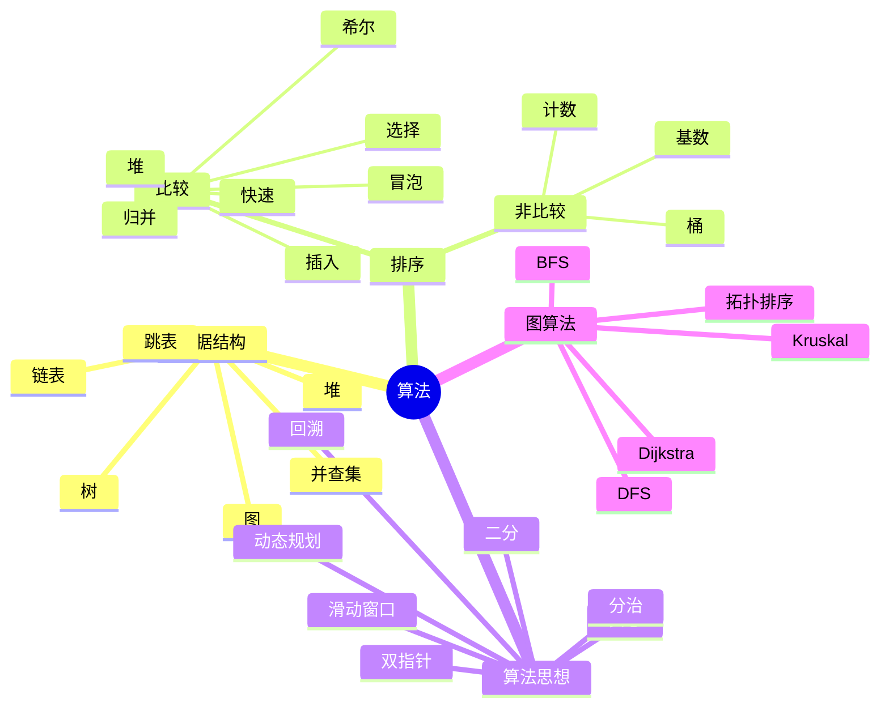

# 算法与数据结构

> 面向面试的算法知识体系，覆盖数据结构、算法思想、经典题型与高频面试题。

## 文档导航

### 数据结构
- [链表](链表.md) — 反转、合并、环、LRU 等高频题
- [跳表](跳表.md) — 多级索引实现 O(logn) 的有序结构
- [二叉树与遍历](二叉树与遍历.md) — 四种遍历 + 经典树题
- [堆与优先队列](堆与优先队列.md) — TopK、中位数、Dijkstra
- [并查集](并查集.md) — 动态连通性问题

### 排序与查找
- [排序](排序.md) — 十大排序算法完整实现与对比
- [查找](查找.md) — 二分、哈希、树查找

### 算法思想
- [双指针与滑动窗口](双指针与滑动窗口.md) — 数组/字符串两大套路
- [回溯算法](回溯算法.md) — 排列、组合、子集、N 皇后
- [动态规划](动态规划.md) — 线性、子序列、背包、区间
- [贪心算法](贪心算法.md) — 区间、跳跃、分配
- [图的 DFS 与 BFS](图的DFS与BFS.md) — 连通性、最短路、拓扑排序

### 题解
- [LeetCode Hot100 题解](letcode.md) — 按题型分类的经典题与思路

## 知识体系总览

## 推荐学习路径

1. **数据结构基础**：链表 → 二叉树 → 堆 → 并查集 → 跳表
2. **排序查找**：排序十大算法 → 查找
3. **算法思想**：双指针/滑动窗口 → 回溯 → 动态规划 → 贪心
4. **图算法**：DFS/BFS → 拓扑排序 → 最短路
5. **题解实战**：LeetCode Hot100 按题型刷

## 复杂度速查

| 数据结构/算法 | 平均时间 | 最坏时间 | 空间 |
|--------------|---------|---------|------|
| 数组查找 | O(n) | O(n) | O(1) |
| 二分查找 | O(logn) | O(logn) | O(1) |
| 哈希表 | O(1) | O(n) | O(n) |
| BST 查找 | O(logn) | O(n) | - |
| 平衡树 | O(logn) | O(logn) | - |
| 堆操作 | O(logn) | O(logn) | O(1) |
| 跳表 | O(logn) | O(n) | O(n) |
| 并查集 | O(α(n)) | O(α(n)) | O(n) |
| 快排 | O(nlogn) | O(n²) | O(logn) |
| 归并 | O(nlogn) | O(nlogn) | O(n) |
| 堆排序 | O(nlogn) | O(nlogn) | O(1) |
| 桶排序 | O(n+k) | O(n²) | O(n+k) |
