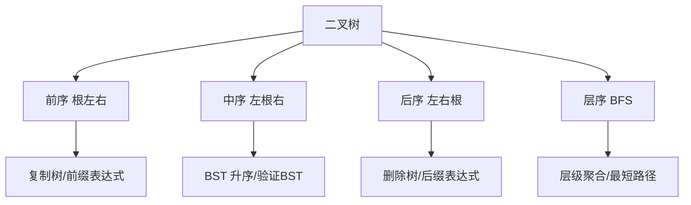

# 二叉树与遍历

> 二叉树是递归思维的典型载体，面试考察频率最高的数据结构之一。

## 目录

- [一、基础定义](#一基础定义)
- [二、四种遍历](#二四种遍历)
- [三、深度与高度](#三深度与高度)
- [四、对称与翻转](#四对称与翻转)
- [五、路径问题](#五路径问题)
- [六、最近公共祖先](#六最近公共祖先)
- [七、二叉搜索树](#七二叉搜索树)
- [八、序列化](#八序列化)
- [九、面试要点](#九面试要点)

## 一、基础定义

```go
type TreeNode struct {
    Val   int
    Left  *TreeNode
    Right *TreeNode
}
```

**常见二叉树分类**：

| 类型 | 特点 |
|------|------|
| 满二叉树 | 每个节点有 0 或 2 个子节点 |
| 完全二叉树 | 除最后一层外全满，最后一层从左到右连续 |
| 二叉搜索树 BST | 左子树值 < 根 < 右子树值，中序遍历为升序 |
| 平衡二叉树 AVL | 任意节点左右子树高度差 ≤ 1 |
| 红黑树 | 近似平衡，O(logn) 操作 |

## 二、四种遍历

### 2.1 前序（根→左→右）

```go
// 递归
func preorder(root *TreeNode, res *[]int) {
    if root == nil {
        return
    }
    *res = append(*res, root.Val)
    preorder(root.Left, res)
    preorder(root.Right, res)
}

// 迭代：栈
func preorderIter(root *TreeNode) []int {
    res := []int{}
    stack := []*TreeNode{}
    cur := root
    for cur != nil || len(stack) > 0 {
        for cur != nil {
            res = append(res, cur.Val)
            stack = append(stack, cur)
            cur = cur.Left
        }
        cur = stack[len(stack)-1].Right
        stack = stack[:len(stack)-1]
    }
    return res
}
```

### 2.2 中序（左→根→右）

```go
// 迭代
func inorderTraversal(root *TreeNode) []int {
    res := []int{}
    stack := []*TreeNode{}
    cur := root
    for cur != nil || len(stack) > 0 {
        for cur != nil {
            stack = append(stack, cur)
            cur = cur.Left
        }
        cur = stack[len(stack)-1]
        stack = stack[:len(stack)-1]
        res = append(res, cur.Val)
        cur = cur.Right
    }
    return res
}
```

> **BST 中序遍历得到升序序列**，是验证 BST、找前驱后继的基础。

### 2.3 后序（左→右→根）

```go
// 迭代：前序「根右左」反过来即「左右根」
func postorderTraversal(root *TreeNode) []int {
    res := []int{}
    stack := []*TreeNode{}
    cur := root
    for cur != nil || len(stack) > 0 {
        for cur != nil {
            res = append(res, cur.Val)
            stack = append(stack, cur)
            cur = cur.Right
        }
        cur = stack[len(stack)-1].Left
        stack = stack[:len(stack)-1]
    }
    // 反转
    for i, j := 0, len(res)-1; i < j; i, j = i+1, j-1 {
        res[i], res[j] = res[j], res[i]
    }
    return res
}
```

### 2.4 层序（BFS）

```go
func levelOrder(root *TreeNode) [][]int {
    if root == nil {
        return nil
    }
    res := [][]int{}
    q := []*TreeNode{root}
    for len(q) > 0 {
        n := len(q)
        level := []int{}
        for i := 0; i < n; i++ {
            node := q[0]
            q = q[1:]
            level = append(level, node.Val)
            if node.Left != nil {
                q = append(q, node.Left)
            }
            if node.Right != nil {
                q = append(q, node.Right)
            }
        }
        res = append(res, level)
    }
    return res
}
```



## 三、深度与高度

### 3.1 最大深度

```go
func maxDepth(root *TreeNode) int {
    if root == nil {
        return 0
    }
    return 1 + max(maxDepth(root.Left), maxDepth(root.Right))
}
```

### 3.2 最小深度

> 根到最近叶子节点的距离。

```go
func minDepth(root *TreeNode) int {
    if root == nil {
        return 0
    }
    if root.Left == nil {
        return 1 + minDepth(root.Right)
    }
    if root.Right == nil {
        return 1 + minDepth(root.Left)
    }
    return 1 + min(minDepth(root.Left), minDepth(root.Right))
}
```

> **坑**：左右子树只有一个为空时，不能直接取 min(0, x)，因为空子树没有叶子。

### 3.3 平衡二叉树

> 任意节点左右子树高度差 ≤ 1。

```go
func isBalanced(root *TreeNode) bool {
    ok, _ := check(root)
    return ok
}

func check(node *TreeNode) (bool, int) {
    if node == nil {
        return true, 0
    }
    lok, lh := check(node.Left)
    rok, rh := check(node.Right)
    h := 1 + max(lh, rh)
    if !lok || !rok || abs(lh-rh) > 1 {
        return false, h
    }
    return true, h
}
```

## 四、对称与翻转

### 4.1 翻转二叉树

```go
func invertTree(root *TreeNode) *TreeNode {
    if root == nil {
        return nil
    }
    root.Left, root.Right = root.Right, root.Left
    invertTree(root.Left)
    invertTree(root.Right)
    return root
}
```

### 4.2 对称二叉树

```go
func isSymmetric(root *TreeNode) bool {
    if root == nil {
        return true
    }
    return mirror(root.Left, root.Right)
}

func mirror(a, b *TreeNode) bool {
    if a == nil && b == nil {
        return true
    }
    if a == nil || b == nil {
        return false
    }
    return a.Val == b.Val &&
        mirror(a.Left, b.Right) &&
        mirror(a.Right, b.Left)
}
```

## 五、路径问题

### 5.1 二叉树的最大路径和

> 路径可以从任意节点出发到任意节点。

**思路**：递归计算「以当前节点为端点向下的最大单链路」。当前节点作为路径最高点时，路径和 = `node.Val + max(0, left) + max(0, right)`。

```go
func maxPathSum(root *TreeNode) int {
    best := -1 << 30
    var dfs func(*TreeNode) int
    dfs = func(node *TreeNode) int {
        if node == nil {
            return 0
        }
        l := max(0, dfs(node.Left))
        r := max(0, dfs(node.Right))
        // 当前节点作为路径顶点
        sum := node.Val + l + r
        if sum > best {
            best = sum
        }
        // 返回以当前节点向下的单链路
        return node.Val + max(l, r)
    }
    dfs(root)
    return best
}
```

### 5.2 路径总和

> 是否存在根到叶子路径和等于 target。

```go
func hasPathSum(root *TreeNode, target int) bool {
    if root == nil {
        return false
    }
    if root.Left == nil && root.Right == nil {
        return root.Val == target
    }
    return hasPathSum(root.Left, target-root.Val) ||
        hasPathSum(root.Right, target-root.Val)
}
```

### 5.3 所有根到叶子路径

```go
func binaryTreePaths(root *TreeNode) []string {
    res := []string{}
    var dfs func(*TreeNode, string)
    dfs = func(node *TreeNode, path string) {
        if node == nil {
            return
        }
        if path == "" {
            path = strconv.Itoa(node.Val)
        } else {
            path += "->" + strconv.Itoa(node.Val)
        }
        if node.Left == nil && node.Right == nil {
            res = append(res, path)
            return
        }
        dfs(node.Left, path)
        dfs(node.Right, path)
    }
    dfs(root, "")
    return res
}
```

## 六、最近公共祖先

### 6.1 普通二叉树

```go
func lowestCommonAncestor(root, p, q *TreeNode) *TreeNode {
    if root == nil || root == p || root == q {
        return root
    }
    left := lowestCommonAncestor(root.Left, p, q)
    right := lowestCommonAncestor(root.Right, p, q)
    if left != nil && right != nil {
        return root // p、q 分布在两侧
    }
    if left != nil {
        return left
    }
    return right
}
```

### 6.2 BST 的最近公共祖先

**思路**：利用 BST 性质，p、q 都在某侧时递归该侧，分叉时当前节点就是答案。

```go
func lowestCommonAncestorBST(root, p, q *TreeNode) *TreeNode {
    for root != nil {
        if p.Val < root.Val && q.Val < root.Val {
            root = root.Left
        } else if p.Val > root.Val && q.Val > root.Val {
            root = root.Right
        } else {
            return root
        }
    }
    return nil
}
```

## 七、二叉搜索树

### 7.1 验证 BST

> 不能只比较节点与左右孩子，必须保证整个左子树都 < 根。

```go
func isValidBST(root *TreeNode) bool {
    return validate(root, nil, nil)
}

func validate(node, lo, hi *TreeNode) bool {
    if node == nil {
        return true
    }
    if lo != nil && node.Val <= lo.Val {
        return false
    }
    if hi != nil && node.Val >= hi.Val {
        return false
    }
    return validate(node.Left, lo, node) && validate(node.Right, node, hi)
}
```

### 7.2 BST 第 K 小

**思路**：中序遍历到第 K 个即答案。

```go
func kthSmallest(root *TreeNode, k int) int {
    stack := []*TreeNode{}
    cur := root
    for cur != nil || len(stack) > 0 {
        for cur != nil {
            stack = append(stack, cur)
            cur = cur.Left
        }
        cur = stack[len(stack)-1]
        stack = stack[:len(stack)-1]
        k--
        if k == 0 {
            return cur.Val
        }
        cur = cur.Right
    }
    return -1
}
```

### 7.3 BST 插入与删除

```go
// 插入
func insertIntoBST(root *TreeNode, val int) *TreeNode {
    if root == nil {
        return &TreeNode{Val: val}
    }
    if val < root.Val {
        root.Left = insertIntoBST(root.Left, val)
    } else {
        root.Right = insertIntoBST(root.Right, val)
    }
    return root
}

// 删除：找到右子树最小值替换
func deleteNode(root *TreeNode, key int) *TreeNode {
    if root == nil {
        return nil
    }
    if key < root.Val {
        root.Left = deleteNode(root.Left, key)
    } else if key > root.Val {
        root.Right = deleteNode(root.Right, key)
    } else {
        if root.Left == nil {
            return root.Right
        }
        if root.Right == nil {
            return root.Left
        }
        // 找右子树最小节点
        min := root.Right
        for min.Left != nil {
            min = min.Left
        }
        root.Val = min.Val
        root.Right = deleteNode(root.Right, min.Val)
    }
    return root
}
```

## 八、序列化

### 8.1 序列化与反序列化

> 用前序 + 占位符 `#` 表示空节点。

```go
type Codec struct{}

func Constructor() Codec { return Codec{} }

func (c Codec) serialize(root *TreeNode) string {
    if root == nil {
        return "#"
    }
    return strconv.Itoa(root.Val) + "," +
        c.serialize(root.Left) + "," +
        c.serialize(root.Right)
}

func (c Codec) deserialize(data string) *TreeNode {
    parts := strings.Split(data, ",")
    idx := 0
    var build func() *TreeNode
    build = func() *TreeNode {
        if parts[idx] == "#" {
            idx++
            return nil
        }
        v, _ := strconv.Atoi(parts[idx])
        idx++
        return &TreeNode{
            Val:   v,
            Left:  build(),
            Right: build(),
        }
    }
    return build()
}
```

## 九、面试要点

### 9.1 解题套路

| 题型 | 套路 |
|------|------|
| 深度 / 高度 | 后序递归返回高度 |
| 路径 | 前序 DFS + 回溯或参数传递 |
| 对称 / 翻转 | 双子树镜像递归 |
| 公共祖先 | 后序 + 左右子树返回值 |
| BST | 利用左<根<右性质 |
| 序列化 | 前序 + 占位符 |

### 9.2 递归思维

二叉树大多用递归，关键是想清楚：
1. **当前节点要做什么**
2. **左右子树返回什么**
3. **边界条件**

### 9.3 高频题清单

- 三种遍历（递归 + 迭代）
- 层序遍历 / 锯齿层序
- 最大/最小深度
- 对称/翻转/平衡
- 最近公共祖先
- 路径总和 / 最大路径和
- 验证 BST / 第 K 小
- 序列化与反序列化
- 从前序与中序构造二叉树
