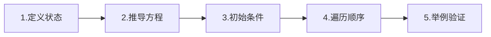
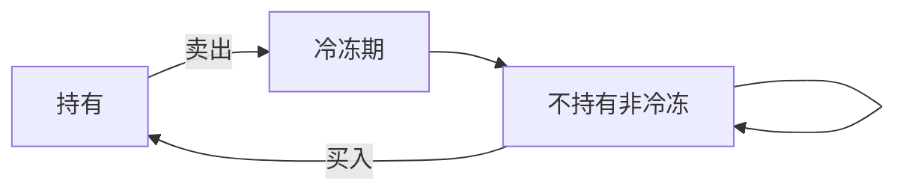

# 动态规划

> 动态规划：把问题拆成子问题，记录子问题答案避免重复计算。适用于有重叠子问题和最优子结构的问题。

## 目录

- [一、核心思想](#一核心思想)
- [二、线性 DP](#二线性-dp)
- [三、子序列 DP](#三子序列-dp)
- [四、背包 DP](#四背包-dp)
- [五、区间 DP](#五区间-dp)
- [六、状态压缩 DP](#六状态压缩-dp)
- [七、面试要点](#七面试要点)

## 一、核心思想

### 1.1 两个性质

1. **重叠子问题**：子问题被多次计算 → 用备忘录/DP 表存储
2. **最优子结构**：原问题最优解由子问题最优解组合而成

### 1.2 解题五步



1. **定义状态**：`dp[i]` / `dp[i][j]` 代表什么
2. **状态转移方程**：从哪些子状态转移而来
3. **初始条件**：边界值
4. **遍历顺序**：依赖关系决定
5. **举例验证**

### 1.3 两种实现

- **自顶向下（记忆化搜索）**：递归 + 备忘录
- **自底向上（递推）**：从初始值往后填表，常用

## 二、线性 DP

### 2.1 爬楼梯

> 每次 1 或 2 步，爬到 n 阶有多少种方法。

```go
func climbStairs(n int) int {
    if n <= 2 {
        return n
    }
    a, b := 1, 2
    for i := 3; i <= n; i++ {
        a, b = b, a+b
    }
    return b
}
```

- 状态：`dp[i]` = 爬到 i 阶的方法数
- 转移：`dp[i] = dp[i-1] + dp[i-2]`
- 空间优化：只需前两个值

### 2.2 打家劫舍

> 不能偷相邻房子，求最大金额。

```go
func rob(nums []int) int {
    if len(nums) == 0 {
        return 0
    }
    if len(nums) == 1 {
        return nums[0]
    }
    dp := make([]int, len(nums))
    dp[0] = nums[0]
    dp[1] = max(nums[0], nums[1])
    for i := 2; i < len(nums); i++ {
        dp[i] = max(dp[i-1], dp[i-2]+nums[i])
    }
    return dp[len(nums)-1]
}
```

### 2.3 最小路径和

> 网格从左上到右下，路径和最小。

```go
func minPathSum(grid [][]int) int {
    m, n := len(grid), len(grid[0])
    dp := make([][]int, m)
    for i := range dp {
        dp[i] = make([]int, n)
    }
    dp[0][0] = grid[0][0]
    for i := 1; i < m; i++ {
        dp[i][0] = dp[i-1][0] + grid[i][0]
    }
    for j := 1; j < n; j++ {
        dp[0][j] = dp[0][j-1] + grid[0][j]
    }
    for i := 1; i < m; i++ {
        for j := 1; j < n; j++ {
            dp[i][j] = min(dp[i-1][j], dp[i][j-1]) + grid[i][j]
        }
    }
    return dp[m-1][n-1]
}
```

### 2.4 不同路径

> 从左上到右下有多少条路径，只能向右或向下。

```go
func uniquePaths(m, n int) int {
    dp := make([]int, n)
    for j := 0; j < n; j++ {
        dp[j] = 1
    }
    for i := 1; i < m; i++ {
        for j := 1; j < n; j++ {
            dp[j] += dp[j-1]
        }
    }
    return dp[n-1]
}
```

## 三、子序列 DP

### 3.1 最长递增子序列 LIS

```go
// O(n²) DP
func lengthOfLIS(nums []int) int {
    dp := make([]int, len(nums))
    best := 0
    for i := range nums {
        dp[i] = 1
        for j := 0; j < i; j++ {
            if nums[j] < nums[i] && dp[j]+1 > dp[i] {
                dp[i] = dp[j] + 1
            }
        }
        if dp[i] > best {
            best = dp[i]
        }
    }
    return best
}

// O(nlogn) 二分
func lengthOfLISBinary(nums []int) int {
    tails := []int{} // tails[i] = 长度为 i+1 的最小尾元素
    for _, x := range nums {
        l, r := 0, len(tails)
        for l < r {
            m := (l + r) / 2
            if tails[m] < x {
                l = m + 1
            } else {
                r = m
            }
        }
        if l == len(tails) {
            tails = append(tails, x)
        } else {
            tails[l] = x
        }
    }
    return len(tails)
}
```

### 3.2 最长公共子序列 LCS

```go
func longestCommonSubsequence(a, b string) int {
    m, n := len(a), len(b)
    dp := make([][]int, m+1)
    for i := range dp {
        dp[i] = make([]int, n+1)
    }
    for i := 1; i <= m; i++ {
        for j := 1; j <= n; j++ {
            if a[i-1] == b[j-1] {
                dp[i][j] = dp[i-1][j-1] + 1
            } else {
                dp[i][j] = max(dp[i-1][j], dp[i][j-1])
            }
        }
    }
    return dp[m][n]
}
```

### 3.3 编辑距离

> 把 word1 变成 word2 的最少操作数（增/删/改）。

```go
func minDistance(a, b string) int {
    m, n := len(a), len(b)
    dp := make([][]int, m+1)
    for i := range dp {
        dp[i] = make([]int, n+1)
        dp[i][0] = i
    }
    for j := 0; j <= n; j++ {
        dp[0][j] = j
    }
    for i := 1; i <= m; i++ {
        for j := 1; j <= n; j++ {
            if a[i-1] == b[j-1] {
                dp[i][j] = dp[i-1][j-1]
            } else {
                dp[i][j] = 1 + min(
                    dp[i-1][j],   // 删除
                    dp[i][j-1],   // 插入
                    dp[i-1][j-1], // 替换
                )
            }
        }
    }
    return dp[m][n]
}
```

### 3.4 最长回文子串

> 返回最长回文子串。

```go
func longestPalindrome(s string) string {
    n := len(s)
    if n < 2 {
        return s
    }
    dp := make([][]bool, n) // dp[i][j] = s[i..j] 是否回文
    for i := range dp {
        dp[i] = make([]bool, n)
        dp[i][i] = true
    }
    start, maxLen := 0, 1
    for L := 2; L <= n; L++ {
        for i := 0; i+L-1 < n; i++ {
            j := i + L - 1
            if s[i] != s[j] {
                dp[i][j] = false
            } else {
                if L <= 3 {
                    dp[i][j] = true
                } else {
                    dp[i][j] = dp[i+1][j-1]
                }
            }
            if dp[i][j] && L > maxLen {
                maxLen = L
                start = i
            }
        }
    }
    return s[start : start+maxLen]
}
```

## 四、背包 DP

### 4.1 0-1 背包

> 每件物品只能选或不选。

```go
// 二维
func knapsack01(weights, values []int, capacity int) int {
    n := len(weights)
    dp := make([][]int, n+1)
    for i := range dp {
        dp[i] = make([]int, capacity+1)
    }
    for i := 1; i <= n; i++ {
        for c := 0; c <= capacity; c++ {
            dp[i][c] = dp[i-1][c]
            if c >= weights[i-1] {
                dp[i][c] = max(dp[i][c], dp[i-1][c-weights[i-1]]+values[i-1])
            }
        }
    }
    return dp[n][capacity]
}

// 一维优化：c 倒序遍历
func knapsack01Opt(weights, values []int, capacity int) int {
    dp := make([]int, capacity+1)
    for i := 0; i < len(weights); i++ {
        for c := capacity; c >= weights[i]; c-- {
            dp[c] = max(dp[c], dp[c-weights[i]]+values[i])
        }
    }
    return dp[capacity]
}
```

### 4.2 完全背包

> 每件物品可无限次选。

```go
// c 正序遍历
func knapsackComplete(weights, values []int, capacity int) int {
    dp := make([]int, capacity+1)
    for i := 0; i < len(weights); i++ {
        for c := weights[i]; c <= capacity; c++ {
            dp[c] = max(dp[c], dp[c-weights[i]]+values[i])
        }
    }
    return dp[capacity]
}
```

### 4.3 零钱兑换

> 凑成 amount 所需的最少硬币数（完全背包）。

```go
func coinChange(coins []int, amount int) int {
    dp := make([]int, amount+1)
    for i := 1; i <= amount; i++ {
        dp[i] = amount + 1
    }
    for _, coin := range coins {
        for c := coin; c <= amount; c++ {
            if dp[c-coin]+1 < dp[c] {
                dp[c] = dp[c-coin] + 1
            }
        }
    }
    if dp[amount] > amount {
        return -1
    }
    return dp[amount]
}
```

### 4.4 零钱兑换 II

> 凑成 amount 的方案数。

```go
func change(amount int, coins []int) int {
    dp := make([]int, amount+1)
    dp[0] = 1
    for _, coin := range coins {
        for c := coin; c <= amount; c++ {
            dp[c] += dp[c-coin]
        }
    }
    return dp[amount]
}
```

> **求方案数**：外层物品、内层容量 → 组合数；外层容量、内层物品 → 排列数。

## 五、区间 DP

### 5.1 戳气球

> 每个气球有值 nums[i]，戳破时获得 `nums[left]*nums[i]*nums[right]` 金币，求最大。

**思路**：反向思考——把 i 当作最后一个戳破的。开区间 `(left, right)` 中先戳 i，把区间分成两半。

```go
func maxCoins(nums []int) int {
    n := len(nums)
    arr := make([]int, n+2)
    arr[0], arr[n+1] = 1, 1
    copy(arr[1:], nums)
    dp := make([][]int, n+2)
    for i := range dp {
        dp[i] = make([]int, n+2)
    }
    // 长度从 2 到 n+1 的开区间
    for L := 2; L <= n+1; L++ {
        for l := 0; l+L <= n+1; l++ {
            r := l + L
            for k := l + 1; k < r; k++ {
                coins := arr[l]*arr[k]*arr[r] + dp[l][k] + dp[k][r]
                if coins > dp[l][r] {
                    dp[l][r] = coins
                }
            }
        }
    }
    return dp[0][n+1]
}
```

### 5.2 最长回文子序列

```go
func longestPalindromeSubseq(s string) int {
    n := len(s)
    dp := make([][]int, n)
    for i := range dp {
        dp[i] = make([]int, n)
        dp[i][i] = 1
    }
    for L := 2; L <= n; L++ {
        for i := 0; i+L-1 < n; i++ {
            j := i + L - 1
            if s[i] == s[j] {
                dp[i][j] = 2 + dp[i+1][j-1]
            } else {
                dp[i][j] = max(dp[i+1][j], dp[i][j-1])
            }
        }
    }
    return dp[0][n-1]
}
```

## 六、状态压缩 DP

### 6.1 买卖股票最佳时机（含冷冻期）

```go
// 三状态：持有/不持有且冷冻/不持有且非冷冻
func maxProfit(prices []int) int {
    if len(prices) == 0 {
        return 0
    }
    hold := -prices[0]
    frozen := 0
    notHold := 0
    for i := 1; i < len(prices); i++ {
        prevHold := hold
        hold = max(hold, notHold-prices[i])
        notHold = max(notHold, frozen)
        frozen = prevHold + prices[i]
    }
    return max(frozen, notHold)
}
```

### 6.2 状态机模型



## 七、面试要点

### 7.1 状态定义套路

| 题型 | 状态 |
|------|------|
| 一维问题 | `dp[i]` = 前 i 个的最优 |
| 二维问题 | `dp[i][j]` = 前 i 与前 j 的最优 |
| 区间 | `dp[i][j]` = 区间 [i, j] 的最优 |
| 背包 | `dp[i][c]` = 前 i 件容量 c 的最优 |
| 状态机 | 每种状态一个值 |

### 7.2 空间优化

- 一维：滚动变量
- 二维：滚动数组 / 一维数组（注意遍历方向）

### 7.3 DP vs 贪心 vs 回溯

- **DP**：求最优解、方案数，子问题重叠
- **贪心**：局部最优推全局最优，需证明正确性
- **回溯**：求所有方案，指数级

### 7.4 高频题清单

- 爬楼梯 / 打家劫舍 I/II/III
- 最小路径和 / 不同路径
- LIS / LCS / 编辑距离
- 最长回文子串 / 子序列
- 0-1 背包 / 完全背包 / 零钱兑换
- 戳气球 / 鸡蛋掉落
- 股票系列（含冷冻期、含手续费、最多 K 次）
- 正则表达式匹配
