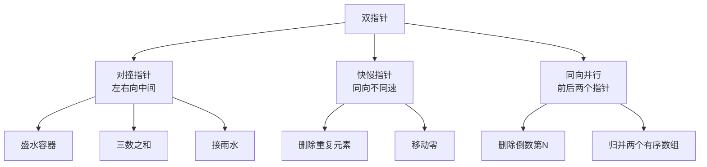
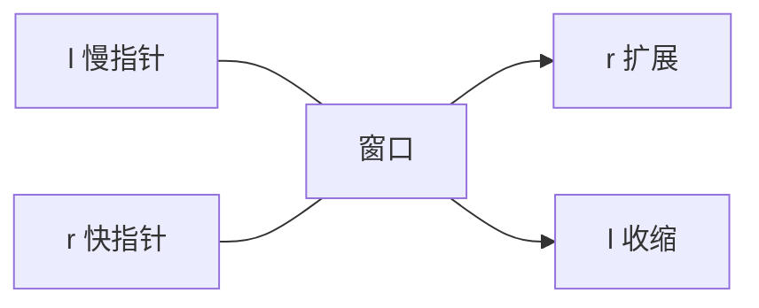

# 双指针与滑动窗口

> 数组/字符串题最常用的两个套路：双指针 O(n) 解决有序问题，滑动窗口解决子串/子数组问题。

## 目录

- [一、双指针](#一双指针)
- [二、对撞指针](#二对撞指针)
- [三、快慢指针](#三快慢指针)
- [四、滑动窗口](#四滑动窗口)
- [五、面试要点](#五面试要点)

## 一、双指针

**核心思想**：用两个指针协同遍历，把 O(n²) 降为 O(n)。



| 类型 | 场景 | 代表题 |
|------|------|------|
| 对撞指针 | 有序数组两数之和、回文 | 盛水容器、三数之和 |
| 快慢指针 | 原地去重、判环 | 移动零、删除重复 |
| 同向并行 | 合并、复制、过滤 | 归并、移除元素 |

## 二、对撞指针

### 2.1 盛最多水的容器

> 两条垂线与 x 轴围成容器，求最大水量。

**思路**：水量 = `min(h[l], h[r]) * (r-l)`。每次移动较短的一边，因为宽度在减小，移动长板不可能让水量变大。

```go
func maxArea(h []int) int {
    l, r := 0, len(h)-1
    best := 0
    for l < r {
        area := min(h[l], h[r]) * (r - l)
        if area > best {
            best = area
        }
        if h[l] < h[r] {
            l++
        } else {
            r--
        }
    }
    return best
}
```

### 2.2 接雨水

> 求柱子之间能接多少雨水。

**思路一（对撞指针）**：维护左右两侧最大值 `leftMax`、`rightMax`。哪边最大值小就处理哪边：因为水位由较低一侧决定。

```go
func trap(height []int) int {
    l, r := 0, len(height)-1
    leftMax, rightMax := 0, 0
    water := 0
    for l < r {
        if height[l] < height[r] {
            if height[l] >= leftMax {
                leftMax = height[l]
            } else {
                water += leftMax - height[l]
            }
            l++
        } else {
            if height[r] >= rightMax {
                rightMax = height[r]
            } else {
                water += rightMax - height[r]
            }
            r--
        }
    }
    return water
}
```

**思路二（DP 预处理）**：`leftMax[i] = max(leftMax[i-1], h[i])`，`rightMax[i]` 同理。每列水量 = `min(leftMax[i], rightMax[i]) - h[i]`。

### 2.3 三数之和

> 返回所有和为 0 的不重复三元组。

**思路**：排序 + 固定首位 i + 对撞指针找两数之和 = -nums[i]。

```go
import "sort"

func threeSum(nums []int) [][]int {
    sort.Ints(nums)
    res := [][]int{}
    for i := 0; i < len(nums)-2; i++ {
        if nums[i] > 0 {
            break
        }
        if i > 0 && nums[i] == nums[i-1] {
            continue // 去重
        }
        l, r := i+1, len(nums)-1
        for l < r {
            sum := nums[i] + nums[l] + nums[r]
            if sum == 0 {
                res = append(res, []int{nums[i], nums[l], nums[r]})
                for l < r && nums[l] == nums[l+1] {
                    l++
                }
                for l < r && nums[r] == nums[r-1] {
                    r--
                }
                l++
                r--
            } else if sum < 0 {
                l++
            } else {
                r--
            }
        }
    }
    return res
}
```

## 三、快慢指针

### 3.1 移动零

> 把所有 0 移到末尾，保持非零元素相对顺序。

```go
func moveZeroes(nums []int) {
    slow := 0 // 指向下一个非零应放的位置
    for fast := 0; fast < len(nums); fast++ {
        if nums[fast] != 0 {
            nums[slow], nums[fast] = nums[fast], nums[slow]
            slow++
        }
    }
}
```

### 3.2 删除有序数组中的重复项

> 原地修改，返回新长度。

```go
func removeDuplicates(nums []int) int {
    if len(nums) == 0 {
        return 0
    }
    slow := 0
    for fast := 1; fast < len(nums); fast++ {
        if nums[fast] != nums[slow] {
            slow++
            nums[slow] = nums[fast]
        }
    }
    return slow + 1
}
```

### 3.3 删除重复元素-保留两个

> 每个元素最多保留两个。

```go
func removeDuplicates2(nums []int) int {
    if len(nums) <= 2 {
        return len(nums)
    }
    slow := 2
    for fast := 2; fast < len(nums); fast++ {
        // nums[slow-2] != nums[fast] 说明 fast 是新值
        if nums[slow-2] != nums[fast] {
            nums[slow] = nums[fast]
            slow++
        }
    }
    return slow
}
```

## 四、滑动窗口

**模板**：维护窗口 `[l, r]`，根据窗口内状态决定是否收缩 `l`。



### 4.1 无重复字符的最长子串

```go
func lengthOfLongestSubstring(s string) int {
    last := map[byte]int{}
    l, best := 0, 0
    for r := 0; r < len(s); r++ {
        c := s[r]
        if i, ok := last[c]; ok && i >= l {
            l = i + 1 // 跳过重复字符
        }
        last[c] = r
        if r-l+1 > best {
            best = r - l + 1
        }
    }
    return best
}
```

### 4.2 最小覆盖子串

> 求 s 中包含 t 所有字符的最短子串。

**思路**：窗口右扩直到满足，再左缩到不满足前一刻记录答案。

```go
func minWindow(s string, t string) string {
    need := map[byte]int{}
    for i := 0; i < len(t); i++ {
        need[t[i]]++
    }
    needCnt := len(t)
    l, start, minLen := 0, 0, 1<<31
    for r := 0; r < len(s); r++ {
        c := s[r]
        if need[c] > 0 {
            needCnt--
        }
        need[c]--
        // 满足条件时收缩左边界
        for needCnt == 0 {
            if r-l+1 < minLen {
                minLen = r - l + 1
                start = l
            }
            need[s[l]]++
            if need[s[l]] > 0 {
                needCnt++
            }
            l++
        }
    }
    if minLen == 1<<31 {
        return ""
    }
    return s[start : start+minLen]
}
```

### 4.3 长度最小的子数组

> 正整数数组中，和 ≥ target 的最短子数组长度。

```go
func minSubArrayLen(target int, nums []int) int {
    l, sum, best := 0, 0, 1<<31
    for r := 0; r < len(nums); r++ {
        sum += nums[r]
        for sum >= target {
            if r-l+1 < best {
                best = r - l + 1
            }
            sum -= nums[l]
            l++
        }
    }
    if best == 1<<31 {
        return 0
    }
    return best
}
```

### 4.4 找到字符串中所有字母异位词

```go
func findAnagrams(s string, p string) []int {
    if len(s) < len(p) {
        return nil
    }
    var cntS, cntP [26]int
    for i := 0; i < len(p); i++ {
        cntP[p[i]-'a']++
        cntS[s[i]-'a']++
    }
    res := []int{}
    if cntS == cntP {
        res = append(res, 0)
    }
    for i := len(p); i < len(s); i++ {
        cntS[s[i]-'a']++
        cntS[s[i-len(p)]-'a']--
        if cntS == cntP {
            res = append(res, i-len(p)+1)
        }
    }
    return res
}
```

### 4.5 滑动窗口最大值

> 返回每个大小为 k 的窗口中的最大值。

**思路**：单调递减队列存下标，队首始终是当前窗口最大值。

```go
func maxSlidingWindow(nums []int, k int) []int {
    deque := []int{} // 存下标，对应值单调递减
    res := []int{}
    for i := 0; i < len(nums); i++ {
        // 队首出窗
        for len(deque) > 0 && deque[0] <= i-k {
            deque = deque[1:]
        }
        // 维护单调递减：新值更大的弹出队尾
        for len(deque) > 0 && nums[deque[len(deque)-1]] <= nums[i] {
            deque = deque[:len(deque)-1]
        }
        deque = append(deque, i)
        if i >= k-1 {
            res = append(res, nums[deque[0]])
        }
    }
    return res
}
```

## 五、面试要点

### 5.1 何时用双指针

- **有序数组 + 两数关系** → 对撞指针
- **原地去重/移动** → 快慢指针
- **链表找中点 / 判环** → 快慢指针

### 5.2 何时用滑动窗口

- **连续子数组 / 子串** + 单调性（窗口扩大时状态单调变化）
- 常见目标：最长、最短、恰好、最大值、最小值

### 5.3 模板记忆

```text
双指针：
  for l < r:
      if 满足条件: 处理 + 移动一边
      else: 移动另一边

滑动窗口：
  for r in range(n):
      加入 nums[r]
      while 窗口不合法:
          移除 nums[l], l++
      更新答案
```

### 5.4 高频题清单

- 双指针：盛水容器、接雨水、三数之和、四数之和
- 快慢指针：移动零、删除重复、颜色分类
- 滑动窗口：无重复最长子串、最小覆盖子串、最小子数组和、异位词、最大值
