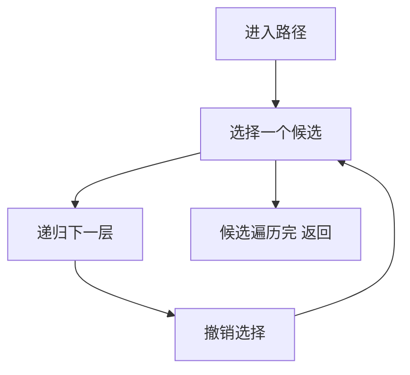

# 回溯算法

> 回溯 = DFS + 选择/撤销选择。用于求解所有方案、组合、排列、子集类问题。

## 目录

- [一、回溯框架](#一回溯框架)
- [二、全排列](#二全排列)
- [三、子集](#三子集)
- [四、组合](#四组合)
- [五、N 皇后](#五n-皇后)
- [六、单词搜索](#六单词搜索)
- [七、分割问题](#七分割问题)
- [八、面试要点](#八面试要点)

## 一、回溯框架



**核心模板**：

```go
func backtrack(path []T, choices []T) {
    if 满足结束条件 {
        res = append(res, append([]T(nil), path...))
        return
    }
    for _, c := range choices {
        if 不合法 {
            continue
        }
        path = append(path, c)   // 做选择
        backtrack(path, 新的choices)
        path = path[:len(path)-1] // 撤销选择
    }
}
```

**关键三要素**：
1. **路径**：已经做出的选择
2. **选择列表**：当前可以做的选择
3. **结束条件**：到达决策树底层

## 二、全排列

### 2.1 不含重复数字

```go
func permute(nums []int) [][]int {
    res := [][]int{}
    var dfs func(int)
    dfs = func(idx int) {
        if idx == len(nums) {
            tmp := append([]int(nil), nums...)
            res = append(res, tmp)
            return
        }
        for i := idx; i < len(nums); i++ {
            nums[idx], nums[i] = nums[i], nums[idx]
            dfs(idx + 1)
            nums[idx], nums[i] = nums[i], nums[idx]
        }
    }
    dfs(0)
    return res
}
```

### 2.2 含重复数字

**思路**：先排序，每层决策时跳过相同数字（避免同层重复）。

```go
import "sort"

func permuteUnique(nums []int) [][]int {
    sort.Ints(nums)
    res := [][]int{}
    used := make([]bool, len(nums))
    path := []int{}
    var dfs func()
    dfs = func() {
        if len(path) == len(nums) {
            tmp := append([]int(nil), path...)
            res = append(res, tmp)
            return
        }
        for i := 0; i < len(nums); i++ {
            if used[i] {
                continue
            }
            // 同层相同数字只取第一个
            if i > 0 && nums[i] == nums[i-1] && !used[i-1] {
                continue
            }
            used[i] = true
            path = append(path, nums[i])
            dfs()
            path = path[:len(path)-1]
            used[i] = false
        }
    }
    dfs()
    return res
}
```

## 三、子集

### 3.1 子集（无重复元素）

```go
func subsets(nums []int) [][]int {
    res := [][]int{}
    path := []int{}
    var dfs func(int)
    dfs = func(start int) {
        tmp := append([]int(nil), path...)
        res = append(res, tmp)
        for i := start; i < len(nums); i++ {
            path = append(path, nums[i])
            dfs(i + 1)
            path = path[:len(path)-1]
        }
    }
    dfs(0)
    return res
}
```

### 3.2 子集 II（含重复元素）

```go
import "sort"

func subsetsWithDup(nums []int) [][]int {
    sort.Ints(nums)
    res := [][]int{}
    path := []int{}
    var dfs func(int)
    dfs = func(start int) {
        tmp := append([]int(nil), path...)
        res = append(res, tmp)
        for i := start; i < len(nums); i++ {
            if i > start && nums[i] == nums[i-1] {
                continue
            }
            path = append(path, nums[i])
            dfs(i + 1)
            path = path[:len(path)-1]
        }
    }
    dfs(0)
    return res
}
```

## 四、组合

### 4.1 组合总和（数字可重复使用）

```go
func combinationSum(candidates []int, target int) [][]int {
    res := [][]int{}
    path := []int{}
    var dfs func(int, int)
    dfs = func(start, remain int) {
        if remain == 0 {
            tmp := append([]int(nil), path...)
            res = append(res, tmp)
            return
        }
        for i := start; i < len(candidates); i++ {
            if candidates[i] > remain {
                continue
            }
            path = append(path, candidates[i])
            dfs(i, remain-candidates[i]) // 同一元素可重复，传 i
            path = path[:len(path)-1]
        }
    }
    dfs(0, target)
    return res
}
```

### 4.2 组合总和 II（每个数字只能用一次）

```go
import "sort"

func combinationSum2(candidates []int, target int) [][]int {
    sort.Ints(candidates)
    res := [][]int{}
    path := []int{}
    var dfs func(int, int)
    dfs = func(start, remain int) {
        if remain == 0 {
            tmp := append([]int(nil), path...)
            res = append(res, tmp)
            return
        }
        for i := start; i < len(candidates); i++ {
            if i > start && candidates[i] == candidates[i-1] {
                continue
            }
            if candidates[i] > remain {
                break
            }
            path = append(path, candidates[i])
            dfs(i+1, remain-candidates[i])
            path = path[:len(path)-1]
        }
    }
    dfs(0, target)
    return res
}
```

### 4.3 电话号码的字母组合

```go
var phone = map[byte]string{
    '2': "abc", '3': "def", '4': "ghi", '5': "jkl",
    '6': "mno", '7': "pqrs", '8': "tuv", '9': "wxyz",
}

func letterCombinations(digits string) []string {
    if digits == "" {
        return nil
    }
    res := []string{}
    var dfs func(int, string)
    dfs = func(idx int, path string) {
        if idx == len(digits) {
            res = append(res, path)
            return
        }
        for i := 0; i < len(phone[digits[idx]]); i++ {
            dfs(idx+1, path+string(phone[digits[idx]][i]))
        }
    }
    dfs(0, "")
    return res
}
```

## 五、N 皇后

> 在 N×N 棋盘上放 N 个皇后，使其互不攻击。

```go
func solveNQueens(n int) [][]string {
    res := [][]string{}
    board := make([][]byte, n)
    for i := range board {
        board[i] = make([]byte, n)
        for j := range board[i] {
            board[i][j] = '.'
        }
    }
    cols := map[int]bool{}
    diag1 := map[int]bool{} // row - col
    diag2 := map[int]bool{} // row + col

    var dfs func(int)
    dfs = func(row int) {
        if row == n {
            tmp := make([]string, n)
            for i := range board {
                tmp[i] = string(board[i])
            }
            res = append(res, tmp)
            return
        }
        for col := 0; col < n; col++ {
            if cols[col] || diag1[row-col] || diag2[row+col] {
                continue
            }
            board[row][col] = 'Q'
            cols[col] = true
            diag1[row-col] = true
            diag2[row+col] = true
            dfs(row + 1)
            board[row][col] = '.'
            cols[col] = false
            diag1[row-col] = false
            diag2[row+col] = false
        }
    }
    dfs(0)
    return res
}
```

## 六、单词搜索

> 在二维网格中找单词。

```go
func exist(board [][]byte, word string) bool {
    m, n := len(board), len(board[0])
    var dfs func(int, int, int) bool
    dfs = func(i, j, k int) bool {
        if k == len(word) {
            return true
        }
        if i < 0 || i >= m || j < 0 || j >= n || board[i][j] != word[k] {
            return false
        }
        tmp := board[i][j]
        board[i][j] = '#'
        found := dfs(i+1, j, k+1) || dfs(i-1, j, k+1) ||
            dfs(i, j+1, k+1) || dfs(i, j-1, k+1)
        board[i][j] = tmp
        return found
    }
    for i := 0; i < m; i++ {
        for j := 0; j < n; j++ {
            if dfs(i, j, 0) {
                return true
            }
        }
    }
    return false
}
```

## 七、分割问题

### 7.1 分割回文串

```go
func partition(s string) [][]string {
    res := [][]string{}
    path := []string{}
    var dfs func(int)
    dfs = func(start int) {
        if start == len(s) {
            tmp := append([]string(nil), path...)
            res = append(res, tmp)
            return
        }
        for end := start; end < len(s); end++ {
            if isPalindrome(s, start, end) {
                path = append(path, s[start:end+1])
                dfs(end + 1)
                path = path[:len(path)-1]
            }
        }
    }
    dfs(0)
    return res
}

func isPalindrome(s string, l, r int) bool {
    for l < r {
        if s[l] != s[r] {
            return false
        }
        l++
        r--
    }
    return true
}
```

### 7.2 复原 IP 地址

```go
func restoreIpAddresses(s string) []string {
    res := []string{}
    var dfs func(int, int, string)
    dfs = func(start, seg int, path string) {
        if seg == 4 {
            if start == len(s) {
                res = append(res, path[:len(path)-1])
            }
            return
        }
        for l := 1; l <= 3 && start+l <= len(s); l++ {
            part := s[start : start+l]
            if (len(part) > 1 && part[0] == '0') || l == 3 && part > "255" {
                continue
            }
            dfs(start+l, seg+1, path+part+".")
        }
    }
    dfs(0, 0, "")
    return res
}
```

## 八、面试要点

### 8.1 何时用回溯

- 求**所有方案**（不是数量、不是最优）
- 输入规模小（指数级解空间）
- 关键词：组合、排列、子集、分割、棋盘

### 8.2 去重套路

**`used` 数组 + 排序**：
- 排列去重：`i > 0 && nums[i] == nums[i-1] && !used[i-1]`
- 组合去重：`i > start && nums[i] == nums[i-1]`

### 8.3 剪枝

提前判断不合法分支，减少搜索空间：
- 组合总和：排序后 `if candidates[i] > remain break`
- N 皇后：用 cols/diag 集合 O(1) 判断

### 8.4 高频题清单

- 全排列 I/II
- 子集 I/II
- 组合总和 I/II/III
- 电话号码字母组合
- N 皇后 / 解数独
- 单词搜索
- 分割回文串
- 复原 IP
- 括号生成
