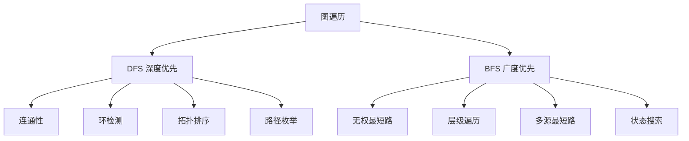

# 图的 DFS 与 BFS

> 图的遍历是图论基础。DFS 适合连通性、路径，BFS 适合最短路、层级。

## 目录

- [一、图的表示](#一图的表示)
- [二、DFS 框架](#二dfs-框架)
- [三、BFS 框架](#三bfs-框架)
- [四、连通性问题](#四连通性问题)
- [五、最短路径](#五最短路径)
- [六、拓扑排序](#六拓扑排序)
- [七、面试要点](#七面试要点)

## 一、图的表示

```go
// 邻接表（推荐）
graph := make([][]int, n)
graph[u] = append(graph[u], v)

// 邻接矩阵
matrix := make([][]int, n)
for i := range matrix {
    matrix[i] = make([]int, n)
}
matrix[u][v] = 1

// 网格图（隐式图）：直接用二维数组 + 方向数组
dirs := [][]int{{-1, 0}, {1, 0}, {0, -1}, {0, 1}}
```



## 二、DFS 框架

```go
func dfs(graph [][]int, start int, visited []bool) {
    if visited[start] {
        return
    }
    visited[start] = true
    // 处理当前节点
    for _, next := range graph[start] {
        dfs(graph, next, visited)
    }
}
```

**关键点**：
- 用 `visited` 数组避免重复访问
- 递归栈天然支持回溯
- 适合求连通分量、检测环、拓扑排序

## 三、BFS 框架

```go
func bfs(graph [][]int, start int) []int {
    visited := make([]bool, len(graph))
    visited[start] = true
    queue := []int{start}
    order := []int{}
    for len(queue) > 0 {
        node := queue[0]
        queue = queue[1:]
        order = append(order, node)
        for _, next := range graph[node] {
            if !visited[next] {
                visited[next] = true
                queue = append(queue, next)
            }
        }
    }
    return order
}
```

**关键点**：
- 入队即标记 visited，避免重复入队
- 适合求无权图最短路、层级遍历
- 双向 BFS 可加速两端搜索

## 四、连通性问题

### 4.1 岛屿数量

> '1' 为陆地，'0' 为水，求岛屿数。

```go
func numIslands(grid [][]byte) int {
    m, n := len(grid), len(grid[0])
    var dfs func(int, int)
    dfs = func(i, j int) {
        if i < 0 || i >= m || j < 0 || j >= n || grid[i][j] != '1' {
            return
        }
        grid[i][j] = '0' // 标记已访问
        dfs(i+1, j)
        dfs(i-1, j)
        dfs(i, j+1)
        dfs(i, j-1)
    }
    cnt := 0
    for i := 0; i < m; i++ {
        for j := 0; j < n; j++ {
            if grid[i][j] == '1' {
                cnt++
                dfs(i, j)
            }
        }
    }
    return cnt
}
```

### 4.2 岛屿的最大面积

```go
func maxAreaOfIsland(grid [][]int) int {
    m, n := len(grid), len(grid[0])
    var dfs func(int, int) int
    dfs = func(i, j int) int {
        if i < 0 || i >= m || j < 0 || j >= n || grid[i][j] != 1 {
            return 0
        }
        grid[i][j] = 0
        return 1 + dfs(i+1, j) + dfs(i-1, j) + dfs(i, j+1) + dfs(i, j-1)
    }
    best := 0
    for i := 0; i < m; i++ {
        for j := 0; j < n; j++ {
            if grid[i][j] == 1 {
                area := dfs(i, j)
                if area > best {
                    best = area
                }
            }
        }
    }
    return best
}
```

### 4.3 被围绕的区域

> 把被 X 围绕的 O 变成 X。

**思路**：从边界 O 出发 DFS 标记为临时字符，最后未标记的 O 改成 X，标记的还原。

```go
func solve(board [][]byte) {
    m, n := len(board), len(board[0])
    var dfs func(int, int)
    dfs = func(i, j int) {
        if i < 0 || i >= m || j < 0 || j >= n || board[i][j] != 'O' {
            return
        }
        board[i][j] = '#'
        dfs(i+1, j)
        dfs(i-1, j)
        dfs(i, j+1)
        dfs(i, j-1)
    }
    for i := 0; i < m; i++ {
        dfs(i, 0)
        dfs(i, n-1)
    }
    for j := 0; j < n; j++ {
        dfs(0, j)
        dfs(m-1, j)
    }
    for i := 0; i < m; i++ {
        for j := 0; j < n; j++ {
            switch board[i][j] {
            case 'O':
                board[i][j] = 'X'
            case '#':
                board[i][j] = 'O'
            }
        }
    }
}
```

## 五、最短路径

### 5.1 BFS 求无权图最短路

> 0-1 矩阵中从左上到右下的最短路径长度。

```go
func shortestPathBinaryMatrix(grid [][]int) int {
    n := len(grid)
    if grid[0][0] == 1 || grid[n-1][n-1] == 1 {
        return -1
    }
    if n == 1 {
        return 1
    }
    dirs := [][]int{{-1, -1}, {-1, 0}, {-1, 1}, {0, -1}, {0, 1}, {1, -1}, {1, 0}, {1, 1}}
    queue := [][]int{{0, 0}}
    grid[0][0] = 1 // 距离
    for len(queue) > 0 {
        cur := queue[0]
        queue = queue[1:]
        for _, d := range dirs {
            ni, nj := cur[0]+d[0], cur[1]+d[1]
            if ni < 0 || ni >= n || nj < 0 || nj >= n || grid[ni][nj] != 0 {
                continue
            }
            grid[ni][nj] = grid[cur[0]][cur[1]] + 1
            if ni == n-1 && nj == n-1 {
                return grid[ni][nj]
            }
            queue = append(queue, []int{ni, nj})
        }
    }
    return -1
}
```

### 5.2 Dijkstra 算法

> 非负权图单源最短路。

```go
import "container/heap"

type Edge struct{ to, weight int }
type Item struct{ node, dist int }
type MinHeap []Item

func (h MinHeap) Len() int           { return len(h) }
func (h MinHeap) Less(i, j int) bool { return h[i].dist < h[j].dist }
func (h MinHeap) Swap(i, j int)      { h[i], h[j] = h[j], h[i] }
func (h *MinHeap) Push(x any)        { *h = append(*h, x.(Item)) }
func (h *MinHeap) Pop() any {
    old := *h
    x := old[len(old)-1]
    *h = old[:len(old)-1]
    return x
}

func dijkstra(graph [][]Edge, start int) []int {
    n := len(graph)
    dist := make([]int, n)
    for i := range dist {
        dist[i] = 1 << 30
    }
    dist[start] = 0
    h := &MinHeap{{start, 0}}
    heap.Init(h)
    for h.Len() > 0 {
        cur := heap.Pop(h).(Item)
        if cur.dist > dist[cur.node] {
            continue
        }
        for _, e := range graph[cur.node] {
            if dist[cur.node]+e.weight < dist[e.to] {
                dist[e.to] = dist[cur.node] + e.weight
                heap.Push(h, Item{e.to, dist[e.to]})
            }
        }
    }
    return dist
}
```

### 5.3 单调队列 / 双向 BFS

- **0-1 BFS**：边权只有 0/1 时用双端队列，0 加队首、1 加队尾，O(V+E)
- **A\***：带启发的搜索，估价函数加速

## 六、拓扑排序

### 6.1 课程表

> 检测有向图是否有环。

**思路**：Kahn 算法，BFS 维护入度为 0 的节点。

```go
func canFinish(numCourses int, prerequisites [][]int) bool {
    graph := make([][]int, numCourses)
    indegree := make([]int, numCourses)
    for _, p := range prerequisites {
        graph[p[1]] = append(graph[p[1]], p[0])
        indegree[p[0]]++
    }
    queue := []int{}
    for i := 0; i < numCourses; i++ {
        if indegree[i] == 0 {
            queue = append(queue, i)
        }
    }
    count := 0
    for len(queue) > 0 {
        cur := queue[0]
        queue = queue[1:]
        count++
        for _, next := range graph[cur] {
            indegree[next]--
            if indegree[next] == 0 {
                queue = append(queue, next)
            }
        }
    }
    return count == numCourses
}
```

### 6.2 课程表 II（返回学习顺序）

```go
func findOrder(numCourses int, prerequisites [][]int) []int {
    graph := make([][]int, numCourses)
    indegree := make([]int, numCourses)
    for _, p := range prerequisites {
        graph[p[1]] = append(graph[p[1]], p[0])
        indegree[p[0]]++
    }
    queue := []int{}
    for i := 0; i < numCourses; i++ {
        if indegree[i] == 0 {
            queue = append(queue, i)
        }
    }
    order := []int{}
    for len(queue) > 0 {
        cur := queue[0]
        queue = queue[1:]
        order = append(order, cur)
        for _, next := range graph[cur] {
            indegree[next]--
            if indegree[next] == 0 {
                queue = append(queue, next)
            }
        }
    }
    if len(order) != numCourses {
        return nil
    }
    return order
}
```

### 6.3 DFS 拓扑排序

> DFS 后序的逆序即为拓扑序。需检测环（用三色标记法）。

```go
func findOrderDFS(numCourses int, prerequisites [][]int) []int {
    graph := make([][]int, numCourses)
    for _, p := range prerequisites {
        graph[p[1]] = append(graph[p[1]], p[0])
    }
    // 0=未访问 1=访问中 2=已完成
    state := make([]int, numCourses)
    order := []int{}
    var dfs func(int) bool
    dfs = func(u int) bool {
        if state[u] == 1 {
            return false // 环
        }
        if state[u] == 2 {
            return true
        }
        state[u] = 1
        for _, v := range graph[u] {
            if !dfs(v) {
                return false
            }
        }
        state[u] = 2
        order = append(order, u)
        return true
    }
    for i := 0; i < numCourses; i++ {
        if !dfs(i) {
            return nil
        }
    }
    // 反转
    for i, j := 0, len(order)-1; i < j; i, j = i+1, j-1 {
        order[i], order[j] = order[j], order[i]
    }
    return order
}
```

## 七、面试要点

### 7.1 DFS vs BFS 选用

| 场景 | 选谁 |
|------|------|
| 求所有方案/路径 | DFS |
| 无权最短路 / 层级 | BFS |
| 连通性 | 任一，DFS 简单 |
| 环检测 | DFS 三色 / BFS 入度 |
| 拓扑排序 | BFS（Kahn）常用 |

### 7.2 网格图技巧

- **方向数组**：`dirs := [][]int{{-1,0},{1,0},{0,-1},{0,1}}`
- **边界检查**：DFS 内首句判 `i<0 || i>=m || j<0 || j>=n`
- **原地标记**：用原数组代替 visited，如 `'1' → '0'`

### 7.3 易错点

1. **BFS 入队时即标记 visited**，否则会重复入队
2. **DFS 三色法检测有向环**：白色未访问、灰色访问中、黑色已完成
3. **拓扑排序必须对 DAG**，有环则无解

### 7.4 高频题清单

- 岛屿数量 / 最大面积 / 周长
- 被围绕的区域
- 克隆图
- 课程表 I/II
- 矩阵中的最长递增路径
- 单词接龙
- 0-1 矩阵最短路径
- 网格最短路径
- Dijkstra / Floyd
- 拓扑排序相关
