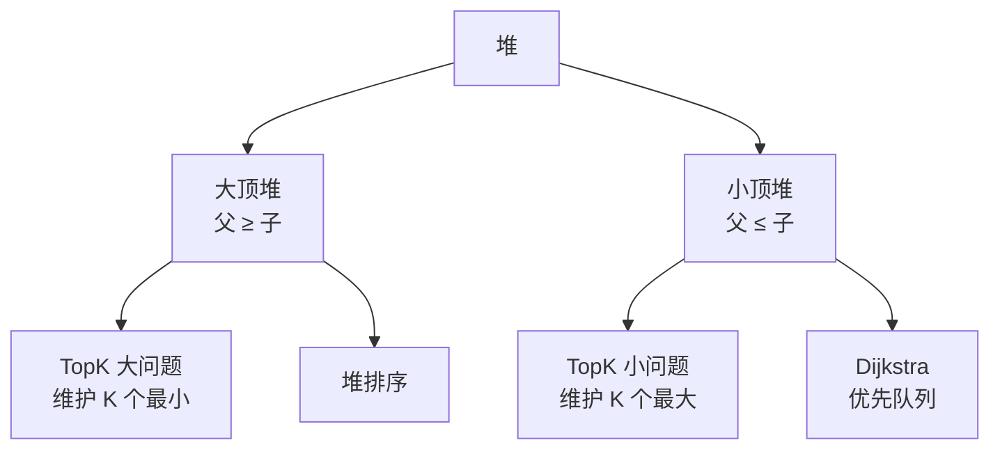

# 堆与优先队列

> 堆是完全二叉树 + 堆序性质。优先队列基于堆实现，O(logn) 插入、O(1) 取最值。

## 目录

- [一、堆的概念](#一堆的概念)
- [二、堆的实现](#二堆的实现)
- [三、Go 标准库 heap](#三go-标准库-heap)
- [四、TopK 问题](#四topk-问题)
- [五、应用场景](#五应用场景)
- [六、面试要点](#六面试要点)

## 一、堆的概念

**堆（Heap）**：满足堆序性质的完全二叉树。



| 操作 | 时间复杂度 |
|------|----------|
| 建堆 | O(n) |
| 插入 push | O(logn) |
| 弹出堆顶 pop | O(logn) |
| 取堆顶 peek | O(1) |
| 调整单个节点 siftDown | O(logn) |

**数组表示**（下标从 0 开始）：
- 父节点：`(i-1) / 2`
- 左孩子：`2*i + 1`
- 右孩子：`2*i + 2`

## 二、堆的实现

### 2.1 大顶堆

```go
type MaxHeap struct {
    arr []int
}

func (h *MaxHeap) Push(x int) {
    h.arr = append(h.arr, x)
    h.siftUp(len(h.arr) - 1)
}

func (h *MaxHeap) Pop() int {
    top := h.arr[0]
    n := len(h.arr)
    h.arr[0] = h.arr[n-1]
    h.arr = h.arr[:n-1]
    if len(h.arr) > 0 {
        h.siftDown(0)
    }
    return top
}

func (h *MaxHeap) Top() int {
    return h.arr[0]
}

func (h *MaxHeap) Len() int {
    return len(h.arr)
}

// 上浮：与父比较，更大则交换
func (h *MaxHeap) siftUp(i int) {
    for i > 0 {
        parent := (i - 1) / 2
        if h.arr[parent] >= h.arr[i] {
            break
        }
        h.arr[parent], h.arr[i] = h.arr[i], h.arr[parent]
        i = parent
    }
}

// 下沉：与较大孩子比较，更小则交换
func (h *MaxHeap) siftDown(i int) {
    n := len(h.arr)
    for {
        l, r := 2*i+1, 2*i+2
        max := i
        if l < n && h.arr[l] > h.arr[max] {
            max = l
        }
        if r < n && h.arr[r] > h.arr[max] {
            max = r
        }
        if max == i {
            break
        }
        h.arr[max], h.arr[i] = h.arr[i], h.arr[max]
        i = max
    }
}
```

### 2.2 建堆

```go
// 从最后一个非叶子节点开始下沉，O(n)
func buildHeap(arr []int) {
    n := len(arr)
    for i := n/2 - 1; i >= 0; i-- {
        siftDown(arr, i, n)
    }
}

func siftDown(arr []int, i, n int) {
    for {
        l, r := 2*i+1, 2*i+2
        max := i
        if l < n && arr[l] > arr[max] {
            max = l
        }
        if r < n && arr[r] > arr[max] {
            max = r
        }
        if max == i {
            return
        }
        arr[max], arr[i] = arr[i], arr[max]
        i = max
    }
}
```

> **为什么建堆是 O(n) 而不是 O(nlogn)？**
> 大多数节点深度小，下沉次数少。数学推导总和为 O(n)。

## 三、Go 标准库 heap

```go
import "container/heap"

// 实现堆接口：Len/Less/Swap/Push/Pop
type IntHeap []int

func (h IntHeap) Len() int           { return len(h) }
func (h IntHeap) Less(i, j int) bool { return h[i] < h[j] } // 小顶堆
func (h IntHeap) Swap(i, j int)      { h[i], h[j] = h[j], h[i] }
func (h *IntHeap) Push(x any)        { *h = append(*h, x.(int)) }
func (h *IntHeap) Pop() any {
    old := *h
    n := len(old)
    x := old[n-1]
    *h = old[:n-1]
    return x
}

// 使用
func example() {
    h := &IntHeap{3, 1, 4, 1, 5}
    heap.Init(h)        // 建堆
    heap.Push(h, 2)     // 插入
    top := (*h)[0]      // 取堆顶
    min := heap.Pop(h)  // 弹出最小
}
```

> **注意**：`Push`/`Pop` 用指针接收者，因为要修改 slice 长度。

## 四、TopK 问题

### 4.1 数组中第 K 大元素

**思路**：维护大小为 K 的**小顶堆**，遍历数组：
- 堆未满直接入
- 堆满且当前 > 堆顶 → 替换堆顶
- 最终堆顶即第 K 大

```go
func findKthLargest(nums []int, k int) int {
    h := &IntHeap{}
    heap.Init(h)
    for _, v := range nums {
        heap.Push(h, v)
        if h.Len() > k {
            heap.Pop(h)
        }
    }
    return (*h)[0]
}
```

**复杂度**：O(nlogK)，空间 O(K)。

### 4.2 前 K 个高频元素

```go
import "container/heap"

type Item struct {
    val   int
    count int
}

type ItemHeap []Item

func (h ItemHeap) Len() int           { return len(h) }
func (h ItemHeap) Less(i, j int) bool { return h[i].count < h[j].count }
func (h ItemHeap) Swap(i, j int)      { h[i], h[j] = h[j], h[i] }
func (h *ItemHeap) Push(x any)        { *h = append(*h, x.(Item)) }
func (h *ItemHeap) Pop() any {
    old := *h
    x := old[len(old)-1]
    *h = old[:len(old)-1]
    return x
}

func topKFrequent(nums []int, k int) []int {
    freq := map[int]int{}
    for _, v := range nums {
        freq[v]++
    }
    h := &ItemHeap{}
    heap.Init(h)
    for val, cnt := range freq {
        heap.Push(h, Item{val, cnt})
        if h.Len() > k {
            heap.Pop(h)
        }
    }
    res := []int{}
    for h.Len() > 0 {
        res = append(res, heap.Pop(h).(Item).val)
    }
    return res
}
```

### 4.3 合并 K 个有序链表

```go
func mergeKLists(lists []*ListNode) *ListNode {
    h := &ListHeap{}
    heap.Init(h)
    for _, l := range lists {
        if l != nil {
            heap.Push(h, l)
        }
    }
    dummy := &ListNode{}
    cur := dummy
    for h.Len() > 0 {
        node := heap.Pop(h).(*ListNode)
        cur.Next = node
        cur = cur.Next
        if node.Next != nil {
            heap.Push(h, node.Next)
        }
    }
    return dummy.Next
}

type ListHeap []*ListNode

func (h ListHeap) Len() int           { return len(h) }
func (h ListHeap) Less(i, j int) bool { return h[i].Val < h[j].Val }
func (h ListHeap) Swap(i, j int)      { h[i], h[j] = h[j], h[i] }
func (h *ListHeap) Push(x any)        { *h = append(*h, x.(*ListNode)) }
func (h *ListHeap) Pop() any {
    old := *h
    x := old[len(old)-1]
    *h = old[:len(old)-1]
    return x
}
```

## 五、应用场景

### 5.1 数据流的中位数

> 维护两个堆：大顶堆存左半部分，小顶堆存右半部分。两堆大小差 ≤ 1。

```go
type MedianFinder struct {
    left  *MaxHeapInt  // 左半部分（大顶堆）
    right *MinHeapInt  // 右半部分（小顶堆）
}

func (mf *MedianFinder) AddNum(num int) {
    // 先加到左堆，再把左堆顶搬到右堆
    heap.Push(mf.left, num)
    heap.Push(mf.right, heap.Pop(mf.left))
    // 平衡大小：左堆 size >= 右堆 size
    if mf.right.Len() > mf.left.Len() {
        heap.Push(mf.left, heap.Pop(mf.right))
    }
}

func (mf *MedianFinder) FindMedian() float64 {
    if mf.left.Len() > mf.right.Len() {
        return float64(mf.left.Top())
    }
    return float64(mf.left.Top()+mf.right.Top()) / 2
}
```

### 5.2 滑动窗口最大值

> 用堆维护窗口内元素，每次取堆顶（但需检查下标是否在窗口内）。

更优解是单调队列，详见 [双指针与滑动窗口.md](双指针与滑动窗口.md#45-滑动窗口最大值)。

### 5.3 任务调度器

> 用最大堆模拟每次取频率最高的任务执行。

### 5.4 Dijkstra 最短路

> 用最小堆取出当前距离最小的节点扩展。

## 六、面试要点

### 6.1 TopK 解法对比

| 方法 | 时间 | 空间 | 适用 |
|------|------|------|------|
| 排序 | O(nlogn) | O(1) | 通用 |
| 小顶堆 K 大 | O(nlogK) | O(K) | 单次查询 |
| 快速选择 | O(n) 平均 | O(1) | 单次查询、可修改数组 |
| 桶排序 | O(n) | O(n) | 数据范围有限 |

### 6.2 堆 vs 排序 vs 平衡树

| 数据结构 | 插入 | 取最值 | 适用 |
|---------|------|--------|------|
| 堆 | O(logn) | O(1) 取顶 / O(logn) 弹出 | 动态取最值 |
| 排序数组 | O(n) | O(1) | 静态查询 |
| 平衡树 | O(logn) | O(logn) | 需要任意位置查找 |

### 6.3 易错点

1. **大顶堆 vs 小顶堆**：TopK 大用小顶堆（淘汰小者）、TopK 小用大顶堆
2. **Go `Push/Pop` 必须用指针接收者**，否则 slice 长度不变
3. **建堆是 O(n)**，不要以为是 O(nlogn)
4. **下标计算**：从 0 还是 1 开始影响公式

### 6.4 高频题清单

- 第 K 大 / 前 K 高频
- 合并 K 个有序链表
- 数据流中位数
- 滑动窗口最大值（堆解法）
- 丑数 II
- 前 K 个高频单词
- 任务调度器
- 最接近原点的 K 个点
