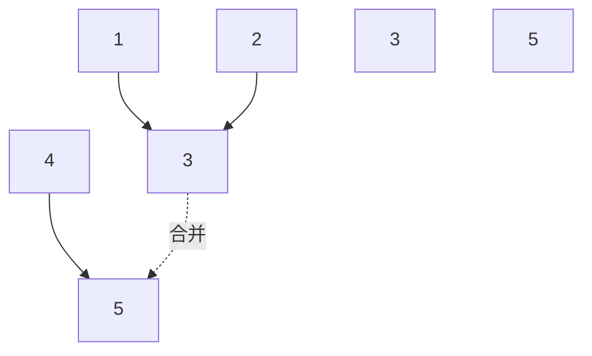

# 并查集

> 并查集（Union-Find）：高效处理动态连通性问题，近 O(1) 完成合并与查询。

## 目录

- [一、核心思想](#一核心思想)
- [二、基础实现](#二基础实现)
- [三、路径压缩与按秩合并](#三路径压缩与按秩合并)
- [四、连通分量](#四连通分量)
- [五、kruskal 最小生成树](#五kruskal-最小生成树)
- [六、应用场景](#六应用场景)
- [七、面试要点](#七面试要点)

## 一、核心思想

**并查集**：用一棵树表示一个集合，根节点作为代表。两个节点连通 ⇔ 它们的根相同。



**支持操作**：
- `find(x)`：找 x 所在集合的根
- `union(x, y)`：合并两个集合
- `connected(x, y)`：判断是否同属一个集合

## 二、基础实现

```go
type UnionFind struct {
    parent []int
}

func Constructor(n int) UnionFind {
    uf := UnionFind{parent: make([]int, n)}
    for i := 0; i < n; i++ {
        uf.parent[i] = i // 初始自己是父
    }
    return uf
}

func (uf *UnionFind) Find(x int) int {
    for uf.parent[x] != x {
        x = uf.parent[x]
    }
    return x
}

func (uf *UnionFind) Union(x, y int) {
    rx, ry := uf.Find(x), uf.Find(y)
    if rx != ry {
        uf.parent[rx] = ry
    }
}

func (uf *UnionFind) Connected(x, y int) bool {
    return uf.Find(x) == uf.Find(y)
}
```

**复杂度**：
- 不优化：最坏 O(n)（树退化成链）
- 优化后：均摊 O(α(n)) ≈ O(1)

## 三、路径压缩与按秩合并

### 3.1 路径压缩

> `find` 时把路径上所有节点直接挂到根。

```go
// 递归版（推荐）
func (uf *UnionFind) Find(x int) int {
    if uf.parent[x] != x {
        uf.parent[x] = uf.Find(uf.parent[x])
    }
    return uf.parent[x]
}

// 迭代版
func (uf *UnionFind) Find(x int) int {
    root := x
    for uf.parent[root] != root {
        root = uf.parent[root]
    }
    // 再次遍历压缩路径
    for uf.parent[x] != root {
        next := uf.parent[x]
        uf.parent[x] = root
        x = next
    }
    return root
}
```

### 3.2 按秩合并

> 把矮树挂到高树下，避免树高增长。

```go
type UnionFind struct {
    parent []int
    rank   []int
}

func (uf *UnionFind) Union(x, y int) {
    rx, ry := uf.Find(x), uf.Find(y)
    if rx == ry {
        return
    }
    // 矮的挂到高的下
    if uf.rank[rx] < uf.rank[ry] {
        uf.parent[rx] = ry
    } else if uf.rank[rx] > uf.rank[ry] {
        uf.parent[ry] = rx
    } else {
        uf.parent[ry] = rx
        uf.rank[rx]++
    }
}
```

### 3.3 完整实现

```go
type UnionFind struct {
    parent []int
    rank   []int
    count  int // 连通分量数
}

func NewUF(n int) *UnionFind {
    uf := &UnionFind{
        parent: make([]int, n),
        rank:   make([]int, n),
        count:  n,
    }
    for i := 0; i < n; i++ {
        uf.parent[i] = i
    }
    return uf
}

func (uf *UnionFind) Find(x int) int {
    if uf.parent[x] != x {
        uf.parent[x] = uf.Find(uf.parent[x])
    }
    return uf.parent[x]
}

func (uf *UnionFind) Union(x, y int) bool {
    rx, ry := uf.Find(x), uf.Find(y)
    if rx == ry {
        return false // 已在同一集合
    }
    if uf.rank[rx] < uf.rank[ry] {
        uf.parent[rx] = ry
    } else if uf.rank[rx] > uf.rank[ry] {
        uf.parent[ry] = rx
    } else {
        uf.parent[ry] = rx
        uf.rank[rx]++
    }
    uf.count--
    return true
}

func (uf *UnionFind) Count() int { return uf.count }
```

## 四、连通分量

### 4.1 朋友圈 / 省份数量

> 给定矩阵 `isConnected[i][j]=1` 表示 i、j 同省，求省份数。

```go
func findCircleNum(isConnected [][]int) int {
    n := len(isConnected)
    uf := NewUF(n)
    for i := 0; i < n; i++ {
        for j := i + 1; j < n; j++ {
            if isConnected[i][j] == 1 {
                uf.Union(i, j)
            }
        }
    }
    return uf.Count()
}
```

### 4.2 冗余连接

> 树中多加一条边导致环，返回多余的边。

```go
func findRedundantConnection(edges [][]int) []int {
    uf := NewUF(len(edges) + 1)
    for _, e := range edges {
        if !uf.Union(e[0], e[1]) {
            // 已经在同一集合，说明这条边多余
            return e
        }
    }
    return nil
}
```

### 4.3 岛屿数量（并查集版）

> 用并查集替代 DFS 求岛屿数。

```go
func numIslandsUF(grid [][]byte) int {
    m, n := len(grid), len(grid[0])
    uf := NewUF(m * n)
    water := 0
    dirs := [][]int{{0, 1}, {1, 0}}
    for i := 0; i < m; i++ {
        for j := 0; j < n; j++ {
            if grid[i][j] == '0' {
                water++
                continue
            }
            for _, d := range dirs {
                ni, nj := i+d[0], j+d[1]
                if ni < m && nj < n && grid[ni][nj] == '1' {
                    uf.Union(i*n+j, ni*n+nj)
                }
            }
        }
    }
    return uf.Count() - water
}
```

## 五、kruskal 最小生成树

> 把所有边按权排序，依次加入；若两端已连通则跳过。直到选了 n-1 条边。

```go
import "sort"

type Edge struct{ u, v, w int }

func kruskal(n int, edges []Edge) int {
    sort.Slice(edges, func(i, j int) bool {
        return edges[i].w < edges[j].w
    })
    uf := NewUF(n)
    total := 0
    cnt := 0
    for _, e := range edges {
        if uf.Union(e.u, e.v) {
            total += e.w
            cnt++
            if cnt == n-1 {
                break
            }
        }
    }
    return total
}
```

## 六、应用场景

### 6.1 等式方程的可满足性

> 给定 `a==b`、`b!=c` 等方程，判断是否冲突。

```go
func equationsPossible(equations []string) bool {
    uf := NewUF(26)
    // 先处理所有 ==
    for _, e := range equations {
        if e[1] == '=' {
            uf.Union(int(e[0]-'a'), int(e[3]-'a'))
        }
    }
    // 再检查 !=
    for _, e := range equations {
        if e[1] == '!' {
            if uf.Find(int(e[0]-'a')) == uf.Find(int(e[3]-'a')) {
                return false
            }
        }
    }
    return true
}
```

### 6.2 账户合并

> 同一邮箱归属同一人，合并账户。

**思路**：邮箱-账户索引映射 + 并查集合并拥有共同邮箱的账户。

### 6.3 最长连续序列（并查集版）

> 数组中最长连续元素序列长度。

```go
func longestConsecutiveUF(nums []int) int {
    if len(nums) == 0 {
        return 0
    }
    uf := NewUF(len(nums))
    index := map[int]int{}
    for i, v := range nums {
        if j, ok := index[v]; ok {
            uf.Union(i, j)
            continue
        }
        index[v] = i
        if j, ok := index[v-1]; ok {
            uf.Union(i, j)
        }
        if j, ok := index[v+1]; ok {
            uf.Union(i, j)
        }
    }
    // 统计每个连通块大小
    size := map[int]int{}
    for i := range nums {
        root := uf.Find(i)
        size[root]++
    }
    best := 0
    for _, s := range size {
        if s > best {
            best = s
        }
    }
    return best
}
```

## 七、面试要点

### 7.1 何时用并查集

- **动态连通性**：边逐渐加入，需实时回答「是否连通」
- **连通分量数**：求无向图连通分量
- **最小生成树**：Kruskal
- **无向图判环**：每条边两端已连通则有环

### 7.2 与其他数据结构对比

| 数据结构 | 优势 |
|---------|------|
| DFS | 静态图全遍历 |
| BFS | 最短路、层级 |
| 并查集 | 动态加边、连通查询 |

### 7.3 模板记忆

```text
并查集三件套：
  Find(x)     // 找根，路径压缩
  Union(x, y) // 按秩合并
  Count()     // 连通分量数

复杂度：α(n) ≈ O(1)
```

### 7.4 高频题清单

- 朋友圈 / 省份数量
- 冗余连接 I/II
- 岛屿数量（并查集版）
- 等式方程的可满足性
- 账户合并
- 最长连续序列（并查集版）
- 连通网络操作次数
- Kruskal 最小生成树
- 情侣牵手
