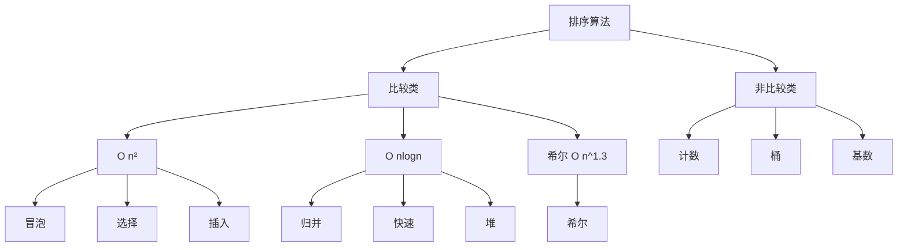

# 排序算法

> 十大经典排序算法面试全解：复杂度、稳定性、实现与优化。

## 目录

- [一、总览](#一总览)
- [二、冒泡排序](#二冒泡排序)
- [三、选择排序](#三选择排序)
- [四、插入排序](#四插入排序)
- [五、希尔排序](#五希尔排序)
- [六、归并排序](#六归并排序)
- [七、快速排序](#七快速排序)
- [八、堆排序](#八堆排序)
- [九、计数排序](#九计数排序)
- [十、桶排序](#十桶排序)
- [十一、基数排序](#十一基数排序)
- [十二、面试要点](#十二面试要点)

## 一、总览

| 算法 | 平均时间 | 最坏时间 | 空间 | 稳定性 | 适用场景 |
|------|---------|---------|------|--------|---------|
| 冒泡 | O(n²) | O(n²) | O(1) | 稳定 | 小数据、几乎有序 |
| 选择 | O(n²) | O(n²) | O(1) | 不稳定 | 小数据、交换代价高 |
| 插入 | O(n²) | O(n²) | O(1) | 稳定 | 小数据、几乎有序 |
| 希尔 | O(n^1.3) | O(n²) | O(1) | 不稳定 | 中等规模 |
| 归并 | O(nlogn) | O(nlogn) | O(n) | 稳定 | 大数据、要求稳定 |
| 快速 | O(nlogn) | O(n²) | O(logn) | 不稳定 | 通用、内存排序 |
| 堆 | O(nlogn) | O(nlogn) | O(1) | 不稳定 | TopK、优先队列 |
| 计数 | O(n+k) | O(n+k) | O(k) | 稳定 | 整数且范围小 |
| 桶 | O(n+k) | O(n²) | O(n+k) | 稳定 | 均匀分布 |
| 基数 | O(d(n+k)) | O(d(n+k)) | O(n+k) | 稳定 | 多关键字整数 |

> **稳定性**：相等元素排序后相对位置不变。稳定排序可用于多关键字排序（先按次要关键字排，再按主要关键字排）。



## 二、冒泡排序

**思路**：相邻两两比较，逆序则交换，每轮把最大值冒到末尾。

```go
func bubbleSort(arr []int) {
    n := len(arr)
    for i := 0; i < n-1; i++ {
        swapped := false
        // 每轮结束后末尾 i 个已就位
        for j := 0; j < n-1-i; j++ {
            if arr[j] > arr[j+1] {
                arr[j], arr[j+1] = arr[j+1], arr[j]
                swapped = true
            }
        }
        // 本轮无交换说明已有序，提前终止
        if !swapped {
            break
        }
    }
}
```

- **优化**：`swapped` 标志位，最好情况 O(n)
- **稳定**：相等不交换

## 三、选择排序

**思路**：每轮在未排序区找最小值，与未排序区首位交换。

```go
func selectionSort(arr []int) {
    n := len(arr)
    for i := 0; i < n-1; i++ {
        minIdx := i
        for j := i + 1; j < n; j++ {
            if arr[j] < arr[minIdx] {
                minIdx = j
            }
        }
        arr[i], arr[minIdx] = arr[minIdx], arr[i]
    }
}
```

- **不稳定**：跨距离交换破坏稳定性，如 `[5, 5, 2]` 第一轮 5 与 2 交换后两个 5 顺序改变
- **优点**：交换次数最少（最多 n-1 次）

## 四、插入排序

**思路**：类似扑克牌理牌，把当前元素插入到已排序区的合适位置。

```go
func insertionSort(arr []int) {
    for i := 1; i < len(arr); i++ {
        key := arr[i]
        j := i - 1
        // 比 key 大的元素后移
        for j >= 0 && arr[j] > key {
            arr[j+1] = arr[j]
            j--
        }
        arr[j+1] = key
    }
}
```

- **稳定**：相等时不后移
- **小数据优势**：n < 16 时常常胜过快排，故常作快排的递归终止分支

## 五、希尔排序

**思路**：分组插入排序。按 gap 分组对每组插入排序，gap 逐步缩小到 1。

```go
func shellSort(arr []int) {
    n := len(arr)
    for gap := n / 2; gap > 0; gap /= 2 {
        for i := gap; i < n; i++ {
            key := arr[i]
            j := i - gap
            for j >= 0 && arr[j] > key {
                arr[j+gap] = arr[j]
                j -= gap
            }
            arr[j+gap] = key
        }
    }
}
```

- **不稳定**：跨 gap 交换
- **gap 序列**：常用 Hibbard `2^k-1`、Sedgewick `4^k+3·2^(k-1)+1`，影响实际复杂度

## 六、归并排序

**思路**：分治。把数组对半拆到单元素，再两两合并为有序序列。

```go
func mergeSort(arr []int) []int {
    if len(arr) <= 1 {
        return arr
    }
    mid := len(arr) / 2
    left := mergeSort(arr[:mid])
    right := mergeSort(arr[mid:])
    return merge(left, right)
}

func merge(a, b []int) []int {
    res := make([]int, 0, len(a)+len(b))
    i, j := 0, 0
    for i < len(a) && j < len(b) {
        if a[i] <= b[j] { // <= 保证稳定
            res = append(res, a[i])
            i++
        } else {
            res = append(res, b[j])
            j++
        }
    }
    res = append(res, a[i:]...)
    res = append(res, b[j:]...)
    return res
}
```

- **稳定**：合并时相等取左侧
- **特性**：最好最坏都是 O(nlogn)，但需 O(n) 额外空间
- **外排序**：大数据无法全部装入内存时，分块排序后多路归并

## 七、快速排序

**思路**：分治。选基准 pivot，小于 pivot 放左、大于放右，对左右子区间递归。

```go
func quickSort(arr []int, lo, hi int) {
    if lo >= hi {
        return
    }
    p := partition(arr, lo, hi)
    quickSort(arr, lo, p-1)
    quickSort(arr, p+1, hi)
}

// Lomuto 分区：选最右为 pivot
func partition(arr []int, lo, hi int) int {
    pivot := arr[hi]
    i := lo // i 指向小于区的右边界
    for j := lo; j < hi; j++ {
        if arr[j] < pivot {
            arr[i], arr[j] = arr[j], arr[i]
            i++
        }
    }
    arr[i], arr[hi] = arr[hi], arr[i]
    return i
}
```

**优化**：
- **三数取中**选 pivot，避免最坏情况
- **小数组切换插入排序**（n < 16）
- **三路快排**：分为 `< pivot`、`= pivot`、`> pivot` 三区，处理大量重复元素

```go
// 三路快排
func quickSort3Way(arr []int, lo, hi int) {
    if lo >= hi {
        return
    }
    pivot := arr[lo]
    lt, gt := lo, hi
    i := lo + 1
    for i <= gt {
        if arr[i] < pivot {
            arr[lt], arr[i] = arr[i], arr[lt]
            lt++
            i++
        } else if arr[i] > pivot {
            arr[gt], arr[i] = arr[i], arr[gt]
            gt--
        } else {
            i++
        }
    }
    quickSort3Way(arr, lo, lt-1)
    quickSort3Way(arr, gt+1, hi)
}
```

- **不稳定**：跨距离交换
- **最坏 O(n²)**：已有序数组 + 选首/尾为 pivot 时退化

## 八、堆排序

**思路**：建大顶堆，反复把堆顶（最大）与末尾交换，缩小堆并下沉调整。

```go
func heapSort(arr []int) {
    n := len(arr)
    // 建堆：从最后一个非叶子节点开始下沉
    for i := n/2 - 1; i >= 0; i-- {
        siftDown(arr, i, n)
    }
    // 排序：堆顶换到末尾，缩小堆
    for i := n - 1; i > 0; i-- {
        arr[0], arr[i] = arr[i], arr[0]
        siftDown(arr, 0, i)
    }
}

func siftDown(arr []int, i, n int) {
    for {
        l, r := 2*i+1, 2*i+2
        max := i
        if l < n && arr[l] > arr[max] {
            max = l
        }
        if r < n && arr[r] > arr[max] {
            max = r
        }
        if max == i {
            return
        }
        arr[i], arr[max] = arr[max], arr[i]
        i = max
    }
}
```

- **不稳定**：跨距离交换
- **原地排序**：O(1) 额外空间
- **TopK 问题**：维护大小为 K 的堆，常比全排序快

## 九、计数排序

**思路**：统计每个值出现次数，按值顺序输出。要求值域有限。

```go
func countingSort(arr []int) []int {
    if len(arr) == 0 {
        return arr
    }
    minV, maxV := arr[0], arr[0]
    for _, v := range arr {
        if v < minV {
            minV = v
        }
        if v > maxV {
            maxV = v
        }
    }
    range_ := maxV - minV + 1
    count := make([]int, range_)
    for _, v := range arr {
        count[v-minV]++
    }
    // 前缀和：定位每个值的最终位置
    for i := 1; i < range_; i++ {
        count[i] += count[i-1]
    }
    out := make([]int, len(arr))
    // 倒序遍历保证稳定
    for i := len(arr) - 1; i >= 0; i-- {
        v := arr[i] - minV
        count[v]--
        out[count[v]] = arr[i]
    }
    return out
}
```

- **稳定**（用前缀和 + 倒序填入时）
- **限制**：值域大或非整数不适用

## 十、桶排序

**思路**：把元素按值分到若干桶，每桶内排序后拼接。

```go
func bucketSort(arr []float64, bucketSize int) []float64 {
    if len(arr) == 0 {
        return arr
    }
    minV, maxV := arr[0], arr[0]
    for _, v := range arr {
        if v < minV {
            minV = v
        }
        if v > maxV {
            maxV = v
        }
    }
    bucketCount := int((maxV-minV)/float64(bucketSize)) + 1
    buckets := make([][]float64, bucketCount)
    for _, v := range arr {
        idx := int((v - minV) / float64(bucketSize))
        buckets[idx] = append(buckets[idx], v)
    }
    out := make([]float64, 0, len(arr))
    for _, b := range buckets {
        sort.Float64s(b)
        out = append(out, b...)
    }
    return out
}
```

- **稳定**（桶内用稳定排序时）
- **最佳场景**：数据均匀分布，每桶元素少

## 十一、基数排序

**思路**：从低位到高位，按每位进行稳定计数排序。

```go
func radixSort(arr []int) {
    if len(arr) == 0 {
        return
    }
    maxV := arr[0]
    for _, v := range arr {
        if v > maxV {
            maxV = v
        }
    }
    // 按每一位计数排序
    for exp := 1; maxV/exp > 0; exp *= 10 {
        countingByDigit(arr, exp)
    }
}

func countingByDigit(arr []int, exp int) {
    n := len(arr)
    out := make([]int, n)
    count := make([]int, 10)
    for _, v := range arr {
        d := (v / exp) % 10
        count[d]++
    }
    for i := 1; i < 10; i++ {
        count[i] += count[i-1]
    }
    for i := n - 1; i >= 0; i-- {
        d := (arr[i] / exp) % 10
        count[d]--
        out[count[d]] = arr[i]
    }
    copy(arr, out)
}
```

- **稳定**
- **复杂度**：O(d·(n+k))，d 是最大位数，k 是基数（如 10）
- **适用**：整数、字符串等可按位拆解的数据

## 十二、面试要点

### 12.1 高频问题

1. **快排为什么通常最快？**
   - 原地、缓存友好（顺序访问）、常数因子小
2. **快排最坏如何避免？**
   - 三数取中、随机 pivot、三路快排处理重复
3. **归并和快排怎么选？**
   - 要求稳定 / 链表排序 / 外排序 → 归并
   - 内存数组通用排序 → 快排
4. **TopK 用什么？**
   - 小顶堆维护 K 个最大元素，O(nlogK)
   - 也可用快速选择，平均 O(n)
5. **稳定性有什么用？**
   - 多关键字排序：先按次要、再按主要稳定排序

### 12.2 各语言内置排序

| 语言 | 实现 |
|------|------|
| Go | `sort` pdqsort（结合快排、插入、堆） |
| Java | 对象 TimSort，基本类型 双轴快排 |
| Python | TimSort（归并+插入） |
| C++ | libstdc++ 内省排序（快排+堆+插入） |

> **TimSort**：归并 + 插入的混合，对部分有序数据友好，是 Java/Python 的默认排序。

### 12.3 一句话记忆

- 冒泡：相邻交换，最大值冒到末尾
- 选择：每轮选最小放前面
- 插入：扑克牌理牌
- 希尔：分组插入
- 归并：分治合并
- 快排：分治 + pivot 分区
- 堆排：建堆 + 反复取堆顶
- 计数：值域内统计
- 桶排序：分桶内排序
- 基数：按位计数排序
