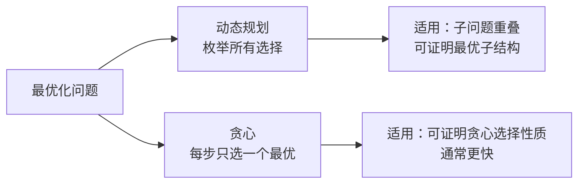

# 贪心算法

> 贪心：每步选当前最优，期望得到全局最优。适用于有贪心选择性质的问题。

## 目录

- [一、核心思想](#一核心思想)
- [二、区间贪心](#二区间贪心)
- [三、跳跃问题](#三跳跃问题)
- [四、分配问题](#四分配问题)
- [五、股票问题](#五股票问题)
- [六、面试要点](#六面试要点)

## 一、核心思想

### 1.1 两个性质

1. **贪心选择性质**：局部最优选择能导致全局最优
2. **最优子结构**：剩余问题的最优解 + 当前选择 = 全局最优

### 1.2 与 DP 的区别



| 维度 | 贪心 | DP |
|------|------|-----|
| 思路 | 局部最优 | 穷举所有子问题 |
| 复杂度 | 通常 O(nlogn) 或 O(n) | O(n²) 或更高 |
| 正确性 | 需严格证明 | 状态方程正确即可 |
| 适用 | 区间、分配、跳跃 | 子序列、背包、路径 |

### 1.3 证明方法

- **交换论证**：假设最优解与贪心解不同，交换使其不更差
- **数学归纳法**：证明前 k 步贪心等于最优

## 二、区间贪心

### 2.1 区间调度（最多不重叠区间数）

> 选最多互不重叠的区间。

**思路**：按右端点排序，每次选最早结束的区间。

```go
import "sort"

func eraseOverlapIntervals(intervals [][]int) int {
    sort.Slice(intervals, func(i, j int) bool {
        return intervals[i][1] < intervals[j][1]
    })
    count := 0
    end := -1 << 30
    for _, iv := range intervals {
        if iv[0] >= end {
            count++
            end = iv[1]
        }
    }
    return len(intervals) - count
}
```

### 2.2 合并区间

```go
import "sort"

func merge(intervals [][]int) [][]int {
    sort.Slice(intervals, func(i, j int) bool {
        return intervals[i][0] < intervals[j][0]
    })
    res := [][]int{intervals[0]}
    for i := 1; i < len(intervals); i++ {
        last := res[len(res)-1]
        if intervals[i][0] <= last[1] {
            if intervals[i][1] > last[1] {
                last[1] = intervals[i][1]
            }
        } else {
            res = append(res, intervals[i])
        }
    }
    return res
}
```

### 2.3 射击气球

> x 轴上水平气球，箭从 x 垂直射出可引爆 [x-start, x-end] 区间内的气球，求最少箭数。

**思路**：按 end 排序，每箭尽可能多射：当某气球 start > 当前箭的 end 时需要新箭。

```go
import "sort"

func findMinArrowShots(points [][]int) int {
    if len(points) == 0 {
        return 0
    }
    sort.Slice(points, func(i, j int) bool {
        return points[i][1] < points[j][1]
    })
    arrows := 1
    end := points[0][1]
    for i := 1; i < len(points); i++ {
        if points[i][0] > end {
            arrows++
            end = points[i][1]
        }
    }
    return arrows
}
```

### 2.4 划分字母区间

> 把字符串分成尽可能多段，每段字母只出现在该段。

**思路**：先记录每个字母最后出现位置，遍历时维护当前段最远边界，到达边界即切分。

```go
func partitionLabels(s string) []int {
    last := map[byte]int{}
    for i := 0; i < len(s); i++ {
        last[s[i]] = i
    }
    res := []int{}
    start, far := 0, 0
    for i := 0; i < len(s); i++ {
        if last[s[i]] > far {
            far = last[s[i]]
        }
        if i == far {
            res = append(res, i-start+1)
            start = i + 1
        }
    }
    return res
}
```

## 三、跳跃问题

### 3.1 跳跃游戏

> 能否跳到最后。

```go
func canJump(nums []int) bool {
    far := 0
    for i := 0; i < len(nums); i++ {
        if i > far {
            return false
        }
        if i+nums[i] > far {
            far = i + nums[i]
        }
        if far >= len(nums)-1 {
            return true
        }
    }
    return true
}
```

### 3.2 跳跃游戏 II

> 跳到最后的最少步数。

**思路**：维护当前一跳能到达的最远位置 `end`，以及下一跳能到达的最远 `far`。i 走到 end 时必须跳一次。

```go
func jump(nums []int) int {
    steps, end, far := 0, 0, 0
    for i := 0; i < len(nums)-1; i++ {
        if i+nums[i] > far {
            far = i + nums[i]
        }
        if i == end {
            steps++
            end = far
        }
    }
    return steps
}
```

## 四、分配问题

### 4.1 分发糖果

> 每个孩子有评分，相邻孩子评分高的要拿更多糖果，求最少糖果数。

**思路**：两次遍历。左到右保证右边比左边大时糖果+1；右到左保证左边比右边大时取较大值。

```go
func candy(ratings []int) int {
    n := len(ratings)
    candies := make([]int, n)
    for i := range candies {
        candies[i] = 1
    }
    // 左到右
    for i := 1; i < n; i++ {
        if ratings[i] > ratings[i-1] {
            candies[i] = candies[i-1] + 1
        }
    }
    // 右到左
    for i := n - 2; i >= 0; i-- {
        if ratings[i] > ratings[i+1] && candies[i] <= candies[i+1] {
            candies[i] = candies[i+1] + 1
        }
    }
    sum := 0
    for _, c := range candies {
        sum += c
    }
    return sum
}
```

### 4.2 任务调度器

> 同类任务需间隔 n 个冷却，求最少时间。

**思路**：让出现次数最多的任务决定框架。最大次数 maxCount，最少时间 = `(maxCount-1)*(n+1) + 出现maxCount次的任务数`，与总任务数取大。

```go
func leastInterval(tasks []byte, n int) int {
    freq := [26]int{}
    for _, t := range tasks {
        freq[t-'A']++
    }
    maxCount := 0
    maxCountNum := 0
    for _, f := range freq {
        if f > maxCount {
            maxCount = f
            maxCountNum = 1
        } else if f == maxCount {
            maxCountNum++
        }
    }
    res := (maxCount-1)*(n+1) + maxCountNum
    if res < len(tasks) {
        return len(tasks)
    }
    return res
}
```

## 五、股票问题

### 5.1 买卖股票最佳时机 II

> 可多次买卖，求最大利润。

**思路**：所有上升段都吃。

```go
func maxProfit(prices []int) int {
    profit := 0
    for i := 1; i < len(prices); i++ {
        if prices[i] > prices[i-1] {
            profit += prices[i] - prices[i-1]
        }
    }
    return profit
}
```

### 5.2 单调递增的数字

> 修改数字使其单调递增且最大。

**思路**：从右到左，遇到递减时把高位减 1、低位全变 9。

```go
func monotoneIncreasingDigits(n int) int {
    s := []byte(strconv.Itoa(n))
    marker := len(s)
    for i := len(s) - 1; i > 0; i-- {
        if s[i-1] > s[i] {
            s[i-1]--
            marker = i
        }
    }
    for i := marker; i < len(s); i++ {
        s[i] = '9'
    }
    res, _ := strconv.Atoi(string(s))
    return res
}
```

## 六、面试要点

### 6.1 常见贪心套路

| 类型 | 套路 |
|------|------|
| 区间调度 | 按 end 排序，选最早结束 |
| 区间合并 | 按 start 排序 |
| 跳跃 | 维护最远可达 |
| 分配 | 两次遍历满足双向约束 |
| 股票 | 吃所有上升段 |

### 6.2 排序是贪心的核心

多数贪心题第一步是排序，关键是**按什么排序**：
- 区间调度：按 end
- 区间合并：按 start
- 分配：按大小
- 任务调度：按频率

### 6.3 何时不能用贪心

- **0-1 背包**：贪心选性价比最高的不一定最优
- **最长递增子序列**：贪心选下一个最大的不一定最长
- **找零钱**（任意面额）：贪心可能找不到解

### 6.4 高频题清单

- 区间调度 / 合并区间 / 插入区间
- 射击气球 / 划分字母区间
- 跳跃游戏 I/II
- 分发糖果
- 任务调度器
- 买卖股票 II
- 单调递增数字
- 摆动序列
- 根据身高重建队列
