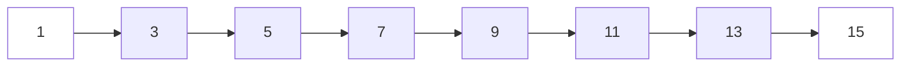
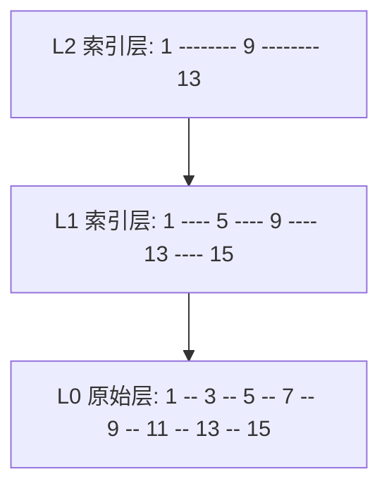
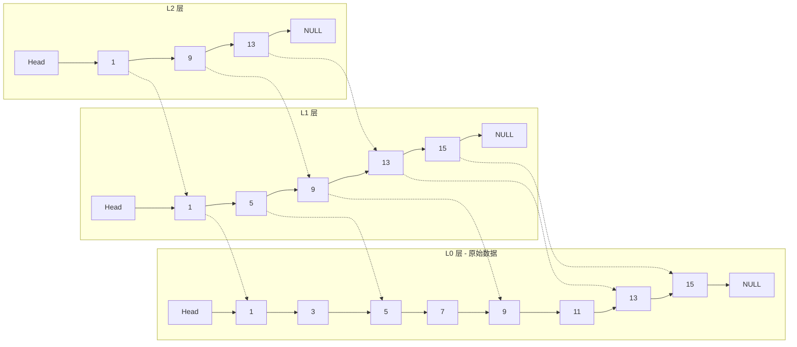
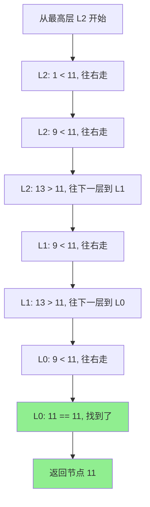
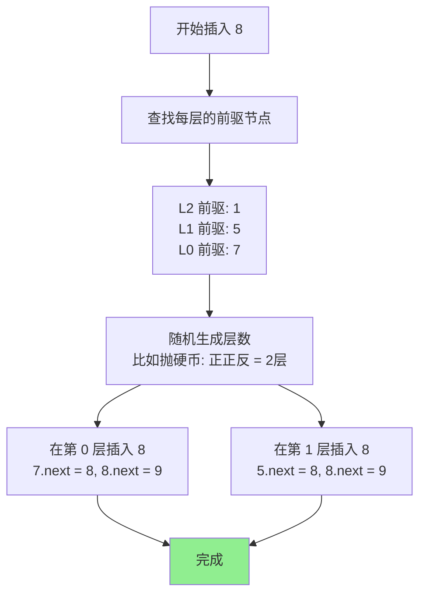
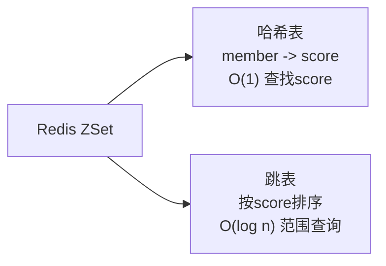

> 跳表（Skip List）：用空间换时间的有序数据结构，通过多级索引实现O(log n)的增删改查

## 目录

- [一、什么是跳表](#一什么是跳表)
- [二、为什么需要跳表](#二为什么需要跳表)
- [三、跳表的结构](#三跳表的结构)
- [四、核心操作](#四核心操作)
- [五、性能分析](#五性能分析)
- [六、应用场景](#六应用场景)
- [七、代码实现](#七代码实现)
- [八、与其他数据结构对比](#八与其他数据结构对比)
- [九、相关资料](#九相关资料)

## 一、什么是跳表

**跳表（Skip List）** 是一种基于有序链表的扩展数据结构，通过在链表上建立**多级索引**来实现快速查找。

- 由 William Pugh 于 1990 年提出
- 是对有序链表的改进，解决了链表查找慢的问题
- 本质上是用空间换时间，通过额外索引层加速查找
- 支持平均 O(log n) 的查找、插入、删除操作

### 核心思想

在有序链表之上，建立多层"快速通道"，让查找过程可以"跳跃"前进，而不是一步步遍历。

## 二、为什么需要跳表

### 2.1 有序链表的问题

普通有序链表虽然插入删除快（O(1) 修改指针），但查找需要 O(n)：



**查找 15**：需要从头节点遍历 8 个节点，效率低。

### 2.2 数组的局限

数组虽然支持二分查找 O(log n)，但插入删除需要移动元素，O(n)。

### 2.3 平衡树的复杂

红黑树、AVL 树能保证 O(log n)，但实现复杂，插入删除需要旋转维护平衡。

### 2.4 跳表的平衡

跳表结合了链表的简单和二分查找的高效：
- 查找：O(log n)
- 插入/删除：O(log n)
- 实现简单：无旋转、无颜色翻转
- 并发友好：更容易实现无锁并发

## 三、跳表的结构

### 3.1 多级索引

跳表在原始链表（第 0 层）之上，建立多层索引：



### 3.2 详细结构图



### 3.3 特点

| 特性 | 说明 |
|------|------|
| **多层结构** | 第 0 层是原始链表，包含所有节点 |
| **索引节点抽取** | 每一层从下一层随机抽取部分节点作为索引 |
| **层级递减** | 层级越高，节点越少，跨度越大 |
| **空间换时间** | 总节点数约为 n + n/2 + n/4 + ... ≈ 2n |

## 四、核心操作

### 4.1 查找过程

**查找 11 的过程**：



**查找路径**：1 → 9 → 13(回头) → 9 → 13(回头) → 11，共 4 次比较。

而普通链表需要遍历 6 次。

### 4.2 查找算法

```python
def search(skiplist, target):
    current = skiplist.head
    # 从最高层开始
    for level in range(skiplist.max_level - 1, -1, -1):
        # 在当前层向右移动，直到下一个节点值大于等于 target
        while current.forward[level] and current.forward[level].value < target:
            current = current.forward[level]
    # 到达第 0 层，检查下一个节点
    current = current.forward[0]
    if current and current.value == target:
        return current
    return None
```

### 4.3 插入过程

**插入 8 的步骤**：

1. **查找插入位置**：记录每层将要插入位置的前驱节点
2. **随机生成层数**：通过抛硬币决定新节点的层数
3. **插入节点**：在每一层对应位置插入新节点，更新指针



### 4.4 随机层数生成

跳表通过随机层数来维持平衡性，避免树结构中的复杂旋转：

```python
import random

def random_level(max_level, p=0.5):
    """生成随机层数
    p: 节点晋升到上一层的概率，通常为 0.5
    """
    level = 1
    while random.random() < p and level < max_level:
        level += 1
    return level
```

**概率分布**：
- 50% 的节点在第 1 层
- 25% 的节点在第 2 层
- 12.5% 的节点在第 3 层
- ...

### 4.5 删除过程

删除操作与插入类似：
1. 查找每层前驱节点
2. 在所有包含该节点的层中移除节点
3. 释放内存

## 五、性能分析

### 5.1 时间复杂度

| 操作 | 平均时间复杂度 | 最坏时间复杂度 | 说明 |
|------|---------------|---------------|------|
| 查找 | O(log n) | O(n) | 最坏情况退化为链表 |
| 插入 | O(log n) | O(n) | 同上 |
| 删除 | O(log n) | O(n) | 同上 |
| 范围查询 | O(log n + m) | O(n + m) | m 为结果数 |

### 5.2 空间复杂度

| 指标 | 复杂度 | 说明 |
|------|--------|------|
| 总空间 | O(n) | 索引节点数总和约 2n |
| 每节点平均指针数 | 2 | p=0.5 时的期望值 |

### 5.3 与其他数据结构对比

| 数据结构 | 查找 | 插入 | 删除 | 范围查询 | 实现难度 | 并发支持 |
|----------|------|------|------|----------|----------|----------|
| 有序链表 | O(n) | O(n) | O(n) | O(n+m) | 简单 | 差 |
| 有序数组 | O(log n) | O(n) | O(n) | O(log n+m) | 简单 | 差 |
| 平衡二叉树(AVL) | O(log n) | O(log n) | O(log n) | O(log n+m) | 复杂 | 一般 |
| 红黑树 | O(log n) | O(log n) | O(log n) | O(log n+m) | 很复杂 | 一般 |
| B+ 树 | O(log n) | O(log n) | O(log n) | O(log n+m) | 复杂 | 一般 |
| **跳表** | **O(log n)** | **O(log n)** | **O(log n)** | **O(log n+m)** | **简单** | **好** |

## 六、应用场景

### 6.1 Redis 的有序集合 ZSet

Redis 的 Sorted Set 底层使用跳表 + 哈希表实现：



**为什么 Redis 选跳表而不是红黑树**：
1. 内存占用灵活，可通过 p 参数调整
2. 范围查询更简单（链表遍历即可）
3. 实现简单，不易出错
4. 无需复杂旋转，调试方便

### 6.2 LevelDB / RocksDB

LSM-Tree 的 MemTable 使用跳表存储内存中的有序数据。

### 6.3 其他场景

| 场景 | 用途 |
|------|------|
| Kafka 流处理 | 时间窗口索引 |
| Lucene | 倒排索引中的词项定位 |
| ConcurrentSkipListMap | Java 并发包中的有序映射 |
| LevelDB MemTable | 内存中有序 KV 存储 |

## 七、代码实现

### 7.1 Go 实现简化版

```go
package main

import (
    "fmt"
    "math/rand"
)

const (
    maxLevel = 16  // 最大层数
    p        = 0.5 // 晋升概率
)

// Node 跳表节点
type Node struct {
    Value  int
    Forward []*Node // 每层的下一个节点
}

// SkipList 跳表
type SkipList struct {
    Head     *Node
    Level    int    // 当前最大层数
}

// NewSkipList 创建跳表
func NewSkipList() *SkipList {
    return &SkipList{
        Head:  &Node{Forward: make([]*Node, maxLevel)},
        Level: 1,
    }
}

// randomLevel 生成随机层数
func randomLevel() int {
    level := 1
    for rand.Float64() < p && level < maxLevel {
        level++
    }
    return level
}

// Search 查找
func (sl *SkipList) Search(target int) bool {
    current := sl.Head
    // 从最高层开始
    for i := sl.Level - 1; i >= 0; i-- {
        for current.Forward[i] != nil && current.Forward[i].Value < target {
            current = current.Forward[i]
        }
    }
    current = current.Forward[0]
    return current != nil && current.Value == target
}

// Insert 插入
func (sl *SkipList) Insert(value int) {
    update := make([]*Node, maxLevel)
    current := sl.Head

    // 查找每层的前驱
    for i := sl.Level - 1; i >= 0; i-- {
        for current.Forward[i] != nil && current.Forward[i].Value < value {
            current = current.Forward[i]
        }
        update[i] = current
    }

    // 生成新节点的层数
    newLevel := randomLevel()
    if newLevel > sl.Level {
        for i := sl.Level; i < newLevel; i++ {
            update[i] = sl.Head
        }
        sl.Level = newLevel
    }

    // 创建新节点
    newNode := &Node{
        Value:  value,
        Forward: make([]*Node, newLevel),
    }

    // 插入到每一层
    for i := 0; i < newLevel; i++ {
        newNode.Forward[i] = update[i].Forward[i]
        update[i].Forward[i] = newNode
    }
}

// Delete 删除
func (sl *SkipList) Delete(value int) bool {
    update := make([]*Node, maxLevel)
    current := sl.Head

    for i := sl.Level - 1; i >= 0; i-- {
        for current.Forward[i] != nil && current.Forward[i].Value < value {
            current = current.Forward[i]
        }
        update[i] = current
    }

    target := current.Forward[0]
    if target == nil || target.Value != value {
        return false
    }

    // 在每一层中移除
    for i := 0; i < sl.Level; i++ {
        if update[i].Forward[i] != target {
            break
        }
        update[i].Forward[i] = target.Forward[i]
    }

    // 更新跳表层数
    for sl.Level > 1 && sl.Head.Forward[sl.Level-1] == nil {
        sl.Level--
    }

    return true
}

func main() {
    sl := NewSkipList()
    sl.Insert(1)
    sl.Insert(3)
    sl.Insert(5)
    sl.Insert(7)
    sl.Insert(9)

    fmt.Println(sl.Search(5))  // true
    fmt.Println(sl.Search(6))  // false

    sl.Delete(5)
    fmt.Println(sl.Search(5))  // false
}
```

## 八、与其他数据结构对比

### 8.1 跳表 vs 红黑树

| 维度 | 跳表 | 红黑树 |
|------|------|--------|
| 时间复杂度 | O(log n) | O(log n) |
| 空间复杂度 | O(n) (2n 指针) | O(n) |
| 实现难度 | 简单 | 复杂 |
| 范围查询 | 简单（链表遍历） | 需中序遍历 |
| 并发控制 | 局部锁即可 | 需要旋转，锁复杂 |
| 调试难度 | 容易 | 困难 |
| 内存局部性 | 一般 | 一般 |

### 8.2 跳表 vs B+ 树

| 维度 | 跳表 | B+ 树 |
|------|------|--------|
| 设计目标 | 内存数据结构 | 磁盘数据结构 |
| 节点大小 | 小（单元素） | 大（一页数据） |
| 查找次数 | log n 次指针跳转 | log n 次磁盘IO |
| 范围查询 | 链表遍历 | 叶子节点链表 |
| 适用场景 | 内存索引 | 数据库索引 |

## 九、相关资料

- [Skip Lists: A Probabilistic Alternative to Balanced Trees](https://15721.courses.cs.cmu.edu/spring2018/papers/08-oltpindexes1/pugh-skiplists-1990.pdf)
- [Redis 源码 t_zset.c](https://github.com/redis/redis/blob/unstable/src/t_zset.c)
- [LevelDB skiplist](https://github.com/google/leveldb/blob/main/db/skiplist.h)
- [Java ConcurrentSkipListMap 源码](https://github.com/openjdk/jdk/blob/master/src/java.base/share/classes/java/util/concurrent/ConcurrentSkipListMap.java)
