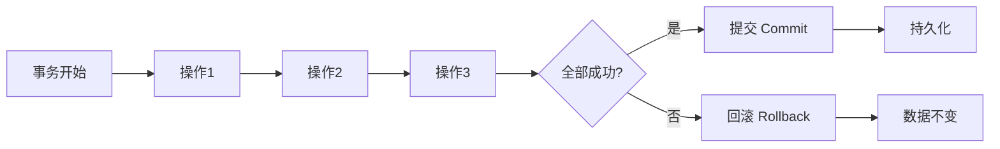
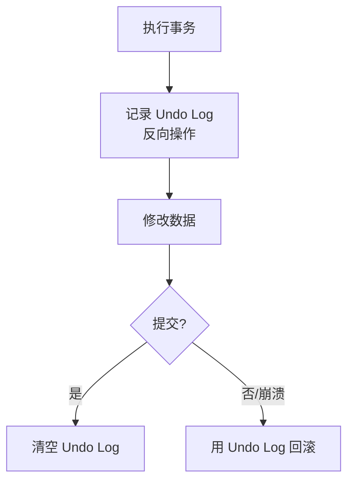
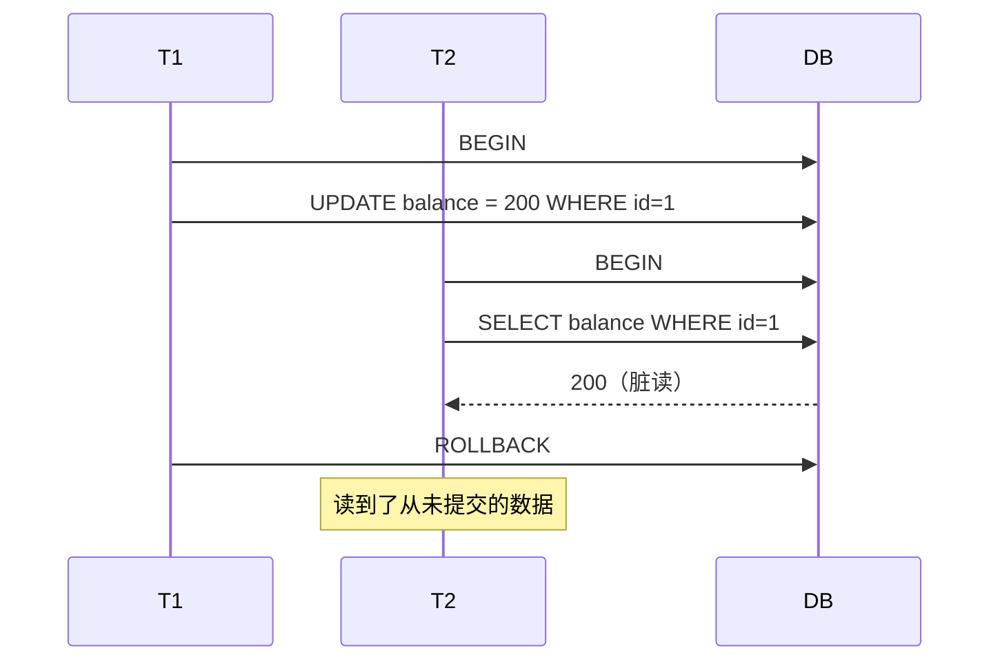
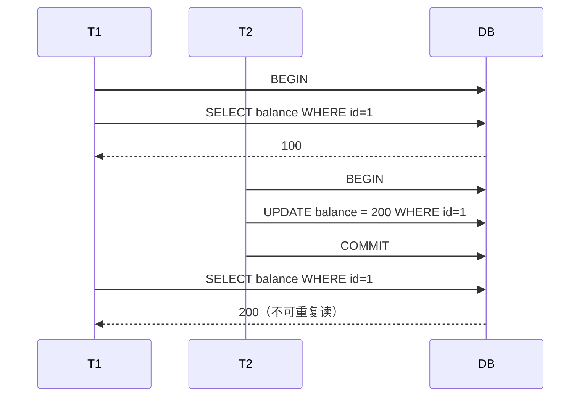
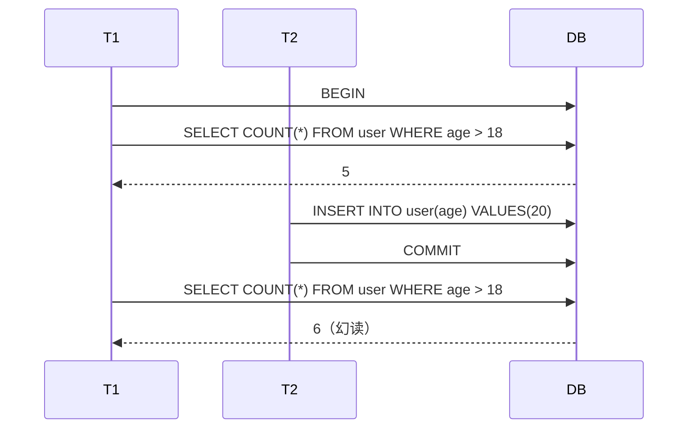
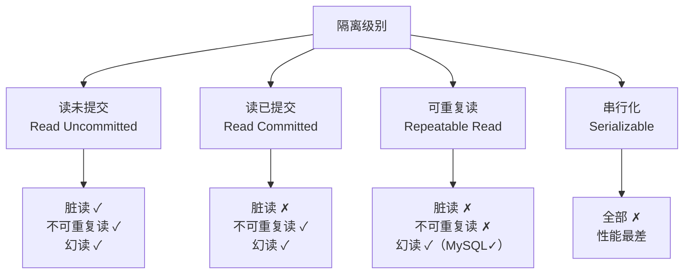
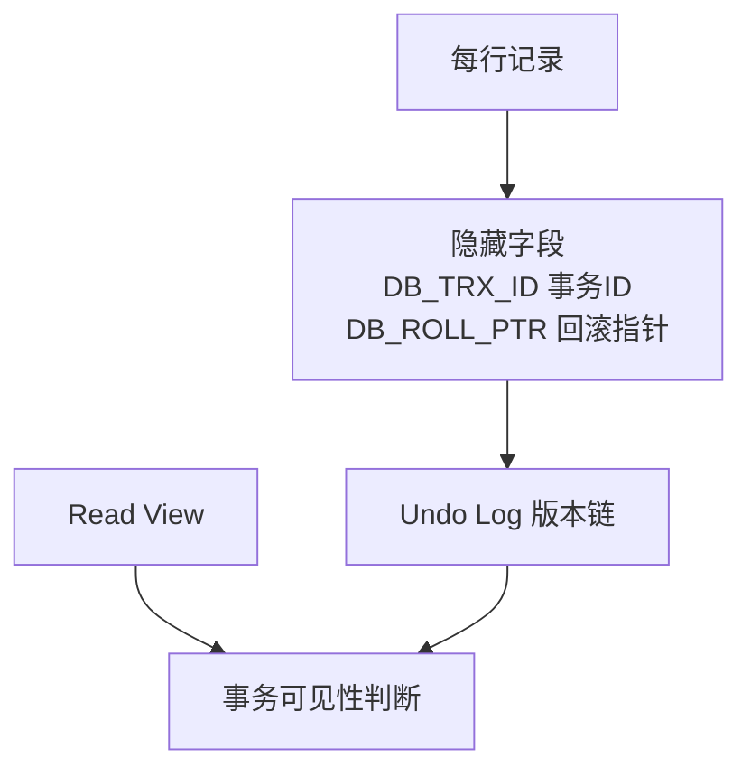
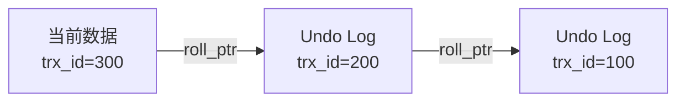
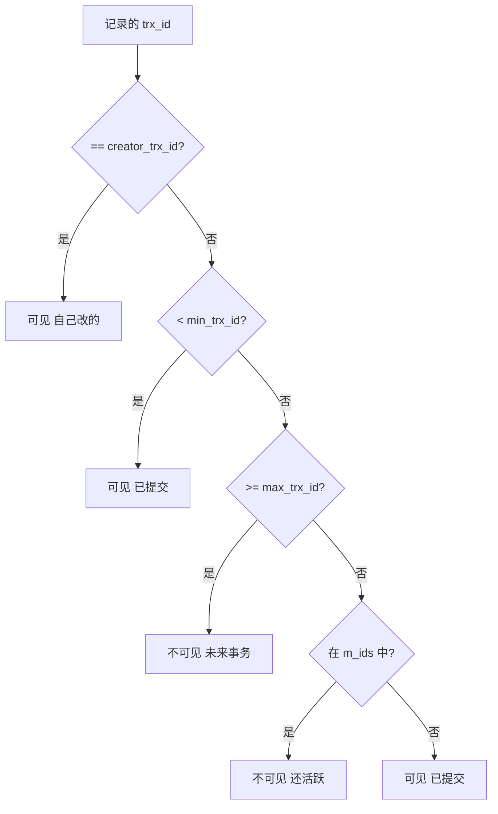
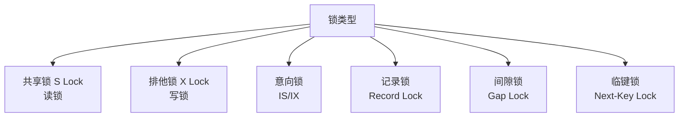

# ACID 与事务隔离级别

> ACID 是数据库事务的基石，理解隔离级别是架构师设计高并发系统的必备知识。本文系统讲解 ACID 特性、并发问题、四种隔离级别及 MVCC 原理。

## 目录

- [一、ACID 特性](#一acid-特性)
- [二、并发问题](#二并发问题)
- [三、四种隔离级别](#三四种隔离级别)
- [四、MVCC 原理](#四mvcc-原理)
- [五、锁机制](#五锁机制)
- [六、分布式事务 ACID](#六分布式事务-acid)
- [七、相关资料](#七相关资料)

## 一、ACID 特性

| 特性 | 全称 | 含义 |
|------|------|------|
| **A** | Atomicity 原子性 | 事务内操作要么全部成功，要么全部失败 |
| **C** | Consistency 一致性 | 事务前后数据保持合法状态 |
| **I** | Isolation 隔离性 | 并发事务互不干扰 |
| **D** | Durability 持久性 | 提交后数据永久保存 |



### 1.1 原子性实现：Undo Log



### 1.2 持久性实现：Redo Log

```mermaid
flowchart LR
    A[修改数据] --> B[写 Redo Log<br/>WAL]
    B --> C[fsync 落盘]
    C --> D[修改内存缓冲池]
    D --> E[异步刷数据页]
    Note over A,E: 崩溃后用 Redo Log 恢复
```

### 1.3 一致性

一致性是**最终目标**，由 A、I、D 共同保证：

- A：事务要么全做要么全不做
- I：并发事务像串行执行
- D：提交后不丢

```python
# 转账示例：A 给 B 转 100 元
def transfer(a, b, amount):
    db.begin()
    try:
        db.execute("UPDATE account SET balance = balance - 100 WHERE id = ?", a)
        db.execute("UPDATE account SET balance = balance + 100 WHERE id = ?", b)
        db.commit()  # 一致性：A + B 总额不变
    except:
        db.rollback()
```

## 二、并发问题

| 问题 | 描述 | 示例 |
|------|------|------|
| **脏读** | 读到未提交的数据 | A 改了未提交，B 读到，A 回滚 |
| **不可重复读** | 同一事务两次读结果不同 | A 读 v=1，B 改并提交，A 再读 v=2 |
| **幻读** | 同一查询条件结果集变化 | A 查 count=5，B 插入，A 再查 count=6 |
| **丢失更新** | 一个事务的更新覆盖另一个 | A、B 都读 v=1，A 改 2，B 改 3，最终 3（A 丢失） |

### 2.1 脏读示例



### 2.2 不可重复读



### 2.3 幻读



## 三、四种隔离级别



| 隔离级别 | 脏读 | 不可重复读 | 幻读 | 性能 |
|---------|------|----------|------|------|
| Read Uncommitted | 可能 | 可能 | 可能 | 最好 |
| Read Committed | 避免 | 可能 | 可能 | 好 |
| Repeatable Read | 避免 | 避免 | 可能（MySQL 避免） | 中 |
| Serializable | 避免 | 避免 | 避免 | 差 |

### 3.1 各数据库默认级别

| 数据库 | 默认级别 |
|--------|---------|
| MySQL InnoDB | Repeatable Read |
| PostgreSQL | Read Committed |
| Oracle | Read Committed |
| SQL Server | Read Committed |

### 3.2 MySQL 的 RR 解决幻读

InnoDB 在 RR 级别通过 **MVCC + Next-Key Lock** 解决幻读：

- **快照读**（普通 SELECT）：MVCC 保证读到事务开始时的快照
- **当前读**（SELECT FOR UPDATE、UPDATE、DELETE）：Next-Key Lock 锁住范围

```sql
-- 事务 A
START TRANSACTION;
SELECT * FROM user WHERE age > 18 FOR UPDATE;  -- 加 Next-Key Lock
-- 锁定 age > 18 的范围，阻止插入

-- 事务 B 尝试插入会被阻塞
INSERT INTO user(age) VALUES(20);  -- 阻塞
```

## 四、MVCC 原理

Multi-Version Concurrency Control，多版本并发控制，让读不阻塞写、写不阻塞读。

### 4.1 核心组件



| 组件 | 作用 |
|------|------|
| **DB_TRX_ID** | 最后修改该行的事务 ID |
| **DB_ROLL_PTR** | 指向 Undo Log 中的上一个版本 |
| **Read View** | 事务开启时的快照，包含活跃事务列表 |

### 4.2 版本链



### 4.3 可见性判断

事务开启时生成 Read View，包含：
- `m_ids`：当前活跃事务 ID 列表
- `min_trx_id`：m_ids 中最小值
- `max_trx_id`：下一个将分配的事务 ID
- `creator_trx_id`：当前事务 ID

判断规则：



### 4.4 RC vs RR 的 Read View

| 隔离级别 | Read View 生成时机 |
|---------|------------------|
| Read Committed | 每次 SELECT 都生成新的 |
| Repeatable Read | 事务开始时生成，后续复用 |

## 五、锁机制

### 5.1 锁分类



### 5.2 锁兼容性

|  | S | X | IS | IX |
|--|---|---|----|----|
| **S** | ✓ | ✗ | ✓ | ✗ |
| **X** | ✗ | ✗ | ✗ | ✗ |
| **IS** | ✓ | ✗ | ✓ | ✓ |
| **IX** | ✗ | ✗ | ✓ | ✓ |

### 5.3 Next-Key Lock

InnoDB 在 RR 级别使用 Next-Key Lock（Record Lock + Gap Lock）防止幻读：

```sql
-- 假设表中 age 有值 10, 20, 30
SELECT * FROM user WHERE age > 15 AND age < 25 FOR UPDATE;
-- 锁定范围 (10, 30)，阻止在此范围插入
```

## 六、分布式事务 ACID

### 6.1 单机 ACID 的局限

```mermaid
flowchart LR
    A[订单服务 MySQL] -->|跨库| B[库存服务 MySQL]
    B -->|跨服务| C[支付服务 MySQL]
    Note over A,C: 单机事务无法保证跨库一致性
```

### 6.2 分布式 ACID 方案

| 方案 | 一致性 | 性能 | 复杂度 |
|------|--------|------|--------|
| 2PC | 强 | 低 | 中 |
| 3PC | 强 | 低 | 高 |
| TCC | 强 | 中 | 高 |
| Saga | 最终 | 高 | 中 |
| 本地消息表 | 最终 | 高 | 低 |

详见：
- [2pc.md](./2pc.md)
- [3pc.md](./3pc.md)
- [分布式事务.md](./分布式事务.md)
- [Saga模式.md](./Saga模式.md)
- [TCC事务.md](./TCC事务.md)

## 七、相关资料

- [MySQL 官方文档 - InnoDB 锁](https://dev.mysql.com/doc/refman/8.0/en/innodb-locking.html)
- 《数据库系统概念》Silberschatz
- 《高性能 MySQL》
- [MVCC 原理详解](https://xiaolincoding.com/mysql/transaction/mvcc.html)
