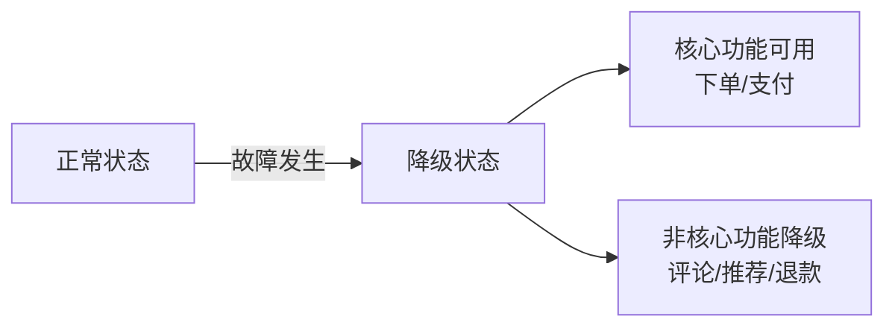
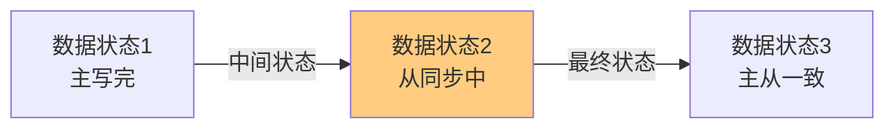
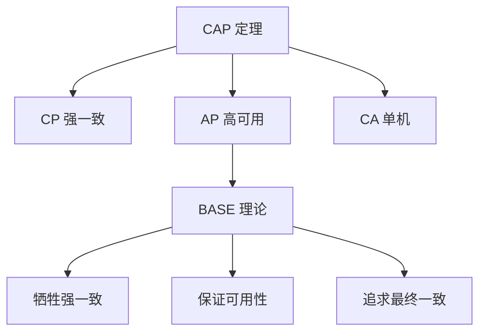
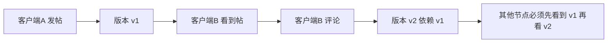
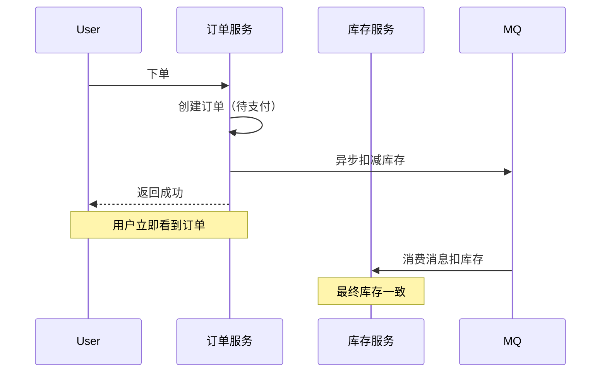
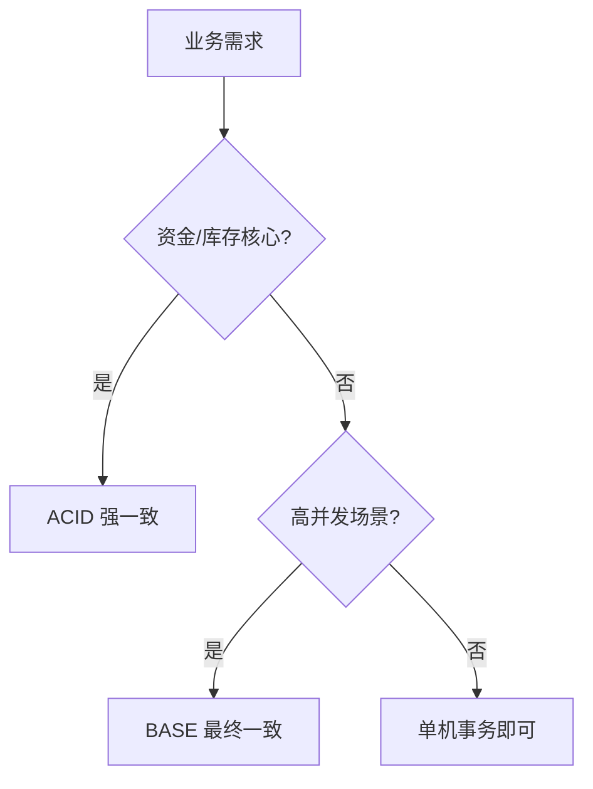

# BASE 理论

> BASE 是分布式系统理论的实践指导，由 Dan Pritchett 于 2008 年提出，是对 CAP 中 AP 的延伸，强调通过牺牲强一致性来获得可用性。

## 目录

- [一、BASE 定义](#一base-定义)
- [二、与 CAP 的关系](#二与-cap-的关系)
- [三、最终一致性](#三最终一致性)
- [四、应用实践](#四应用实践)
- [五、与 ACID 对比](#五与-acid-对比)
- [六、相关资料](#六相关资料)

## 一、BASE 定义

| 缩写 | 全称 | 含义 |
|------|------|------|
| **BA** | Basically Available | 基本可用 |
| **S** | Soft State | 软状态 |
| **E** | Eventually Consistent | 最终一致性 |

### 1.1 基本可用（Basically Available）

系统在故障时**允许损失部分可用性**，保证核心可用：

- **响应时间损失**：查询从 1s 增加到 5s
- **功能损失**：双十一降级退款服务，保留下单



### 1.2 软状态（Soft State）

允许系统中的数据存在**中间状态**，该状态不影响系统整体可用性：

- 订单状态：创建中 → 支付中 → 已支付
- 复制延迟：主从数据短暂不一致
- 消息处理中：消息已接收但未处理完成



### 1.3 最终一致性（Eventually Consistent）

系统保证**最终**数据会达到一致状态，但不需要实时一致：


## 二、与 CAP 的关系



| 维度 | CAP | BASE |
|------|-----|------|
| 层次 | 理论定理 | 实践指导 |
| 关注点 | 一致性与可用性的权衡 | 如何在 AP 下构建可用系统 |
| 性质 | 数学证明 | 工程经验 |

## 三、最终一致性

### 3.1 一致性变体

| 类型 | 说明 | 示例 |
|------|------|------|
| **因果一致性** | 有因果关系的写操作按顺序可见 | 评论必须在文章后 |
| **读己之写** | 客户端能看到自己刚写的值 | 修改头像后立即看到 |
| **会话一致性** | 同一会话内读己之写 | 登录会话内一致 |
| **单调读一致性** | 不会读到比之前更旧的值 | 不会出现时间倒流 |
| **单调写一致性** | 同一客户端写操作按顺序生效 | 避免乱序更新 |

### 3.2 读己之写实现

```python
# 方案1：粘性会话
def read_after_write(user_id, key):
    # 写主库
    master.set(key, value)
    # 同会话内读主库
    return master.get(key)

# 方案2：版本号
def read_with_version(key, min_version):
    while True:
        value, version = replica.get_with_version(key)
        if version >= min_version:
            return value
        time.sleep(0.01)
```

### 3.3 因果一致性实现



## 四、应用实践

### 4.1 电商订单



- **基本可用**：下单核心功能必须可用
- **软状态**：订单状态短暂为"库存扣减中"
- **最终一致**：异步消息保证最终库存扣减

### 4.2 社交动态

```python
# 发布动态后，粉丝看到的延迟可接受
def publish_post(user_id, content):
    # 1. 写入主库
    post_id = db.insert(user_id, content)
    # 2. 异步推送粉丝时间线
    mq.send('fanout', {'user_id': user_id, 'post_id': post_id})
    # 3. 立即返回，不等待推送完成
    return post_id
```

### 4.3 缓存更新

```python
# Cache Aside 模式体现 BASE 思想
def update_data(key, value):
    db.update(key, value)   # 数据库立即一致
    cache.delete(key)        # 缓存软状态（短暂不一致）
    # 下次读时回填，最终一致
```

## 五、与 ACID 对比

| 维度 | ACID | BASE |
|------|------|------|
| **一致性** | 强一致 | 最终一致 |
| **可用性** | 牺牲可用性保一致 | 优先可用性 |
| **场景** | 金融核心交易 | 互联网高并发 |
| **实现复杂度** | 高（分布式事务） | 中（异步补偿） |
| **性能** | 低 | 高 |



### 混合策略

实际系统常采用 ACID + BASE 混合：

| 模块 | 一致性策略 |
|------|----------|
| 账户余额 | ACID 强一致 |
| 商品库存 | BASE 最终一致（预扣 + 异步确认） |
| 用户评论 | BASE 最终一致 |
| 订单状态 | BASE 最终一致 |

## 六、相关资料

- [Base: An ACID Alternative - Dan Pritchett](https://queue.acm.org/detail.cfm?id=1394128)
- [CAP 定理十二年回顾](https://www.infoq.cn/article/cap-twelve-years-later-how-the-rules-have-changed)
- 《数据密集型应用系统设计》Martin Kleppmann
