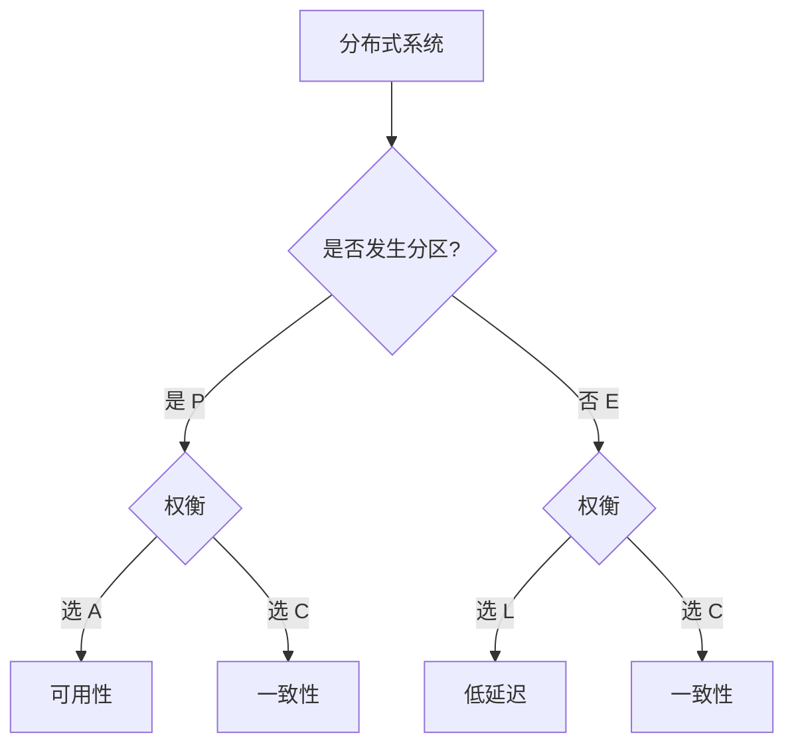
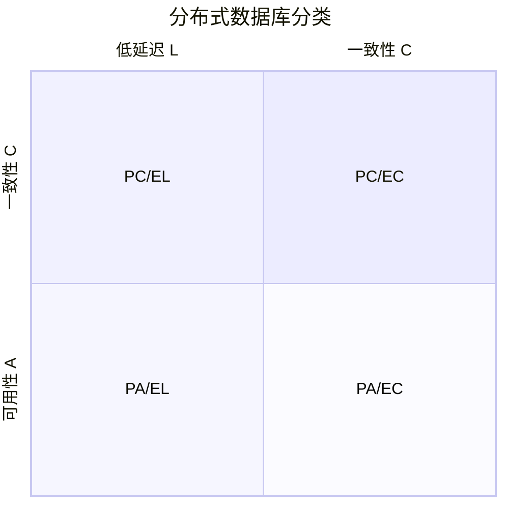
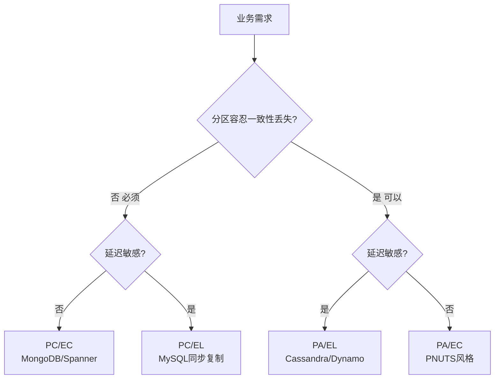

# PACELC 定理

> PACELC 是 CAP 定理的扩展，由 Daniel Abadi 于 2010 年提出，弥补了 CAP 未考虑"无分区时的延迟-一致性权衡"这一缺陷。

## 目录

- [一、PACELC 定义](#一pacelc-定义)
- [二、与 CAP 的关系](#二与-cap-的关系)
- [三、典型系统分类](#三典型系统分类)
- [四、工程意义](#四工程意义)
- [五、相关资料](#五相关资料)

## 一、PACELC 定义

PACELC 是一个条件性定理：

```
If Partition (P): choose between Availability (A) and Consistency (C)
Else (E): choose between Latency (L) and Consistency (C)
```



| 缩写 | 含义 | 触发条件 |
|------|------|---------|
| **PA** | Partition 时选可用性 | 发生分区 |
| **PC** | Partition 时选一致性 | 发生分区 |
| **EL** | Else 时选低延迟 | 无分区 |
| **EC** | Else 时选一致性 | 无分区 |

组合形式：`PA/EL` 或 `PC/EC`

## 二、与 CAP 的关系


| 维度 | CAP | PACELC |
|------|-----|--------|
| 关注场景 | 仅分区时 | 分区时 + 正常时 |
| 关注属性 | C 与 A | C 与 A，C 与 L |
| 完整性 | 不完整 | 完整 |

### CAP 的盲区

CAP 未回答：**正常情况下**系统如何权衡？

- 强一致系统（CP）在无分区时也需要权衡：同步复制 vs 异步复制
- AP 系统在无分区时也可能提供较强一致性

## 三、典型系统分类

### 3.1 PA/EL（可用性优先）

**特点**：分区时牺牲一致性，正常时追求低延迟。

| 系统 | 说明 |
|------|------|
| **Dynamo** | Amazon KV 存储，异步复制 |
| **Cassandra** | 最终一致，可调一致性 |
| **Riak** | 默认 PA/EL |

```python
# Cassandra 一致性级别可调
# ANY: 最高可用性，最低一致性（PA/EL）
# ONE: 写一个副本即返回（低延迟）
# QUORUM: 写多数副本（较高延迟，较强一致）
session.execute("WRITE CONSISTENCY ONE")
```

### 3.2 PC/EC（一致性优先）

**特点**：分区时牺牲可用性，正常时追求强一致。

| 系统 | 说明 |
|------|------|
| **BigTable** | 同步复制 |
| **HBase** | 强一致 |
| **MongoDB** | 默认强一致（已选举出主后） |

### 3.3 PA/EC（分区选A，正常选C）

**特点**：分区时保可用性，正常时追求一致性。

| 系统 | 说明 |
|------|------|
| **PNUTS** | Yahoo 系统 |

### 3.4 PC/EL（分区选C，正常选L）

**特点**：分区时保一致性，正常时追求低延迟。

| 系统 | 说明 |
|------|------|
| **MySQL 异步复制** | 主从异步，主故障时可能丢数据 |

### 3.5 系统对比表



| 系统 | 分区时 | 正常时 | 分类 |
|------|--------|--------|------|
| Dynamo | A | L | PA/EL |
| Cassandra | A | L | PA/EL |
| MongoDB | C | C | PC/EC |
| BigTable | C | C | PC/EC |
| MySQL 主从 | C | L | PC/EL |
| PNUTS | A | C | PA/EC |

## 四、工程意义

### 4.1 系统设计选型



### 4.2 Cassandra 一致性可调

Cassandra 允许每次操作指定一致性级别，体现 PACELC 思想：

| 一致性级别 | 分区行为 | 正常延迟 | 适用场景 |
|----------|---------|---------|---------|
| ANY | 可用 | 最低 | 日志类 |
| ONE | 可用 | 低 | 用户画像 |
| QUORUM | 部分一致 | 中 | 订单 |
| ALL | 强一致 | 高 | 金融 |

### 4.3 业务场景匹配

| 场景 | 推荐 PACELC | 理由 |
|------|------------|------|
| 银行账户 | PC/EC | 绝不能错 |
| 电商库存 | PA/EL 或 PC/EL | 可短时不一致 |
| 社交动态 | PA/EL | 可用性优先 |
| 配置中心 | PC/EC | 强一致 |
| 监控指标 | PA/EL | 容忍丢失 |
| 计费系统 | PC/EC | 必须准确 |

## 五、相关资料

- [PACELC 原论文 - Daniel Abadi](https://www.cs.umd.edu/~abadi/papers/abadi-pacelc.pdf)
- [CAP 定理与 PACELC](https://www.cs.umd.edu/~abadi/)
- 《数据密集型应用系统设计》Martin Kleppmann
