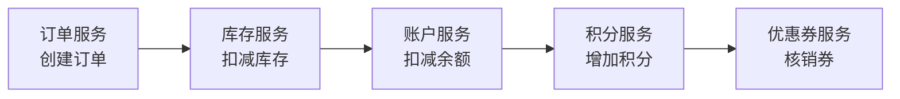
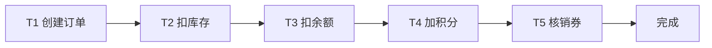
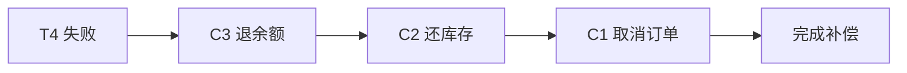
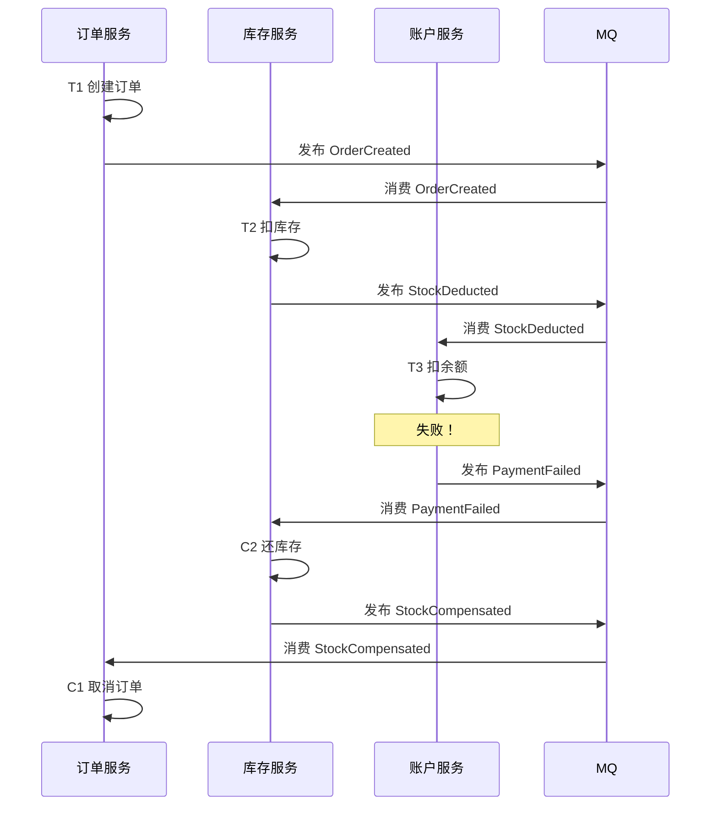
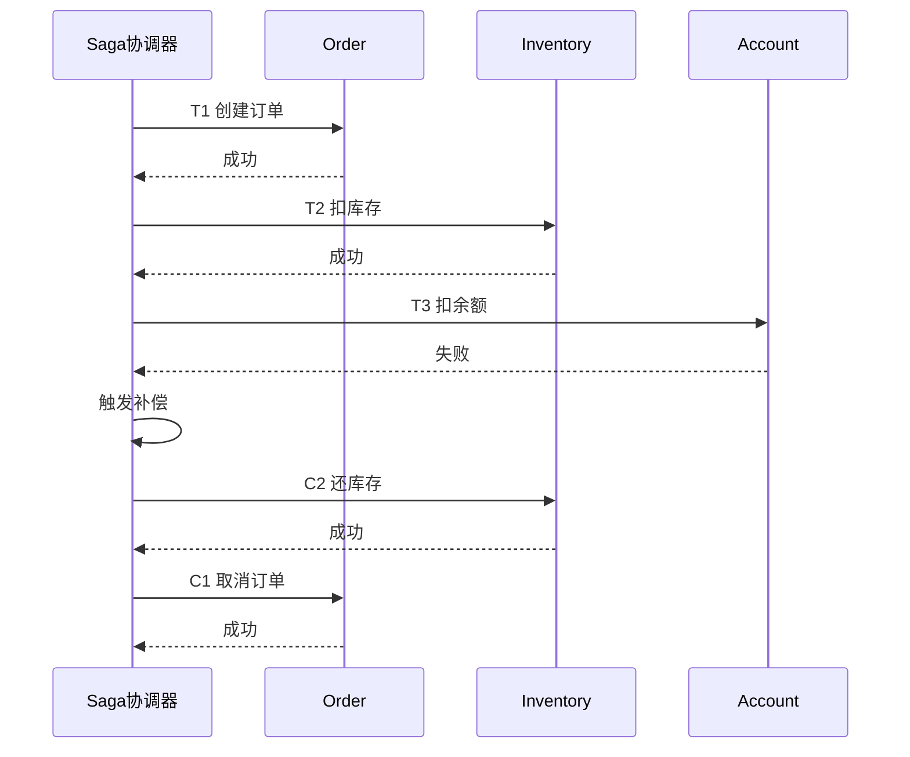
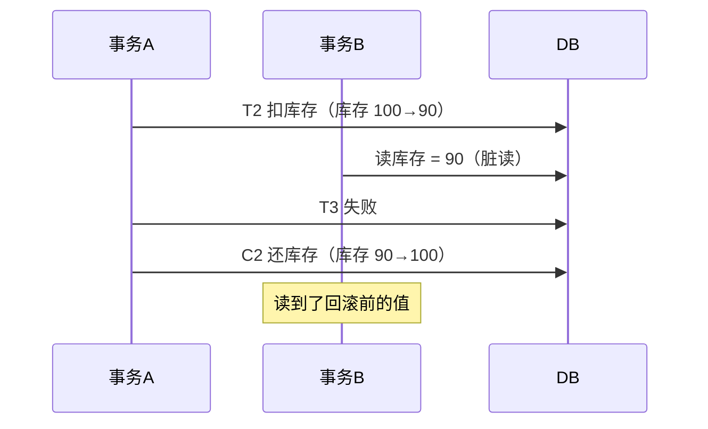
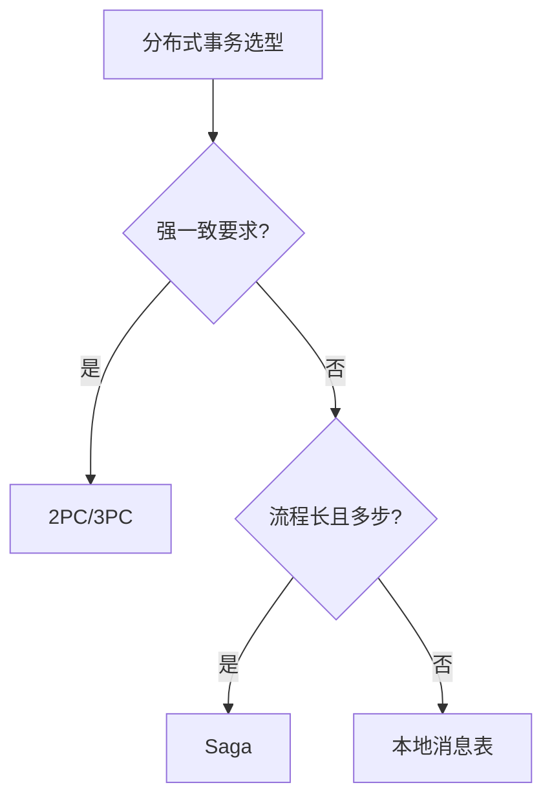

# Saga 分布式事务

> Saga 是处理长事务的分布式事务模式，通过将大事务拆分为一系列本地事务，配合补偿操作实现最终一致性。适合业务流程长、参与方多的场景。

## 目录

- [一、问题背景](#一问题背景)
- [二、Saga 核心思想](#二saga-核心思想)
- [三、协调方式](#三协调方式)
- [四、异常处理](#四异常处理)
- [五、与 2PC 对比](#五与-2pc-对比)
- [六、工程实现](#六工程实现)
- [七、相关资料](#七相关资料)

## 一、问题背景

### 1.1 长事务难题

电商下单流程涉及多个服务：



**问题**：
- 跨服务无法用本地事务
- 2PC 锁资源时间长，性能差
- 任意一步失败需要回滚前面所有操作

### 1.2 Saga 的解决思路

将长事务拆分为 N 个本地事务 T1, T2, ..., Tn，每个 Ti 有对应的补偿操作 Ci。任一 Ti 失败时，执行 Ci-1, Ci-2, ..., C1 回滚。

## 二、Saga 核心思想

### 2.1 正向流程



### 2.2 补偿流程

若 T4 失败：



### 2.3 补偿操作设计原则

| 原则 | 说明 |
|------|------|
| **业务可逆** | 补偿操作能撤销正向操作的影响 |
| **幂等性** | 补偿操作可能被重试，必须幂等 |
| **不破坏数据** | 不能直接删除，要标记为"已撤销" |

```python
# 正向操作：扣减库存
def deduct_stock(item_id, quantity):
    stock = db.query("SELECT stock FROM item WHERE id = ?", item_id)
    if stock < quantity:
        raise InsufficientStockError()
    db.execute("UPDATE item SET stock = stock - ? WHERE id = ?", quantity, item_id)
    db.execute("INSERT INTO stock_log(item_id, delta) VALUES(?, ?)", item_id, -quantity)
    return log_id

# 补偿操作：归还库存（幂等）
def compensate_stock(log_id):
    # 检查是否已补偿
    if db.query("SELECT compensated FROM stock_log WHERE id = ?", log_id):
        return  # 已补偿，幂等返回
    log = db.query("SELECT * FROM stock_log WHERE id = ?", log_id)
    db.execute("UPDATE item SET stock = stock + ? WHERE id = ?", -log.delta, log.item_id)
    db.execute("UPDATE stock_log SET compensated = 1 WHERE id = ?", log_id)
```

## 三、协调方式

### 3.1 编排式（Choreography）

无中心协调者，各服务通过事件触发：



**优点**：
- 无单点故障
- 服务松耦合
- 适合简单流程

**缺点**：
- 流程难以追踪
- 循环依赖风险
- 调试困难

### 3.2 协调式（Orchestration）

中心化协调器管理流程：



**优点**：
- 流程清晰可控
- 易于监控和调试
- 支持复杂分支逻辑

**缺点**：
- 协调器是单点
- 集中化耦合

### 3.3 对比

| 维度 | 编排式 | 协调式 |
|------|--------|--------|
| 耦合度 | 低 | 中 |
| 可观测性 | 差 | 好 |
| 复杂流程 | 不适合 | 适合 |
| 单点风险 | 无 | 有 |
| 实现难度 | 简单 | 中等 |

## 四、异常处理

### 4.1 三种异常场景

| 场景 | 描述 | 处理 |
|------|------|------|
| **Ti 失败** | 正向操作失败 | 执行 Ci-1, Ci-2, ..., C1 |
| **Ci 失败** | 补偿操作失败 | 重试，仍失败则告警人工 |
| **协调器宕机** | 协调式下协调器挂 | 持久化状态，重启后恢复 |

### 4.2 隔离性问题（脏读）

Saga 不隔离事务，中间状态对外可见：



**解决方案**：
- 业务层面加锁（如订单状态机）
- 使用语义锁（Sector Lock）
- 重新设计为可重入操作

### 4.3 补偿失败的兜底

```python
def execute_with_compensation(steps):
    completed = []
    try:
        for step in steps:
            step.execute()
            completed.append(step)
    except Exception as e:
        # 反向补偿
        for step in reversed(completed):
            try:
                step.compensate()
            except Exception as ce:
                # 补偿失败：记录日志，人工介入
                alert_human_intervention(step, ce)
                raise
        raise
```

## 五、与 2PC 对比

| 维度 | 2PC | Saga |
|------|-----|------|
| 一致性 | 强一致 | 最终一致 |
| 锁持有 | 长（整个事务期间） | 短（仅本地事务） |
| 性能 | 低 | 高 |
| 可用性 | 低（协调器故障则阻塞） | 高 |
| 回滚 | 自动回滚 | 业务补偿 |
| 适用场景 | 短事务、强一致 | 长事务、最终一致 |



## 六、工程实现

### 6.1 Seata Saga 模式

阿里开源的分布式事务框架，支持 Saga 模式：

```java
// 定义 Saga 流程
@SagaOrchestrator
public class OrderSaga {
    
    @SagaStep(compensateMethod = "cancelOrder")
    public boolean createOrder(Order order) {
        return orderService.create(order);
    }
    
    public boolean cancelOrder(Order order) {
        return orderService.cancel(order.getId());
    }
    
    @SagaStep(compensateMethod = "restoreStock")
    public boolean deductStock(String itemId, int qty) {
        return inventoryService.deduct(itemId, qty);
    }
    
    public boolean restoreStock(String itemId, int qty) {
        return inventoryService.restore(itemId, qty);
    }
}
```

### 6.2 状态机引擎

复杂 Saga 流程用状态机定义：

```json
{
  "Name": "orderSaga",
  "States": [
    {
      "Name": "CreateOrder",
      "Type": "ServiceTask",
      "ServiceName": "orderService",
      "ServiceMethod": "create",
      "CompensateState": "CancelOrder"
    },
    {
      "Name": "DeductStock",
      "Type": "ServiceTask",
      "ServiceName": "inventoryService",
      "ServiceMethod": "deduct",
      "CompensateState": "RestoreStock"
    },
    {
      "Name": "DeductBalance",
      "Type": "ServiceTask",
      "ServiceName": "accountService",
      "ServiceMethod": "deduct",
      "CompensateState": "RefundBalance"
    }
  ]
}
```

### 6.3 持久化事务日志

```sql
CREATE TABLE saga_log (
    id BIGINT PRIMARY KEY,
    saga_id VARCHAR(64),
    step_name VARCHAR(64),
    step_status VARCHAR(20),  -- RUNNING/SUCCESS/FAIL/COMPENSATED
    request_data TEXT,
    response_data TEXT,
    created_at TIMESTAMP,
    updated_at TIMESTAMP
);
```

## 七、相关资料

- [Saga 原论文 - Hector Garcia-Molina](https://www.cs.cornell.edu/andru/cs711/2002fa/reading/sagas.pdf)
- [Seata 官方文档](https://seata.io/zh-cn/docs/user/saga.html)
- [微服务模式 - Saga](https://microservices.io/patterns/data/saga.html)
- 《微服务架构设计模式》Chris Richardson
