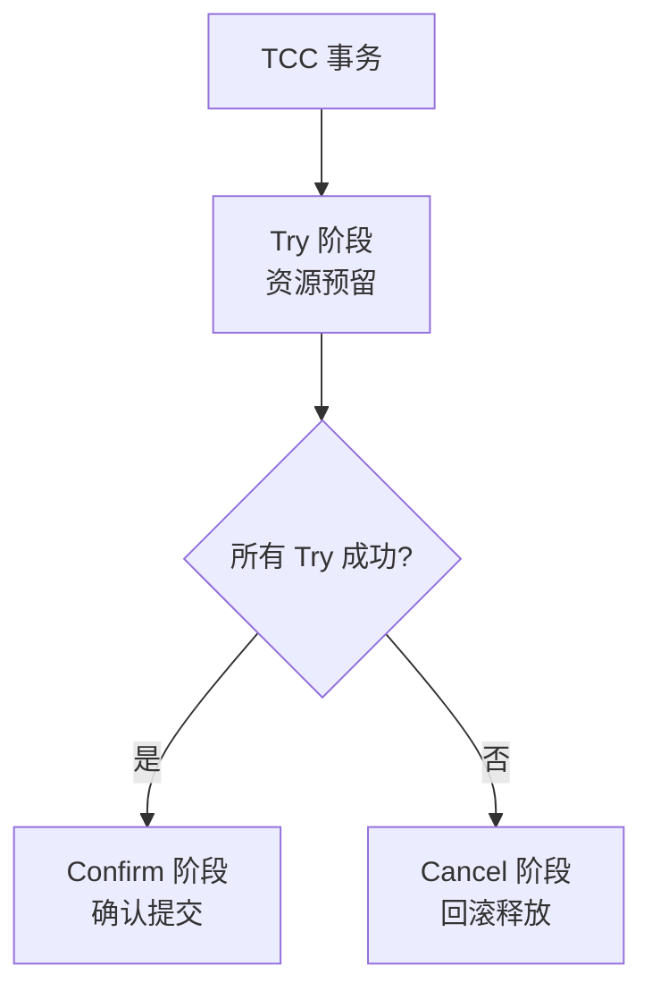
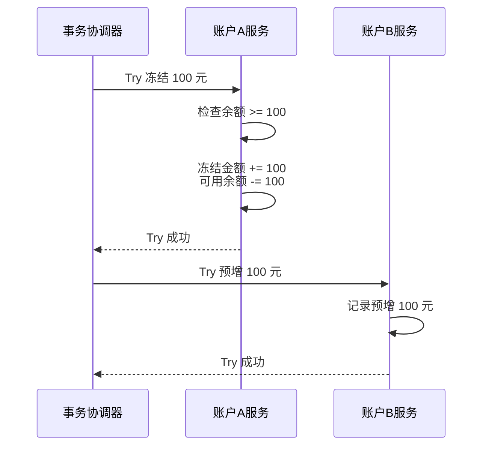
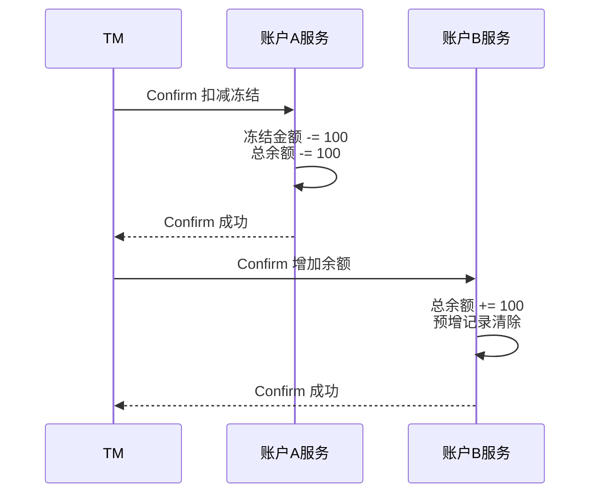
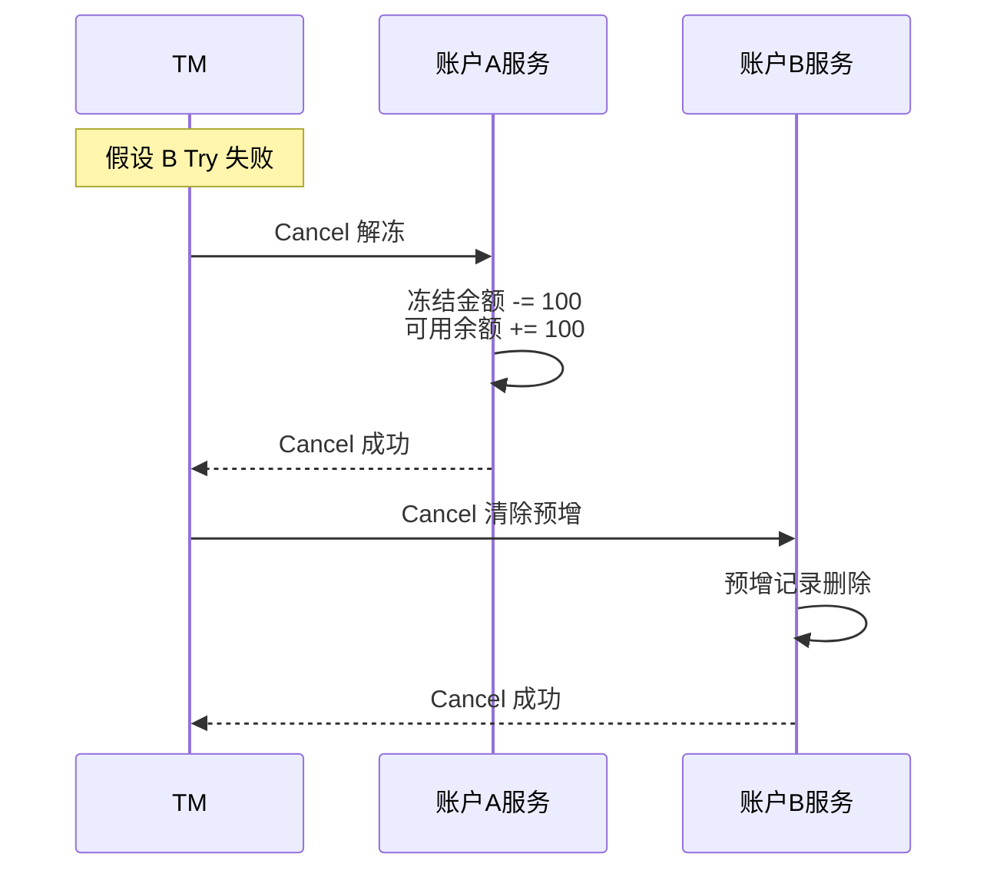
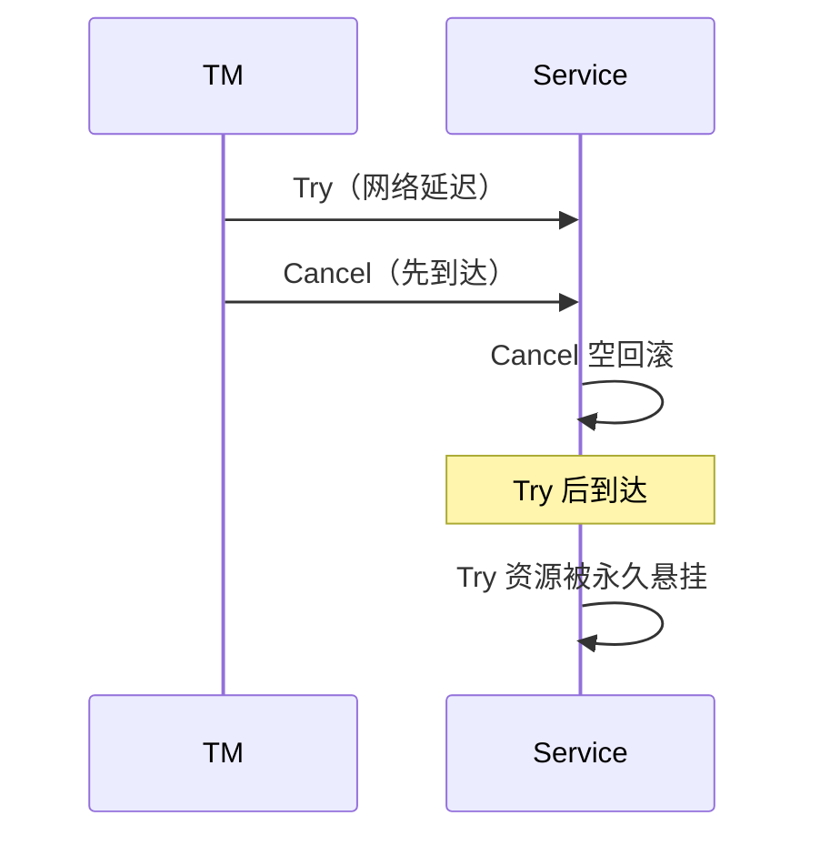
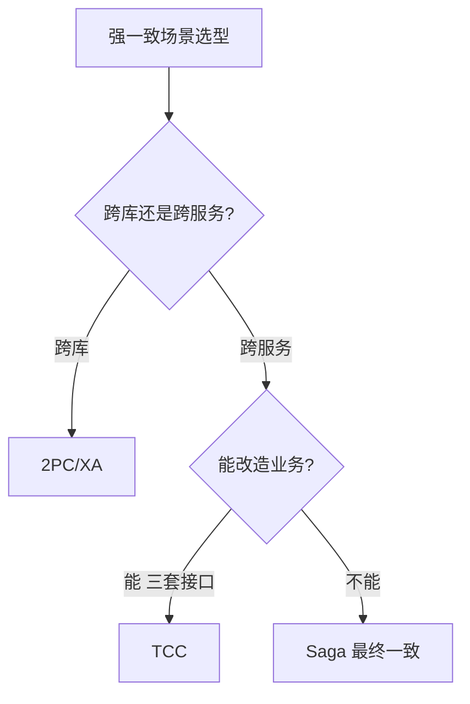

# TCC 分布式事务

> TCC（Try-Confirm-Cancel）是应用层层面的两阶段提交，通过业务补偿实现强一致性，适合金融、库存等对一致性要求高的场景。

## 目录

- [一、TCC 核心思想](#一tcc-核心思想)
- [二、三阶段详解](#二三阶段详解)
- [三、关键问题](#三关键问题)
- [四、与 2PC 对比](#四与-2pc-对比)
- [五、工程实践](#五工程实践)
- [六、相关资料](#六相关资料)

## 一、TCC 核心思想

TCC 是 Try、Confirm、Cancel 的缩写，将每个业务操作分为三个阶段：



| 阶段 | 作用 | 示例（转账） |
|------|------|-------------|
| **Try** | 检查 + 资源预留 | 冻结转出账户 100 元 |
| **Confirm** | 确认执行业务 | 扣减冻结金额，增加到转入账户 |
| **Cancel** | 取消，释放预留 | 解冻 100 元 |

## 二、三阶段详解

### 2.1 Try 阶段



**Try 要点**：
- 检查业务前置条件（余额是否充足）
- 预留资源（冻结金额、预占库存）
- 不执行真正的业务

### 2.2 Confirm 阶段



**Confirm 要点**：
- 不做业务检查（Try 已做）
- 使用 Try 阶段预留的资源
- 操作必须幂等（可能被重试）

### 2.3 Cancel 阶段



**Cancel 要点**：
- 释放 Try 阶段预留的资源
- 操作必须幂等
- 即使 Try 部分成功也要 Cancel

### 2.4 数据模型

```sql
-- 账户表
CREATE TABLE account (
    id BIGINT PRIMARY KEY,
    total_balance DECIMAL(18,2),   -- 总余额
    frozen_balance DECIMAL(18,2)   -- 冻结金额
);
-- 可用余额 = total_balance - frozen_balance

-- 事务日志表（保证幂等）
CREATE TABLE tcc_log (
    tx_id VARCHAR(64) PRIMARY KEY,    -- 全局事务ID
    branch_id VARCHAR(64),            -- 分支事务ID
    status VARCHAR(20),               -- TRY/CONFIRM/CANCEL
    business_data TEXT,
    created_at TIMESTAMP
);
```

## 三、关键问题

### 3.1 幂等性

Confirm 和 Cancel 可能因网络问题被重试，必须幂等：

```python
def confirm(tx_id, branch_id):
    # 检查是否已执行
    if tcc_log.query(status='CONFIRM', tx_id=tx_id, branch_id=branch_id):
        return  # 已执行，幂等返回
    # 执行确认
    db.execute("UPDATE account SET frozen = frozen - 100, total = total - 100 WHERE id = ?", account_id)
    tcc_log.insert(tx_id, branch_id, 'CONFIRM')
```

### 3.2 空回滚

Try 未执行但 Cancel 被调用（如 Try 超时后协调器发 Cancel）：

```python
def cancel(tx_id, branch_id):
    # 检查 Try 是否执行
    if not tcc_log.query(status='TRY', tx_id=tx_id, branch_id=branch_id):
        # Try 未执行，记录空回滚
        tcc_log.insert(tx_id, branch_id, 'CANCEL_EMPTY')
        return  # 不执行实际 Cancel
    # 正常 Cancel
    ...
```

### 3.3 悬挂

Cancel 先于 Try 执行（网络延迟）：



**解决**：Cancel 时插入"已 Cancel"标记，Try 检查到则拒绝：

```python
def try_action(tx_id, branch_id):
    if tcc_log.query(status='CANCEL', tx_id=tx_id, branch_id=branch_id):
        return  # 已被 Cancel，拒绝 Try
    # 正常 Try
    ...
```

### 3.4 隔离性

TCC 在 Try 阶段预留资源，天然隔离：

```python
# Try 时扣减可用余额
db.execute("UPDATE account SET frozen = frozen + 100 WHERE id = ? AND total - frozen >= 100", account_id)
# 其他事务看到可用余额减少，无法使用
```

## 四、与 2PC 对比

| 维度 | 2PC | TCC |
|------|-----|-----|
| 层面 | 数据库层 | 应用层 |
| 锁 | 数据库锁 | 业务资源冻结 |
| 隔离性 | 数据库保证 | Try 阶段预留保证 |
| 性能 | 低（锁资源长） | 高（锁资源短） |
| 一致性 | 强一致 | 强一致 |
| 业务侵入 | 无 | 高（需写三套代码） |
| 适用场景 | 跨库强一致 | 业务流程强一致 |



## 五、工程实践

### 5.1 Seata TCC 模式

```java
// 定义 TCC 接口
@LocalTCC
public interface AccountTCCService {

    @TwoPhaseBusinessAction(name = "deduct", commitMethod = "confirm", rollbackMethod = "cancel")
    boolean tryDeduct(BusinessActionContext ctx,
                      @BusinessActionContextParameter(paramName = "accountId") Long accountId,
                      @BusinessActionContextParameter(paramName = "amount") BigDecimal amount);

    boolean confirm(BusinessActionContext ctx);
    boolean cancel(BusinessActionContext ctx);
}

// 实现
@Service
public class AccountTCCServiceImpl implements AccountTCCService {

    @Override
    public boolean tryDeduct(BusinessActionContext ctx, Long accountId, BigDecimal amount) {
        // 检查余额 + 冻结
        return accountMapper.freeze(accountId, amount) > 0;
    }

    @Override
    public boolean confirm(BusinessActionContext ctx) {
        Long accountId = ctx.getActionContext("accountId");
        BigDecimal amount = ctx.getActionContext("amount");
        // 扣减冻结金额
        return accountMapper.deductFrozen(accountId, amount) > 0;
    }

    @Override
    public boolean cancel(BusinessActionContext ctx) {
        Long accountId = ctx.getActionContext("accountId");
        BigDecimal amount = ctx.getActionContext("amount");
        // 解冻
        return accountMapper.unfreeze(accountId, amount) > 0;
    }
}
```

### 5.2 适用场景

| 场景 | 是否适合 TCC | 理由 |
|------|------------|------|
| 转账 | ✓ | 资金强一致 |
| 库存扣减 | ✓ | 预占库存 |
| 订单创建 | △ | 可用 Saga 替代 |
| 积分发放 | ✗ | 最终一致即可 |
| 优惠券核销 | ✓ | 防止超发 |

## 六、相关资料

- [TCC 原始概念 - Atomikos](https://www.atomikos.com/Publications/TransactionManagementForRestfulArchitecture)
- [Seata TCC 模式](https://seata.io/zh-cn/docs/user/tcc.html)
- 《微服务架构设计模式》Chris Richardson
- [TCC 事务详解](https://www.infoq.cn/articles/tcc-transaction-principle)
