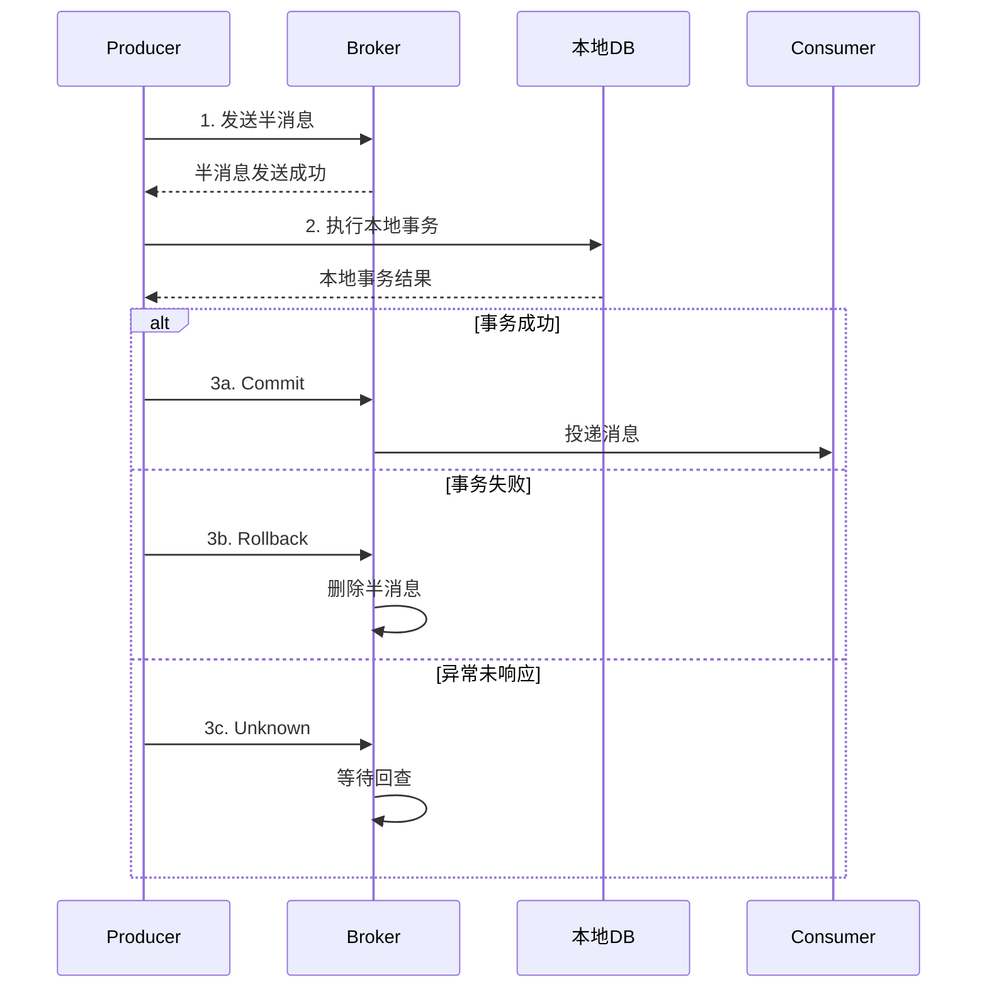
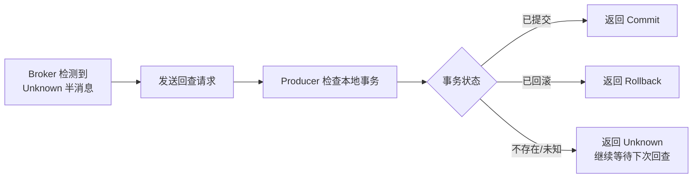

# 可靠消息最终一致性

> RocketMQ 事务消息是分布式事务的优雅方案，通过半消息 + 本地事务 + 回查机制，实现业务与消息发送的最终一致性，无需本地消息表辅助。

## 目录

- [一、方案背景](#一方案背景)
- [二、RocketMQ 事务消息原理](#二rocketmq-事务消息原理)
- [三、核心流程](#三核心流程)
- [四、回查机制](#四回查机制)
- [五、与本地消息表对比](#五与本地消息表对比)
- [六、工程实现](#六工程实现)
- [七、相关资料](#七相关资料)

## 一、方案背景

### 1.1 本地消息表的局限

| 问题 | 说明 |
|------|------|
| 业务侵入 | 需要额外维护消息表 |
| 性能开销 | 业务表与消息表同事务 |
| 多实例复杂 | 需分布式锁避免重复扫描 |

### 1.2 事务消息优势

- 无需业务库维护消息表
- 业务与消息发送原子性由 MQ 保证
- 支持事务回查，无需定时扫描

## 二、RocketMQ 事务消息原理

### 2.1 半消息（Half Message）

```mermaid
flowchart LR
    A[Producer] -->|1.发送半消息| B[Broker]
    B --> C[半消息主题<br/>RMQ_SYS_TRANS_HALF_TOPIC]
    C --> D[消费者不可见]
    Note over D: 半消息对消费者不可见
```

半消息特点：
- 发送到 Broker 但消费者不可见
- 存储在特殊主题 `RMQ_SYS_TRANS_HALF_TOPIC`
- 等待 Producer 执行本地事务后决定提交或回滚

### 2.2 三种状态

| 状态 | 含义 |
|------|------|
| `CommitMessage` | 提交，消息对消费者可见 |
| `RollbackMessage` | 回滚，删除消息 |
| `Unknown` | 未知，等待回查 |

## 三、核心流程



### 3.1 详细步骤

1. **发送半消息**：Producer 发送半消息到 Broker
2. **半消息发送成功**：Broker 返回成功，本地事务开始执行
3. **执行本地事务**：Producer 执行本地数据库事务
4. **提交事务状态**：
   - 成功 → 发送 Commit
   - 失败 → 发送 Rollback
   - 异常 → 不响应（Unknown）
5. **回查**（如 Unknown）：Broker 定期回查 Producer 本地事务状态
6. **消息投递**：Commit 后消息进入真实主题，消费者可见

## 四、回查机制

### 4.1 回查触发

Broker 在以下情况触发回查：
- Producer 未返回 Commit/Rollback
- Producer 网络异常
- Producer 宕机



### 4.2 回查次数限制

- 默认回查 15 次
- 每次间隔递增（1 分钟、2 分钟...）
- 超过限制后默认 Rollback

### 4.3 本地事务状态检查

Producer 需要实现回查接口，根据本地数据库状态返回：

```python
def check_local_transaction(message_id):
    # 查询本地业务表，确认事务是否成功
    order = db.query("SELECT * FROM orders WHERE message_id = ?", message_id)
    if order and order.status == 'PAID':
        return 'COMMIT'
    elif order and order.status == 'CANCELLED':
        return 'ROLLBACK'
    else:
        return 'UNKNOWN'  # 继续等待
```

## 五、与本地消息表对比

| 维度 | 本地消息表 | 事务消息 |
|------|----------|---------|
| 业务侵入 | 中（需消息表） | 低（接口实现） |
| 性能 | 业务表+消息表同事务 | 半消息+本地事务 |
| 可靠性 | 定时扫描重发 | Broker 主动回查 |
| MQ 依赖 | 任意 MQ | RocketMQ |
| 实现难度 | 简单 | 中等 |
| 一致性 | 最终 | 最终 |

## 六、工程实现

### 6.1 Java 实现

```java
// 事务消息生产者
@Component
public class OrderTransactionProducer {

    @Autowired
    private TransactionMQProducer producer;

    public void sendOrderMessage(Order order) {
        Message msg = new Message(
            "OrderTopic",
            "create",
            JSON.toJSONString(order).getBytes()
        );
        producer.sendMessageInTransaction(msg, order);
    }
}

// 本地事务执行器
@Component
public class OrderTransactionListener implements TransactionListener {

    @Autowired
    private OrderService orderService;

    // 执行本地事务
    @Override
    public LocalTransactionState executeLocalTransaction(Message msg, Object arg) {
        Order order = (Order) arg;
        try {
            orderService.createOrder(order);
            return LocalTransactionState.COMMIT_MESSAGE;
        } catch (Exception e) {
            return LocalTransactionState.ROLLBACK_MESSAGE;
        }
    }

    // 事务回查
    @Override
    public LocalTransactionState checkLocalTransaction(MessageExt msg) {
        String orderId = msg.getKeys();
        Order order = orderService.getById(orderId);
        if (order == null) {
            return LocalTransactionState.UNKNOW;  // 继续等待
        }
        return order.getStatus() == OrderStatus.PAID
            ? LocalTransactionState.COMMIT_MESSAGE
            : LocalTransactionState.ROLLBACK_MESSAGE;
    }
}
```

### 6.2 业务表设计

```sql
CREATE TABLE orders (
    id BIGINT PRIMARY KEY,
    order_no VARCHAR(64) UNIQUE,
    user_id BIGINT,
    amount DECIMAL(18,2),
    status VARCHAR(20),  -- PENDING / PAID / CANCELLED
    message_id VARCHAR(64),  -- 关联消息ID，用于回查
    created_at TIMESTAMP,
    INDEX idx_message_id(message_id)
);
```

### 6.3 注意事项

1. **本地事务必须幂等**：消息可能重复投递
2. **回查接口必须快速**：避免阻塞 Broker
3. **业务表与消息ID关联**：用于回查判断
4. **半消息期间业务可见性**：半消息期间业务已写库但下游未感知

## 七、相关资料

- [RocketMQ 事务消息官方文档](https://rocketmq.apache.org/docs/transaction-example/)
- [RocketMQ 事务消息原理](https://github.com/apache/rocketmq/blob/master/docs/cn/features.md)
- 《RocketMQ 技术内幕》丁威
