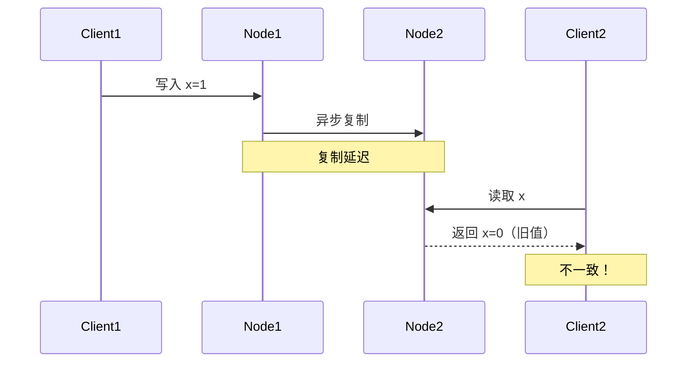
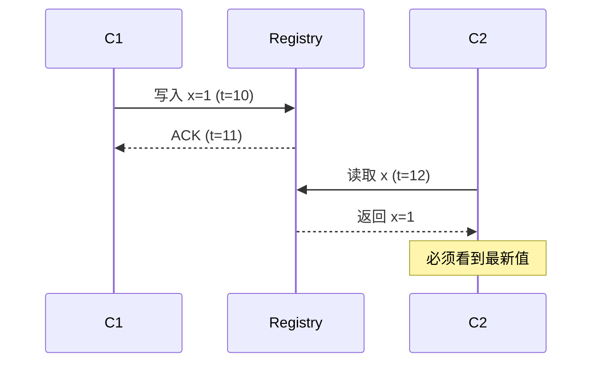
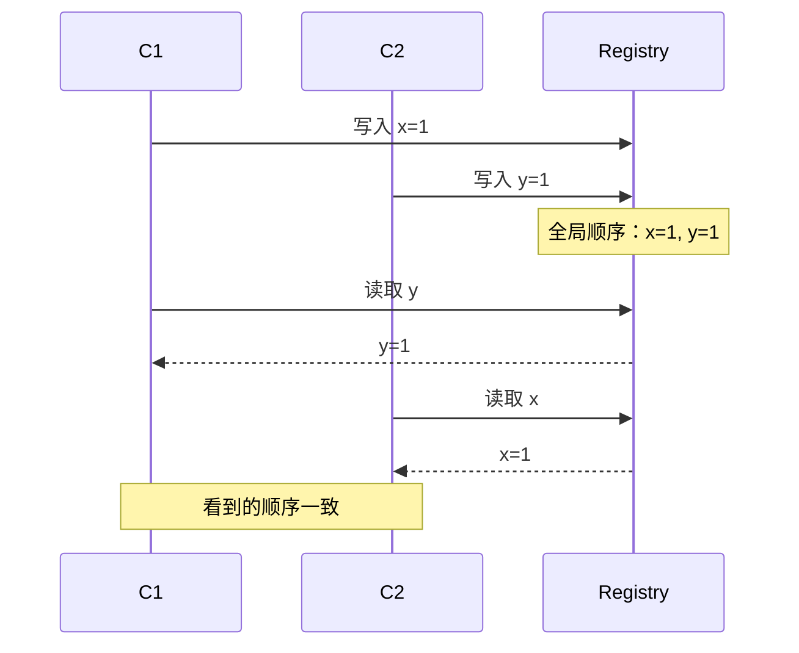
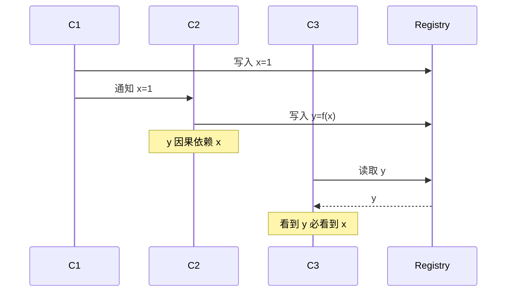
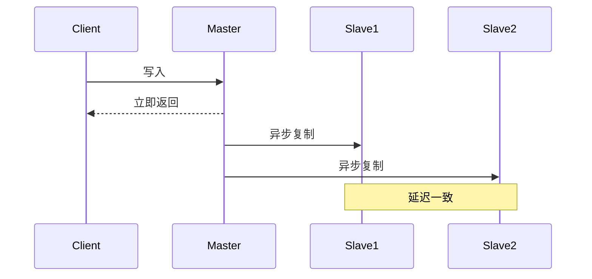
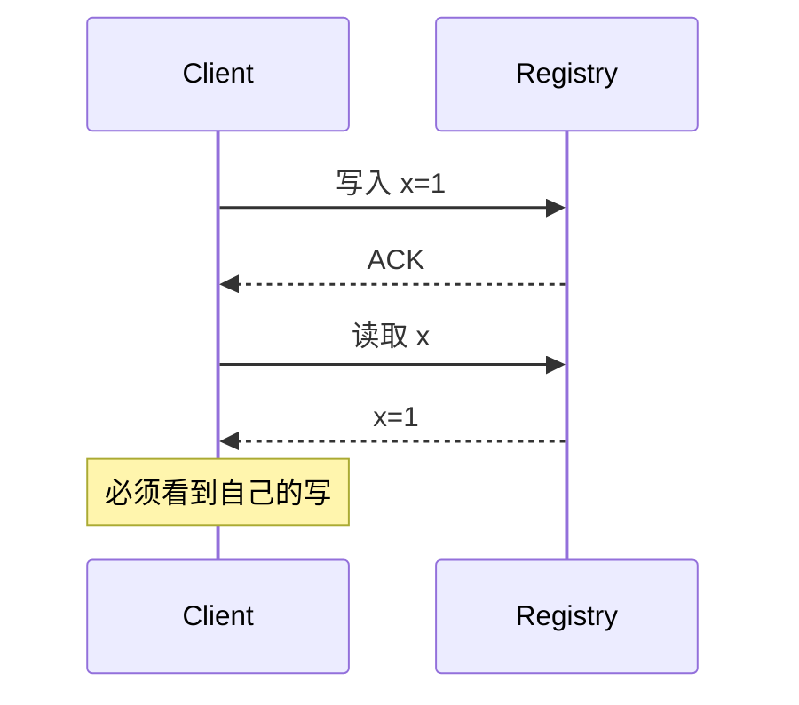
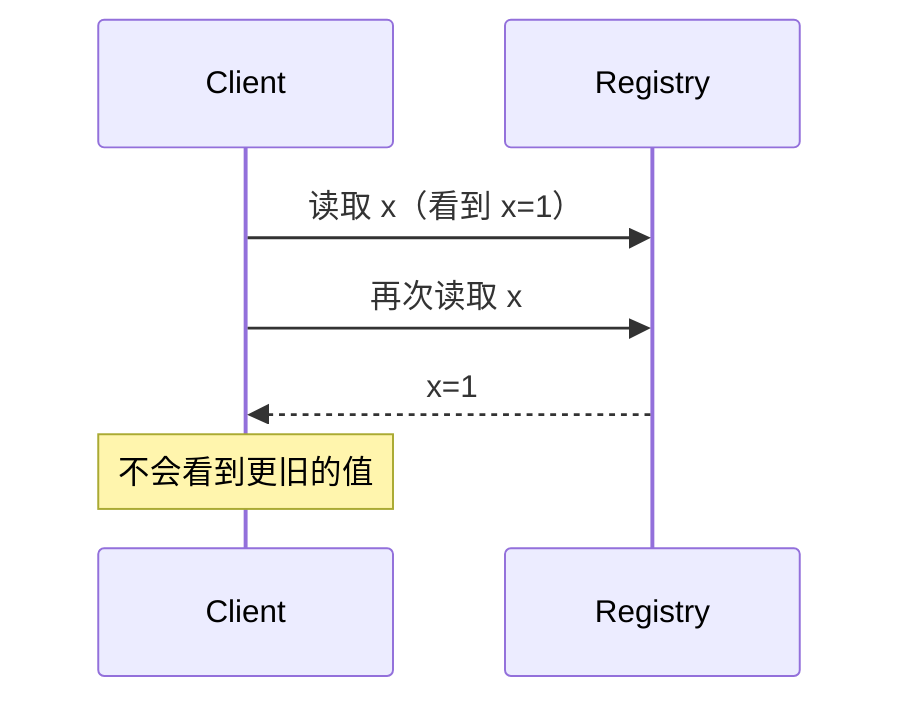
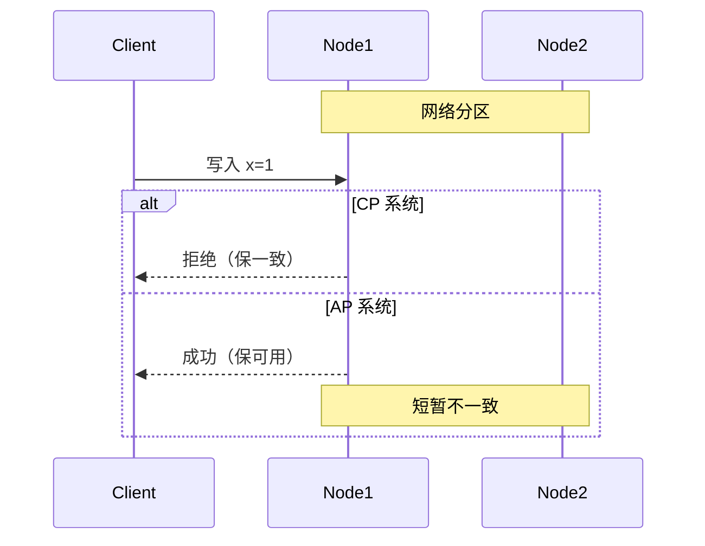
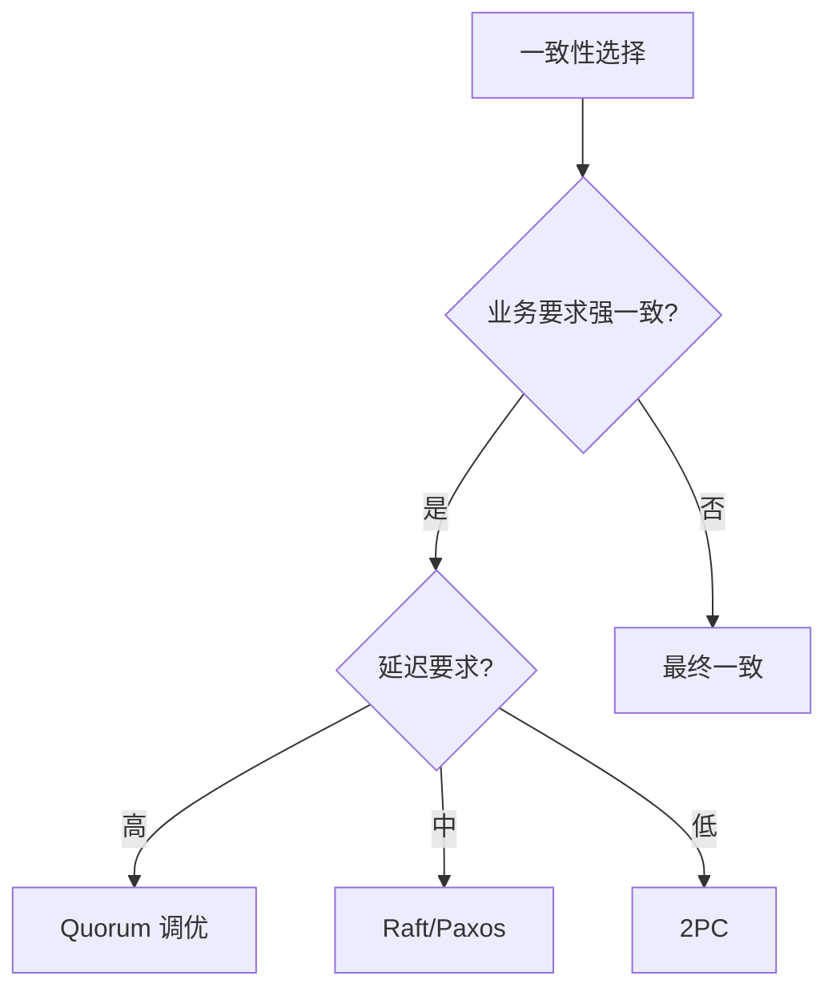

# 数据一致性模型

> 一致性模型是分布式系统的核心概念，定义了并发读写时数据的可见性规则。本文梳理主流一致性模型及其应用。

## 目录

- [一、一致性模型概览](#一一致性模型概览)
- [二、强一致性](#二强一致性)
- [三、弱一致性](#三弱一致性)
- [四、最终一致性](#四最终一致性)
- [五、因果一致性](#五因果一致性)
- [六、客户端一致性](#六客户端一致性)
- [七、选型建议](#七选型建议)
- [八、相关资料](#八相关资料)

## 一、一致性模型概览

### 1.1 为什么需要一致性模型



分布式系统数据多副本，需定义一致性规则。

### 1.2 一致性谱系

```mermaid
flowchart LR
    A[强一致<br/>Linearizable] --> B[顺序一致<br/>Sequential]
    B --> C[因果一致<br/>Causal]
    C --> D[最终一致<br/>Eventual]
    D --> E[弱一致<br/>Weak]
    Note over A,E: 一致性由强到弱
```

### 1.3 一致性 vs 性能

```mermaid
flowchart TD
    A[一致性] -->|越强| B[性能越低]
    A -->|越弱| C[性能越高]
    Note over B,C: 需权衡
```

## 二、强一致性

### 2.1 线性一致性（Linearizability）

最严格的一致性模型：



特点：
- 所有操作有全局顺序
- 写入完成立即可见
- 看起来像单机系统

### 2.2 实现方式

#### Quorum 机制

```
N = 3 副本
W = 2 写入确认数
R = 2 读取确认数

W + R > N → 强一致
```

```python
def write(key, value):
    """同步写入多数派"""
    success = 0
    for node in nodes:
        if node.write(key, value):
            success += 1
    if success >= W:
        return Success
    return Failed

def read(key):
    """读多数派取最新"""
    responses = []
    for node in nodes:
        responses.append(node.read(key))
    # 取版本最新的
    return max(responses, key=lambda x: x.version)
```

#### Paxos/Raft

详见 [Paxos算法.md](./Paxos算法.md)

### 2.3 典型系统

| 系统 | 实现方式 |
|------|---------|
| ZooKeeper | ZAB 协议 |
| etcd | Raft |
| Spanner | TrueTime + Paxos |
| HBase | 强一致 Region |

### 2.4 适用场景

- 银行账户
- 库存扣减
- 配置中心
- 选主

## 三、弱一致性

### 3.1 顺序一致性（Sequential Consistency）



特点：
- 所有节点看到相同操作顺序
- 不要求实时

### 3.2 因果一致性（Causal Consistency）

有因果关系的操作保序：



特点：
- 因果相关操作保序
- 无因果关系可乱序

## 四、最终一致性

### 4.1 定义

```mermaid
flowchart LR
    A[写入] --> B[短暂不一致]
    B --> C[复制传播]
    C --> D[最终一致]
    Note over A,D: 不保证何时一致
```

### 4.2 实现方式

#### 异步复制



#### 读修复

```python
def read(key):
    """读多个节点，发现不一致则修复"""
    responses = []
    for node in nodes:
        responses.append(node.read(key))

    # 取最新值
    latest = max(responses, key=lambda x: x.version)

    # 修复旧节点
    for node, resp in zip(nodes, responses):
        if resp.version < latest.version:
            node.write(key, latest.value)

    return latest.value
```

#### 反熵协议

节点间定期同步：
- Push：将自己的数据推给其他节点
- Pull：从其他节点拉取最新数据
- Push-Pull：双向同步

### 4.3 典型系统

| 系统 | 一致性 |
|------|--------|
| Cassandra | 可调（默认最终一致） |
| DynamoDB | 最终一致（强一致可选） |
| Eureka | AP 最终一致 |
| DNS | 最终一致 |

## 五、客户端一致性

### 5.1 读自己写（Read Your Writes）



实现：
- 会话粘性
- 读写都走主节点
- 客户端缓存版本号

### 5.2 单调读（Monotonic Reads）



实现：记录已读最大版本，只读更新版本。

### 5.3 单调写（Monotonic Writes）

同一客户端的写入按顺序生效。

### 5.4 读写一致性（Read-After-Write）

写完立即读，能看到自己的写入。

## 六、CAP 与一致性

### 6.1 CAP 中的 C 是线性一致

```mermaid
flowchart TD
    A[CAP] --> B[C 强一致<br/>线性一致]
    A --> C[A 可用]
    A --> D[P 分区容忍]
    Note over A: 三选二
```

### 6.2 网络分区时



## 七、一致性 vs 隔离级别

| 概念 | 范畴 |
|------|------|
| 一致性模型 | 分布式多副本 |
| 隔离级别 | 数据库并发事务 |

详见 [ACID与隔离级别.md](./ACID与隔离级别.md)

## 八、选型建议

### 8.1 决策框架



### 8.2 场景推荐

| 场景 | 一致性 | 典型系统 |
|------|--------|---------|
| 银行账户 | 强一致 | Spanner/TiDB |
| 库存扣减 | 强一致 | Redis/MySQL |
| 配置中心 | 强一致 | etcd/ZK |
| 用户信息 | 最终一致 | Cassandra |
| 商品详情 | 最终一致 | 任意 |
| 社交动态 | 最终一致 | 任意 |

### 8.3 一致性 vs 可用性 vs 性能

```mermaid
flowchart TD
    A[权衡] --> B[强一致<br/>低可用 低性能]
    A --> C[最终一致<br/>高可用 高性能]
    A --> D[可调一致<br/>折中]
    Note over D: Cassandra 可调
```

## 九、可调一致性（Cassandra）

Cassandra 允许每次操作指定一致性级别：

```python
# 写入
INSERT INTO users (id, name) VALUES (1, 'Alice')
USING CONSISTENCY QUORUM;

# 读取
SELECT * FROM users WHERE id = 1
USING CONSISTENCY QUORUM;
```

一致性级别：
- ONE：一个副本确认
- QUORUM：多数派确认
- ALL：所有副本确认
- LOCAL_QUORUM：本地数据中心多数派

## 十、相关资料

- 《数据密集型应用系统设计》Martin Kleppmann
- [Consistency Model](https://jepsen.io/consistency)
- [CAP FAQ](https://www.github.com/eugenp/tutorials/wiki/CAP-Theorem)
- [Linearizability](https://cs.brown.edu/~mph/HerlihyW90/p463-herlihy.pdf)
- [Cassandra 一致性](https://docs.datastax.com/en/cassandra-oss/3.0/cassandra/dml/dmlConfigConsistency.html)
