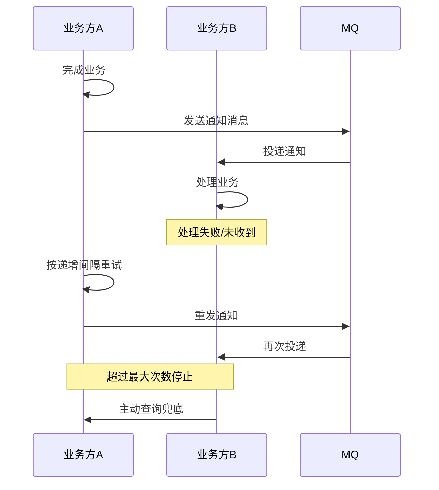
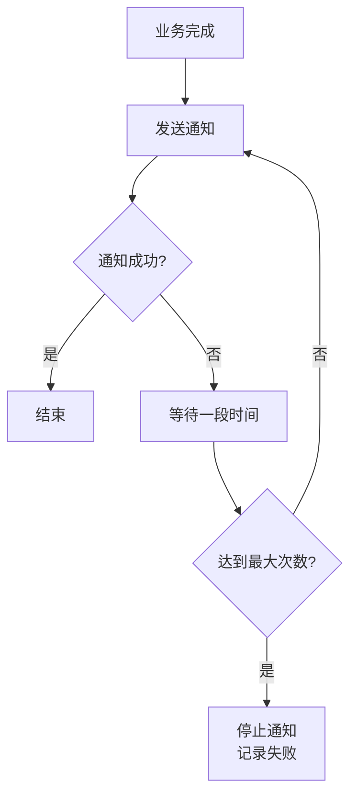
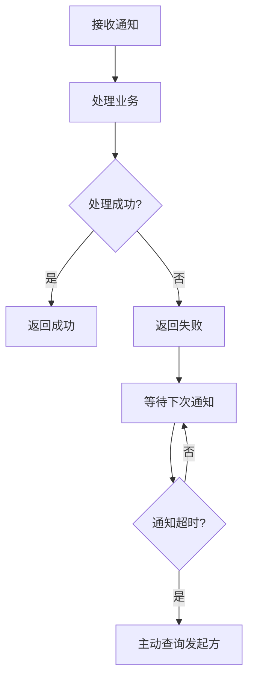
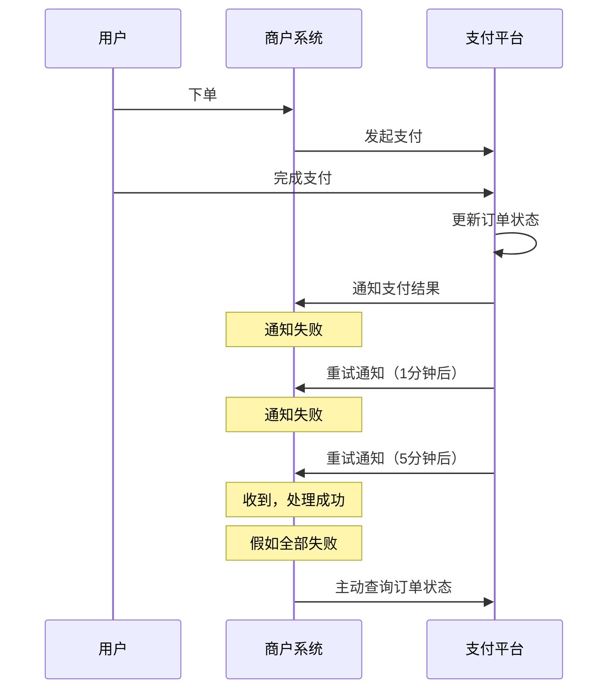

# 最大努力通知

> 最大努力通知是最弱的分布式事务方案，适用于跨企业的对外通知场景，如支付结果通知、对账通知等。发起方尽力通知，接收方需主动查询兜底。

## 目录

- [一、方案特点](#一方案特点)
- [二、核心流程](#二核心流程)
- [三、关键设计](#三关键设计)
- [四、与其他方案对比](#四与其他方案对比)
- [五、典型应用](#五典型应用)
- [六、相关资料](#六相关资料)

## 一、方案特点

### 1.1 定位

最大努力通知是分布式事务方案中**一致性最弱**的一种：

| 维度 | 说明 |
|------|------|
| 一致性 | 最终一致（尽力而为） |
| 业务侵入 | 低 |
| 适用场景 | 跨企业通知 |
| 失败处理 | 接收方主动查询 |

### 1.2 与可靠消息区别

| 维度 | 可靠消息 | 最大努力通知 |
|------|---------|------------|
| 主动方 | 消息发送方 | 业务发起方 |
| 可靠性 | MQ 保证送达 | 通知方尽力通知 |
| 失败处理 | 自动重试 | 接收方查询兜底 |
| 场景 | 内部业务 | 跨企业 |

## 二、核心流程

### 2.1 标准流程



### 2.2 通知发起方流程



### 2.3 通知接收方流程



## 三、关键设计

### 3.1 通知表设计

```sql
CREATE TABLE notify_record (
    id BIGINT PRIMARY KEY,
    notify_id VARCHAR(64) UNIQUE,    -- 通知唯一ID
    target_url VARCHAR(255),         -- 通知目标URL
    content TEXT,                    -- 通知内容
    status VARCHAR(20),              -- PENDING / SUCCESS / FAILED
    retry_count INT DEFAULT 0,
    max_retry INT DEFAULT 8,
    next_retry_time TIMESTAMP,
    created_at TIMESTAMP,
    INDEX idx_status_retry(status, next_retry_time)
);
```

### 3.2 递增重试策略

| 重试次数 | 间隔 | 说明 |
|---------|------|------|
| 1 | 1 分钟 | |
| 2 | 5 分钟 | |
| 3 | 10 分钟 | |
| 4 | 30 分钟 | |
| 5 | 1 小时 | |
| 6 | 2 小时 | |
| 7 | 6 小时 | |
| 8 | 15 小时 | 达到上限 |

### 3.3 通知发起方实现

```python
def send_notification(notify_id, target_url, content):
    # 记录到通知表
    db.insert("""
        INSERT INTO notify_record(notify_id, target_url, content, status, next_retry_time)
        VALUES(?, ?, ?, 'PENDING', NOW())
    """, notify_id, target_url, content)

def scan_and_notify():
    """定时扫描待发送通知"""
    records = db.query("""
        SELECT * FROM notify_record
        WHERE status = 'PENDING' AND next_retry_time <= NOW()
        LIMIT 100
    """)
    for record in records:
        try:
            response = http.post(record.target_url, {
                'notify_id': record.notify_id,
                'content': record.content
            })
            if response.success:
                db.execute("UPDATE notify_record SET status='SUCCESS' WHERE id=?", record.id)
            else:
                schedule_retry(record)
        except Exception as e:
            schedule_retry(record)

def schedule_retry(record):
    if record.retry_count + 1 >= record.max_retry:
        db.execute("UPDATE notify_record SET status='FAILED' WHERE id=?", record.id)
        alert(record)  # 告警人工
    else:
        interval = INTERVALS[record.retry_count + 1]
        db.execute("""
            UPDATE notify_record
            SET retry_count = retry_count + 1,
                next_retry_time = DATE_ADD(NOW(), INTERVAL ? MINUTE)
            WHERE id = ?
        """, interval, record.id)
```

### 3.4 接收方幂等与查询

```python
# 接收通知
@app.post('/notify')
def receive_notification(notify_id, content):
    # 幂等检查
    if db.query("SELECT 1 FROM processed WHERE notify_id = ?", notify_id):
        return {'code': 'SUCCESS'}  # 重复通知，幂等返回
    try:
        process_business(content)
        db.execute("INSERT INTO processed(notify_id) VALUES(?)", notify_id)
        return {'code': 'SUCCESS'}
    except:
        return {'code': 'FAIL'}

# 主动查询兜底
def query_status_fallback():
    """定时主动查询未确认的业务"""
    pending = db.query("SELECT * FROM business WHERE status = 'PENDING' AND created_at < NOW() - INTERVAL 5 MINUTE")
    for item in pending:
        result = http.get(f"{upstream_url}/query?business_id={item.id}")
        if result.status == 'SUCCESS':
            db.execute("UPDATE business SET status='SUCCESS' WHERE id=?", item.id)
```

## 四、与其他方案对比

| 维度 | 最大努力通知 | 可靠消息 | 本地消息表 | TCC |
|------|------------|---------|----------|-----|
| 一致性 | 弱最终 | 强最终 | 强最终 | 强 |
| 主动方 | 尽力通知 | 保证送达 | 保证送达 | 协调提交 |
| 失败处理 | 接收方查询 | 持续重试 | 持续重试 | 自动回滚 |
| 业务侵入 | 极低 | 低 | 中 | 高 |
| 场景 | 跨企业 | 内部 | 内部 | 资金 |

## 五、典型应用

### 5.1 支付结果通知



### 5.2 对账通知

银行与商户间的对账：

```python
# 银行每日发送对账文件通知
def send_reconciliation_notify(date):
    # 生成对账文件
    file_url = generate_reconciliation_file(date)
    # 通知商户
    notify_id = str(uuid.uuid4())
    send_notification(notify_id, merchant_callback_url, {
        'date': date,
        'file_url': file_url
    })

# 商户定时主动拉取对账文件（兜底）
def fetch_reconciliation():
    if not received_notify(today):
        # 未收到通知，主动拉取
        file_url = http.get(f"{bank_url}/reconciliation?date={today}")
        process(file_url)
```

### 5.3 物流状态变更

物流公司通知电商平台包裹状态变更，电商平台若未收到通知，可主动查询物流 API。

## 六、相关资料

- [分布式事务几种方案](https://www.infoq.cn/article/2018/08/distributed-transaction-four)
- 《微服务架构设计模式》Chris Richardson
- 支付宝/微信支付商户接入文档
