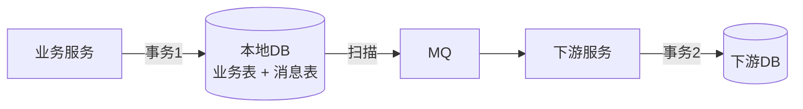
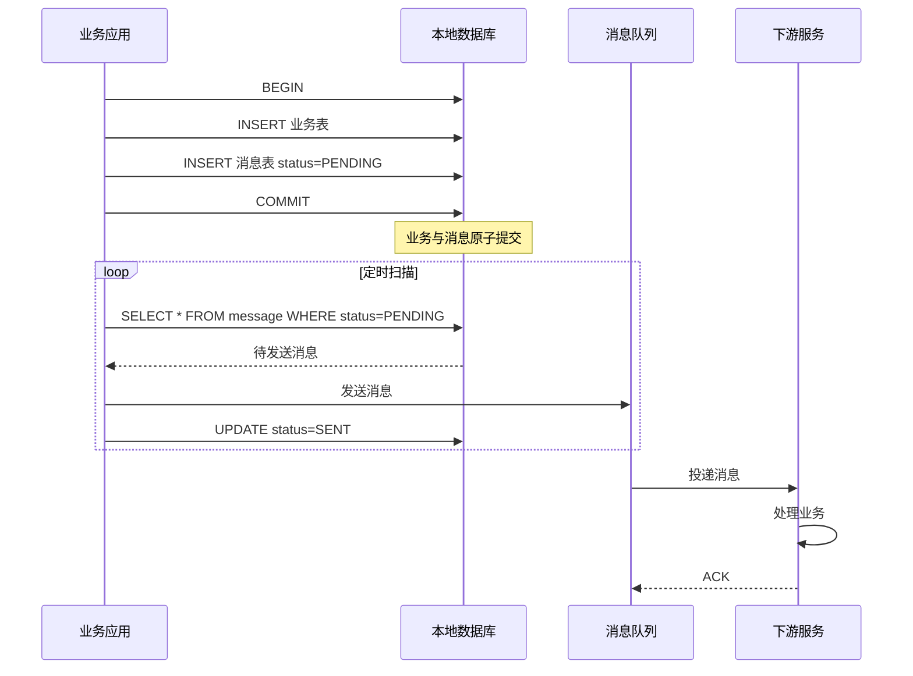
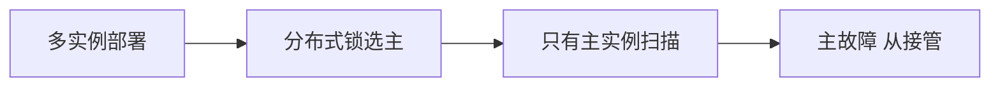

# 本地消息表方案

> 本地消息表是最简单实用的最终一致性方案，通过将消息持久化到本地数据库，与业务操作在同一事务中提交，保证业务与消息的原子性。

## 目录

- [一、方案原理](#一方案原理)
- [二、核心流程](#二核心流程)
- [三、关键设计](#三关键设计)
- [四、与其他方案对比](#四与其他方案对比)
- [五、工程实现](#五工程实现)
- [六、相关资料](#六相关资料)

## 一、方案原理

### 1.1 核心思想

将分布式事务拆为：
1. 本地业务 + 写消息表（同一本地事务）
2. 定时扫描消息表，发送到 MQ
3. 下游消费消息



### 1.2 解决的核心问题

**问题**：先更新 DB 还是先发 MQ？

| 方式 | 问题 |
|------|------|
| 先 DB 后 MQ | DB 成功 MQ 失败 → 业务不一致 |
| 先 MQ 后 DB | MQ 成功 DB 失败 → 下游处理了不存在的数据 |
| DB + MQ 同时 | 无法保证原子性 |

**本地消息表方案**：DB 业务表 + 消息表在同一事务，要么同时成功要么同时失败。

## 二、核心流程

### 2.1 完整流程



### 2.2 消息表设计

```sql
CREATE TABLE local_message (
    id BIGINT PRIMARY KEY AUTO_INCREMENT,
    message_id VARCHAR(64) UNIQUE,       -- 全局唯一消息ID
    topic VARCHAR(100),                  -- MQ主题
    tag VARCHAR(50),
    message_body TEXT,                   -- 消息内容
    status VARCHAR(20),                  -- PENDING / SENT / CONFIRMED
    retry_count INT DEFAULT 0,           -- 重试次数
    next_retry_time TIMESTAMP,           -- 下次重试时间
    created_at TIMESTAMP,
    updated_at TIMESTAMP,
    INDEX idx_status_next_retry(status, next_retry_time)
);
```

### 2.3 业务代码

```python
def create_order(order_data):
    db.begin()
    try:
        # 1. 业务操作
        order_id = db.insert("INSERT INTO orders(...) VALUES(...)", order_data)
        # 2. 写消息表
        db.insert("""
            INSERT INTO local_message(message_id, topic, message_body, status)
            VALUES(?, ?, ?, 'PENDING')
        """, str(uuid.uuid4()), 'order_created', json.dumps({'order_id': order_id}))
        db.commit()
    except:
        db.rollback()
        raise
```

### 2.4 定时扫描发送

```python
def scan_and_send():
    while True:
        messages = db.query("""
            SELECT * FROM local_message
            WHERE status = 'PENDING' AND next_retry_time <= NOW()
            LIMIT 100
        """)
        for msg in messages:
            try:
                mq.send(msg.topic, msg.message_body, msg.message_id)
                db.execute("UPDATE local_message SET status='SENT' WHERE id=?", msg.id)
            except Exception as e:
                db.execute("""
                    UPDATE local_message
                    SET retry_count = retry_count + 1,
                        next_retry_time = DATE_ADD(NOW(), INTERVAL POWER(2, retry_count) MINUTE)
                    WHERE id = ?
                """, msg.id)
                if msg.retry_count >= 10:
                    alert(msg)  # 告警人工介入
        time.sleep(1)
```

## 三、关键设计

### 3.1 幂等性保证

下游消费必须幂等：

```python
def consume(message):
    message_id = message['message_id']
    # 检查是否已处理
    if db.query("SELECT 1 FROM consumed_log WHERE message_id = ?", message_id):
        return  # 已处理
    # 业务处理
    process_business(message)
    # 记录已处理
    db.execute("INSERT INTO consumed_log(message_id) VALUES(?)", message_id)
```

### 3.2 重试策略

| 重试次数 | 间隔 | 说明 |
|---------|------|------|
| 1 | 1s | 立即重试 |
| 2 | 2s | |
| 3 | 4s | |
| 4 | 8s | |
| 5 | 16s | |
| 6+ | 指数退避 | 最大 1 小时 |
| 10+ | 停止 | 人工介入 |

### 3.3 消息顺序性

```python
# 同一业务ID的消息按顺序处理
# 方案1：单线程扫描
# 方案2：MQ 分区（同一业务ID路由到同一分区）
def get_partition_key(message):
    return message['business_id']  # 业务ID作为分区键
```

### 3.4 高可用



避免多实例同时扫描发送：

```python
def acquire_scan_lock():
    # Redis 分布式锁
    if redis.set('scan_lock', instance_id, nx=True, ex=30):
        return True
    return False
```

## 四、与其他方案对比

| 维度 | 本地消息表 | 事务消息（RocketMQ） | Saga |
|------|----------|------------------|------|
| 一致性 | 最终 | 最终 | 最终 |
| 业务侵入 | 中（需写消息表） | 低 | 高（写补偿） |
| 中间件依赖 | 任意 MQ | RocketMQ | 复杂框架 |
| 性能 | 高 | 高 | 中 |
| 实现难度 | 低 | 低 | 高 |
| 适用场景 | 通用 | 阿里系 | 复杂流程 |

## 五、工程实现

### 5.1 Spring Boot 实现

```java
@Service
public class OrderService {

    @Autowired
    private JdbcTemplate jdbcTemplate;
    @Autowired
    private RocketMQTemplate mqTemplate;

    @Transactional
    public void createOrder(Order order) {
        // 1. 业务表
        jdbcTemplate.update("INSERT INTO orders(...) VALUES(...)", ...);
        // 2. 消息表（同事务）
        Message msg = MessageBuilder
            .withPayload(order)
            .setHeader("message_id", UUID.randomUUID().toString())
            .build();
        jdbcTemplate.update(
            "INSERT INTO local_message(message_id, topic, message_body, status) VALUES(?,?,?, 'PENDING')",
            msg.getHeaders().get("message_id"),
            "order_created",
            JSON.toJSONString(order)
        );
    }
}

@Component
public class MessageScanner {

    @Scheduled(fixedDelay = 1000)
    public void scan() {
        if (!acquireLock()) return;
        List<Message> messages = jdbcTemplate.query(
            "SELECT * FROM local_message WHERE status='PENDING' LIMIT 100",
            new MessageRowMapper()
        );
        for (Message msg : messages) {
            try {
                mqTemplate.send(msg.getTopic(), msg);
                jdbcTemplate.update("UPDATE local_message SET status='SENT' WHERE id=?", msg.getId());
            } catch (Exception e) {
                jdbcTemplate.update(
                    "UPDATE local_message SET retry_count=retry_count+1, next_retry_time=DATE_ADD(NOW(), INTERVAL ? MINUTE) WHERE id=?",
                    Math.pow(2, msg.getRetryCount()), msg.getId()
                );
            }
        }
    }
}
```

### 5.2 适用场景

| 场景 | 是否适合 | 理由 |
|------|---------|------|
| 订单创建后扣库存 | ✓ | 简单异步触发 |
| 支付成功后发货 | ✓ | 单向通知 |
| 用户注册后发短信 | ✓ | 简单通知 |
| 跨服务复杂流程 | ✗ | 用 Saga |
| 资金强一致 | ✗ | 用 TCC |

## 六、相关资料

- [微服务模式 - 事务性发件箱](https://microservices.io/patterns/data/transactional-outbox.html)
- [RocketMQ 事务消息对比](https://rocketmq.apache.org/docs/transaction-example/)
- 《微服务架构设计模式》Chris Richardson
