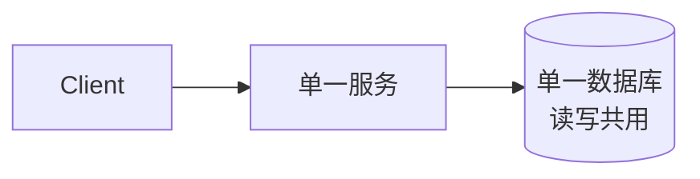
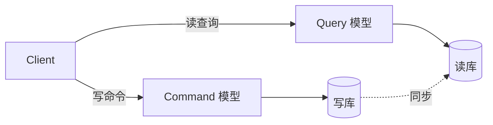
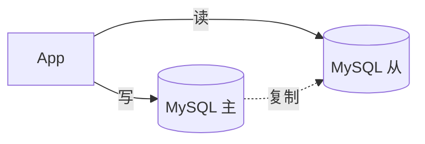
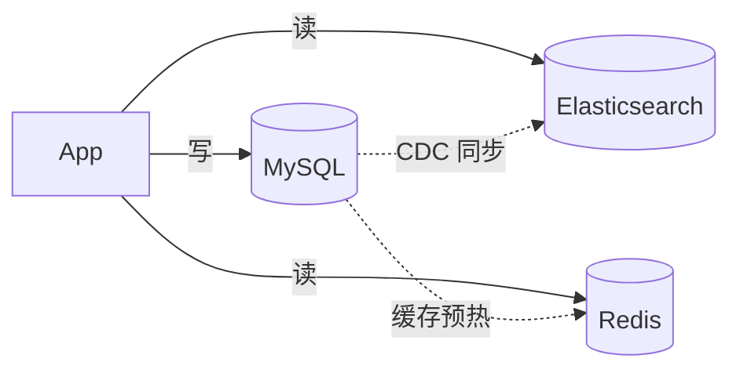
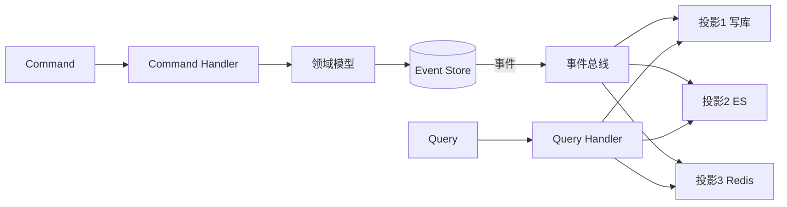
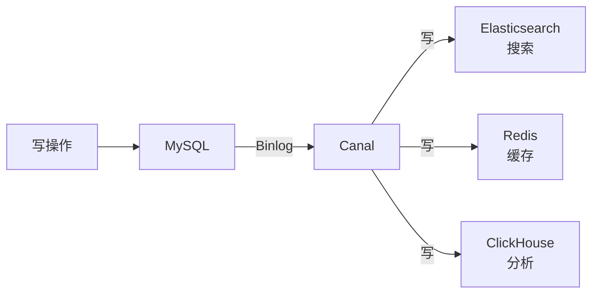
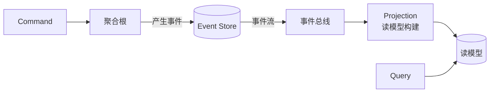
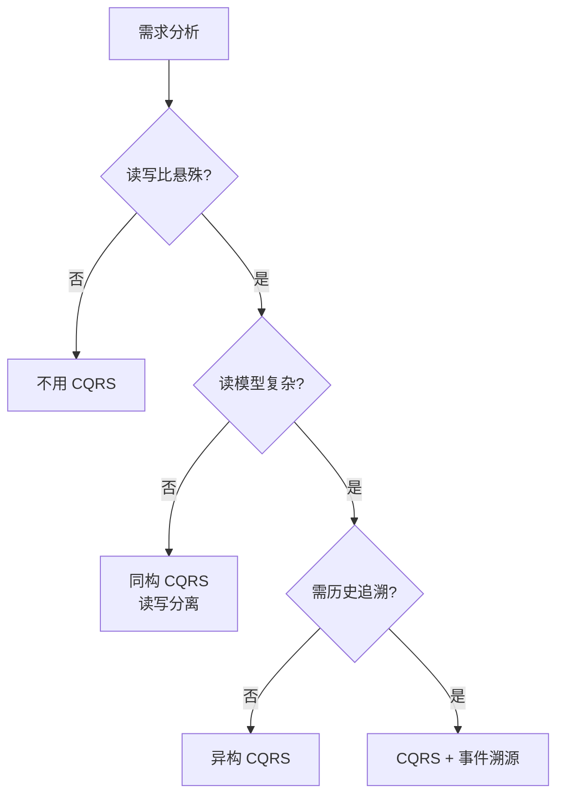

# CQRS 模式

> CQRS（Command Query Responsibility Segregation）将系统的写操作与读操作分离，让它们独立扩展、独立优化。是高并发读多写少场景的利器。

## 目录

- [一、CQRS 核心思想](#一cqrs-核心思想)
- [二、架构模式](#二架构模式)
- [三、典型实现](#三典型实现)
- [四、与事件溯源结合](#四与事件溯源结合)
- [五、优缺点](#五优缺点)
- [六、应用场景](#六应用场景)
- [七、相关资料](#七相关资料)

## 一、CQRS 核心思想

### 1.1 传统 CRUD 问题



问题：
- 读写特征不同：读多写少或写多读少
- 索引冲突：写优化索引 vs 读优化索引
- 扩展性差：读写共享资源
- 模型混乱：领域模型既读又写

### 1.2 CQRS 分离



| 模型 | 关注点 | 示例 |
|------|--------|------|
| Command | 业务规则、校验、状态变更 | 下单、修改、删除 |
| Query | 查询性能、聚合、缓存 | 列表、详情、统计 |

## 二、架构模式

### 2.1 同构 CQRS（最简单）



特点：
- 同一数据库技术
- 只分离读写入口
- 实现简单

### 2.2 异构 CQRS



特点：
- 不同存储技术
- 各取所长
- 实现复杂

### 2.3 完整 CQRS



## 三、典型实现

### 3.1 数据库读写分离

最简单的 CQRS：MySQL 主从。

```python
# 写操作走主库
def create_order(order):
    master_db.insert(order)

# 读操作走从库
def get_order(order_id):
    return slave_db.query("SELECT * FROM orders WHERE id = ?", order_id)
```

### 3.2 MySQL + Elasticsearch

```python
# 写操作：写入 MySQL
def update_product(product_id, data):
    mysql.update("UPDATE products SET ... WHERE id = ?", product_id)
    # 同步发送事件，由消费者更新 ES
    mq.send('ProductUpdated', {'product_id': product_id, **data})

# 读操作：从 ES 查询（支持复杂搜索）
def search_products(keyword):
    return es.search(index='products', q=keyword)
```

### 3.3 MySQL + Redis 缓存

```python
# 写操作
def update_user(user_id, data):
    mysql.update("UPDATE users SET ... WHERE id = ?", user_id)
    redis.delete(f"user:{user_id}")  # 失效缓存
    # 下次读时回源

# 读操作
def get_user(user_id):
    # 先读缓存
    cached = redis.get(f"user:{user_id}")
    if cached:
        return cached
    # 回源 MySQL
    user = mysql.query("SELECT * FROM users WHERE id = ?", user_id)
    redis.set(f"user:{user_id}", user, ex=3600)
    return user
```

### 3.4 多读模型



不同读场景使用不同存储：

| 读场景 | 存储 | 理由 |
|--------|------|------|
| 详情查询 | Redis | 高性能 |
| 全文搜索 | ES | 倒排索引 |
| 复杂统计 | ClickHouse | 列式存储 |
| 关系查询 | MySQL | 关系型 |

## 四、与事件溯源结合

CQRS 与 Event Sourcing 经常一起使用：



| 维度 | CQRS | Event Sourcing |
|------|------|---------------|
| 关注点 | 读写分离 | 状态以事件方式存储 |
| 关系 | 可独立使用 | 通常配合 CQRS |
| 复杂度 | 中 | 高 |

详见 [事件溯源.md](./事件溯源.md)

## 五、优缺点

### 5.1 优点

| 优点 | 说明 |
|------|------|
| 独立扩展 | 读写按需独立扩容 |
| 独立优化 | 读用索引、写用列式 |
| 模型清晰 | 写模型关注业务，读模型关注查询 |
| 技术选型灵活 | 不同存储各取所长 |
| 历史追溯 | 配合事件溯源可追溯状态变化 |

### 5.2 缺点

| 缺点 | 说明 |
|------|------|
| 复杂度上升 | 多套代码、多套存储 |
| 最终一致 | 读模型同步有延迟 |
| 调试难 | 跨存储问题排查 |
| 学习成本 | 团队需理解 CQRS |

## 六、应用场景

### 6.1 适合 CQRS

| 场景 | 理由 |
|------|------|
| 电商商品搜索 | 读多写少，需全文搜索 |
| 社交时间线 | 读多写少，需排序 |
| 报表系统 | 读多写少，需聚合统计 |
| IoT 数据采集 | 写多读少，时序数据 |
| 金融交易 | 写多读少，需事件溯源 |

### 6.2 不适合 CQRS

| 场景 | 理由 |
|------|------|
| 简单 CRUD | 复杂度收益不匹配 |
| 强一致读 | 读延迟无法接受 |
| 小型系统 | 过度设计 |

### 6.3 选型决策



## 七、相关资料

- [CQRS - Martin Fowler](https://martinfowler.com/bliki/CQRS.html)
- [CQRS Journey - Microsoft](https://learn.microsoft.com/en-us/previous-versions/msp-n-p/jj554200(v=pandp.10))
- 《领域驱动设计》Eric Evans
- [CQRS 模式详解](https://microservices.io/patterns/data/cqrs.html)
