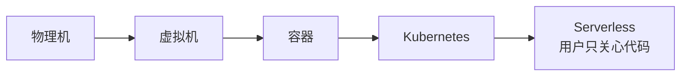
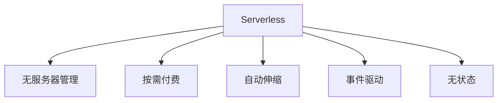
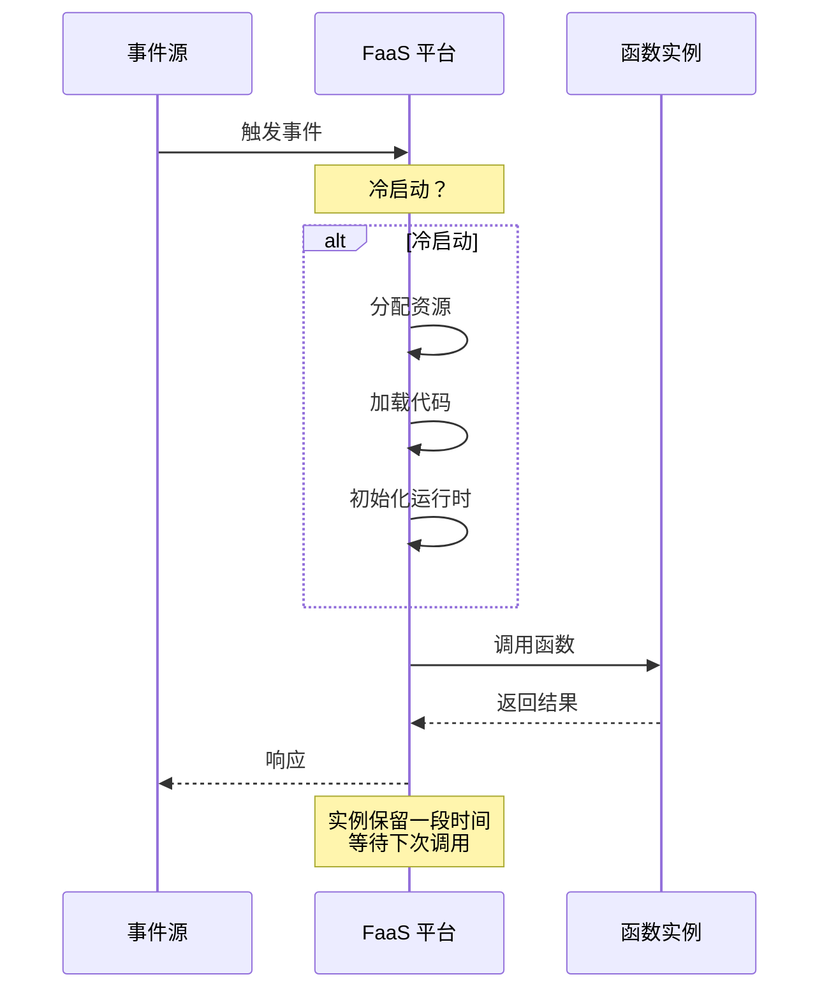
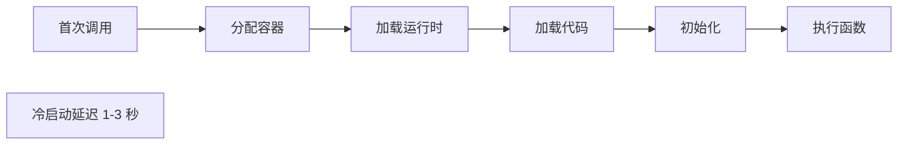
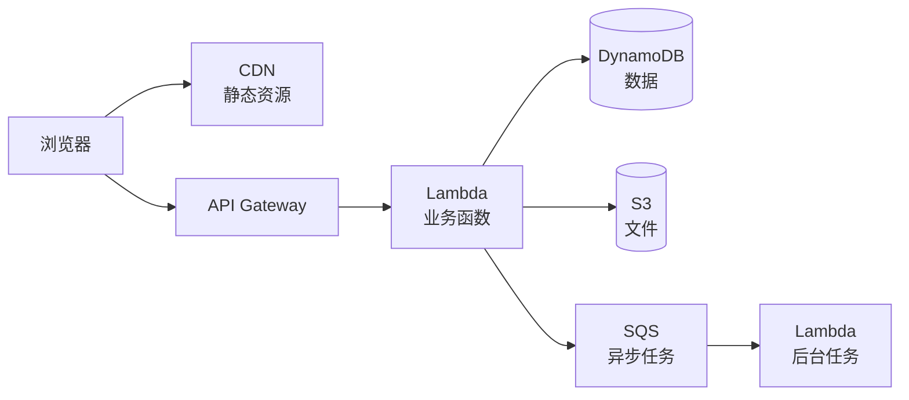
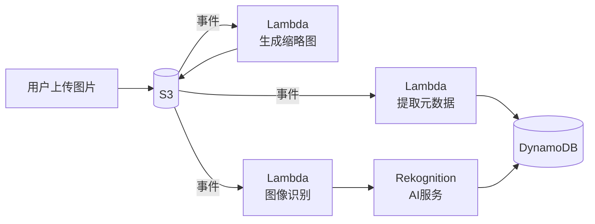
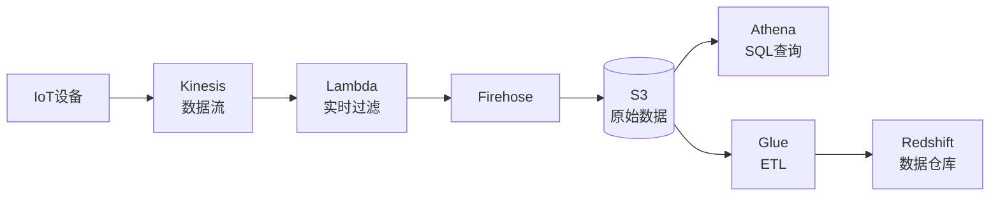

# Serverless 架构

> Serverless 是云原生演进的极致形态，开发者无需管理服务器，按需付费、自动伸缩。包括 FaaS（函数即服务）和 BaaS（后端即服务）。

## 目录

- [一、Serverless 概述](#一serverless-概述)
- [二、核心特征](#二核心特征)
- [三、FaaS 函数即服务](#三faas-函数即服务)
- [四、BaaS 后端即服务](#四baas-后端即服务)
- [五、典型架构](#五典型架构)
- [六、优缺点与适用场景](#六优缺点与适用场景)
- [七、相关资料](#七相关资料)

## 一、Serverless 概述

### 1.1 演进路径



### 1.2 两种形态

| 形态 | 全称 | 说明 | 示例 |
|------|------|------|------|
| **FaaS** | Function as a Service | 函数即服务，事件驱动 | AWS Lambda、阿里云 FC |
| **BaaS** | Backend as a Service | 后端即服务，托管服务 | DynamoDB、Firebase |

## 二、核心特征

### 2.1 五大特征



### 2.2 计费模型

| 传统 | 容器 | Serverless |
|------|------|-----------|
| 按机器时长 | 按容器规格 | 按请求次数 + 执行时长 |

```
Lambda 计费示例：
- 请求次数：$0.20 / 百万次
- 计算时长：$0.0000166667 / GB-秒
- 100 万次请求，每次 100ms，128MB：
  - 请求费用：$0.20
  - 计算费用：100万 × 0.1s × 128MB/1024 × $0.0000166667 = $0.208
  - 总计：$0.41
```

## 三、FaaS 函数即服务

### 3.1 函数生命周期



### 3.2 冷启动问题



冷启动优化：
- 预留实例（Provisioned Concurrency）
- 减小代码包体积
- 选择轻量运行时（Node.js、Python）
- VPC 内访问资源优化

### 3.3 函数示例

```python
# AWS Lambda 示例
import json
import boto3

dynamodb = boto3.resource('dynamodb')
table = dynamodb.Table('Orders')

def lambda_handler(event, context):
    """处理 API Gateway 请求"""
    method = event['httpMethod']
    path = event['path']

    if method == 'POST' and path == '/orders':
        body = json.loads(event['body'])
        order_id = create_order(body)
        return {
            'statusCode': 201,
            'body': json.dumps({'order_id': order_id})
        }
    elif method == 'GET' and path.startswith('/orders/'):
        order_id = path.split('/')[-1]
        order = get_order(order_id)
        return {
            'statusCode': 200,
            'body': json.dumps(order)
        }

def create_order(data):
    order_id = str(uuid.uuid4())
    table.put_item(Item={
        'order_id': order_id,
        'user_id': data['user_id'],
        'amount': data['amount'],
        'status': 'CREATED'
    })
    return order_id

def get_order(order_id):
    response = table.get_item(Key={'order_id': order_id})
    return response.get('Item')
```

### 3.4 事件源

| 事件源 | 触发场景 |
|--------|---------|
| API Gateway | HTTP 请求 |
| S3 / OSS | 文件上传 |
| DynamoDB Streams | 数据变更 |
| Kinesis / Kafka | 流数据 |
| CloudWatch Events | 定时任务 |
| SQS / SNS | 消息队列 |

## 四、BaaS 后端即服务

### 4.1 托管数据库

| 服务 | 类型 | 特点 |
|------|------|------|
| DynamoDB | KV | 自动伸缩、全球复制 |
| Aurora Serverless | 关系型 | 按使用付费 |
| Firestore | 文档 | 实时同步 |
| Redis Cloud | 缓存 | 托管 Redis |

### 4.2 托管认证

- AWS Cognito
- Firebase Auth
- Auth0
- 阿里云 IDaaS

### 4.3 托管存储

- S3 / OSS：对象存储
- CDN：边缘加速

### 4.4 托管消息

- SQS / SNS：消息队列与通知
- EventBridge：事件总线

## 五、典型架构

### 5.1 Serverless Web 应用



### 5.2 Serverless 事件驱动



### 5.3 Serverless 数据流处理



## 六、优缺点与适用场景

### 6.1 优点

| 优点 | 说明 |
|------|------|
| 无运维 | 无需管理服务器 |
| 成本低 | 按需付费，空闲不收费 |
| 自动伸缩 | 0 到上万实例 |
| 上线快 | 专注业务代码 |
| 事件驱动 | 天然解耦 |

### 6.2 缺点

| 缺点 | 说明 |
|------|------|
| 冷启动 | 首次响应慢 |
| 供应商锁定 | 各家 API 不兼容 |
| 调试难 | 本地调试复杂 |
| 执行时长限制 | Lambda 最大 15 分钟 |
| 状态管理 | 无状态，需外部存储 |
| 链路追踪复杂 | 函数间调用多 |

### 6.3 适用场景

| 场景 | 是否适合 | 理由 |
|------|---------|------|
| Web API | ✓ | 突发流量 |
| 文件处理 | ✓ | 事件触发 |
| 定时任务 | ✓ | 短时执行 |
| IoT 数据处理 | ✓ | 事件流 |
| 聊天机器人 | ✓ | 事件驱动 |
| 长连接服务 | ✗ | 执行时长限制 |
| 高性能计算 | ✗ | 冷启动影响 |
| 重状态服务 | ✗ | 无状态特性 |
| 强一致事务 | ✗ | 不适合 |

### 6.4 主流平台对比

| 平台 | 厂商 | 特点 |
|------|------|------|
| AWS Lambda | AWS | 最成熟，生态丰富 |
| Azure Functions | Microsoft | .NET 友好 |
| Google Cloud Functions | Google | 集成 GCP |
| 阿里云 FC | 阿里 | 国内首选 |
| 腾讯云 SCF | 腾讯 | 国内 |
| Knative | 开源 | K8s 上 Serverless |
| OpenFaaS | 开源 | 自建 Serverless |

## 七、相关资料

- [AWS Lambda 官方文档](https://docs.aws.amazon.com/lambda/)
- [Serverless 架构 - Martin Fowler](https://martinfowler.com/articles/serverless.html)
- 《Serverless 架构：无服务器应用实践》
- [CNCF Serverless 白皮书](https://github.com/cncf/wg-serverless)
