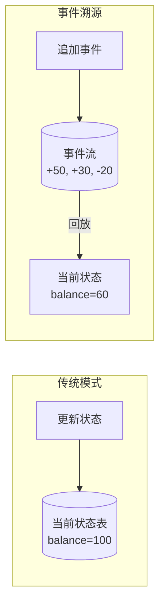
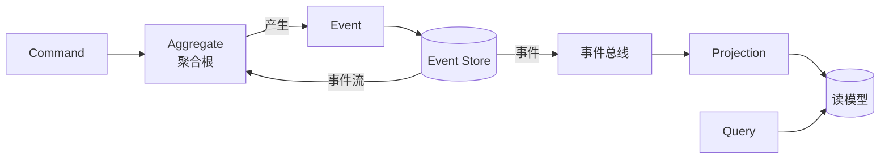
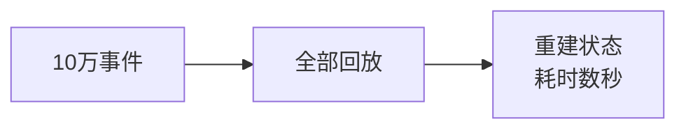
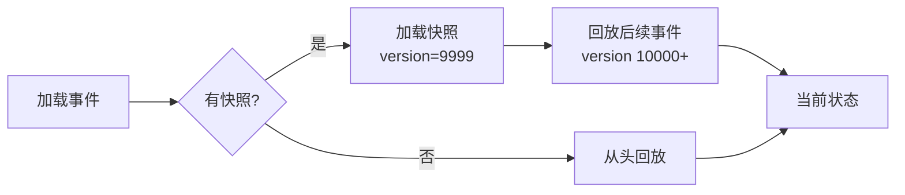
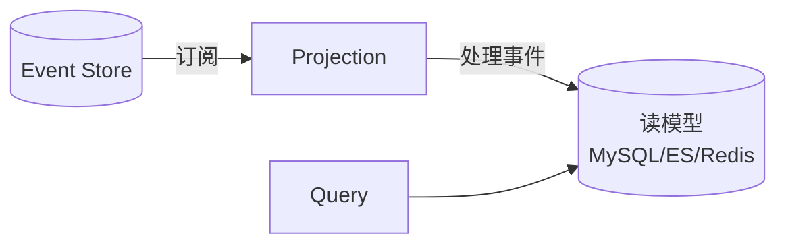

# 事件溯源 Event Sourcing

> 事件溯源将状态变更以事件序列的方式持久化，当前状态通过回放事件得到。是金融、审计、复杂业务流程追溯的强力工具。

## 目录

- [一、核心思想](#一核心思想)
- [二、架构组成](#二架构组成)
- [三、关键问题](#三关键问题)
- [四、快照优化](#四快照优化)
- [五、Projection 读模型](#五projection-读模型)
- [六、应用场景](#六应用场景)
- [七、相关资料](#七相关资料)

## 一、核心思想

### 1.1 传统 vs 事件溯源



| 维度 | 传统模式 | 事件溯源 |
|------|---------|---------|
| 存储 | 当前状态 | 事件序列 |
| 更新 | 覆盖 | 追加 |
| 历史 | 丢失 | 完整保留 |
| 审计 | 需额外日志 | 天然支持 |

### 1.2 事件示例

```python
# 账户事件流
events = [
    {"type": "AccountCreated", "account_id": "A1", "owner": "Alice", "timestamp": "2026-08-01T10:00:00Z"},
    {"type": "MoneyDeposited", "account_id": "A1", "amount": 100, "timestamp": "2026-08-01T10:05:00Z"},
    {"type": "MoneyDeposited", "account_id": "A1", "amount": 50, "timestamp": "2026-08-02T11:00:00Z"},
    {"type": "MoneyWithdrawn", "account_id": "A1", "amount": 30, "timestamp": "2026-08-03T09:00:00Z"},
]
# 当前状态：余额 = 100 + 50 - 30 = 120
```

## 二、架构组成



| 组件 | 职责 |
|------|------|
| **Command** | 表示意图（如 Deposit） |
| **Aggregate** | 业务逻辑 + 状态 |
| **Event** | 已发生的事实 |
| **Event Store** | 事件持久化存储 |
| **Projection** | 投影，构建读模型 |
| **Read Model** | 查询优化模型 |

## 三、关键问题

### 3.1 状态重建

```python
class Account:
    def __init__(self):
        self.balance = 0
        self.version = 0  # 用于乐观锁

    def apply(self, event):
        if event['type'] == 'AccountCreated':
            self.account_id = event['account_id']
        elif event['type'] == 'MoneyDeposited':
            self.balance += event['amount']
        elif event['type'] == 'MoneyWithdrawn':
            self.balance -= event['amount']
        self.version += 1

    @classmethod
    def from_events(cls, events):
        account = cls()
        for event in events:
            account.apply(event)
        return account
```

### 3.2 命令处理

```python
class DepositCommand:
    def __init__(self, account_id, amount):
        self.account_id = account_id
        self.amount = amount

def handle_deposit(cmd):
    # 1. 加载事件流重建聚合根
    events = event_store.load(cmd.account_id)
    account = Account.from_events(events)
    # 2. 执行业务逻辑（产生事件）
    if cmd.amount <= 0:
        raise InvalidAmountError()
    new_event = {
        'type': 'MoneyDeposited',
        'account_id': cmd.account_id,
        'amount': cmd.amount,
        'timestamp': now()
    }
    # 3. 持久化事件
    event_store.append(cmd.account_id, new_event, expected_version=account.version)
    # 4. 发布事件
    event_bus.publish(new_event)
```

### 3.3 并发控制（乐观锁）

```python
def append(stream_id, event, expected_version):
    # 事务保证版本号检查和写入原子性
    with db.transaction():
        current_version = db.query("SELECT MAX(version) FROM events WHERE stream_id = ?", stream_id)
        if current_version != expected_version:
            raise ConcurrencyError()
        db.insert("INSERT INTO events(stream_id, version, data) VALUES(?, ?, ?)",
                  stream_id, expected_version + 1, event)
```

### 3.4 事件不可变

事件一旦写入永不修改：
- Bug 修复：写补偿事件
- Schema 演进：新字段向后兼容
- 数据错误：写修正事件，不删原事件

## 四、快照优化

### 4.1 问题

事件流过长时，重建状态耗时巨大。



### 4.2 快照方案



### 4.3 快照策略

- 每 N 个事件（如 1000）创建一次快照
- 每隔时间（如 1 小时）创建一次
- 事件数达到阈值自动触发

```python
def load_aggregate(stream_id):
    # 先查快照
    snapshot = db.query("SELECT * FROM snapshots WHERE stream_id = ? ORDER BY version DESC LIMIT 1", stream_id)
    if snapshot:
        agg = deserialize(snapshot.data)
        start_version = snapshot.version + 1
    else:
        agg = Account()
        start_version = 0
    # 回放后续事件
    events = event_store.load(stream_id, from_version=start_version)
    for event in events:
        agg.apply(event)
    return agg

def maybe_create_snapshot(agg, stream_id):
    if agg.version % 1000 == 0:
        db.insert("INSERT INTO snapshots(stream_id, version, data) VALUES(?, ?, ?)",
                  stream_id, agg.version, serialize(agg))
```

## 五、Projection 读模型

事件溯源存储不适合查询，需要 Projection 构建读模型。

### 5.1 投影流程



### 5.2 投影实现

```python
class AccountBalanceProjection:
    def handle(self, event):
        if event['type'] == 'AccountCreated':
            mysql.execute("INSERT INTO account_view(id, owner, balance) VALUES(?, ?, 0)",
                         event['account_id'], event['owner'])
        elif event['type'] == 'MoneyDeposited':
            mysql.execute("UPDATE account_view SET balance = balance + ? WHERE id = ?",
                         event['amount'], event['account_id'])
        elif event['type'] == 'MoneyWithdrawn':
            mysql.execute("UPDATE account_view SET balance = balance - ? WHERE id = ?",
                         event['amount'], event['account_id'])

# 查询直接走读模型
def get_balance(account_id):
    return mysql.query("SELECT balance FROM account_view WHERE id = ?", account_id)
```

### 5.3 重放重建读模型

```python
def rebuild_read_model():
    mysql.execute("TRUNCATE account_view")
    events = event_store.load_all_events()
    projection = AccountBalanceProjection()
    for event in events:
        projection.handle(event)
```

## 六、应用场景

### 6.1 适合场景

| 场景 | 理由 |
|------|------|
| 金融账户 | 完整审计追溯 |
| 订单系统 | 状态机复杂，需追溯 |
| 医疗记录 | 法规要求完整历史 |
| 协同编辑 | 多端同步、撤销重做 |
| 物联网 | 时序数据、状态变化 |

### 6.2 不适合场景

| 场景 | 理由 |
|------|------|
| 简单 CRUD | 过度设计 |
| 高频更新小数据 | 事件膨胀严重 |
| 无审计需求 | 收益低 |

### 6.3 工程实现

| 框架 | 语言 | 特点 |
|------|------|------|
| Axon Framework | Java | 成熟完整 |
| EventStoreDB | 通用 | 专用事件存储数据库 |
| Akka Persistence | Scala/Java | Actor 模型 + 事件溯源 |
| Marten | .NET | PostgreSQL + 事件溯源 |

## 七、相关资料

- [Event Sourcing - Martin Fowler](https://martinfowler.com/eaaDev/EventSourcing.html)
- [Event Store 官网](https://www.eventstore.com/)
- 《领域驱动设计》Eric Evans
- [Event Sourcing 模式](https://learn.microsoft.com/en-us/azure/architecture/patterns/event-sourcing)
