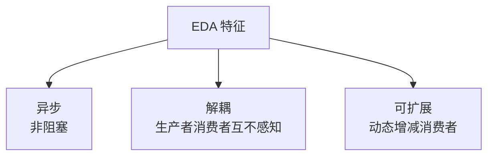
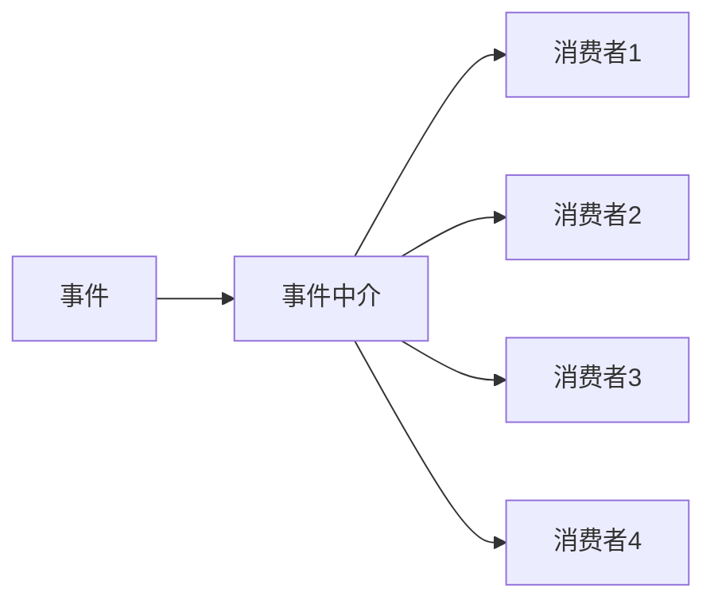
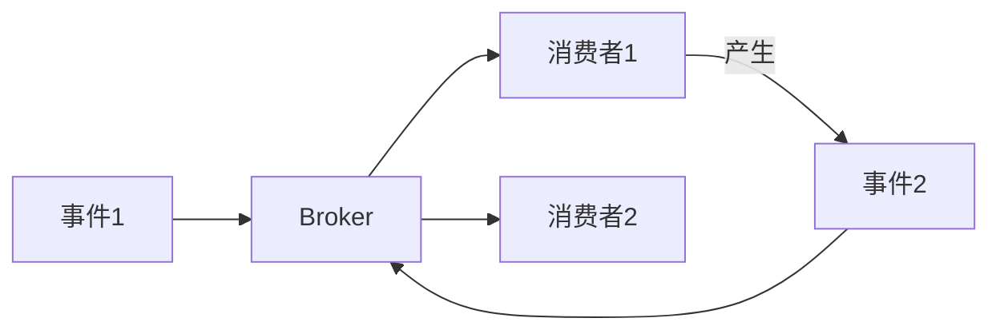
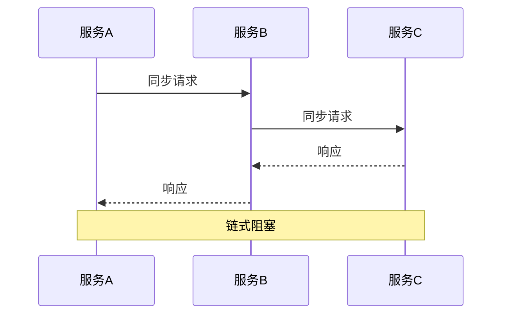
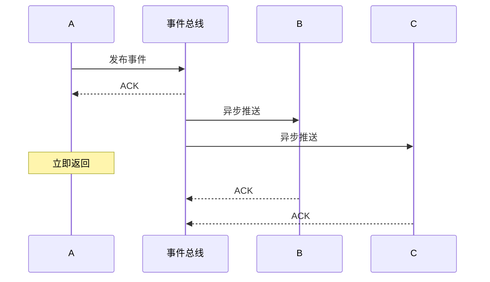
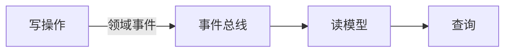
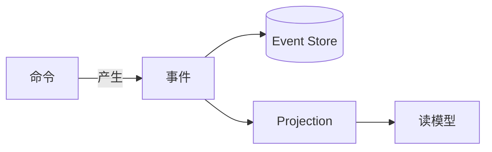
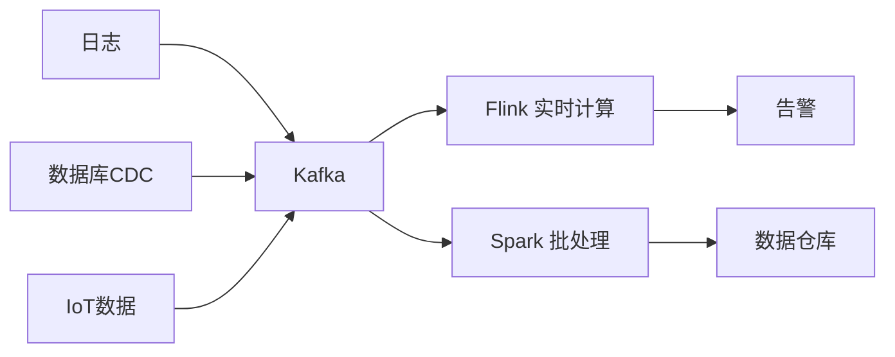

# 事件驱动架构 EDA

> 事件驱动架构（Event-Driven Architecture）通过事件的产生、检测、消费实现系统解耦。是现代微服务、Serverless 的核心模式。

## 目录

- [一、EDA 概述](#一eda-概述)
- [二、核心组件](#二核心组件)
- [三、两种拓扑结构](#三两种拓扑结构)
- [四、与请求驱动对比](#四与请求驱动对比)
- [五、应用场景](#五应用场景)
- [六、工程实践](#六工程实践)
- [七、相关资料](#七相关资料)

## 一、EDA 概述

### 1.1 什么是事件

**事件**：系统中状态变化的客观记录。事件已发生且不可变。

```python
# 事件示例
event = {
    "event_id": "evt-12345",
    "event_type": "OrderCreated",
    "timestamp": "2026-08-17T10:30:00Z",
    "source": "order-service",
    "data": {
        "order_id": "ORD-001",
        "user_id": "U-100",
        "amount": 99.5
    }
}
```

### 1.2 EDA 三大特征



## 二、核心组件

```mermaid
flowchart LR
    E[事件生产者] -->|发布| EB[事件总线<br/>Broker]
    EB -->|订阅| C1[消费者1]
    EB --> C2[消费者2]
    EB --> C3[消费者3]
    Note over EB: 解耦核心
```

| 组件 | 职责 | 示例 |
|------|------|------|
| **事件生产者** | 产生事件 | 订单服务发出 `OrderCreated` |
| **事件总线** | 路由、存储事件 | Kafka/RocketMQ/EventBridge |
| **事件消费者** | 处理事件 | 库存服务扣库存 |
| **事件存储** | 持久化事件 | Event Store |

## 三、两种拓扑结构

### 3.1 Mediator 拓扑（中介者）



特点：
- 中心化协调
- 控制事件流转
- 易于流程编排
- 单点风险

### 3.2 Broker 拓扑（代理）



特点：
- 去中心化
- 无协调器
- 链式触发
- 难以追踪流程

### 3.3 对比

| 维度 | Mediator | Broker |
|------|---------|--------|
| 控制流 | 集中 | 分散 |
| 复杂度 | 中 | 低 |
| 单点风险 | 有 | 无 |
| 流程可观测性 | 好 | 差 |
| 适用场景 | 复杂业务流程 | 简单通知 |

## 四、与请求驱动对比

### 4.1 请求驱动（同步）



### 4.2 事件驱动（异步）



### 4.3 对比

| 维度 | 请求驱动 | 事件驱动 |
|------|---------|---------|
| 耦合 | 强（接口依赖） | 弱（事件契约） |
| 同步性 | 同步阻塞 | 异步非阻塞 |
| 扩展性 | 改接口影响多方 | 加消费者无影响 |
| 调试 | 易 | 难 |
| 一致性 | 强 | 最终 |
| 适用 | 简单查询、强一致 | 解耦、广播 |

## 五、应用场景

### 5.1 微服务解耦

```mermaid
flowchart LR
    Order[订单服务] -->|OrderCreated| EB[事件总线]
    EB --> Inventory[库存服务]
    EB --> SMS[短信服务]
    EB --> Points[积分服务]
    EB --> Analytics[分析服务]
    Note over EB: 新增分析服务无需改订单服务
```

### 5.2 CQRS 模式



详见 [CQRS模式.md](./CQRS模式.md)

### 5.3 事件溯源



详见 [事件溯源.md](./事件溯源.md)

### 5.4 实时流处理



## 六、工程实践

### 6.1 事件设计原则

| 原则 | 说明 |
|------|------|
| 事件命名 | 过去式（已发生）如 `OrderCreated` |
| 不可变 | 事件一旦发布不能修改 |
| 自包含 | 包含消费者所需的所有信息 |
| Schema 化 | 用 Schema Registry 管理版本 |
| 增量演进 | 新字段兼容老消费者 |

### 6.2 事件 Schema

```json
{
  "type": "record",
  "name": "OrderCreated",
  "namespace": "com.example.events",
  "fields": [
    {"name": "event_id", "type": "string"},
    {"name": "timestamp", "type": "long"},
    {"name": "order_id", "type": "string"},
    {"name": "user_id", "type": "string"},
    {"name": "amount", "type": "double"},
    {"name": "items", "type": {"type": "array", "items": "string"}},
    {"name": "shipping_address", "type": ["null", "string"], "default": null}
  ]
}
```

### 6.3 至少一次消费 + 幂等

```python
def consume(event):
    event_id = event['event_id']
    # 幂等检查
    if processed.exists(event_id):
        return
    # 业务处理
    process(event)
    # 标记已处理
    processed.add(event_id)
```

### 6.4 事件版本兼容

```python
# 老版本消费者处理新版本事件
def consume(event):
    # 用 .get 容错新字段
    user_id = event.get('user_id')
    items = event.get('items', [])
    # 新字段 shipping_address 不处理也不报错
```

### 6.5 选型建议

| 中间件 | 适用场景 |
|--------|---------|
| Kafka | 高吞吐、流处理 |
| RocketMQ | 事务消息、金融场景 |
| RabbitMQ | 复杂路由、企业集成 |
| Pulsar | 多租户、分层存储 |
| EventBridge | 云原生、SaaS 集成 |

## 七、相关资料

- [EDA 模式 - Martin Fowler](https://martinfowler.com/articles/201701-event-driven.html)
- 《企业集成模式》Gregor Hohpe
- [Building Event-Driven Microservices](https://www.oreilly.com/library/view/building-event-driven-microservices/9781492057888/)
