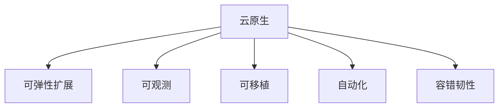
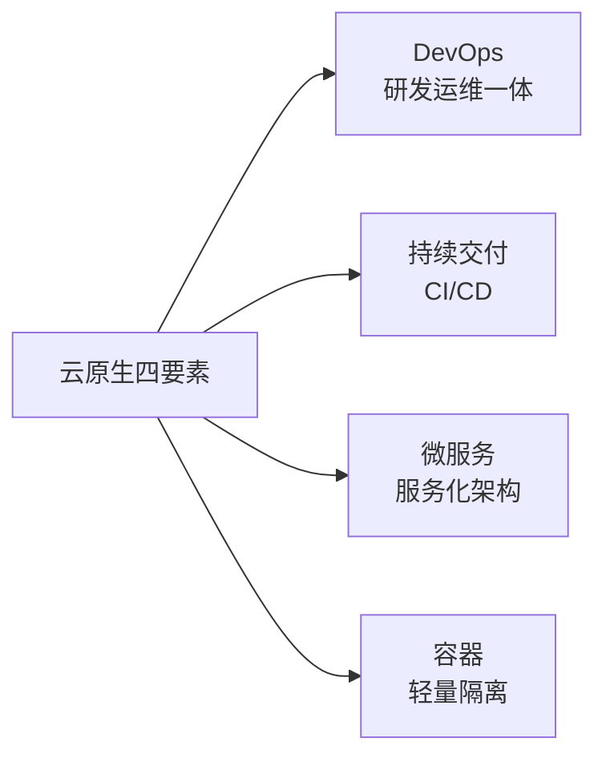
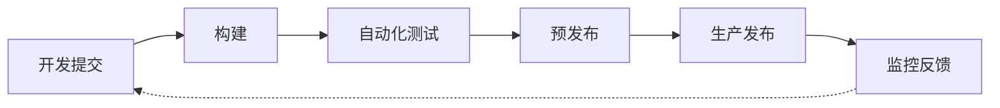
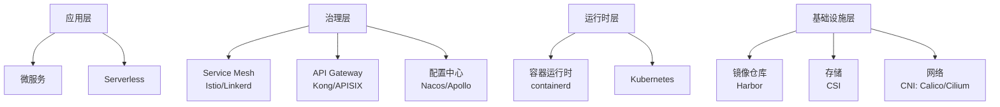
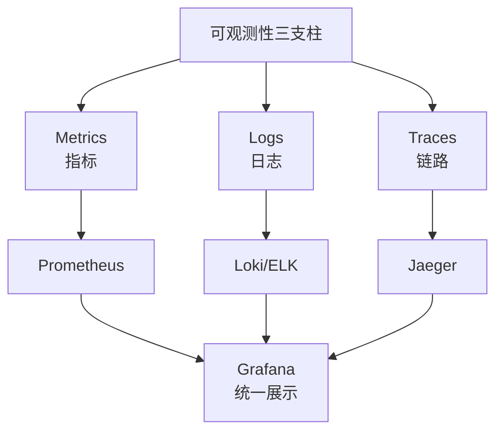
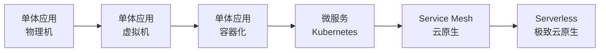
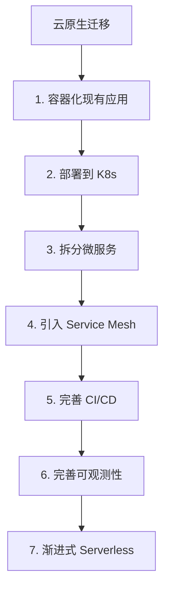
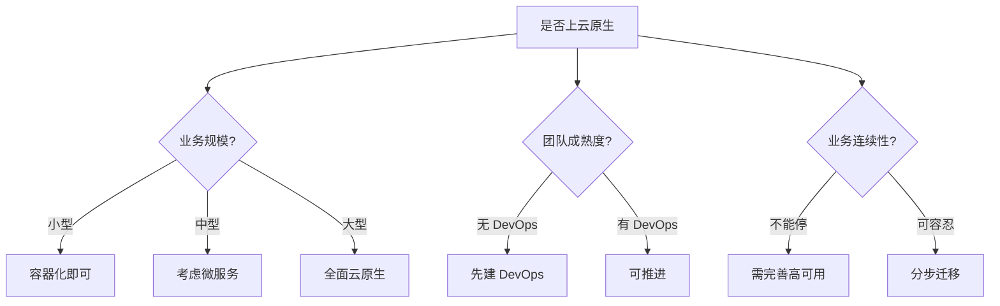

# 云原生架构

> 云原生（Cloud Native）是构建和运行可弹性扩展应用的方法论，以容器、微服务、DevOps、持续交付为核心，让应用充分释放云计算的红利。

## 目录

- [一、云原生定义](#一云原生定义)
- [二、四大核心要素](#二四大核心要素)
- [三、云原生技术栈](#三云原生技术栈)
- [四、云原生架构特征](#四云原生架构特征)
- [五、演进路径](#五演进路径)
- [六、相关资料](#六相关资料)

## 一、云原生定义

### 1.1 CNCF 定义

> Cloud native technologies empower organizations to build and run scalable applications in modern, dynamic environments such as public, private, and hybrid clouds. Containers, service meshes, microservices, immutable infrastructure, and declarative APIs exemplify this approach.

—— CNCF（Cloud Native Computing Foundation）

### 1.2 核心理念



## 二、四大核心要素



### 2.1 DevOps

| 维度 | 说明 |
|------|------|
| 文化 | 开发与运维协作 |
| 实践 | 自动化一切 |
| 工具 | Jenkins、GitLab CI、ArgoCD |

### 2.2 持续交付



### 2.3 微服务

详见 [微服务架构.md](./微服务架构.md)

### 2.4 容器

详见 [Kubernetes 相关文档](../kubernetes/kubernetes架构.md)

## 三、云原生技术栈



### 3.1 CNCF 全景图分类

| 类别 | 代表项目 |
|------|---------|
| 编排调度 | Kubernetes、Nomad |
| 服务网格 | Istio、Linkerd、Consul Connect |
| API 网关 | Kong、APISIX、Envoy |
| 容器运行时 | containerd、CRI-O |
| 存储 | Rook、Longhorn、OpenEBS |
| 网络 | Calico、Cilium、Flannel |
| 监控 | Prometheus、Grafana |
| 日志 | Fluentd、Loki |
| 链路追踪 | Jaeger、Zipkin、OpenTelemetry |
| CI/CD | ArgoCD、Flux、Jenkins X |
| 镜像仓库 | Harbor |

## 四、云原生架构特征

### 4.1 12 要素应用

| 要素 | 说明 |
|------|------|
| Codebase | 一份代码库，多份部署 |
| Dependencies | 显式声明依赖 |
| Config | 配置存环境变量 |
| Backing Services | 后端服务视为附加资源 |
| Build/Release/Run | 构建、发布、运行分离 |
| Processes | 无状态进程 |
| Port Binding | 自包含端口绑定 |
| Concurrency | 通过进程并发扩展 |
| Disposability | 快速启动、优雅退出 |
| Dev/Prod Parity | 各环境尽量一致 |
| Logs | 日志作为事件流 |
| Admin Processes | 管理任务一次性执行 |

### 4.2 不可变基础设施


原则：
- 不 SSH 到容器修改
- 配置变更通过 CI/CD 重新部署
- 失败回滚而非修复

### 4.3 声明式 API

```yaml
# Kubernetes Deployment 声明式
apiVersion: apps/v1
kind: Deployment
metadata:
  name: order-service
spec:
  replicas: 3
  selector:
    matchLabels:
      app: order-service
  template:
    spec:
      containers:
      - name: order
        image: order-service:v1.2.3
        resources:
          requests:
            cpu: 100m
            memory: 128Mi
          limits:
            cpu: 500m
            memory: 512Mi
```

系统根据声明自动达到期望状态，无需关心中间过程。

### 4.4 弹性与韧性

| 机制 | 说明 |
|------|------|
| 健康检查 | Liveness/Readiness Probe |
| 自动伸缩 | HPA/VPA/CA |
| 自愈 | Pod 重启、节点替换 |
| 熔断降级 | Service Mesh 或 Resilience4j |
| 滚动发布 | 零停机部署 |
| 限流 | 网关层或 Service Mesh |

### 4.5 可观测性



详见 [指标监控.md](./指标监控.md)、[日志聚合.md](./日志聚合.md)、[OpenTelemetry.md](./OpenTelemetry.md)

## 五、演进路径

### 5.1 单体到云原生



### 5.2 各阶段特征

| 阶段 | 部署方式 | 架构 | 运维 |
|------|---------|------|------|
| 物理机 | 手动部署 | 单体 | 人工 |
| 虚拟机 | 脚本部署 | 单体 | 半自动 |
| 容器化 | CI/CD | 单体 | 自动 |
| 微服务 | K8s + CI/CD | 微服务 | 自动 + 自愈 |
| Service Mesh | Service Mesh | 微服务 | 治理增强 |
| Serverless | 事件驱动 | 函数 | 完全托管 |

### 5.3 迁移建议



## 六、云原生陷阱

### 6.1 不要为了云原生而云原生

| 错误 | 后果 |
|------|------|
| 简单系统强行拆微服务 | 复杂度爆炸 |
| 没有自动化就上 K8s | 运维更累 |
| 没有 DevOps 文化 | 上线流程更慢 |
| 没有 SLA 意识 | 故障频发 |

### 6.2 评估维度



## 七、相关资料

- [CNCF Cloud Native Definition](https://github.com/cncf/toc/blob/main/DEFINITION.md)
- [CNCF Landscape](https://landscape.cncf.io/)
- [12-Factor App](https://12factor.net/)
- 《Cloud Native Patterns》Cornelia Davis
- 《Cloud Native DevOps with Kubernetes》John Arundel
