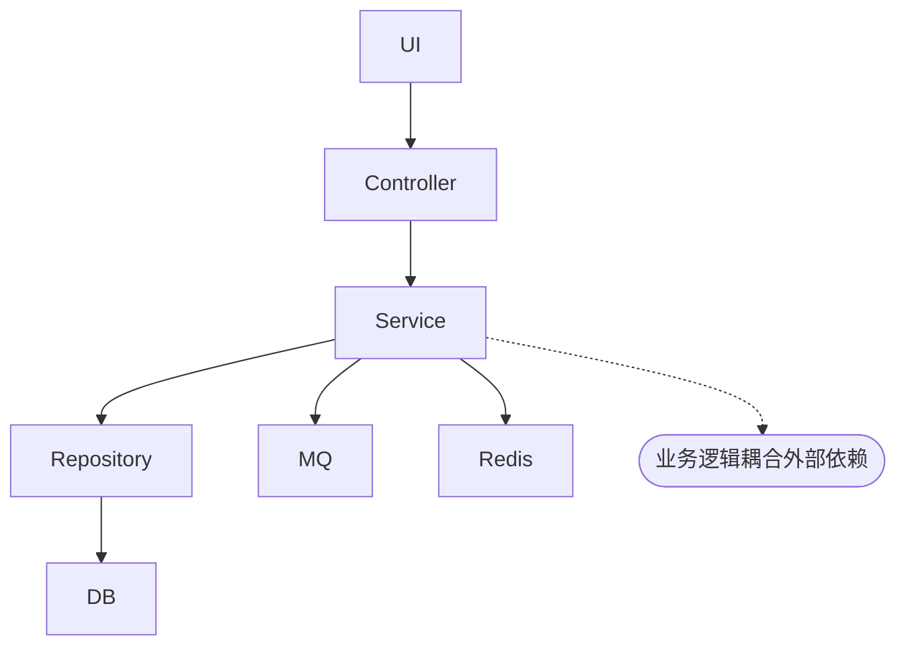
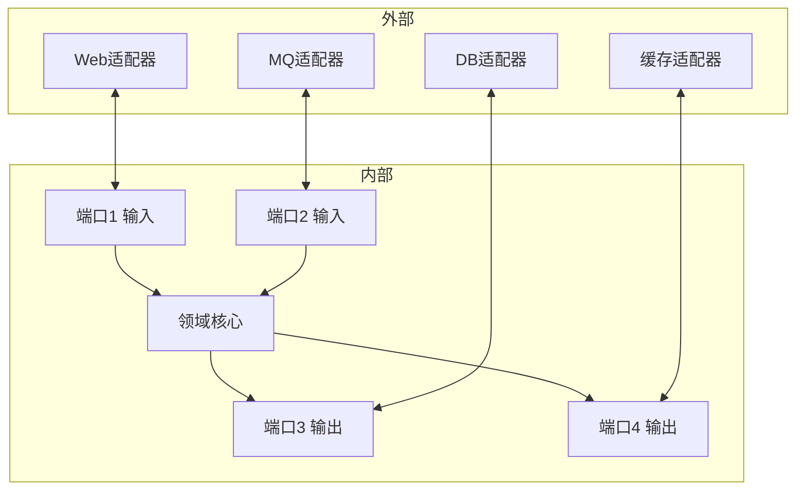
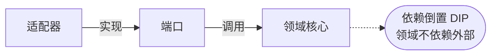
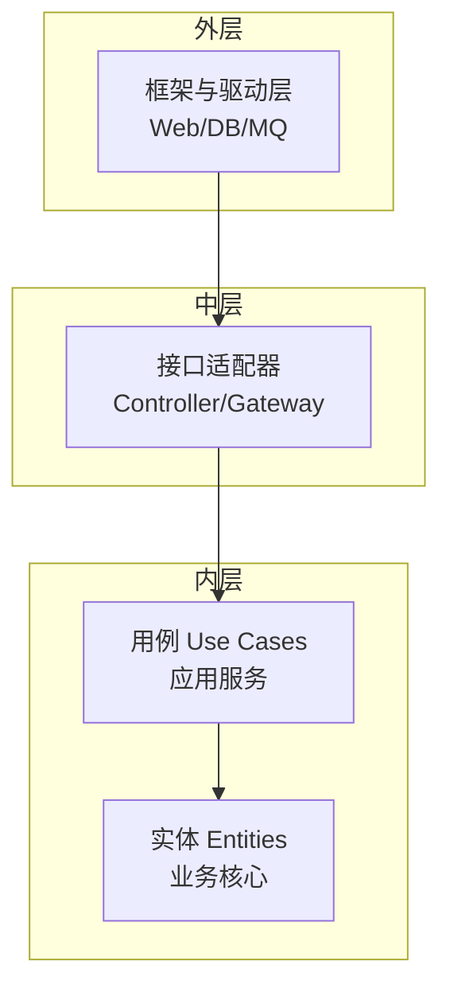
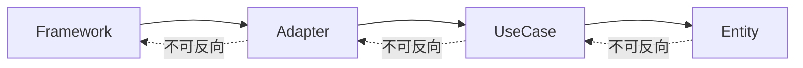
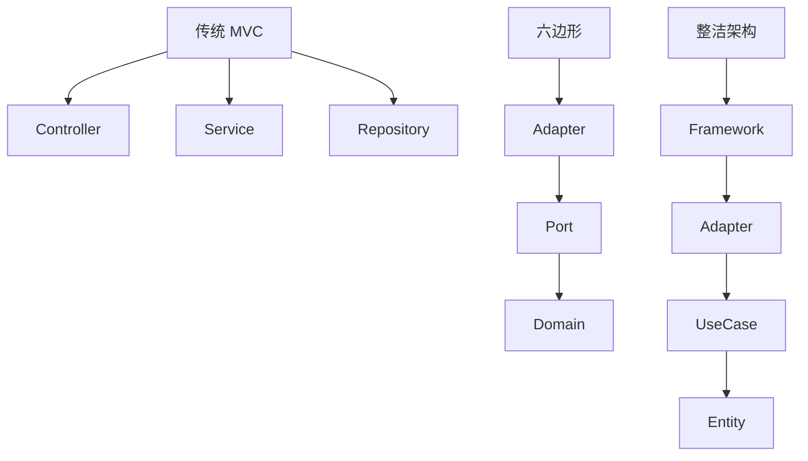

# 六边形架构与整洁架构

> 六边形架构（Hexagonal Architecture / Ports and Adapters）由 Alistair Cockburn 于 2005 年提出，通过端口与适配器隔离业务逻辑与外部依赖，是 DDD 微服务的基础架构风格。

## 目录

- [一、问题背景](#一问题背景)
- [二、六边形架构](#二六边形架构)
- [三、整洁架构](#三整洁架构)
- [四、分层对比](#四分层对比)
- [五、工程实现](#五工程实现)
- [六、相关资料](#六相关资料)

## 一、问题背景

### 1.1 传统分层架构问题



问题：
- 业务逻辑依赖具体技术（数据库、MQ）
- 替换技术栈代价大
- 单元测试困难（需 mock 整个依赖链）
- 业务逻辑被技术细节污染

## 二、六边形架构

### 2.1 核心思想

将应用分为**内部**（业务核心）和**外部**（适配器），通过**端口**通信。



### 2.2 端口与适配器

| 概念 | 说明 | 示例 |
|------|------|------|
| **端口** | 接口定义 | `OrderRepository` 接口 |
| **适配器** | 接口实现 | `MySQLOrderRepository` 实现 |
| **输入端口** | 外部调用内部 | API Controller |
| **输出端口** | 内部调用外部 | Repository、MQ 接口 |

### 2.3 依赖方向



核心原则：**依赖方向始终指向内部**。领域核心不依赖任何外部。

### 2.4 优势

| 优势 | 说明 |
|------|------|
| 测试友好 | 内部完全无依赖，纯单元测试 |
| 技术无关 | 切换 DB/MQ 不影响业务 |
| 关注点分离 | 业务与技术清晰分层 |
| 可替换性 | 同一端口多套适配器 |

## 三、整洁架构

Robert C. Martin（Uncle Bob）在六边形架构基础上提出整洁架构：



### 3.1 四层结构

| 层 | 职责 | 示例 |
|----|------|------|
| **Entities** | 业务实体与规则 | `Order`、`User` |
| **Use Cases** | 应用业务流程 | `CreateOrderUseCase` |
| **Interface Adapters** | 数据转换 | Controller、Presenter |
| **Frameworks & Drivers** | 技术细节 | Spring、MySQL、Kafka |

### 3.2 依赖规则

依赖只能**从外向内**：
- 外层可依赖内层
- 内层不能依赖外层
- 内层不知道外层的存在



## 四、分层对比

### 4.1 三种架构对比

| 维度 | 传统分层 | 六边形 | 整洁架构 |
|------|---------|--------|---------|
| 分层依据 | 技术分层 | 端口适配器 | 同心圆 |
| 业务核心 | Service 层 | 内部 | Entities |
| 依赖方向 | 自上而下 | 外向内 | 外向内 |
| 测试性 | 中 | 高 | 高 |
| 复杂度 | 低 | 中 | 中高 |

### 4.2 各架构对应关系



## 五、工程实现

### 5.1 项目结构

```
order-service/
├── adapter/                  # 适配器层
│   ├── in/                  # 输入适配器
│   │   ├── web/             # Web API
│   │   │   └── OrderController.java
│   │   └── mq/              # MQ 消费者
│   │       └── OrderMessageListener.java
│   └── out/                 # 输出适配器
│       ├── persistence/     # 持久化
│       │   ├── OrderRepositoryImpl.java
│       │   └── OrderJpaRepository.java
│       └── mq/              # MQ 生产者
│           └── OrderEventPublisher.java
├── application/             # 应用层
│   ├── port/                # 端口定义
│   │   ├── in/              # 输入端口
│   │   │   └── CreateOrderUseCase.java
│   │   └── out/             # 输出端口
│   │       ├── OrderRepository.java
│   │       └── EventPublisher.java
│   └── service/             # 用例实现
│       └── CreateOrderService.java
└── domain/                  # 领域层
    ├── model/               # 实体与值对象
    │   ├── Order.java
    │   └── OrderItem.java
    └── service/             # 领域服务
        └── PricingService.java
```

### 5.2 Java 实现示例

```java
// 领域层 - 实体
public class Order {
    private OrderId id;
    private List<OrderItem> items;
    private Money totalAmount;
    private OrderStatus status;

    public void addItem(Product product, int quantity) {
        // 业务规则在实体中
        if (status != OrderStatus.DRAFT) {
            throw new IllegalStateException("Cannot add item to non-draft order");
        }
        items.add(new OrderItem(product, quantity));
        recalculateTotal();
    }

    public void submit() {
        if (items.isEmpty()) {
            throw new IllegalStateException("Cannot submit empty order");
        }
        this.status = OrderStatus.SUBMITTED;
    }
}

// 应用层 - 输入端口（接口）
public interface CreateOrderUseCase {
    OrderId createOrder(CreateOrderCommand command);
}

// 应用层 - 用例实现
@Service
@RequiredArgsConstructor
public class CreateOrderService implements CreateOrderUseCase {
    private final OrderRepository orderRepository;  // 输出端口
    private final EventPublisher eventPublisher;     // 输出端口

    @Override
    @Transactional
    public OrderId createOrder(CreateOrderCommand command) {
        Order order = new Order(command.getUserId());
        for (ItemCommand item : command.getItems()) {
            order.addItem(item.getProduct(), item.getQuantity());
        }
        order.submit();
        orderRepository.save(order);
        eventPublisher.publish(new OrderCreatedEvent(order.getId()));
        return order.getId();
    }
}

// 应用层 - 输出端口（接口）
public interface OrderRepository {
    void save(Order order);
    Order findById(OrderId id);
}

// 适配器层 - 输出适配器（实现端口）
@Repository
@RequiredArgsConstructor
public class OrderRepositoryImpl implements OrderRepository {
    private final OrderJpaRepository jpaRepository;

    @Override
    public void save(Order order) {
        OrderEntity entity = toEntity(order);
        jpaRepository.save(entity);
    }

    @Override
    public Order findById(OrderId id) {
        return jpaRepository.findById(id.getValue())
            .map(this::toDomain)
            .orElseThrow(() -> new OrderNotFoundException(id));
    }
}

// 适配器层 - 输入适配器
@RestController
@RequiredArgsConstructor
public class OrderController {
    private final CreateOrderUseCase createOrderUseCase;

    @PostMapping("/orders")
    public ResponseEntity<?> createOrder(@RequestBody CreateOrderRequest request) {
        CreateOrderCommand command = toCommand(request);
        OrderId orderId = createOrderUseCase.createOrder(command);
        return ResponseEntity.ok(toResponse(orderId));
    }
}
```

### 5.3 测试优势

```java
// 领域核心测试 - 纯单元测试，无任何依赖
class OrderTest {
    @Test
    void should_add_item_to_draft_order() {
        Order order = new Order(UserId.of("u1"));
        Product product = Product.of("p1", Money.of(100));

        order.addItem(product, 2);

        assertThat(order.getTotalAmount()).isEqualTo(Money.of(200));
        assertThat(order.getItems()).hasSize(1);
    }

    @Test
    void should_not_submit_empty_order() {
        Order order = new Order(UserId.of("u1"));
        assertThatThrownBy(order::submit)
            .isInstanceOf(IllegalStateException.class);
    }
}

// 用例测试 - 使用内存实现替代端口
class CreateOrderServiceTest {
    @Test
    void should_create_order() {
        InMemoryOrderRepository repo = new InMemoryOrderRepository();
        FakeEventPublisher publisher = new FakeEventPublisher();
        CreateOrderService service = new CreateOrderService(repo, publisher);

        OrderId id = service.createOrder(new CreateOrderCommand(...));

        assertThat(repo.findById(id)).isNotNull();
        assertThat(publisher.publishedEvents()).hasSize(1);
    }
}
```

## 六、相关资料

- [Hexagonal Architecture - Alistair Cockburn](https://alistair.cockburn.us/hexagonal-architecture/)
- [Clean Architecture - Robert C. Martin](https://blog.cleancoder.com/uncle-bob/2012/08/13/the-clean-architecture.html)
- 《整洁架构》Robert C. Martin
- 《领域驱动设计》Eric Evans
