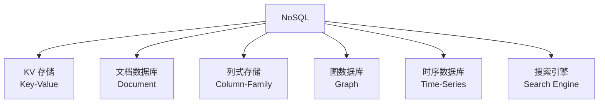
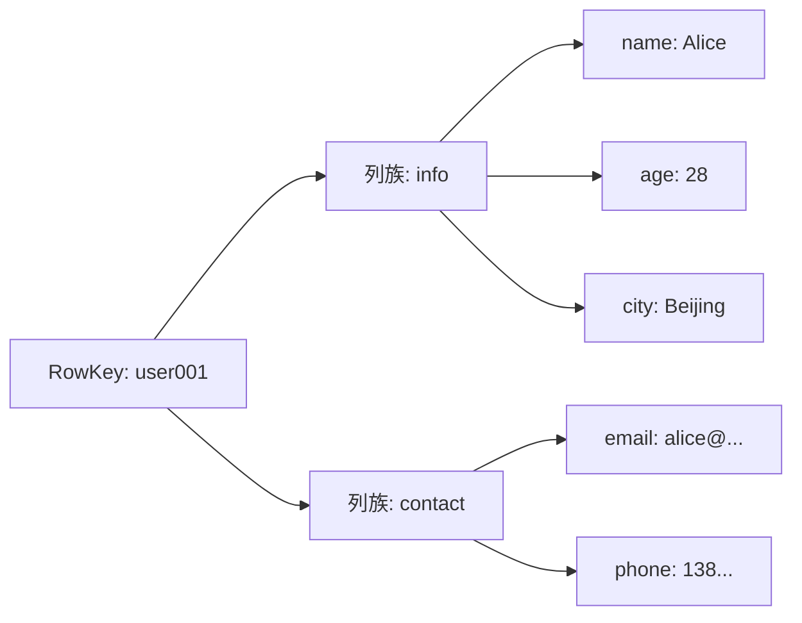
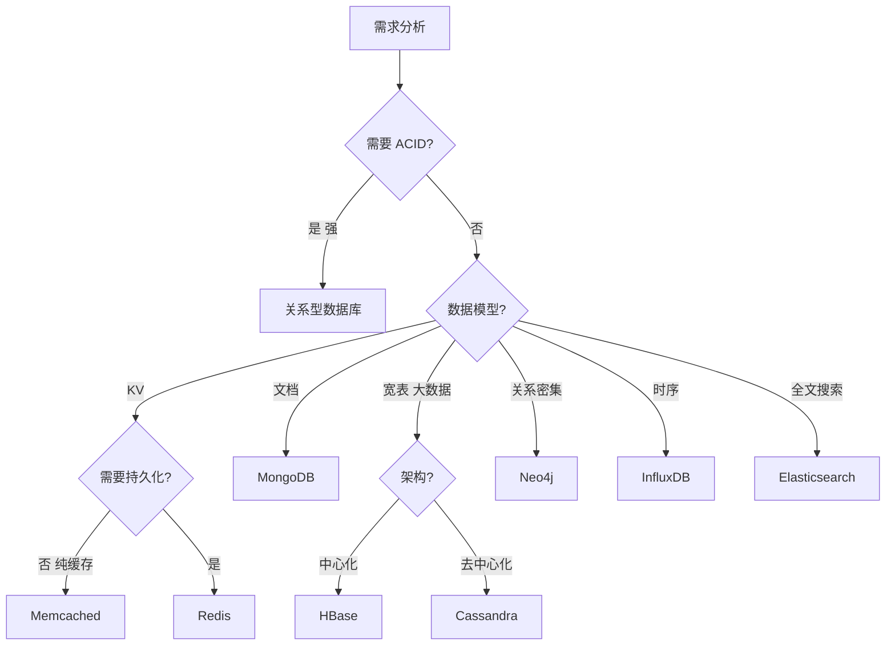
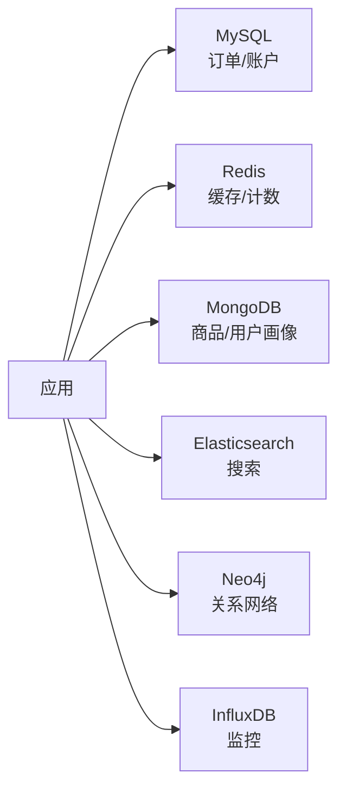

# NoSQL 选型

> 不同 NoSQL 数据库各有定位，选型需结合数据模型、一致性需求、查询模式、规模等维度。

## 目录

- [一、NoSQL 分类](#一nosql-分类)
- [二、KV 存储](#二kv-存储)
- [三、文档数据库](#三文档数据库)
- [四、列式存储](#四列式存储)
- [五、图数据库](#五图数据库)
- [六、选型决策](#六选型决策)
- [七、相关资料](#七相关资料)

## 一、NoSQL 分类



| 类型 | 代表 | 数据模型 | 适用场景 |
|------|------|---------|---------|
| KV | Redis、Memcached | Key-Value | 缓存、计数、队列 |
| 文档 | MongoDB、CouchDB | JSON 文档 | 内容管理、用户画像 |
| 列式 | HBase、Cassandra | 列族 | 大数据、宽表 |
| 图 | Neo4j、JanusGraph | 图结构 | 关系网络、推荐 |
| 时序 | InfluxDB、TimescaleDB | 时间序列 | 监控、IoT |
| 搜索 | Elasticsearch | 倒排索引 | 全文搜索、日志 |

## 二、KV 存储

### 2.1 Redis

详见 [Redis 系列文档](../redis/基础入门.md)

| 特性 | 说明 |
|------|------|
| 数据结构 | String/Hash/List/Set/SortedSet |
| 持久化 | RDB + AOF |
| 集群 | 主从 + 哨兵 + Cluster |
| 性能 | 10万+ QPS |

### 2.2 Memcached

| 特性 | 说明 |
|------|------|
| 数据结构 | 纯 KV |
| 持久化 | 无 |
| 多线程 | 是 |
| 适用 | 纯缓存 |

### 2.3 对比

| 维度 | Redis | Memcached |
|------|-------|-----------|
| 数据类型 | 丰富 | 纯 KV |
| 持久化 | 支持 | 不支持 |
| 单线程/多线程 | 单线程（6.0后网络IO多线程） | 多线程 |
| 集群 | 原生 | 客户端分片 |
| 适用 | 缓存+数据存储 | 纯缓存 |

## 三、文档数据库

### 3.1 MongoDB

```javascript
// 文档结构
{
  "_id": ObjectId("..."),
  "user_id": "u100",
  "name": "Alice",
  "age": 28,
  "address": {
    "city": "Beijing",
    "street": "..."
  },
  "orders": [
    {"order_id": "o1", "amount": 100},
    {"order_id": "o2", "amount": 200}
  ]
}
```

| 特性 | 说明 |
|------|------|
| 数据模型 | BSON 文档 |
| Schema | 动态 Schema |
| 事务 | 4.0+ 支持多文档事务 |
| 索引 | B-Tree、地理、文本 |
| 分片 | 内置 Sharding |
| 副本集 | Replica Set |

### 3.2 适用场景

- 内容管理（CMS）
- 用户画像
- 商品目录
- 实时数据
- 物联网数据

### 3.3 不适用场景

- 强事务跨文档（虽然有但不强）
- 复杂 JOIN
- 财务系统

## 四、列式存储

### 4.1 HBase



| 特性 | 说明 |
|------|------|
| 数据模型 | 稀疏、列族、宽表 |
| 存储 | HDFS |
| 一致性 | 强一致 |
| 规模 | PB 级 |
| 写入 | 高吞吐 |
| 查询 | RowKey 查询高效 |

### 4.2 Cassandra

| 特性 | 说明 |
|------|------|
| 数据模型 | 宽列 |
| 一致性 | 可调（最终到强） |
| 架构 | 无主去中心化 |
| 写入 | 极高吞吐 |
| 适用 | 时序、日志、IoT |

### 4.3 HBase vs Cassandra

| 维度 | HBase | Cassandra |
|------|-------|-----------|
| 架构 | 主从 | 去中心化 |
| 一致性 | 强一致 | 可调 |
| 依赖 | HDFS | 无 |
| 读写 | 强一致读 | 高性能写 |
| 部署 | 重 | 轻 |

## 五、图数据库

### 5.1 Neo4j

```cypher
// 创建节点
CREATE (alice:Person {name: 'Alice', age: 28})
CREATE (bob:Person {name: 'Bob', age: 30})
CREATE (alice)-[:KNOWS {since: 2020}]->(bob)

// 查询：Alice 的朋友的朋友
MATCH (p:Person {name: 'Alice'})-[:KNOWS]->(:Person)-[:KNOWS]->(fof)
RETURN fof.name
```

| 特性 | 说明 |
|------|------|
| 数据模型 | 节点 + 关系 + 属性 |
| 查询语言 | Cypher |
| 关系查询 | 极快 |
| 事务 | ACID |

### 5.2 适用场景


## 六、选型决策

### 6.1 决策流程



### 6.2 场景匹配表

| 场景 | 推荐 | 理由 |
|------|------|------|
| 用户会话 | Redis | 高性能 KV |
| 商品详情 | MongoDB | 文档结构灵活 |
| 商品搜索 | Elasticsearch | 全文搜索 |
| 订单数据 | MySQL | 强一致 |
| 用户行为日志 | Cassandra | 高写入 |
| 监控指标 | InfluxDB | 时序 |
| 社交关系 | Neo4j | 关系查询 |
| 推荐系统 | Neo4j + Redis | 图 + 缓存 |
| 大数据分析 | HBase | 海量存储 |
| 计数器 | Redis | 原子操作 |
| 排行榜 | Redis SortedSet | 排序高效 |

### 6.3 多数据库组合

实际系统常多库共存：



### 6.4 CAP 取向

| 数据库 | CAP 倾向 | PACELC |
|--------|---------|--------|
| MongoDB | CP | PC/EC |
| Cassandra | AP | PA/EL |
| HBase | CP | PC/EC |
| Redis Cluster | AP | PA/EL |
| DynamoDB | AP | PA/EL |
| Neo4j | 单机 CA | N/A |

## 七、相关资料

- [NoSQL 数据库对比](https://www.mongodb.com/nosql-explained)
- 《NoSQL 精粹》Pramod J. Sadalage
- [数据库选型指南](https://aws.amazon.com/cn/nosql/)
- [DB-Engines 排行](https://db-engines.com/en/ranking)
