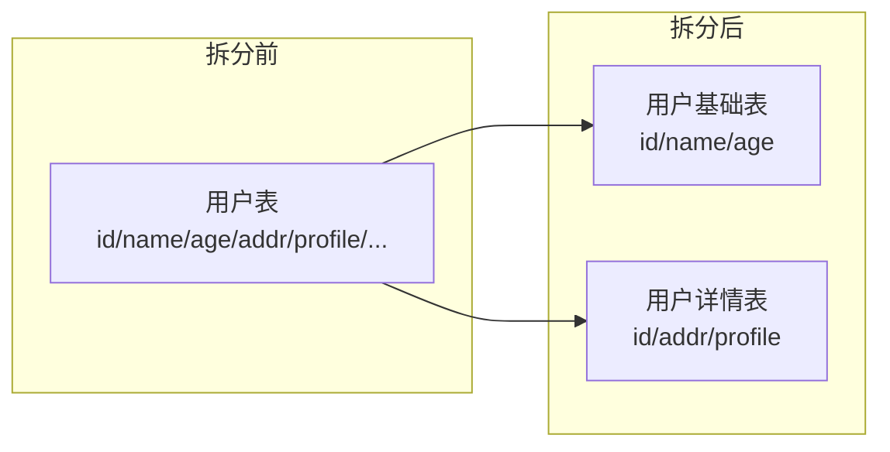
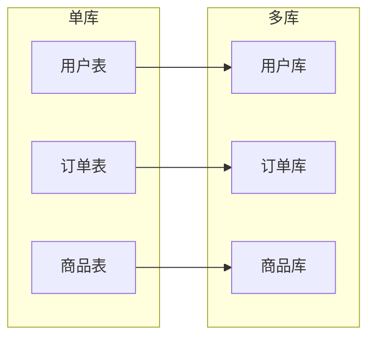
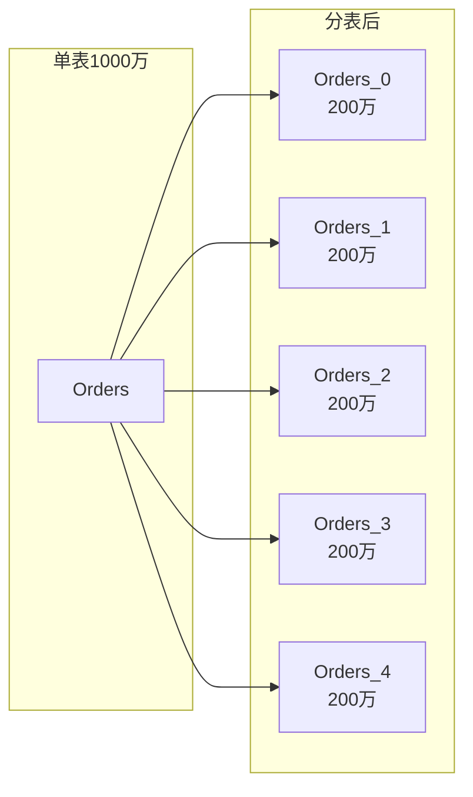
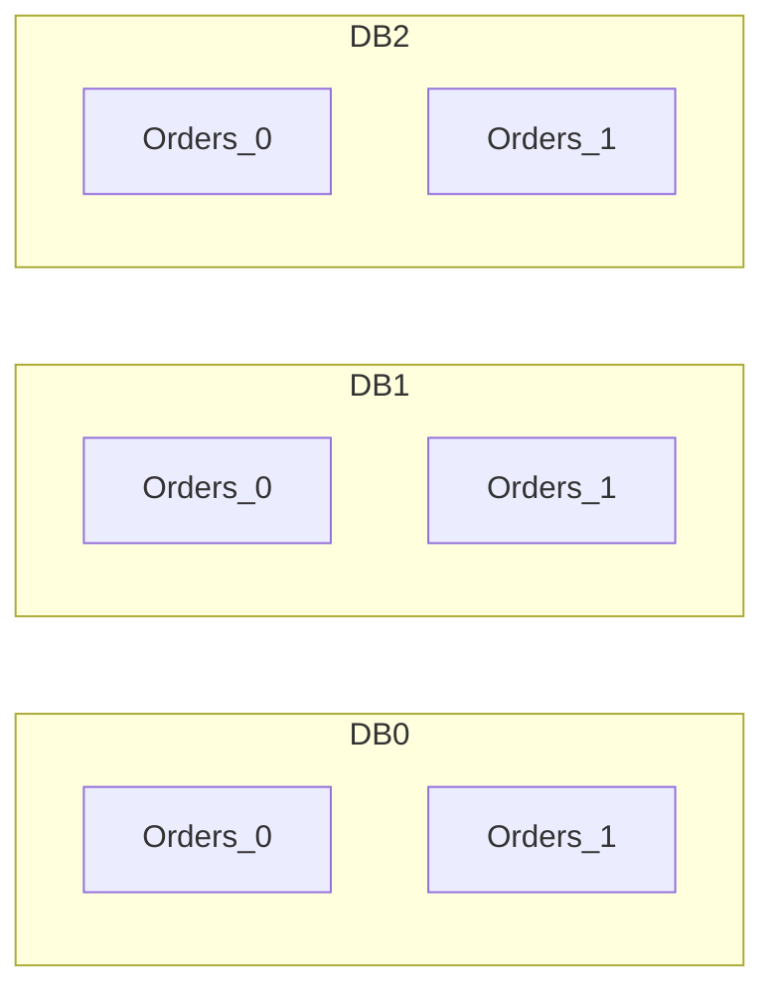
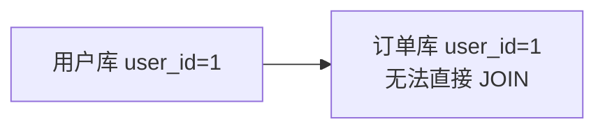
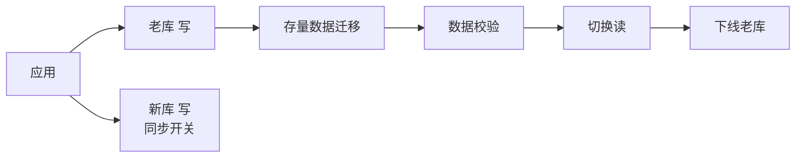

# 分库分表方案

> 当单库数据量突破千万、单表数据量超过千万时，数据库性能急剧下降。分库分表是关系型数据库水平扩展的核心方案。

## 目录

- [一、为什么需要分库分表](#一为什么需要分库分表)
- [二、分库分表方式](#二分库分表方式)
- [三、分片策略](#三分片策略)
- [四、分布式 ID](#四分布式-id)
- [五、跨库问题](#五跨库问题)
- [六、主流中间件](#六主流中间件)
- [七、迁移方案](#七迁移方案)
- [八、相关资料](#八相关资料)

## 一、为什么需要分库分表

### 1.1 单库瓶颈

| 维度 | 瓶颈 |
|------|------|
| 数据量 | 单表 5000 万后查询性能下降 |
| 并发量 | 单库 QPS 上限 5000-10000 |
| 磁盘 | 单机磁盘容量有限 |
| 内存 | Buffer Pool 装不下热数据 |

### 1.2 性能拐点


## 二、分库分表方式

### 2.1 垂直拆分



**垂直分表**：将一张大表按字段拆为多张小表，将热点字段与非热点字段分离。

**垂直分库**：按业务模块拆分到不同数据库：



### 2.2 水平拆分



**水平分表**：同一数据库内，按规则拆为多个表。

**水平分库分表**：将数据分散到多个数据库的多个表：



### 2.3 拆分方式对比

| 方式 | 解决问题 | 难度 |
|------|---------|------|
| 垂直分表 | 字段多，热点字段分离 | 低 |
| 垂直分库 | 业务耦合，单库压力大 | 中 |
| 水平分表 | 单表数据量大 | 中 |
| 水平分库分表 | 单库数据量大 + 单表数据量大 | 高 |

## 三、分片策略

### 3.1 Range 分片

按范围划分：

```
DB0: id 0 - 100万
DB1: id 100万 - 200万
DB2: id 200万 - 300万
```

| 优点 | 缺点 |
|------|------|
| 简单 | 热点问题（最新数据集中） |
| 范围查询友好 | 数据分布不均 |

### 3.2 Hash 分片

```python
def get_db_table(user_id, db_count=4, table_count=8):
    """Hash 分片"""
    hash_val = hash(user_id)
    db_idx = hash_val % db_count
    table_idx = (hash_val // db_count) % table_count
    return f"db_{db_idx}.orders_{table_idx}"
```

| 优点 | 缺点 |
|------|------|
| 数据均匀 | 范围查询难 |
| 扩容复杂（rehash） | 扩容需迁移数据 |

### 3.3 一致性 Hash

详见 [一致性hash算法.md](./一致性hash算法.md)

### 3.4 雪花算法分片

```python
def get_shard(snowflake_id, shard_count=16):
    """雪花算法 ID 中包含分片信息"""
    # 取雪花ID的中间位作为分片
    return (snowflake_id >> 12) % shard_count
```

### 3.5 分片键选择

| 键 | 适用 | 示例 |
|----|------|------|
| 用户ID | 用户相关 | 用户订单、消息 |
| 订单ID | 订单相关 | 订单详情 |
| 时间 | 时序数据 | 日志、监控 |
| 业务ID | 业务隔离 | 多租户 |

## 四、分布式 ID

### 4.1 主键冲突问题

分库后自增主键失效，需全局唯一 ID。

### 4.2 方案对比

| 方案 | 优点 | 缺点 |
|------|------|------|
| UUID | 简单 | 无序、占空间 |
| 数据库自增步长 | 简单 | 扩展难 |
| 号段模式 | 高性能 | 依赖 DB |
| 雪花算法 | 高性能、有序 | 时钟回拨 |
| Redis INCR | 简单 | 依赖 Redis |
| Zookeeper | 强一致 | 性能差 |

### 4.3 雪花算法


```python
class Snowflake:
    def __init__(self, worker_id, datacenter_id):
        self.worker_id = worker_id
        self.datacenter_id = datacenter_id
        self.sequence = 0
        self.last_timestamp = -1

    def next_id(self):
        timestamp = int(time.time() * 1000)
        if timestamp == self.last_timestamp:
            self.sequence = (self.sequence + 1) & 0xFFF
            if self.sequence == 0:
                timestamp = self.wait_next_millis(self.last_timestamp)
        else:
            self.sequence = 0
        self.last_timestamp = timestamp
        return ((timestamp - EPOCH) << 22) \
            | (self.datacenter_id << 17) \
            | (self.worker_id << 12) \
            | self.sequence
```

## 五、跨库问题

### 5.1 跨库 JOIN



**解决方案**：
- **应用层组装**：分别查询后内存组装
- **冗余字段**：订单表冗余用户名
- **数据同步**：通过 CDC 同步到 ES 查询
- **全局表**：基础数据广播到所有库

```python
# 应用层组装
def get_order_with_user(order_id):
    order = order_db.query("SELECT * FROM orders WHERE id = ?", order_id)
    user = user_db.query("SELECT * FROM users WHERE id = ?", order.user_id)
    return {**order, 'user_name': user.name}
```

### 5.2 跨库事务

| 方案 | 说明 |
|------|------|
| 2PC / XA | 强一致，性能差 |
| TCC | 业务侵入大 |
| Saga | 最终一致 |
| 本地消息表 | 最终一致 |

详见 [分布式事务.md](./分布式事务.md)

### 5.3 跨库分页

```sql
-- 错误：无法跨库 LIMIT 10, 5
-- 方案：每个库查前 15 条，应用层合并后取 5 条
SELECT * FROM orders_0 ORDER BY create_time DESC LIMIT 0, 15;
SELECT * FROM orders_1 ORDER BY create_time DESC LIMIT 0, 15;
SELECT * FROM orders_2 ORDER BY create_time DESC LIMIT 0, 15;
-- 应用层归并排序后取第 10-14 条
```

分页越深性能越差，二次查询法、禁止跳页等优化策略。

### 5.4 跨库聚合

```sql
-- 统计总销售额
-- 各库分别 SUM，应用层再 SUM
SELECT SUM(amount) FROM orders_0 WHERE create_time = '2026-08-17';
SELECT SUM(amount) FROM orders_1 WHERE create_time = '2026-08-17';
-- 应用层 sum0 + sum1 + ...
```

## 六、主流中间件

### 6.1 ShardingSphere

Apache 顶级项目，支持 JDBC 与 Proxy 两种模式：

| 模式 | 特点 |
|------|------|
| ShardingSphere-JDBC | 客户端模式，性能好，无需额外部署 |
| ShardingSphere-Proxy | 代理模式，对应用透明，支持异构语言 |

```yaml
# ShardingSphere-JDBC 配置
shardingRule:
  tables:
    orders:
      actualDataNodes: ds_${0..1}.orders_${0..3}
      databaseStrategy:
        standard:
          shardingColumn: user_id
          shardingAlgorithmName: db_hash_mod
      tableStrategy:
        standard:
          shardingColumn: user_id
          shardingAlgorithmName: table_hash_mod
  shardingAlgorithms:
    db_hash_mod:
      type: HASH_MOD
      props:
        sharding-count: 2
    table_hash_mod:
      type: HASH_MOD
      props:
        sharding-count: 4
```

### 6.2 MyCat

老牌数据库中间件，Proxy 模式。

### 6.3 对比

| 中间件 | 模式 | 维护活跃 | 特点 |
|--------|------|---------|------|
| ShardingSphere-JDBC | JDBC | 活跃 | 性能好，Java 生态 |
| ShardingSphere-Proxy | Proxy | 活跃 | 多语言支持 |
| MyCat | Proxy | 一般 | 老牌 |
| Vitess | Proxy | 活跃 | MySQL 集群方案 |
| TDDL | JDBC | 阿里内部 | 不开源 |

## 七、迁移方案

### 7.1 双写迁移



步骤：
1. 应用双写新老库
2. 存量数据通过工具迁移（如 DataX、Canal）
3. 数据校验
4. 切换读流量到新库
5. 观察一段时间后下线老库

### 7.2 停机迁移

适合小数据量或可停机业务：
1. 停机
2. 全量数据迁移
3. 切换数据源
4. 启动

### 7.3 增量同步 + 切换


## 八、相关资料

- [ShardingSphere 官方文档](https://shardingsphere.apache.org/)
- [MyCat 官方文档](http://www.mycat.org.cn/)
- [Vitess 官方文档](https://vitess.io/)
- 《MySQL 性能调优与架构设计》
- [分库分表中间件对比](https://www.infoq.cn/article/sharding-jdbc)
