# 存储引擎：LSM Tree 与 B+ Tree

> 数据库存储引擎决定了数据的写入与查询性能。B+ Tree 是关系型数据库的基石，LSM Tree 是 NoSQL 的高性能写入方案。

## 目录

- [一、存储引擎概述](#一存储引擎概述)
- [二、B+ Tree](#二b-tree)
- [三、LSM Tree](#三lsm-tree)
- [四、对比与选型](#四对比与选型)
- [五、其他存储结构](#五其他存储结构)
- [六、相关资料](#六相关资料)

## 一、存储引擎概述

存储引擎决定了数据如何在磁盘上组织、如何被索引和查询。

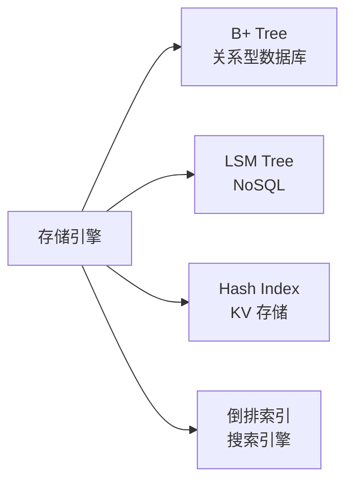

## 二、B+ Tree

### 2.1 结构

```mermaid
flowchart TD
    Root[根节点<br/>10 | 20 | 30] --> N1[节点<br/>5 | 10]
    Root --> N2[节点<br/>15 | 20]
    Root --> N3[节点<br/>25 | 30]
    N1 --> L1[叶子<br/>1 2 5]
    N1 --> L2[叶子<br/>7 10]
    N2 --> L3[叶子<br/>12 15]
    N2 --> L4[叶子<br/>17 20]
    N3 --> L5[叶子<br/>22 25]
    N3 --> L6[叶子<br/>27 30]
    L1 -.->|链表| L2
    L2 -.-> L3
    L3 -.-> L4
    L4 -.-> L5
    L5 -.-> L6
```

特点：
- 非叶子节点只存索引，不存数据
- 所有数据都在叶子节点
- 叶子节点通过链表相连
- 树高通常 3-4 层

### 2.2 查询过程

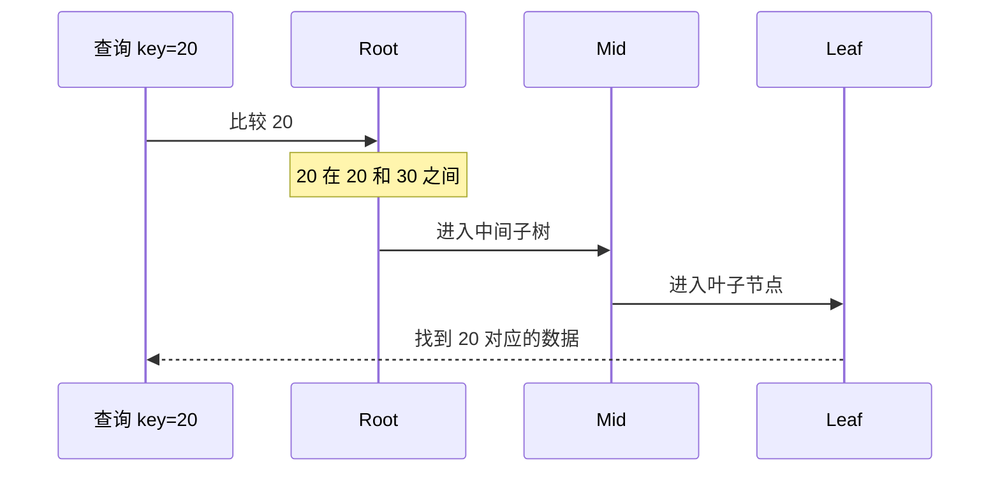

查询复杂度：O(log N)

### 2.3 插入与分裂

```mermaid
flowchart LR
    A[插入 18] --> B[找到目标叶子节点<br/>12 15 17 20]
    B --> C[插入后<br/>12 15 17 18 20]
    C --> D{超过阶数?}
    D -->|是| E[分裂<br/>12 15 | 17 18 20]
    D -->|否| F[完成]
    E --> G[父节点添加索引]
```

### 2.4 B+ Tree 在 MySQL InnoDB

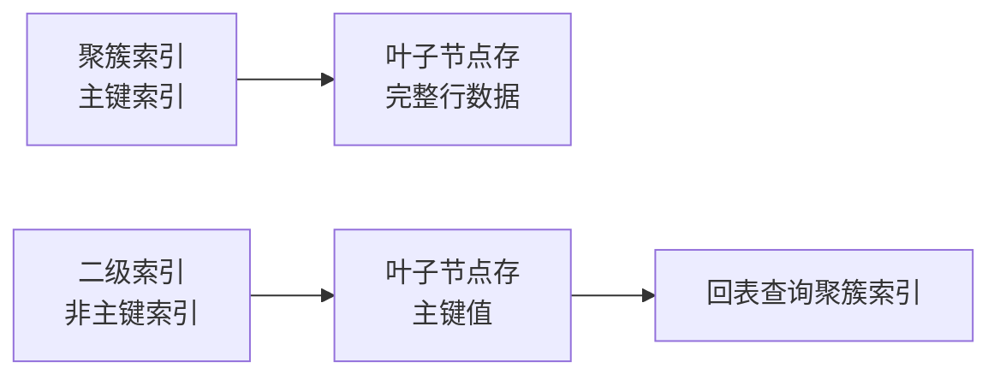

```sql
-- 聚簇索引：主键查询直接拿到数据
SELECT * FROM users WHERE id = 1;

-- 二级索引：先查到主键，再回表
SELECT * FROM users WHERE name = 'Alice';
-- 1. 在 name 索引找到主键 id=5
-- 2. 在聚簇索引查 id=5 的完整数据
```

### 2.5 B+ Tree 优缺点

| 优点 | 缺点 |
|------|------|
| 范围查询高效 | 写入需重排节点 |
| 查询稳定 O(log N) | 大量随机 IO |
| 适合读多写少 | 写放大 |

## 三、LSM Tree

### 3.1 核心思想

Log-Structured Merge Tree，将随机写转为顺序写。

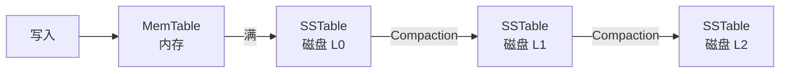

### 3.2 写入流程

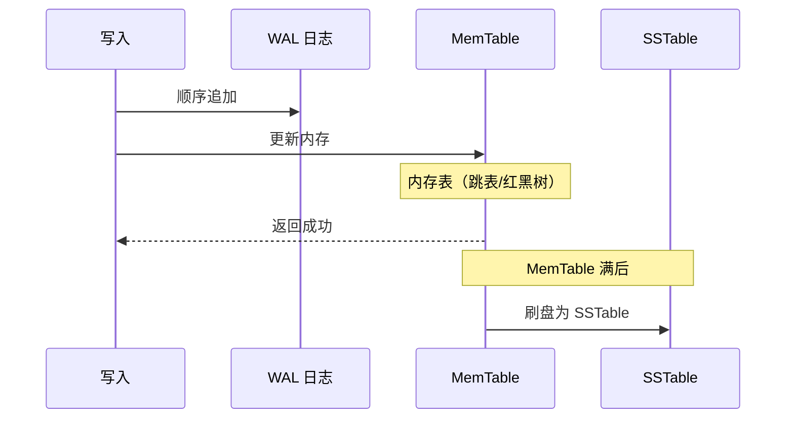

### 3.3 查询流程

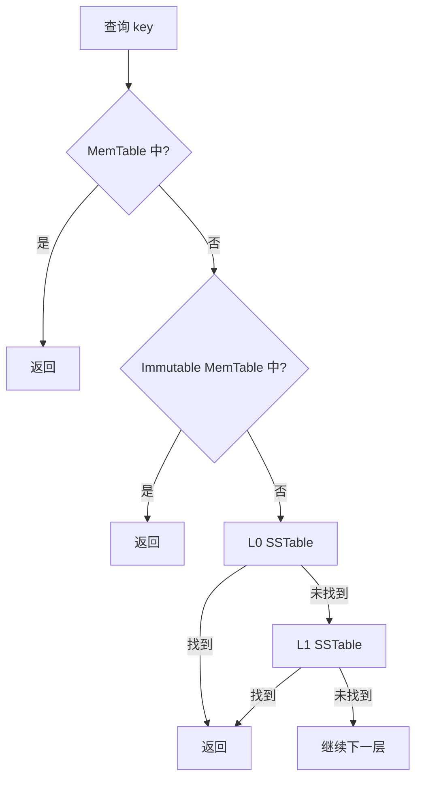

查询需合并多层，性能不如 B+ Tree。

### 3.4 Compaction

合并多层 SSTable，消除重复与删除标记：

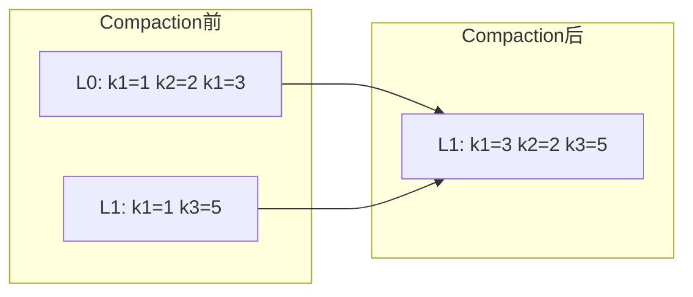

两种 Compaction：
- **Size-Tiered**：相似大小合并，写放大低，读放大高
- **Leveled**：分层合并，读放大低，写放大高

### 3.5 LSM Tree 优缺点

| 优点 | 缺点 |
|------|------|
| 顺序写性能极高 | 读放大（多层查找） |
| 写吞吐高 | 空间放大（旧版本） |
| 适合写多读少 | Compaction 影响 IO |
| 压缩友好 | 后台 Compaction 资源消耗 |

### 3.6 LSM Tree 应用

| 数据库 | 实现 |
|--------|------|
| LevelDB | Google，Leveled Compaction |
| RocksDB | Facebook，LevelDB 增强版 |
| HBase | 基于 LSM |
| Cassandra | 基于 LSM |
| RocksDB | MySQL RocksDB 引擎 |

## 四、对比与选型

### 4.1 性能对比

```mermaid
flowchart TD
    A[写入] --> B[B+ Tree<br/>随机写 慢]
    A --> C[LSM Tree<br/>顺序写 快]
    D[查询] --> E[B+ Tree<br/>O(log N) 快]
    D --> F[LSM Tree<br/>多层合并 慢]
```

| 维度 | B+ Tree | LSM Tree |
|------|---------|----------|
| 写入 | 慢（随机 IO） | 快（顺序 IO） |
| 查询 | 快 | 慢（多层） |
| 空间 | 紧凑 | 放大 |
| 范围查询 | 强（叶子链表） | 中 |
| 写放大 | 中（一次写） | 高（Compaction） |
| 读放大 | 低 | 高 |
| 适用 | 读多写少 | 写多读少 |

### 4.2 选型决策

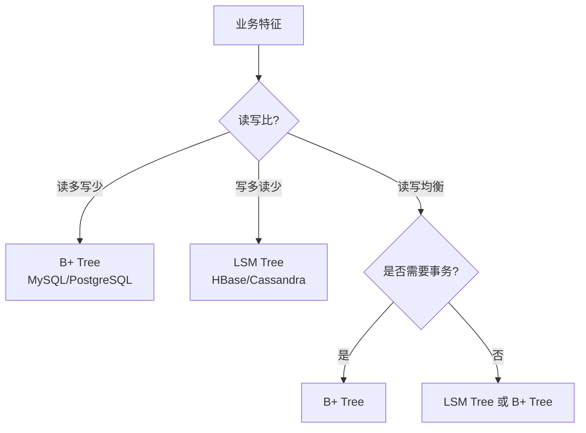

### 4.3 实际应用

| 场景 | 推荐 | 理由 |
|------|------|------|
| OLTP 交易 | B+ Tree | 强一致、查询快 |
| 日志写入 | LSM Tree | 高吞吐写 |
| 时序数据 | LSM Tree | 写多读少 |
| 用户画像 | B+ Tree | 查询为主 |
| 监控指标 | LSM Tree | 时序写入 |
| 全文搜索 | 倒排索引 | 见下文 |

## 五、其他存储结构

### 5.1 倒排索引

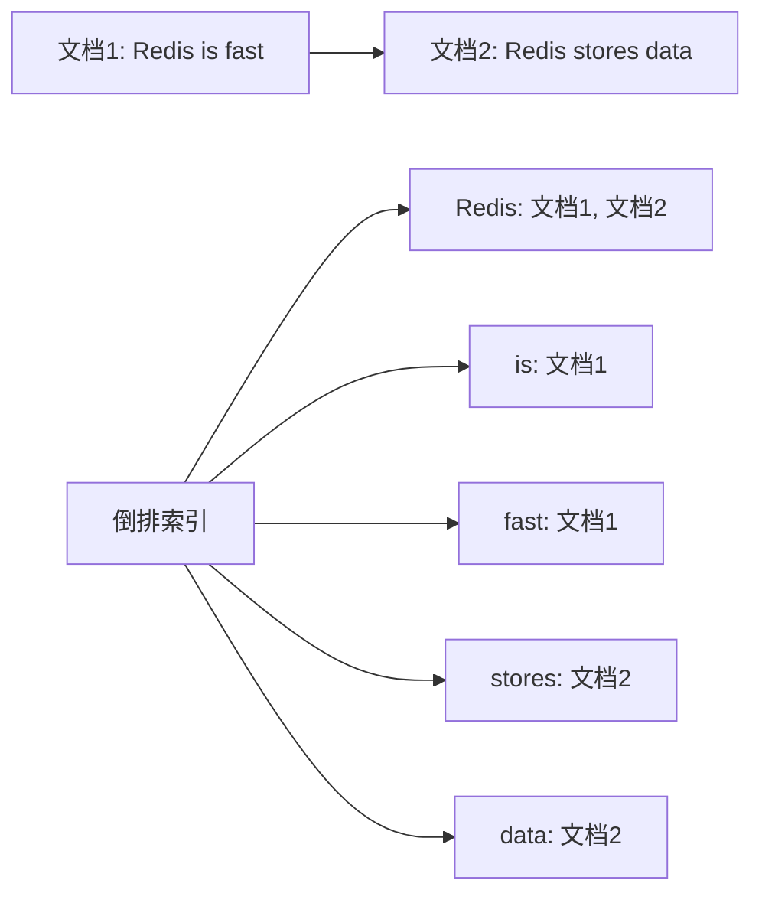

Elasticsearch、Lucene 核心结构。

### 5.2 Hash Index

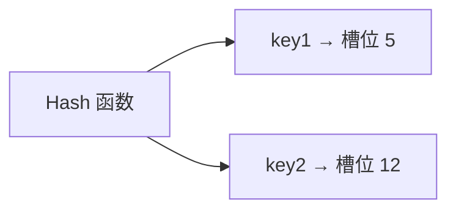

特点：
- O(1) 查询
- 不支持范围查询
- 适合等值查询

### 5.3 BitMap

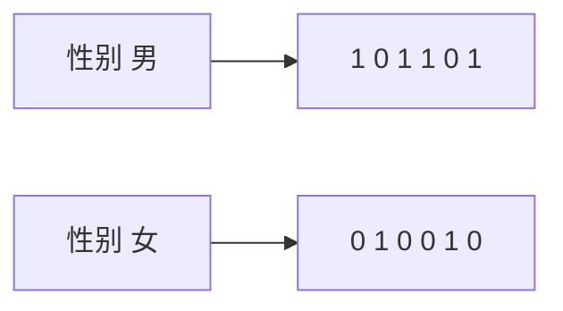

适合基数小的列，ClickHouse 中广泛应用。

## 六、相关资料

- [B+ Tree 详解](https://www.cs.usfca.edu/~galles/visualization/BPlusTree.html)
- [LSM Tree 论文](https://www.cs.umb.edu/~poneil/lsmtree.pdf)
- 《数据密集型应用系统设计》Martin Kleppmann
- [RocksDB 官方文档](https://github.com/facebook/rocksdb/wiki)
- [InnoDB 存储引擎](https://dev.mysql.com/doc/refman/8.0/en/innodb-storage-engine.html)
