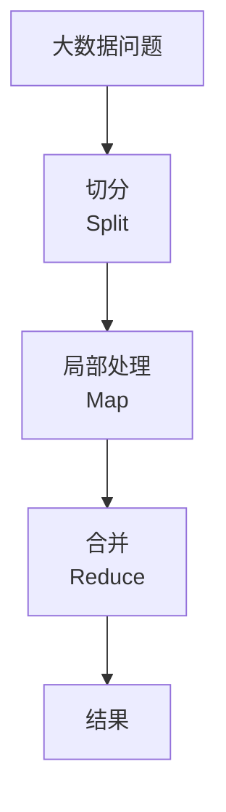

# 海量数据处理

> 海量数据处理是架构师面试与实战的高频主题，涉及大数据统计、去重、排序、查询等场景，常用 Bitmap、布隆过滤器、外部排序、分治等技术。

## 目录

- [一、问题特征](#一问题特征)
- [二、Bitmap 与位运算](#二bitmap-与位运算)
- [三、布隆过滤器](#三布隆过滤器)
- [四、HyperLogLog](#四hyperloglog)
- [五、外部排序](#五外部排序)
- [六、分治与 MapReduce](#六分治与-mapreduce)
- [七、常见面试题](#七常见面试题)
- [八、相关资料](#八相关资料)

## 一、问题特征

| 特征 | 说明 |
|------|------|
| 数据量大 | GB、TB、PB 级 |
| 内存不够 | 数据无法一次性装入内存 |
| 单机不够 | 需分布式处理 |
| 实时性要求 | 部分场景需流式处理 |

## 二、Bitmap 与位运算

### 2.1 原理

用 bit 位表示某个数是否存在，1 bit 表示一个数。

```mermaid
flowchart LR
    A[数字 1, 3, 5, 7] --> B[bitmap: 0 1 0 1 0 1 0 1]
    Note over B: 8个数字仅用 1 字节
```

### 2.2 内存优势

| 场景 | 数据量 | 传统存储 | Bitmap |
|------|--------|---------|--------|
| 0-10亿数字 | 10亿 | 4GB（int） | 125MB |
| 0-43亿数字 | 43亿 | 17GB | 512MB |

### 2.3 应用

#### 场景：40亿个无符号整数中判断某个数是否存在

```python
class Bitmap:
    def __init__(self, max_num):
        # 每个int32可存32位
        self.bits = [0] * (max_num // 32 + 1)

    def set(self, num):
        idx = num // 32
        offset = num % 32
        self.bits[idx] |= (1 << offset)

    def get(self, num):
        idx = num // 32
        offset = num % 32
        return (self.bits[idx] & (1 << offset)) != 0

# 40亿数字仅用 512MB
bitmap = Bitmap(4_000_000_000)
for num in data:
    bitmap.set(num)
print(bitmap.get(123456))  # 是否存在
```

### 2.4 扩展：BitMap 统计

```python
# 统计活跃用户数（用户ID范围已知）
def count_active_users(active_user_ids):
    bitmap = Bitmap(MAX_USER_ID)
    for uid in active_user_ids:
        bitmap.set(uid)
    # 统计1的个数
    return sum(bin(b).count('1') for b in bitmap.bits)
```

### 2.5 限制

- 仅适合整数且范围已知
- 数据稀疏时浪费空间（用 Roaring Bitmap 优化）

## 三、布隆过滤器

详见 [布隆过滤器.md](./布隆过滤器.md)

### 3.1 核心场景

- 缓存穿透防护
- 海量数据去重
- 黑名单过滤
- 邮箱垃圾过滤

### 3.2 示例

```python
from pybloom_live import ScalableBloomFilter

# 1亿URL去重
bloom = ScalableBloomFilter(initial_capacity=100_000_000, error_rate=0.001)

for url in urls:
    if url in bloom:
        continue  # 重复
    bloom.add(url)
    process(url)
```

## 四、HyperLogLog

### 4.1 原理

概率算法，用极少内存估算基数（去重数量）。

```mermaid
flowchart LR
    A[输入流] --> B[Hash]
    B --> C[统计前导零]
    C --> D[估算基数]
    Note over D: 12KB 估算 2^64 个元素
```

### 4.2 应用

| 场景 | 数据量 | HyperLogLog 内存 | 精确算法内存 |
|------|--------|----------------|------------|
| UV 统计 | 1亿 | 12KB | 1GB+ |
| 日活用户 | 1亿 | 12KB | 1GB+ |
| 搜索词去重 | 1亿 | 12KB | 1GB+ |

### 4.3 Redis HyperLogLog

```bash
# Redis PFADD/PFCOUNT
PFADD page:uv:user1 page:uv:user2 page:uv:user3
PFCOUNT page:uv  # 估算 UV

# 合并多个 HyperLogLog
PFMERGE total_uv page1:uv page2:uv
```

```python
import redis

r = redis.Redis()

# 统计网站 UV
def record_uv(user_id, date):
    r.pfadd(f"uv:{date}", user_id)

def get_uv(date):
    return r.pfcount(f"uv:{date}")

# 月度 UV（合并）
def get_monthly_uv(year_month):
    keys = [f"uv:{year_month}-{day:02d}" for day in range(1, 32)]
    r.pfmerge(f"monthly_uv:{year_month}", *keys)
    return r.pfcount(f"monthly_uv:{year_month}")
```

## 五、外部排序

### 5.1 问题

100GB 文件排序，内存只有 1GB。

### 5.2 解决思路


### 5.3 实现

```python
import heapq

def external_sort(input_file, output_file, chunk_size=1_000_000):
    # 1. 切分排序
    chunks = []
    with open(input_file) as f:
        while True:
            chunk = []
            for _ in range(chunk_size):
                line = f.readline()
                if not line:
                    break
                chunk.append(int(line))
            if not chunk:
                break
            chunk.sort()
            chunk_file = f"chunk_{len(chunks)}.tmp"
            with open(chunk_file, 'w') as cf:
                for num in chunk:
                    cf.write(f"{num}\n")
            chunks.append(chunk_file)

    # 2. 多路归并
    files = [open(c) for c in chunks]
    with open(output_file, 'w') as out:
        # 用堆进行K路归并
        heap = []
        for i, f in enumerate(files):
            num = int(f.readline())
            heap.append((num, i))
        heapq.heapify(heap)
        while heap:
            num, idx = heapq.heappop(heap)
            out.write(f"{num}\n")
            line = files[idx].readline()
            if line:
                heapq.heappush(heap, (int(line), idx))

    for f in files:
        f.close()
```

## 六、分治与 MapReduce

### 6.1 分治思想



### 6.2 MapReduce 模式

```python
# 经典 WordCount
def map_fn(line):
    for word in line.split():
        yield (word, 1)

def reduce_fn(word, counts):
    return (word, sum(counts))

# MapReduce 流程
input_data = ["hello world", "hello mapreduce", "world hello"]
mapped = []
for line in input_data:
    mapped.extend(map_fn(line))

# Shuffle：按 word 分组
shuffled = {}
for word, count in mapped:
    shuffled.setdefault(word, []).append(count)

# Reduce
result = [reduce_fn(word, counts) for word, counts in shuffled.items()]
print(result)  # [('hello', 3), ('world', 2), ('mapreduce', 1)]
```

### 6.3 Spark RDD

```python
from pyspark import SparkContext

sc = SparkContext()
text = sc.textFile("hdfs://path/to/file")
counts = (text
    .flatMap(lambda line: line.split())
    .map(lambda word: (word, 1))
    .reduceByKey(lambda a, b: a + b))
counts.saveAsTextFile("hdfs://output")
```

## 七、常见面试题

### 7.1 100亿个URL去重

**方案**：
1. 文件切分：100亿URL切分为100个文件（按Hash取模）
2. 同一URL必在同一文件
3. 每个文件用 HashSet 去重
4. 合并结果

**优化**：用布隆过滤器，内存占用极小。

### 7.2 40亿个无符号整数中找出现次数最多的

**方案**：
1. 切分为多个文件
2. 每个文件用 HashMap 统计
3. 各文件最大值归并

### 7.3 100亿个整数中找中位数

**方案**：
1. 按高位分桶（如高8位分256桶）
2. 统计每桶元素数
3. 确定中位数所在桶
4. 在该桶内递归或排序找中位数

### 7.4 40亿个QQ号去重

**方案**：Bitmap，40亿QQ仅需 512MB。

### 7.5 海量日志中统计访问最多的IP

**方案**：
1. 按Hash分到100个文件
2. 每个文件 HashMap 统计
3. 各文件 Top10 用堆归并

### 7.6 两个100GB文件求交集

**方案**：
1. 文件A按Hash切分100份
2. 文件B按相同Hash切分100份
3. 对应文件两两求交集（小内存可处理）
4. 合并结果

### 7.7 寻找热门搜索词


## 八、相关资料

- 《数据密集型应用系统设计》Martin Kleppmann
- [HyperLogLog 论文](http://algo.inria.fr/flajolet/Publications/FlFuGaMe07.pdf)
- [MapReduce 论文](https://research.google/pubs/pub62/)
- [大数据面试题集](https://github.com/doocs/coding-interview)
- [Roaring Bitmap](https://roaringbitmap.org/)
