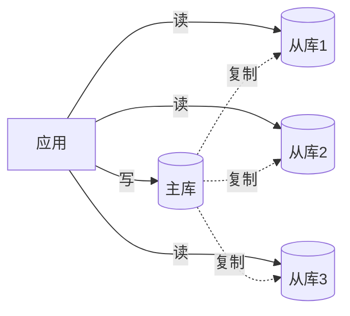
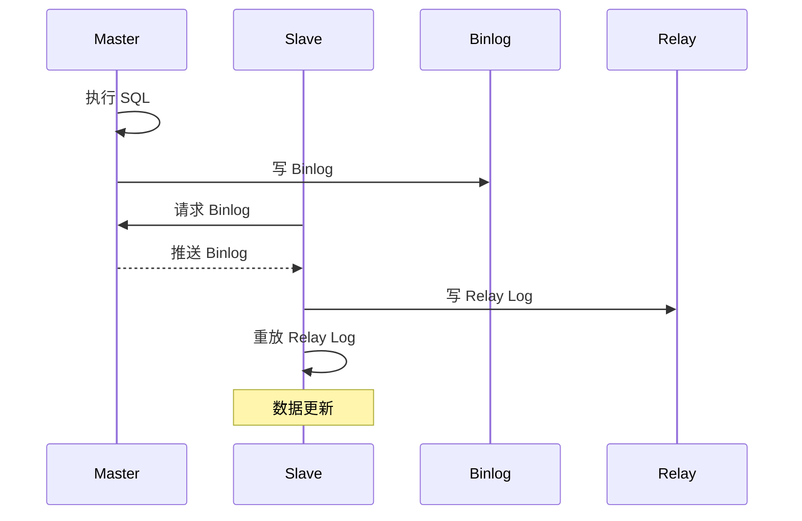
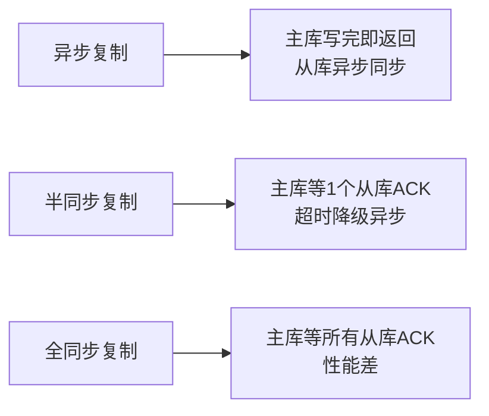
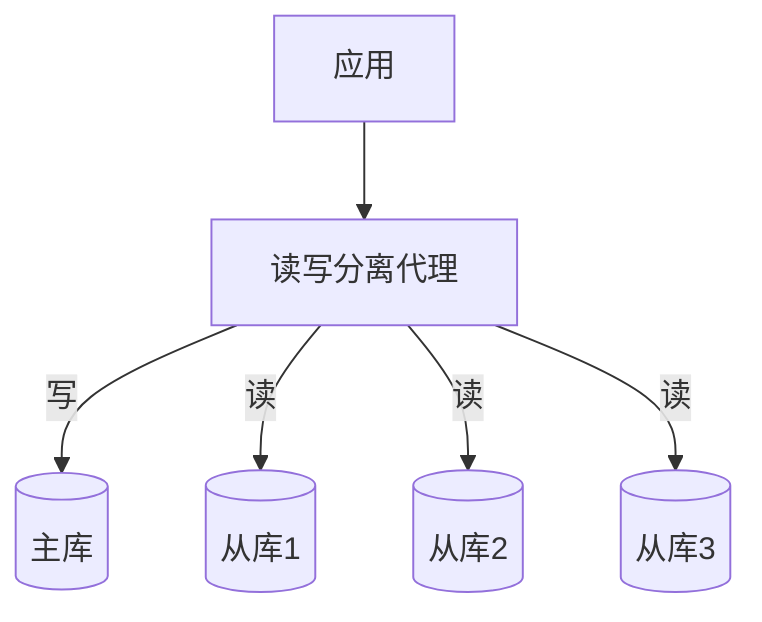
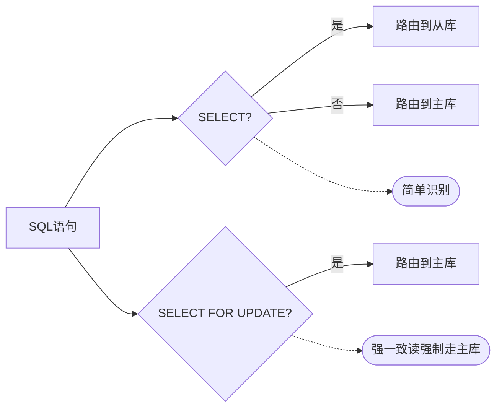
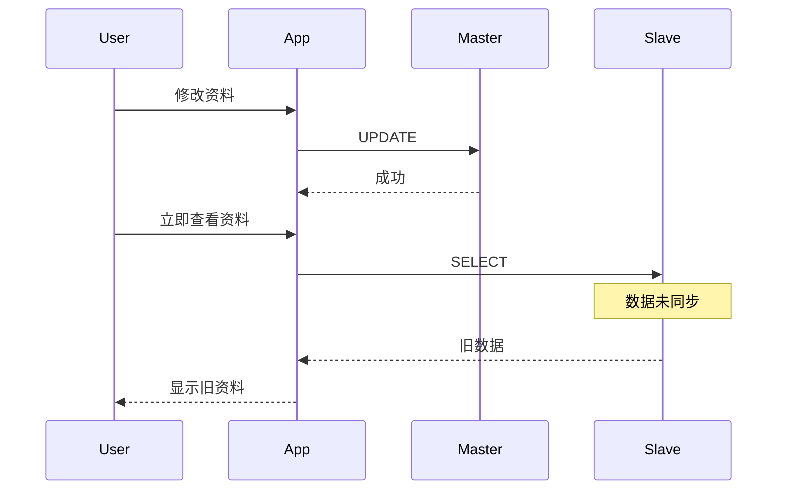
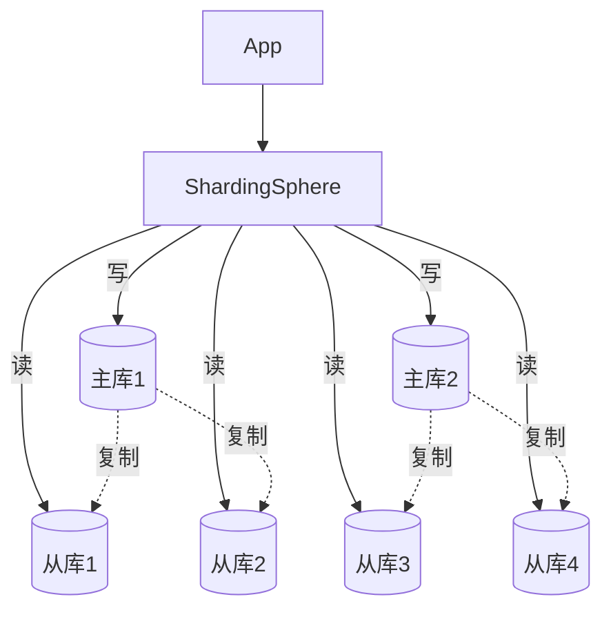

# 读写分离方案

> 读写分离是数据库扩展的基础方案，通过主从复制将读写流量分离，提升数据库并发处理能力。

## 目录

- [一、原理与价值](#一原理与价值)
- [二、主从复制原理](#二主从复制原理)
- [三、读写分离架构](#三读写分离架构)
- [四、主从延迟问题](#四主从延迟问题)
- [五、工程实现](#五工程实现)
- [六、相关资料](#六相关资料)

## 一、原理与价值

### 1.1 核心思想



### 1.2 价值

| 价值 | 说明 |
|------|------|
| 提升读性能 | 多从库并行读 |
| 提升写性能 | 主库专注写 |
| 读写隔离 | 读不影响写 |
| 故障切换 | 主库故障可切从库 |
| 报表分析 | 读库承担分析查询 |

## 二、主从复制原理

### 2.1 MySQL 主从复制流程



### 2.2 三种复制方式

| 方式 | 说明 | 一致性 | 性能 |
|------|------|--------|------|
| **异步复制** | 主库不等待从库 ACK | 弱 | 高 |
| **半同步复制** | 主库等至少一个从库 ACK | 中 | 中 |
| **全同步复制** | 主库等所有从库 ACK | 强 | 低 |



### 2.3 复制线程

| 线程 | 位置 | 职责 |
|------|------|------|
| Binlog Dump | 主库 | 推送 Binlog 给从库 |
| IO Thread | 从库 | 接收 Binlog 写 Relay Log |
| SQL Thread | 从库 | 重放 Relay Log |

## 三、读写分离架构

### 3.1 基础架构



### 3.2 实现方式

| 方式 | 说明 | 优点 | 缺点 |
|------|------|------|------|
| **代码层** | 应用内配置多数据源 | 灵活、性能好 | 业务侵入 |
| **中间件** | Proxy 透明转发 | 业务无感 | 增加网络跳数 |
| **驱动层** | JDBC 驱动内置 | 性能好 | 语言绑定 |

### 3.3 读写识别



## 四、主从延迟问题

### 4.1 延迟原因

| 原因 | 说明 |
|------|------|
| 单线程重放 | MySQL 5.6 之前从库单线程重放 |
| 大事务 | 主库一个大事务，从库重放慢 |
| 网络延迟 | 跨机房复制 |
| 从库负载 | 从库承担大查询拖慢重放 |

### 4.2 延迟危害



### 4.3 解决方案

#### 方案 1：强制读主库

```python
def update_and_read(user_id, data):
    db.master.update("UPDATE users SET ... WHERE id = ?", user_id)
    # 强制读主库
    return db.master.query("SELECT * FROM users WHERE id = ?", user_id)
```

#### 方案 2：会话粘性

```python
def update_and_read(user_id, data):
    db.master.update("UPDATE users SET ... WHERE id = ?", user_id)
    # 同会话内一段时间内读主库
    session['last_write_time'] = time.time()
    return db.master.query("SELECT * FROM users WHERE id = ?", user_id)

def read_user(user_id):
    # 检查是否在写入后窗口期内
    if session.get('last_write_time') and time.time() - session['last_write_time'] < 3:
        return db.master.query("SELECT * FROM users WHERE id = ?", user_id)
    return db.slave.query("SELECT * FROM users WHERE id = ?", user_id)
```

#### 方案 3：GTID 等待

```python
def update_and_read(user_id, data):
    # 获取主库 GTID
    gtid = db.master.update_returning_gtid("UPDATE users SET ... WHERE id = ?", user_id)
    # 从库等待 GTID 同步
    db.slave.wait_for_gtid(gtid, timeout=3)
    return db.slave.query("SELECT * FROM users WHERE id = ?", user_id)
```

#### 方案 4：半同步复制

降低延迟到毫秒级，配合业务可接受。

#### 方案 5：业务设计避免

- 写后跳转页面，不立即显示新数据
- 重要查询使用主库
- 关键业务避免读写分离

### 4.4 多线程复制

MySQL 5.7+ 支持并行复制（基于组提交）：

```sql
-- 从库配置
slave_parallel_type = LOGICAL_CLOCK
slave_parallel_workers = 8
```

## 五、工程实现

### 5.1 ShardingSphere 读写分离

```yaml
rules:
- !READWRITE_SPLITTING
  dataSources:
    readwrite_ds:
      writeDataSourceName: write_ds
      readDataSourceNames:
        - read_ds_0
        - read_ds_1
      transactionalReadQueryStrategy: PRIMARY
      loadBalancerName: round_robin
  loadBalancers:
    round_robin:
      type: ROUND_ROBIN
```

### 5.2 Spring 多数据源

```java
@Configuration
public class DataSourceConfig {

    @Bean("masterDataSource")
    @ConfigurationProperties(prefix = "spring.datasource.master")
    public DataSource masterDataSource() {
        return DataSourceBuilder.create().build();
    }

    @Bean("slaveDataSources")
    public List<DataSource> slaveDataSources(
            @Value("${slaves.url}") List<String> urls) {
        return urls.stream()
            .map(url -> createSlaveDataSource(url))
            .collect(Collectors.toList());
    }

    @Bean
    @Primary
    public RoutingDataSource routingDataSource(
            @Qualifier("masterDataSource") DataSource master,
            @Qualifier("slaveDataSources") List<DataSource> slaves) {
        RoutingDataSource routing = new RoutingDataSource();
        routing.setDefaultTargetDataSource(master);
        Map<Object, Object> target = new HashMap<>();
        target.put("master", master);
        for (int i = 0; i < slaves.size(); i++) {
            target.put("slave_" + i, slaves.get(i));
        }
        routing.setTargetDataSources(target);
        return routing;
    }
}

public class RoutingDataSource extends AbstractRoutingDataSource {
    @Override
    protected Object determineCurrentLookupKey() {
        if (TransactionSynchronizationManager.isActualTransactionActive()) {
            // 事务内走主库
            return "master";
        }
        // 简单轮询从库
        return "slave_" + ThreadLocalRandom.current().nextInt(SLAVE_COUNT);
    }
}
```

### 5.3 读写分离 + 分库分表



## 六、相关资料

- [MySQL 主从复制官方文档](https://dev.mysql.com/doc/refman/8.0/en/replication.html)
- [ShardingSphere 读写分离](https://shardingsphere.apache.org/document/5.1.2/en/features/readwrite-splitting/)
- [MySQL 半同步复制](https://dev.mysql.com/doc/refman/8.0/en/replication-semisync.html)
