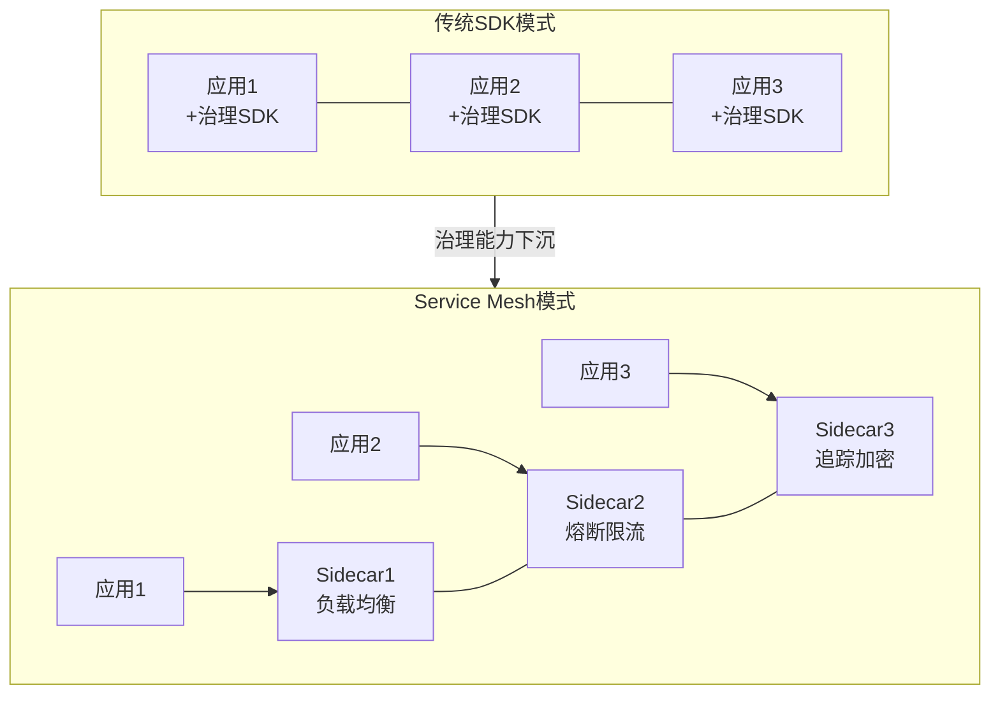
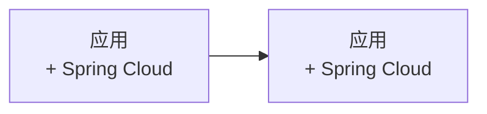
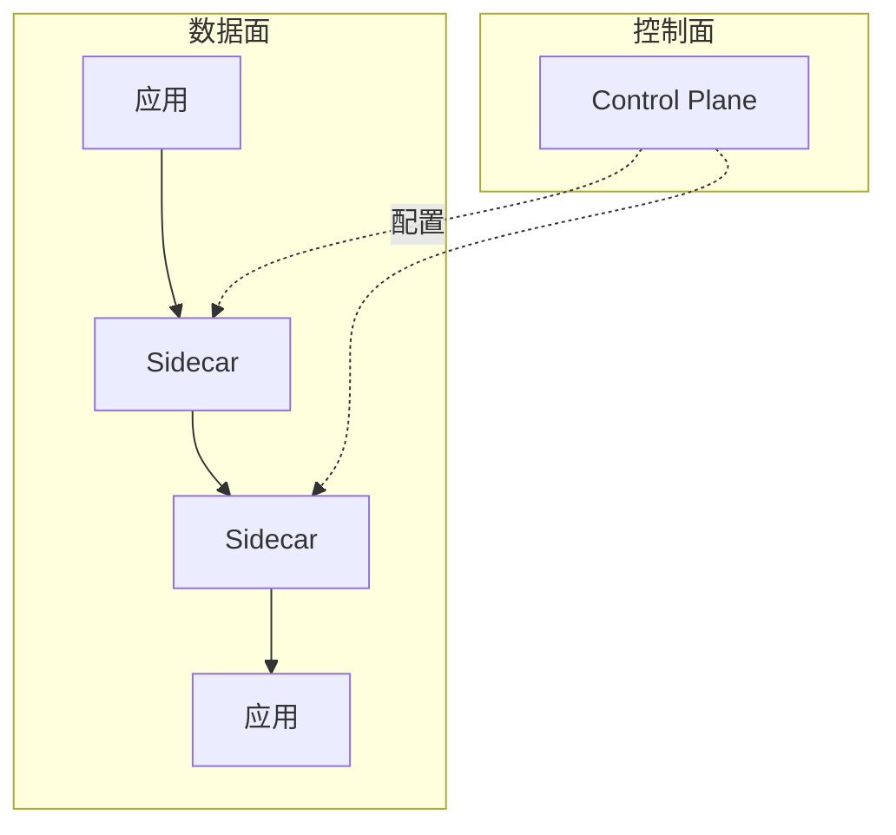
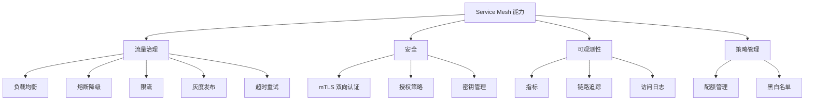
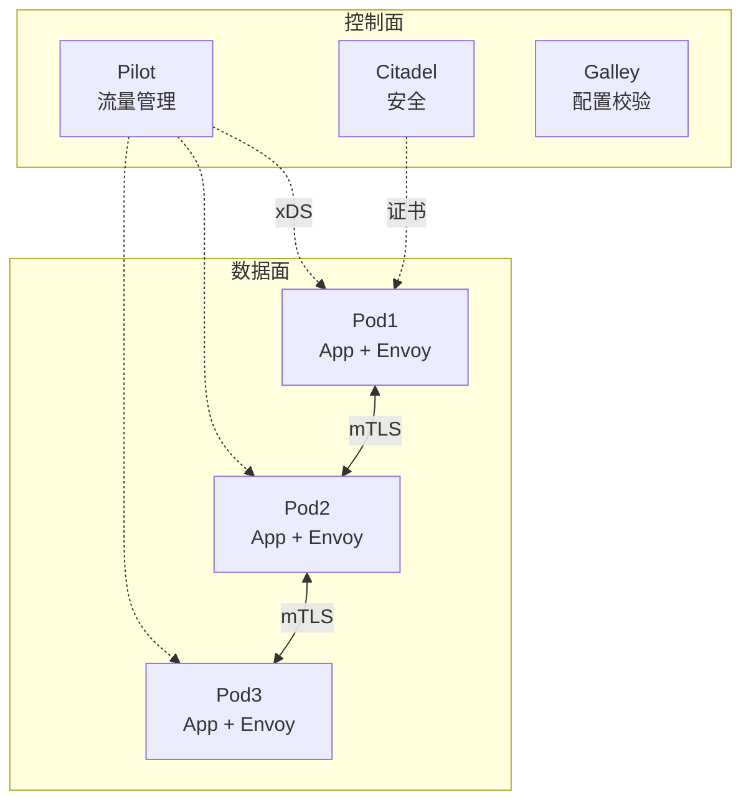
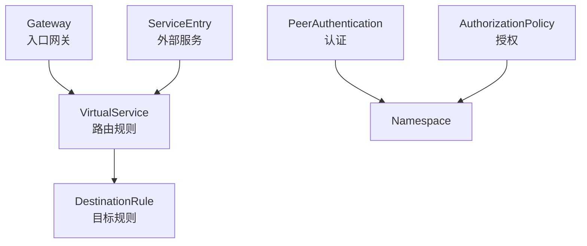
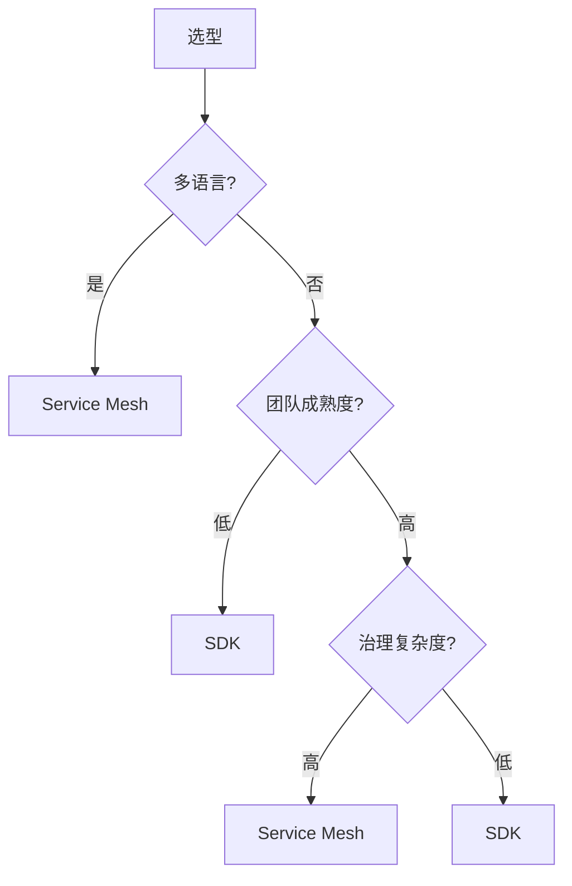

# Service Mesh 服务网格

> Service Mesh 是云原生架构中服务间通信的基础设施层，通过 Sidecar 代理将服务治理能力从应用代码中解耦，让开发者专注业务逻辑。

## 目录

- [一、Service Mesh 概述](#一service-mesh-概述)
- [二、架构演进](#二架构演进)
- [三、Sidecar 模式](#三sidecar-模式)
- [四、核心能力](#四核心能力)
- [五、Istio 架构](#五istio-架构)
- [六、对比与选型](#六对比与选型)
- [七、相关资料](#七相关资料)

## 一、Service Mesh 概述

### 1.1 定义

> A service mesh is a dedicated infrastructure layer for facilitating service-to-service communications between services or microservices, using a proxy.

服务网格是一个**专用基础设施层**，通过代理处理服务间通信。

### 1.2 核心思想

将服务治理能力（负载均衡、熔断、限流、追踪、加密等）从应用代码下沉到 Sidecar 代理：



## 二、架构演进

### 2.1 第一代：SDK 模式



问题：
- 多语言需各自实现
- 治理逻辑侵入业务
- 升级需重新部署应用

### 2.2 第二代：Sidecar 模式


优势：
- 应用无感知
- 多语言统一
- 独立升级

### 2.3 第三代：Service Mesh



控制面统一管理数据面，提供服务治理能力。

## 三、Sidecar 模式

### 3.1 工作原理

```mermaid
flowchart LR
    subgraph Pod
        App[应用容器<br/>127.0.0.1:8080]
        Proxy[Sidecar 容器<br/>15001]
        Note over App,Proxy: 共享网络命名空间
    end
    In[入站流量] --> Proxy
    Proxy --> App
    App --> Proxy
    Proxy --> Out[出站流量]
```

应用所有出入流量都经过 Sidecar。

### 3.2 流量劫持

#### 方式 1：iptables 重定向

```bash
# 所有出站流量重定向到 Sidecar
iptables -t nat -A OUTPUT -p tcp --dport 80 -j REDIRECT --to-port 15001
```

#### 方式 2：eBPF（Cilium）

性能更好，无需 iptables。

### 3.3 应用感知

应用以为自己在直连目标服务，实际上是 Sidecar 在转发：

```python
# 应用代码不变
import requests
response = requests.get('http://order-service/api/orders')
# 实际经过 Sidecar，由 Sidecar 做负载均衡、熔断等
```

## 四、核心能力



### 4.1 流量治理

#### 灰度发布（金丝雀）

```yaml
# Istio VirtualService - 10% 流量到 v2
apiVersion: networking.istio.io/v1beta1
kind: VirtualService
metadata:
  name: order-service
spec:
  hosts: [order-service]
  http:
  - route:
    - destination:
        host: order-service
        subset: v1
      weight: 90
    - destination:
        host: order-service
        subset: v2
      weight: 10
```

#### 熔断

```yaml
apiVersion: networking.istio.io/v1beta1
kind: DestinationRule
metadata:
  name: order-service
spec:
  host: order-service
  trafficPolicy:
    outlierDetection:
      consecutive5xxErrors: 5
      interval: 10s
      baseEjectionTime: 30s
      maxEjectionPercent: 50
```

#### 超时重试

```yaml
apiVersion: networking.istio.io/v1beta1
kind: VirtualService
metadata:
  name: order-service
spec:
  hosts: [order-service]
  http:
  - timeout: 5s
    retries:
      attempts: 3
      perTryTimeout: 2s
      retryOn: 5xx,reset,connect-failure
    route:
    - destination:
        host: order-service
```

### 4.2 安全

#### mTLS 双向认证

```mermaid
flowchart LR
    App1[应用1] --> S1[Sidecar]
    S1 -->|mTLS 加密| S2[Sidecar]
    S2 --> App2[应用2]
    Note over S1,S2: 自动双向认证与加密
```

```yaml
# Istio PeerAuthentication - 全局 mTLS
apiVersion: security.istio.io/v1beta1
kind: PeerAuthentication
metadata:
  name: default
  namespace: istio-system
spec:
  mtls:
    mode: STRICT
```

### 4.3 可观测性

Service Mesh 自动生成：
- 黄金信号：请求数、错误数、延迟、饱和度
- 分布式追踪：自动注入 trace header
- 访问日志：每次请求详细记录

## 五、Istio 架构

### 5.1 整体架构



### 5.2 控制面组件

| 组件 | 职责 |
|------|------|
| **Pilot** | 流量管理、配置分发（xDS 协议） |
| **Citadel** | 证书管理、密钥轮转 |
| **Galley** | 配置校验与分发 |
| **Istiod**（1.5+） | 上述合并为单二进制 |

### 5.3 数据面：Envoy

C++ 编写的高性能代理：
- L7 代理（HTTP、gRPC）
- L4 代理（TCP）
- 动态配置（xDS）
- 多协议支持

### 5.4 核心资源模型



## 六、对比与选型

### 6.1 主流 Service Mesh

| 项目 | 数据面 | 控制面 | 特点 |
|------|--------|--------|------|
| **Istio** | Envoy | Istiod | 功能最全、复杂 |
| **Linkerd** | Linkerd2-proxy | Rust | 轻量、易用 |
| **Consul Connect** | Envoy/内置 | Consul | HashiCorp 生态 |
| **Kuma** | Envoy | 控制面 | 多集群 |
| **Open Service Mesh** | Envoy | OSM | 微软开源 |

### 6.2 Istio vs Linkerd

| 维度 | Istio | Linkerd |
|------|-------|---------|
| 功能 | 完整 | 核心 |
| 复杂度 | 高 | 低 |
| 资源占用 | 高 | 低 |
| 性能损耗 | 中（10-30%） | 低（<10%） |
| 学习曲线 | 陡峭 | 平缓 |
| 适用 | 大型复杂场景 | 中小型 |

### 6.3 SDK vs Service Mesh



| 维度 | SDK | Service Mesh |
|------|-----|--------------|
| 业务侵入 | 高 | 无 |
| 多语言 | 难 | 友好 |
| 性能损耗 | 低 | 中 |
| 升级 | 重部署 | 独立 |
| 学习成本 | 低 | 高 |

## 七、Service Mesh 陷阱

### 7.1 性能损耗

```mermaid
flowchart LR
    A[应用1] --> B[Sidecar1]
    B --> C[Sidecar2]
    C --> D[应用2]
    Note over B,C: 增加两次跳转<br/>增加 1-3ms 延迟
```

### 7.2 复杂度

- 排查问题更难（多一跳代理）
- 配置项极多
- 学习曲线陡峭

### 7.3 不适合场景

- 小规模微服务（<10 个）
- 性能极致要求
- 无 K8s 基础
- 团队无专职运维

## 八、相关资料

- [Istio 官方文档](https://istio.io/latest/docs/)
- [Linkerd 官方文档](https://linkerd.io/)
- [Envoy 官方文档](https://www.envoyproxy.io/)
- 《Service Mesh 实战》
- [Pattern: Service Mesh](https://philcalcino.com/pattern-service-mesh/)
- [Sidecar Pattern](https://learn.microsoft.com/en-us/azure/architecture/patterns/sidecar)
