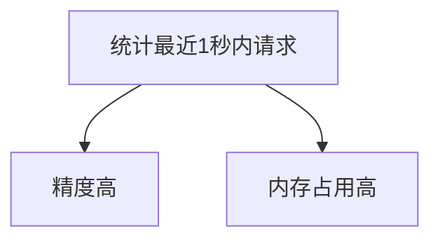
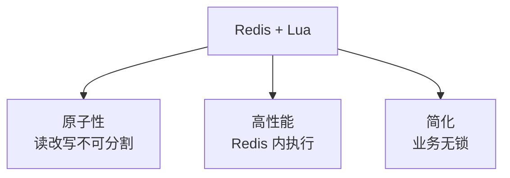
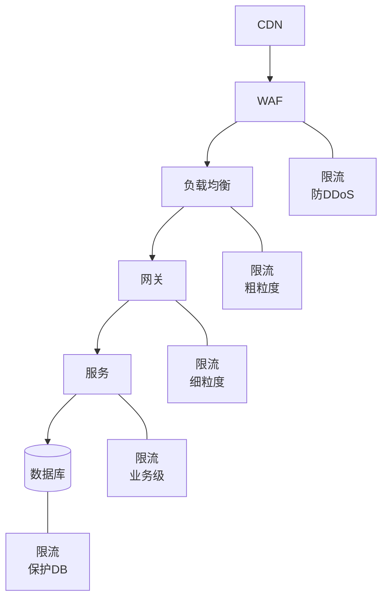
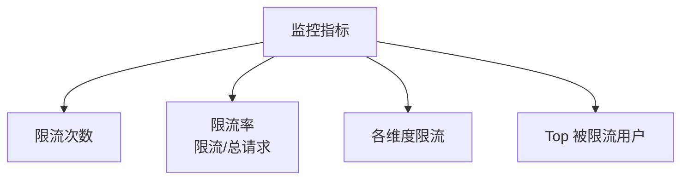

# 分布式限流方案

> 单机限流无法应对集群场景，分布式限流统一管控全局流量。本文梳理主流分布式限流算法与实现方案。

## 目录

- [一、为什么需要分布式限流](#一为什么需要分布式限流)
- [二、限流算法](#二限流算法)
- [三、Redis + Lua 分布式限流](#三redis--lua-分布式限流)
- [四、网关层限流](#四网关层限流)
- [五、限流位置](#五限流位置)
- [六、限流策略](#六限流策略)
- [七、相关资料](#七相关资料)

## 一、为什么需要分布式限流

### 1.1 单机限流的局限

```mermaid
flowchart TD
    LB[负载均衡] --> S1[服务1<br/>限流100/s]
    LB --> S2[服务2<br/>限流100/s]
    LB --> S3[服务3<br/>限流100/s]
    Note over S1,S3: 单机各100 全局300
    Note over LB: 业务期望全局100
```

单机限流：每个实例各自限流，无法控制全局总量。

### 1.2 分布式限流价值

```mermaid
flowchart TD
    LB[负载均衡] --> S1[服务1]
    LB --> S2[服务2]
    LB --> S3[服务3]
    S1 & S2 & S3 --> Redis[(Redis<br/>全局计数)]
    Note over Redis: 全局统一限流
```

## 二、限流算法

### 2.1 固定窗口

```mermaid
flowchart TD
    A[0-1秒: 100个] --> B[1-2秒: 0个]
    B --> C[2-3秒: 100个]
    Note over A,C: 每秒100 临界突刺
```

```python
def fixed_window_limit(key, limit=100, window=1):
    """固定窗口限流"""
    current = int(time.time() / window)
    counter_key = f"rate:{key}:{current}"
    count = redis.incr(counter_key)
    if count == 1:
        redis.expire(counter_key, window)
    return count <= limit
```

缺点：临界点可能 2 倍流量。

### 2.2 滑动窗口



```python
def sliding_window_limit(key, limit=100, window=1):
    """滑动窗口限流（Sorted Set）"""
    now = time.time()
    pipe = redis.pipeline()
    pipe.zremrangebyscore(key, 0, now - window)  # 移除窗口外
    pipe.zadd(key, {now: now})  # 添加当前请求
    pipe.zcard(key)  # 统计当前窗口请求数
    pipe.expire(key, window)
    _, _, count, _ = pipe.execute()
    return count <= limit
```

### 2.3 令牌桶

```mermaid
flowchart LR
    A[令牌桶<br/>容量100] -->|每秒100个令牌| B[请求]
    B -->|有令牌| C[通过]
    B -->|无令牌| D[拒绝]
    Note over A: 允许突发
```

```python
def token_bucket_limit(key, capacity=100, rate=100):
    """令牌桶限流"""
    now = time.time()
    last_key = f"tb:{key}:last"
    tokens_key = f"tb:{key}:tokens"

    # Lua 保证原子性
    script = """
    local capacity = tonumber(ARGV[1])
    local rate = tonumber(ARGV[2])
    local now = tonumber(ARGV[3])

    local last = tonumber(redis.call('GET', KEYS[1]) or now)
    local tokens = tonumber(redis.call('GET', KEYS[2]) or capacity)

    -- 添加这段时间产生的令牌
    local delta = math.max(0, now - last)
    tokens = math.min(capacity, tokens + delta * rate)

    if tokens < 1 then
        return 0  -- 拒绝
    end

    tokens = tokens - 1
    redis.call('SET', KEYS[1], now)
    redis.call('SET', KEYS[2], tokens)
    return 1  -- 通过
    """

    return redis.eval(script, 2, last_key, tokens_key,
                     capacity, rate, now)
```

特点：
- 允许突发流量
- 适合大多数场景
- 主流网关采用

### 2.4 漏桶

```mermaid
flowchart LR
    A[请求] --> B[漏桶]
    B -->|恒定速率出| C[处理]
    Note over B: 流量整形
```

特点：
- 出口速率恒定
- 平滑流量
- 不允许突发

### 2.5 算法对比

| 算法 | 优点 | 缺点 | 适用 |
|------|------|------|------|
| 固定窗口 | 简单 | 临界突刺 | 粗略限流 |
| 滑动窗口 | 精确 | 内存高 | 精确限流 |
| 令牌桶 | 允许突发 | 实现复杂 | API 网关 |
| 漏桶 | 平滑 | 不允许突发 | 流量整形 |

## 三、Redis + Lua 分布式限流

### 3.1 为什么用 Lua



### 3.2 完整实现

```python
import redis
import time

class DistributedRateLimiter:
    def __init__(self, redis_client):
        self.redis = redis_client
        self.lua_script = """
        local key = KEYS[1]
        local limit = tonumber(ARGV[1])
        local window = tonumber(ARGV[2])

        local current = redis.call('INCR', key)
        if current == 1 then
            redis.call('EXPIRE', key, window)
        end

        if current > limit then
            return 0
        end
        return 1
        """

    def allow(self, key, limit=100, window=1):
        """是否允许通过"""
        result = self.redis.eval(self.lua_script, 1, key, limit, window)
        return result == 1
```

### 3.3 多维度限流

```python
def multi_dimension_limit(user_id, api):
    """多维度限流"""
    # 用户级：每用户每秒100次
    if not limiter.allow(f"user:{user_id}", limit=100):
        return False

    # API 级：每API每秒1万次
    if not limiter.allow(f"api:{api}", limit=10000):
        return False

    # 全局：总QPS 10万
    if not limiter.allow("global", limit=100000):
        return False

    return True
```

### 3.4 Redis 集群限流

Redis Cluster 中 key 分布在不同节点：

```mermaid
flowchart TD
    A[限流 key] -->|Hash Tag| B[同一 slot]
    Note over B: {user:100}:api → 同一 slot
```

```python
# 用 Hash Tag 让相关 key 落同一节点
key = f"{{user:{user_id}}}:api:{api}"
```

## 四、网关层限流

### 4.1 Kong 限流

```yaml
plugins:
- name: rate-limiting
  config:
    minute: 1000
    hour: 10000
    policy: redis
    redis_host: redis
    fault_tolerant: true
```

### 4.2 Spring Cloud Gateway

```yaml
spring:
  cloud:
    gateway:
      routes:
      - id: order
        uri: lb://order-service
        filters:
        - name: RequestRateLimiter
          args:
            redis-rate-limiter.replenishRate: 100  # 令牌生成速率
            redis-rate-limiter.burstCapacity: 1000  # 桶容量
            key-resolver: "#{@userKeyResolver}"
```

```java
@Bean
public KeyResolver userKeyResolver() {
    return exchange -> Mono.just(
        exchange.getRequest().getHeaders().getFirst("user-id")
    );
}
```

### 4.3 APISIX 限流

```json
{
  "plugins": {
    "limit-req": {
      "rate": 100,
      "burst": 50,
      "rejected_code": 429,
      "key_type": "var",
      "key": "remote_addr"
    },
    "limit-count": {
      "count": 1000,
      "time_window": 60,
      "rejected_code": 429,
      "key": "http_x_user_id"
    }
  }
}
```

### 4.4 Nginx 限流

```nginx
# 按IP限流
limit_req_zone $binary_remote_addr zone=ip_limit:10m rate=10r/s;

server {
    location /api/ {
        limit_req zone=ip_limit burst=20 nodelay;
        proxy_pass http://backend;
    }
}
```

## 五、限流位置



### 5.1 各层限流特点

| 层级 | 限流维度 | 优点 | 缺点 |
|------|---------|------|------|
| CDN | IP | 早拦截 | 信息少 |
| WAF | IP/UA | 安全为主 | 业务无关 |
| LB | IP | 高性能 | 粗粒度 |
| 网关 | 用户/API | 灵活 | 单点 |
| 服务 | 业务 | 精确 | 性能影响 |
| DB | 连接数 | 兜底 | 治标 |

## 六、限流策略

### 6.1 按用户限流

```python
def check_user_limit(user_id):
    # 普通用户：100/秒
    # VIP：1000/秒
    # 企业：10000/秒
    tier = get_user_tier(user_id)
    limit = {
        'normal': 100,
        'vip': 1000,
        'enterprise': 10000
    }[tier]
    return limiter.allow(f"user:{user_id}", limit=limit)
```

### 6.2 按 API 限流

```python
def check_api_limit(api_path):
    # 核心API：高配额
    # 非核心：低配额
    limits = {
        '/api/orders': 10000,
        '/api/search': 1000,
        '/api/export': 10
    }
    limit = limits.get(api_path, 100)
    return limiter.allow(f"api:{api_path}", limit=limit)
```

### 6.3 时间维度限流

```python
def check_time_limit(user_id):
    hour = datetime.now().hour
    # 工作时间：1000/秒
    # 非工作时间：100/秒
    if 9 <= hour < 22:
        return limiter.allow(f"user:{user_id}", limit=1000)
    else:
        return limiter.allow(f"user:{user_id}", limit=100)
```

## 七、限流响应

### 7.1 标准 429 响应

```http
HTTP/1.1 429 Too Many Requests
Content-Type: application/json
Retry-After: 60
X-RateLimit-Limit: 100
X-RateLimit-Remaining: 0
X-RateLimit-Reset: 1609459200

{
  "error": "Rate limit exceeded",
  "retry_after": 60
}
```

### 7.2 降级策略

```python
def handle_rate_limit_exceeded(request):
    # 1. 返回降级数据
    if request.path == '/api/recommend':
        return get_default_recommendations()

    # 2. 返回缓存
    cached = cache.get(request.cache_key)
    if cached:
        return cached

    # 3. 排队等待（短时间）
    if request.can_wait:
        return queue_and_wait(request)

    # 4. 直接拒绝
    return error_response(429)
```

## 八、监控与告警

### 8.1 限流监控指标



### 8.2 告警规则

```yaml
# Prometheus 告警
- alert: HighRateLimitRejection
  expr: |
    rate(rate_limit_rejected_total[5m])
    /
    rate(http_requests_total[5m]) > 0.1
  for: 5m
  labels:
    severity: warning
  annotations:
    summary: "限流率超过10%"
```

## 九、最佳实践

### 9.1 多层防护

```mermaid
flowchart TD
    A[请求] --> B[网关限流<br/>粗粒度]
    B --> C[业务限流<br/>细粒度]
    C --> D[资源限流<br/>连接池]
    Note over A,D: 多层兜底
```

### 9.2 客户端配合

```http
# 响应头告诉客户端
X-RateLimit-Limit: 100
X-RateLimit-Remaining: 99
X-RateLimit-Reset: 60
Retry-After: 60
```

客户端应：
- 指数退避重试
- 缓存减少请求
- 遵守 Retry-After

### 9.3 动态调整

```python
def get_dynamic_limit(user_id):
    """根据系统负载动态调整限流"""
    load = get_system_load()
    base_limit = get_user_limit(user_id)

    if load > 0.8:  # 高负载
        return int(base_limit * 0.5)
    elif load > 0.5:
        return int(base_limit * 0.8)
    return base_limit
```

## 十、相关资料

- [Redis 限流](https://redis.io/commands/INCR/)
- [Kong Rate Limiting](https://docs.konghq.com/hub/kong-inc/rate-limiting/)
- [Spring Cloud Gateway RateLimiter](https://docs.spring.io/spring-cloud-gateway/docs/current/reference/html/#the-requestratelimiter-gatewayfilter-factory)
- [APISIX 限流插件](https://apisix.apache.org/docs/apisix/plugins/limit-req/)
- [Token Bucket Algorithm](https://en.wikipedia.org/wiki/Token_bucket)
- [Sentinel - 阿里限流组件](https://github.com/alibaba/Sentinel)
