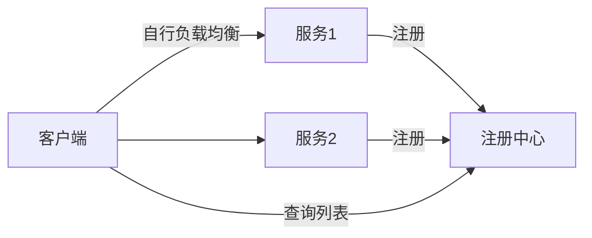
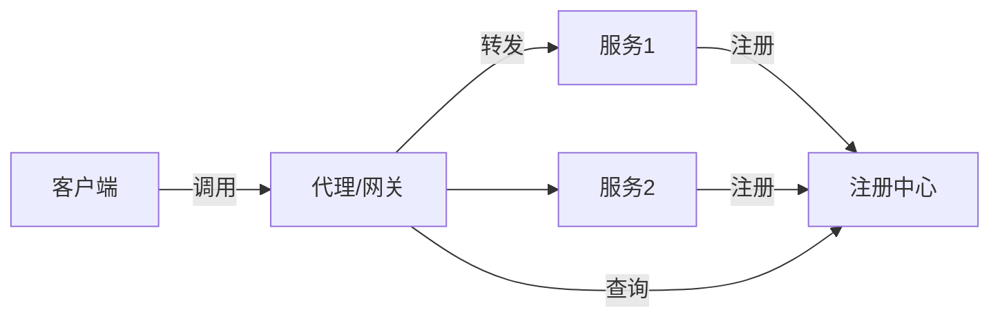
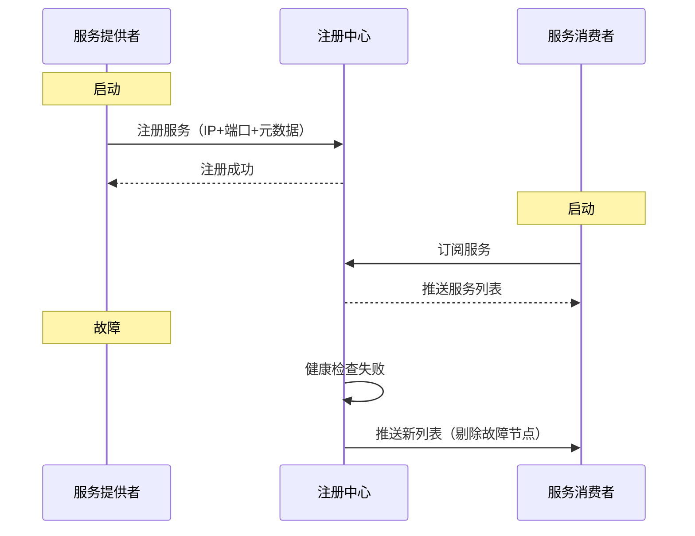
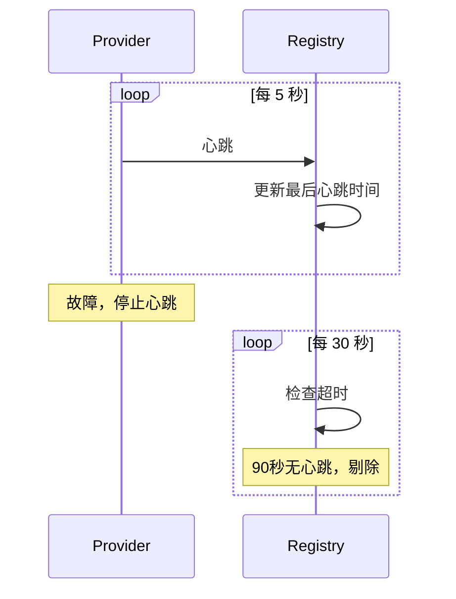
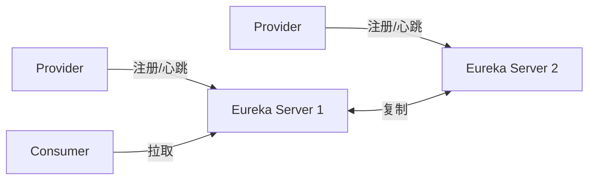
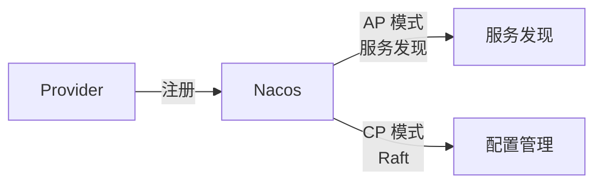
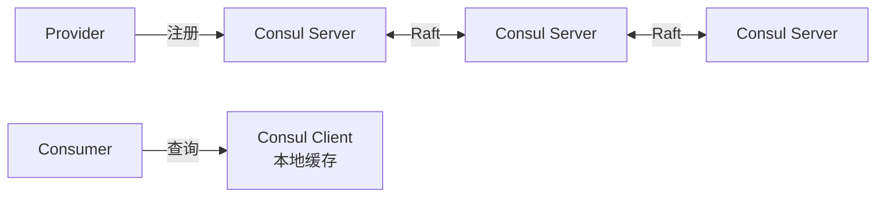
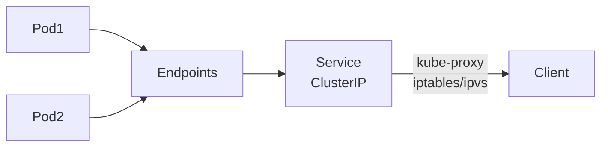
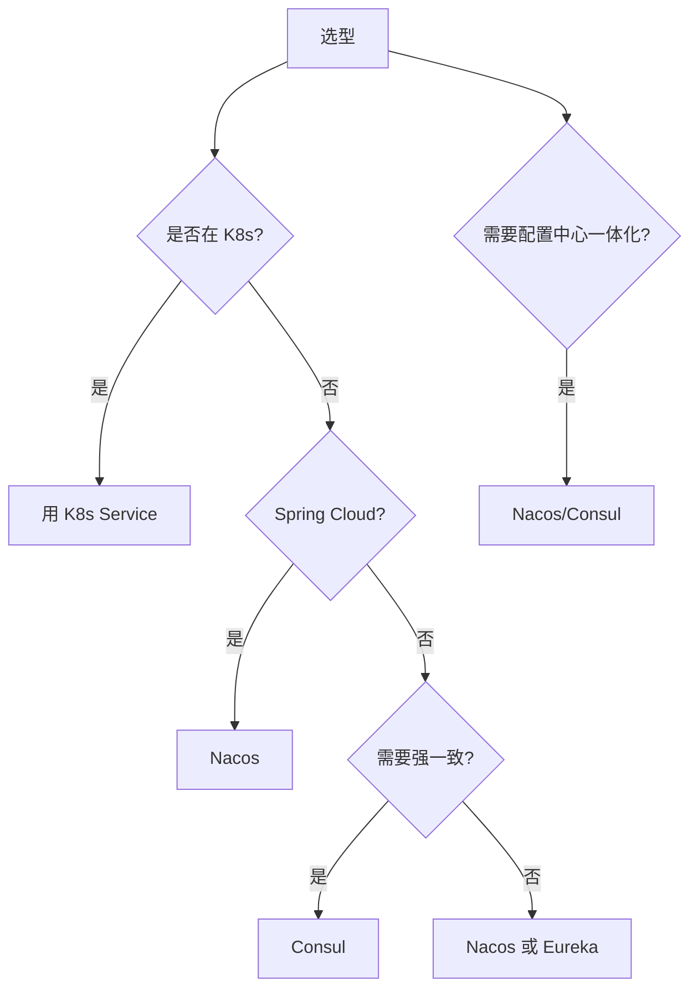

# 服务注册与发现

> 服务注册与发现是微服务架构的基础设施，让服务能动态感知其他服务地址变化，实现负载均衡与故障转移。

## 目录

- [一、为什么需要服务发现](#一为什么需要服务发现)
- [二、核心模式](#二核心模式)
- [三、工作流程](#三工作流程)
- [四、健康检查](#四健康检查)
- [五、主流方案](#五主流方案)
- [六、对比与选型](#六对比与选型)
- [七、相关资料](#七相关资料)

## 一、为什么需要服务发现

### 1.1 传统方式问题

```mermaid
flowchart LR
    App[应用] -->|硬编码| S1[192.168.1.10:8080]
    App -->|硬编码| S2[192.168.1.11:8080]
    Note over S1,S2: 节点变更需改代码配置
```

问题：
- 服务地址变更需重新部署
- 无法动态扩缩容
- 故障节点无法自动剔除
- 负载均衡难以动态调整

### 1.2 服务发现价值

```mermaid
flowchart LR
    App[应用] -->|查询| Reg[注册中心]
    Reg -.->|返回列表| App
    App -->|调用| S1[服务1]
    App -->|调用| S2[服务2]
    App -->|调用| S3[服务3]
    Note over S1,S3: 动态变化
```

## 二、核心模式

### 2.1 客户端发现



| 优点 | 缺点 |
|------|------|
| 无中间层，性能好 | 客户端逻辑复杂 |
| 直接连接 | 多语言需各自实现 |

代表：Eureka、Nacos

### 2.2 服务端发现



| 优点 | 缺点 |
|------|------|
| 客户端简单 | 多一跳网络 |
| 多语言友好 | 代理是单点 |
| 统一治理 | 性能损耗 |

代表：Kubernetes Service + kube-proxy、Istio Envoy

## 三、工作流程

### 3.1 完整流程



### 3.2 服务注册信息

```json
{
  "serviceName": "order-service",
  "instances": [
    {
      "instanceId": "order-001",
      "ip": "10.0.1.10",
      "port": 8080,
      "weight": 100,
      "metadata": {
        "version": "v2",
        "region": "us-east-1",
        "tags": ["canary"]
      },
      "healthy": true
    }
  ]
}
```

## 四、健康检查

### 4.1 检查方式

| 方式 | 说明 | 代表 |
|------|------|------|
| **客户端心跳** | 服务定期发心跳 | Eureka、Nacos |
| **服务端探测** | 注册中心主动探测 | Consul、K8s |
| **应用层健康** | 调用 /health 接口 | K8s Liveness |

### 4.2 心跳模式



### 4.3 K8s 健康检查

```yaml
apiVersion: apps/v1
kind: Deployment
spec:
  template:
    spec:
      containers:
      - name: app
        livenessProbe:        # 存活探针
          httpGet:
            path: /health
            port: 8080
          initialDelaySeconds: 30
          periodSeconds: 10
        readinessProbe:       # 就绪探针
          httpGet:
            path: /ready
            port: 8080
          initialDelaySeconds: 5
          periodSeconds: 5
```

| 探针 | 作用 |
|------|------|
| **livenessProbe** | 失败则重启容器 |
| **readinessProbe** | 失败则从 Service Endpoints 剔除 |
| **startupProbe** | 启动探针，启动前不检查其他 |

## 五、主流方案

### 5.1 Eureka

Netflix 开源，AP 模式。



特点：
- AP 模式，最终一致
- 客户端发现
- 自我保护机制（85% 心跳丢失时停止剔除）
- 已停止维护 2.x

### 5.2 Nacos

阿里开源，支持 AP 与 CP 切换。



特点：
- 同时支持服务发现与配置中心
- AP（默认）与 CP 可切换
- 支持权重、健康检查
- Spring Cloud 集成友好

### 5.3 Consul

HashiCorp 开源，CP 模式。



特点：
- CP 模式（Raft）
- 服务端探测健康
- 支持 KV 存储
- 多数据中心

### 5.4 Kubernetes Service



特点：
- 基于标签选择器
- 服务端发现（kube-proxy）
- 自动负载均衡
- DNS 集成

### 5.5 Zookeeper

```mermaid
flowchart LR
    P[Provider] -->|创建临时节点| Z[Zookeeper]
    Z <-->|Zab| Z2[Zookeeper]
    C[Consumer] -->|监听节点| Z
    Note over Z: 临时节点会话失效自动删除
```

特点：
- CP 模式
- 强一致
- 适合强一致场景
- 服务发现非其设计初衷

## 六、对比与选型

### 6.1 综合对比

| 维度 | Eureka | Nacos | Consul | K8s | Zookeeper |
|------|--------|-------|--------|-----|-----------|
| CAP | AP | AP/CP | CP | - | CP |
| 一致性 | 最终 | 可选 | 强 | - | 强 |
| 健康检查 | 心跳 | 心跳+TCP+HTTP | 主动探测 | Probe | 会话 |
| 多数据中心 | ✗ | ✓ | ✓ | ✓ | ✗ |
| 配置中心 | ✗ | ✓ | ✓ | ConfigMap | ✓ |
| 语言 | Java | Java | Go | Go | Java |
| 维护 | 停止 | 活跃 | 活跃 | 活跃 | 活跃 |

### 6.2 选型决策



### 6.3 服务网格时代

Service Mesh（如 Istio）下，服务发现下沉到 sidecar：

```mermaid
flowchart LR
    App1[应用1] --> Sidecar1[Envoy]
    Sidecar1 -->|xDS| Pilot[Istio Pilot]
    Pilot --> K8s[K8s API]
    Sidecar1 --> App2[应用2]
    App2 --> Sidecar2[Envoy]
    Note over Sidecar1,Sidecar2: 应用无感知服务发现
```

详见 [ServiceMesh.md](./ServiceMesh.md)

## 七、相关资料

- [Eureka 官方文档](https://github.com/Netflix/eureka/wiki)
- [Nacos 官方文档](https://nacos.io/zh-cn/docs/what-is-nacos.html)
- [Consul 官方文档](https://developer.hashicorp.com/consul/docs)
- [Kubernetes Service](https://kubernetes.io/docs/concepts/services-networking/service/)
- 《微服务架构设计模式》Chris Richardson
