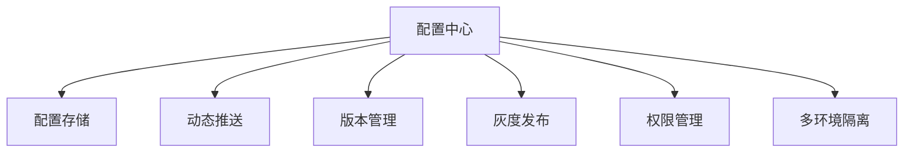
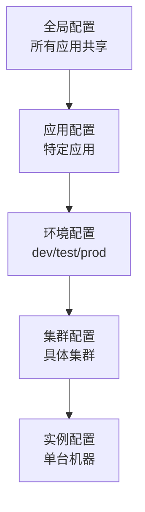
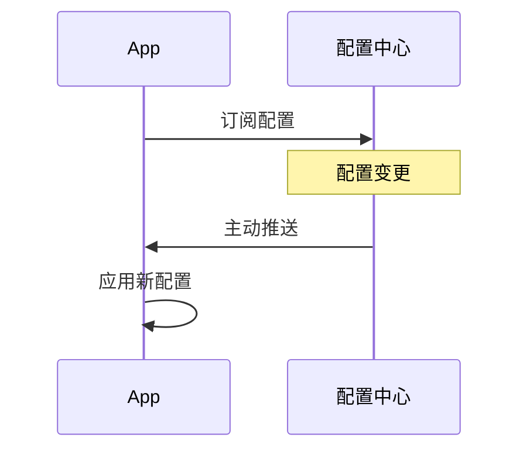
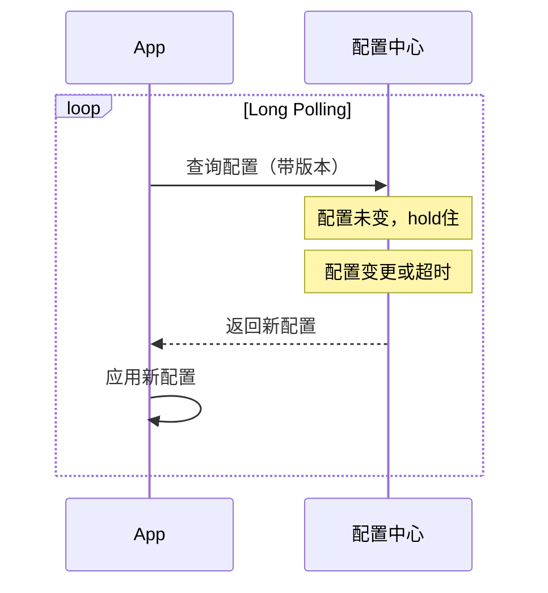
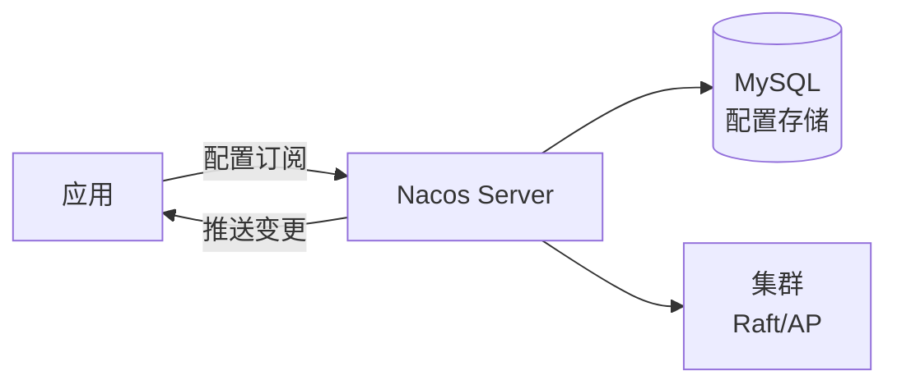
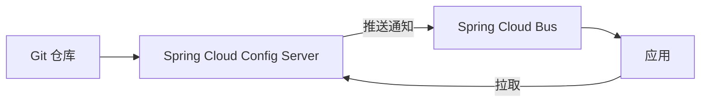
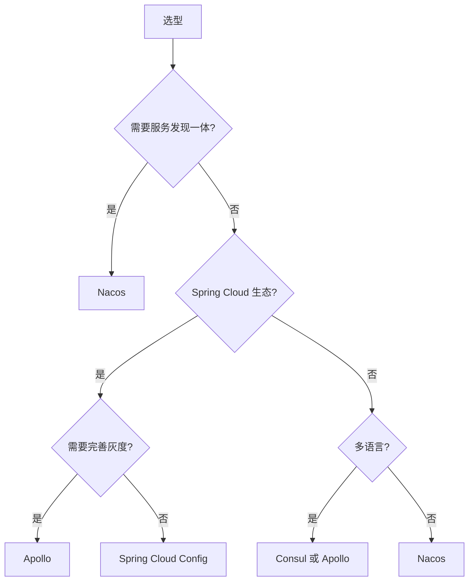

# 配置中心方案

> 配置中心集中管理应用配置，支持动态更新、版本管理、灰度发布，是微服务治理的核心组件。

## 目录

- [一、为什么需要配置中心](#一为什么需要配置中心)
- [二、核心功能](#二核心功能)
- [三、架构模式](#三架构模式)
- [四、动态刷新机制](#四动态刷新机制)
- [五、主流方案](#五主流方案)
- [六、对比与选型](#六对比与选型)
- [七、相关资料](#七相关资料)

## 一、为什么需要配置中心

### 1.1 传统配置问题

```mermaid
flowchart LR
    Code[代码] --> Config[配置文件]
    Config --> P1[生产环境]
    Note over Config: 修改需重新打包部署
    Note over P1: 多实例配置不一致风险
```

问题：
- 配置变更需重新打包
- 多环境配置难管理
- 敏感信息易泄露
- 无法动态调整
- 配置变更难审计

### 1.2 配置中心价值

```mermaid
flowchart LR
    CC[配置中心] -->|推送| App1[应用1]
    CC -->|推送| App2[应用2]
    CC -->|推送| App3[应用3]
    Note over CC: 集中管理 动态推送 版本审计
```

| 价值 | 说明 |
|------|------|
| 集中管理 | 统一存储所有环境配置 |
| 动态更新 | 修改即生效，无需重启 |
| 多环境隔离 | dev/test/prod 隔离 |
| 权限审计 | 谁改了什么、何时改的 |
| 灰度发布 | 按机器/分组灰度 |

## 二、核心功能



### 2.1 配置层级



优先级：实例 > 集群 > 环境 > 应用 > 全局

### 2.2 配置示例

```yaml
# Nacos 配置示例
dataId: order-service.yaml
group: ORDER_GROUP
namespace: prod

content:
  # 数据库
  datasource:
    url: jdbc:mysql://prod-db:3306/orders
    username: ${DB_USER}  # 敏感信息加密
    password: ${DB_PASSWORD}
    pool-size: 20

  # 业务开关
  feature:
    new-promo-enabled: true
    payment-timeout: 30000

  # 限流
  rate-limit:
    qps: 1000
    concurrent: 100
```

## 三、架构模式

### 3.1 推模式（Push）



特点：
- 实时性好
- 服务端需维护长连接
- 客户端被动接收

### 3.2 拉模式（Pull / Long Polling）



特点：
- 实现简单
- 实时性稍差
- 客户端主动

### 3.3 混合模式

Apollo 与 Nacos 都采用 Long Polling + 推送通知：
1. 客户端 Long Polling 配置变更
2. 服务端收到变更立即返回
3. 客户端拉取最新配置

## 四、动态刷新机制

### 4.1 Spring Cloud Config

```java
// 需配合 Spring Cloud Bus + RabbitMQ
@RefreshScope
@RestController
public class OrderController {

    @Value("${order.timeout:3000}")
    private int timeout;

    @GetMapping("/timeout")
    public int getTimeout() {
        return timeout;
    }
}

// 配置变更后需调用 /actuator/refresh
// 或通过 Bus 推送到所有节点
```

### 4.2 Nacos 动态刷新

```java
@Service
public class OrderService {

    @NacosValue(value = "${order.timeout:3000}", autoRefreshed = true)
    private int timeout;

    @NacosConfigListener(dataId = "order-service.yaml")
    public void onConfigChange(String config) {
        // 配置变更回调
        log.info("Config changed: {}", config);
    }
}
```

### 4.3 Apollo 动态刷新

```java
@Configuration
public class ApolloConfig {

    @Value("${order.timeout:3000}")
    private int timeout;

    @ApolloConfigChangeListener
    public void onChange(ConfigChangeEvent event) {
        event.changedKeys().forEach(key -> {
            ConfigChange change = event.getChange(key);
            log.info("Config changed - key: {}, old: {}, new: {}",
                key, change.getOldValue(), change.getNewValue());
        });
    }
}
```

## 五、主流方案

### 5.1 Nacos

阿里开源，服务发现 + 配置中心一体化。



特点：
- 配置 + 服务发现一体
- 支持 YAML/Properties/JSON
- 灰度发布
- 国内生态友好

### 5.2 Apollo

携程开源，专注配置中心。

```mermaid
flowchart TD
    Portal[Apollo Portal<br/>配置管理界面] --> Admin[Admin Service]
    Admin --> DB[(ConfigDB)]
    App[应用] -->|长轮询| Config[Config Service]
    Config --> DB
    Note over App,Config: 客户端本地缓存
```

特点：
- 灰度发布完善
- 权限管理细
- 多语言 SDK
- 部署稍复杂

### 5.3 Spring Cloud Config



特点：
- 基于 Git 存储
- 与 Spring 集成紧密
- 配置变更需 Bus 推送
- 无 UI

### 5.4 Consul KV

```python
import consul

c = consul.Consul()

# 写入配置
c.kv.put('order-service/timeout', '3000')

# 读取配置
index, data = c.kv.get('order-service/timeout')
print(data['Value'])  # 3000

# 监听变更
def watch():
    index = None
    while True:
        index, data = c.kv.get('order-service/timeout', index=index)
        if data:
            apply_config(data['Value'])
```

特点：
- 简单 KV 存储
- 与服务发现一体
- 长轮询监听

## 六、对比与选型

### 6.1 综合对比

| 维度 | Nacos | Apollo | Spring Cloud Config | Consul |
|------|-------|--------|--------------------|--------|
| 一致性 | CP/AP | CP | 最终一致 | CP |
| 实时性 | 高 | 高 | 中 | 高 |
| 灰度发布 | ✓ | ✓ | ✗ | ✗ |
| 权限管理 | 基础 | 完善 | Git 权限 | ACL |
| 多环境 | Namespace | Environment | Profile | Datacenter |
| 配置回滚 | ✓ | ✓ | Git | ✗ |
| 部署复杂度 | 中 | 中 | 低 | 中 |
| UI | ✓ | ✓ | ✗ | ✓ |
| 服务发现 | ✓ | ✗ | ✗ | ✓ |

### 6.2 选型决策



### 6.3 K8s 时代的配置

```mermaid
flowchart LR
    CM[ConfigMap] --> Pod1[Pod]
    CM --> Pod2[Pod]
    Secret[Secret] --> Pod1
    Secret --> Pod2
    Note over CM,Secret: K8s 原生配置
    Operator[Operator] -->|动态更新| CM
```

K8s 中：
- ConfigMap：普通配置
- Secret：敏感信息
- 配置变更触发滚动重启
- 配合 Operator 实现动态更新

## 七、相关资料

- [Nacos 官方文档](https://nacos.io/zh-cn/docs/what-is-nacos.html)
- [Apollo 官方文档](https://www.apolloconfig.com/)
- [Spring Cloud Config](https://docs.spring.io/spring-cloud-config/docs/current/reference/html/)
- [12-Factor App - Config](https://12factor.net/config)
