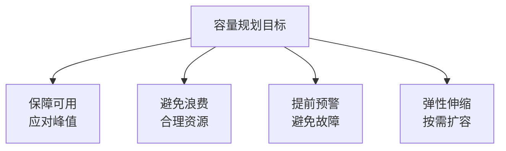
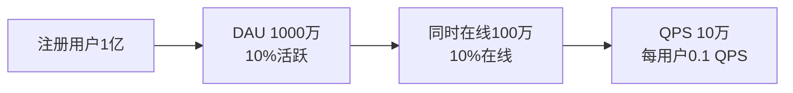
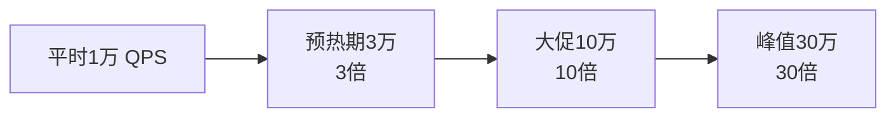
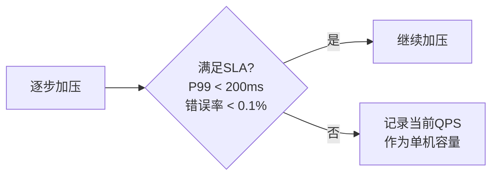
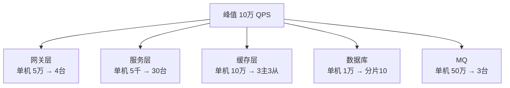
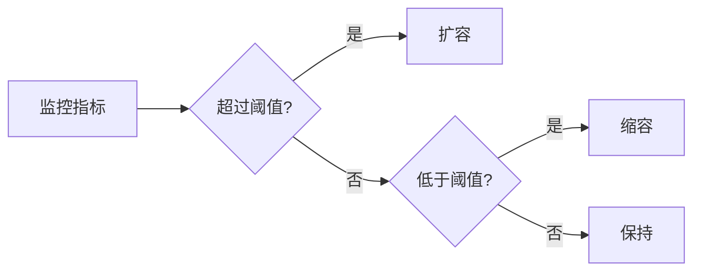
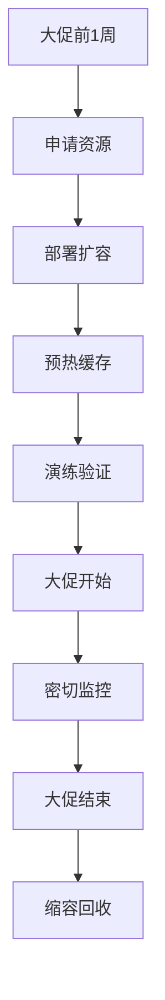

# 容量规划

> 容量规划是架构师的核心能力，基于业务预估系统所需资源，避免资源浪费或不足导致故障。

## 目录

- [一、容量规划目标](#一容量规划目标)
- [二、规划流程](#二规划流程)
- [三、业务量预估](#三业务量预估)
- [四、单机容量测试](#四单机容量测试)
- [五、容量计算](#五容量计算)
- [六、弹性扩缩容](#六弹性扩缩容)
- [七、容量演练](#七容量演练)
- [八、相关资料](#八相关资料)

## 一、容量规划目标



### 1.1 三类容量

| 类型 | 说明 | 周期 |
|------|------|------|
| **日常容量** | 平时所需资源 | 长期 |
| **峰值容量** | 高峰时段所需 | 短期 |
| **大促容量** | 活动期间所需 | 临时 |

## 二、规划流程


### 2.1 关键问题

| 问题 | 答案 |
|------|------|
| 业务量有多大？ | DAU、QPS、订单量 |
| 峰值何时来？ | 时间分布 |
| 单机能扛多少？ | 压测得来 |
| 需要多少台？ | 计算 + 余量 |
| 预算多少？ | 成本约束 |

## 三、业务量预估

### 3.1 用户量预估



### 3.2 流量模型

```
DAU → 在线率 → 并发率 → QPS

DAU = 1000万
在线率 = 10% → 同时在线 100万
并发率 = 10% → 并发请求 10万
人均 QPS = 0.1 → 总 QPS = 1万

峰值 QPS = 平均 × 3 = 3万
```

### 3.3 80/20 法则

80% 流量集中在 20% 时间：

```
日活 1000万
活跃时长 4小时
20% 时间 = 48分钟
80% 流量 = 800万次访问

峰值 QPS = 800万 / (48 × 60) ≈ 2778 QPS
```

### 3.4 大促预估



## 四、单机容量测试

### 4.1 压测方法


### 4.2 压测工具

| 工具 | 适用 | 特点 |
|------|------|------|
| JMeter | HTTP/TCP | 功能全、GUI |
| wrk | HTTP | 轻量、高性能 |
| Locust | Python | 可编程 |
| Gatling | Scala | 高性能、报告好 |
| k6 | JavaScript | 现代化 |

### 4.3 压测示例

```bash
# wrk 压测示例
wrk -t12 -c400 -d30s http://127.0.0.1:8080/api/orders

# -t12 12线程
# -c400 400连接
# -d30s 30秒
```

### 4.4 找到单机容量



示例：
```
单机容量测试结果：
- 1000 QPS：P99 50ms，错误率 0%
- 3000 QPS：P99 100ms，错误率 0%
- 5000 QPS：P99 200ms，错误率 0.05%
- 7000 QPS：P99 500ms，错误率 0.5%（超SLA）
- 10000 QPS：P99 2000ms，错误率 5%

单机容量：5000 QPS（满足SLA）
```

## 五、容量计算

### 5.1 基础公式

```
所需实例数 = 峰值 QPS / 单机容量

例：峰值 3万 QPS，单机 5千 QPS
实例数 = 30000 / 5000 = 6 台
```

### 5.2 加入余量


```
理论需求 = 6台
+ 30%余量 = 6 × 1.3 = 7.8 ≈ 8台
+ 跨机房容灾 = 8 + 2 = 10台
```

### 5.3 各层容量计算



### 5.4 瓶颈分析

```mermaid
flowchart TD
    A[链路] --> B[网关 5万]
    B --> C[服务 5000]
    C --> D[Redis 10万]
    D --> E[MySQL 1000]

    Note over A,E: 瓶颈在 MySQL
    Note over E: 需分库或缓存
```

## 六、弹性扩缩容

### 6.1 自动伸缩



### 6.2 K8s HPA

```yaml
apiVersion: autoscaling/v2
kind: HorizontalPodAutoscaler
metadata:
  name: order-service
spec:
  scaleTargetRef:
    apiVersion: apps/v1
    kind: Deployment
    name: order-service
  minReplicas: 5
  maxReplicas: 50
  metrics:
  - type: Resource
    resource:
      name: cpu
      target:
        type: Utilization
        averageUtilization: 60
  - type: Resource
    resource:
      name: memory
      target:
        type: Utilization
        averageUtilization: 70
```

### 6.3 预测性扩容


### 6.4 大促预备



## 七、容量演练

### 7.1 全链路压测


### 7.2 混沌工程

模拟故障验证容量：
- 杀死部分实例
- 注入网络延迟
- 模拟磁盘满

### 7.3 容量评估报告

```markdown
## 容量评估报告

### 业务预估
- 日活：1000万
- 峰值 QPS：3万
- 大促峰值：30万

### 单机容量（压测）
- 网关：5万 QPS
- 业务服务：5千 QPS
- Redis：10万 QPS
- MySQL：1千 QPS

### 所需实例
- 网关：8台（理论6 + 余量）
- 业务服务：40台
- Redis：6台（3主3从）
- MySQL：30台（分库分表）

### 成本估算
- 月度成本：50万元
- 大促临时成本：100万元
```

## 八、相关资料

- [Google SRE - 容量规划](https://sre.google/sre-book/service-capacity-planning/)
- [全链路压测](https://developer.aliyun.com/article/765370)
- 《SRE：Google 运维解密》
- [Chaos Engineering](https://principlesofchaos.org/)
- [K8s HPA 文档](https://kubernetes.io/docs/tasks/run-application/horizontal-pod-autoscale/)
