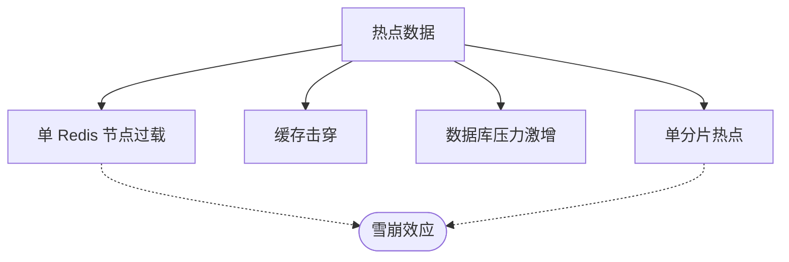
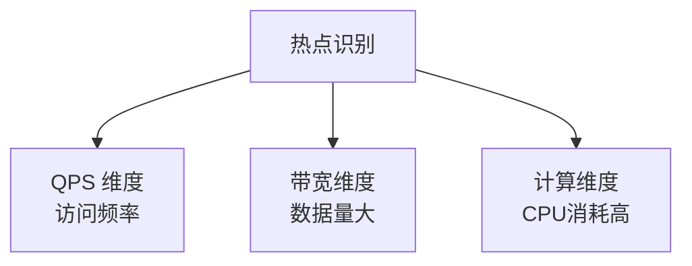
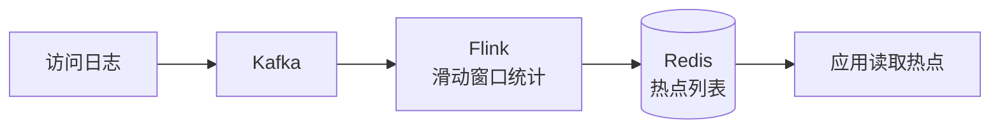
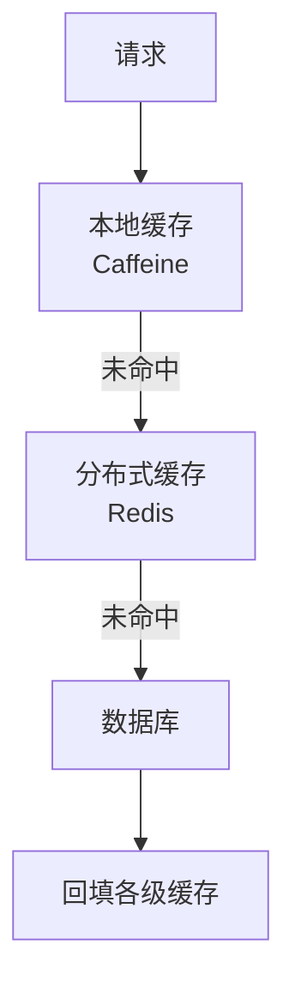
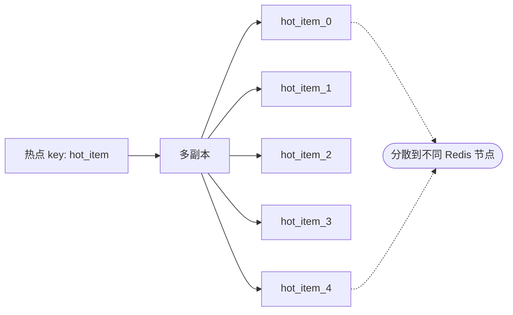
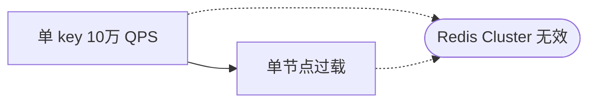
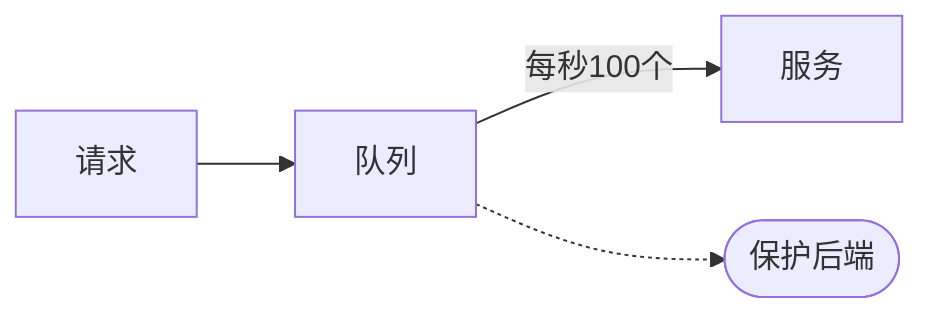
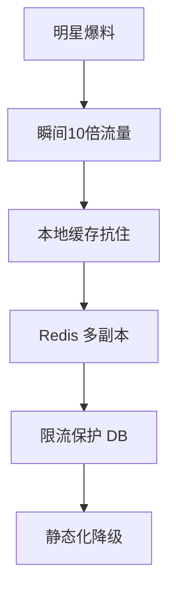
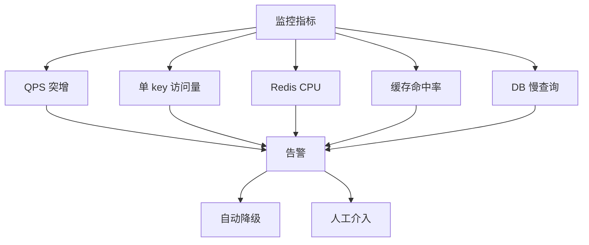

# 热点数据处理

> 热点数据是被高频访问的少量数据，如明星微博、热门商品、突发新闻。处理不当会导致单点过载、缓存击穿、数据库雪崩。

## 目录

- [一、热点数据特征](#一热点数据特征)
- [二、热点识别](#二热点识别)
- [三、热点发现机制](#三热点发现机制)
- [四、多级缓存策略](#四多级缓存策略)
- [五、热点副本分散](#五热点副本分散)
- [六、热点限流保护](#六热点限流保护)
- [七、相关资料](#七相关资料)

## 一、热点数据特征


### 1.1 热点类型

| 类型 | 示例 | 特征 |
|------|------|------|
| **突发热点** | 明星爆料 | 短时间爆发 |
| **周期热点** | 双十一商品 | 可预知 |
| **持续热点** | 首页推荐 | 长期热 |
| **意外热点** | 病毒式传播 | 难以预测 |

### 1.2 危害



## 二、热点识别

### 2.1 识别维度



### 2.2 静态识别

业务提前预知的热点：

```python
# 双十一预热商品
def preheat_hot_items():
    hot_items = db.query("SELECT id FROM items WHERE is_promotion = 1")
    for item_id in hot_items:
        # 多副本缓存预热
        for i in range(10):
            redis.set(f"item:{item_id}:copy_{i}", load_item(item_id))
```

### 2.3 动态识别

实时统计访问频次：

```python
# 滑动窗口统计
def detect_hot_keys():
    """实时检测热点 key"""
    hot_keys = []
    # 用 Redis Sorted Set 统计
    now = int(time.time())
    # 每秒访问次数
    for key in get_recent_keys():
        count = redis.zcount(f"stats:{key}", now - 60, now)
        if count > 10000:  # 1分钟 1万次
            hot_keys.append(key)
    return hot_keys
```

### 2.4 客户端采样

```python
# 在客户端采样统计
class HotKeyDetector:
    def __init__(self, sample_rate=0.1, threshold=100):
        self.sample_rate = sample_rate
        self.threshold = threshold
        self.counter = defaultdict(int)

    def access(self, key):
        if random.random() < self.sample_rate:
            self.counter[key] += 1
            if self.counter[key] > self.threshold:
                report_hot_key(key)
```

## 三、热点发现机制

### 3.1 Redis 热点 key 发现

#### 方式 1：monitor 命令（慎用）

```bash
# 监控所有命令（性能影响大）
redis-cli monitor | grep -E "GET|SET" | awk '{print $4}' | sort | uniq -c | sort -rn
```

#### 方式 2：LFU 模式

```bash
# 配置 LFU 淘汰策略
redis-cli config set maxmemory-policy allkeys-lfu
# 查看热点 key
redis-cli --hotkeys
```

#### 方式 3：业务层统计

```python
# 客户端统计访问频率
def get_item(item_id):
    # 业务统计
    redis.zincrby("hot_keys:1min", 1, f"item:{item_id}")
    redis.expire("hot_keys:1min", 60)
    return redis.get(f"item:{item_id}")
```

### 3.2 实时计算框架



## 四、多级缓存策略

### 4.1 多级缓存架构



### 4.2 本地缓存

```java
// Caffeine 本地缓存
Caffeine.newBuilder()
    .maximumSize(10_000)
    .expireAfterWrite(10, TimeUnit.SECONDS)
    .build<String, Item>()

// 适合热点：访问延迟 < 1ms
```

优点：
- 无网络开销
- 极低延迟

缺点：
- 容量有限
- 多实例数据不一致

### 4.3 缓存永不过期 + 异步刷新

```python
def get_hot_item(item_id):
    # 缓存永不过期
    data = redis.get(f"item:{item_id}")
    if data:
        # 异步刷新（剩余有效期 < 10%）
        ttl = redis.ttl(f"item:{item_id}")
        if ttl < 60:  # 即将过期
            mq.send('refresh_cache', {'key': f"item:{item_id}"})
        return data
    # 缓存未命中，加锁查 DB
    with redis_lock(f"lock:item:{item_id}"):
        data = redis.get(f"item:{item_id}")
        if data:
            return data
        data = db.query("SELECT * FROM items WHERE id = ?", item_id)
        redis.set(f"item:{item_id}", data, ex=600)
        return data
```

## 五、热点副本分散

### 5.1 多副本策略



```python
def get_hot_item(item_id, replica_count=10):
    """随机选择一个副本读取"""
    replica = random.randint(0, replica_count - 1)
    key = f"hot_item:{item_id}:{replica}"
    data = redis.get(key)
    if data:
        return data
    # 未命中，加锁回源
    return load_and_cache(item_id, replica)

def load_and_cache(item_id, replica):
    """加锁防止缓存击穿"""
    lock_key = f"lock:hot_item:{item_id}"
    if redis.set(lock_key, 1, nx=True, ex=10):
        try:
            data = db.query("SELECT * FROM items WHERE id = ?", item_id)
            # 缓存所有副本
            for i in range(10):
                redis.set(f"hot_item:{item_id}:{i}", data, ex=600)
            return data
        finally:
            redis.delete(lock_key)
    else:
        # 等待其他线程加载
        time.sleep(0.05)
        return get_hot_item(item_id)
```

### 5.2 Redis Cluster 热点分片

Redis Cluster 单 key 无法分片：



解决：用 Hash Tag 强制分散：

```python
# 不同副本落在不同 slot
keys = [f"{{hot}}:item:{item_id}:{i}" for i in range(10)]
# 通过 {hot} 让副本分散到不同 slot
```

## 六、热点限流保护

### 6.1 单 key 限流

```python
def access_hot_key(key):
    # 单 key 限流
    counter_key = f"counter:{key}"
    current = redis.incr(counter_key)
    if current == 1:
        redis.expire(counter_key, 1)
    if current > 10000:  # 1秒1万次
        # 触发降级
        return get_degraded_data(key)
    return get_data(key)
```

### 6.2 排队机制



### 6.3 降级策略

```python
def get_data_with_fallback(key):
    try:
        # 正常路径
        return redis.get(key)
    except RedisOverloadedError:
        # 降级1：返回本地缓存
        local_data = local_cache.get(key)
        if local_data:
            return local_data
        # 降级2：返回默认值
        return get_default_value(key)
        # 降级3：返回错误码
        # return error_response
```

## 七、典型场景

### 7.1 微博明星爆料



### 7.2 电商爆款商品


### 7.3 直播间消息


## 八、监控告警



## 九、相关资料

- 《Redis 设计与实现》黄健宏
- [微博热点处理](https://github.com/weibocom/tengine)
- [Hot Key Detection](https://medium.com/@alitech_2017/hot-key-detection-in-redis-7e8d22b5e5f)
- [京东热点数据架构](https://developer.jdcloud.com/article/1269)
