# 秒杀系统设计

> 秒杀是高并发架构的极致场景，瞬间流量可达日常的 100 倍以上。设计秒杀系统的核心是分层防护、削峰填谷、保证一致。

## 目录

- [一、秒杀场景特征](#一秒杀场景特征)
- [二、核心挑战](#二核心挑战)
- [三、分层架构](#三分层架构)
- [四、关键设计](#四关键设计)
- [五、库存扣减方案](#五库存扣减方案)
- [六、防刷与公平](#六防刷与公平)
- [七、典型架构](#七典型架构)
- [八、相关资料](#八相关资料)

## 一、秒杀场景特征

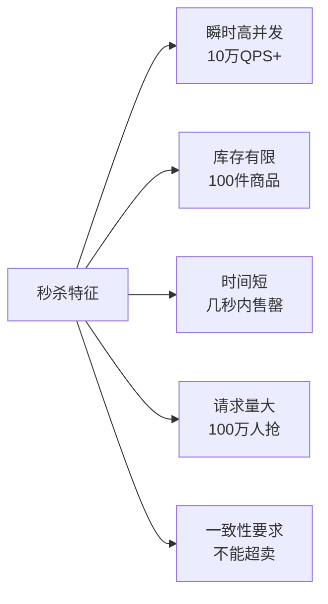

## 二、核心挑战

| 挑战 | 难点 |
|------|------|
| 高并发 | 瞬间流量百倍增长 |
| 防超卖 | 库存不能扣超 |
| 防黄牛 | 公平性保障 |
| 防雪崩 | 链路任何环节不能挂 |
| 一致性 | 库存与订单一致 |

## 三、分层架构

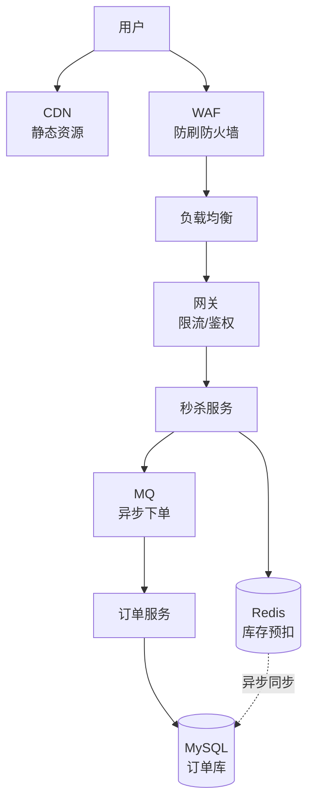

### 3.1 流量层层削减

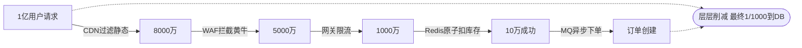

## 四、关键设计

### 4.1 静态资源 CDN

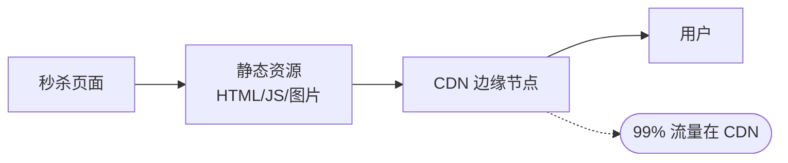

策略：
- 页面静态化
- 资源 CDN 缓存
- 动态接口分离

### 4.2 排队与限流

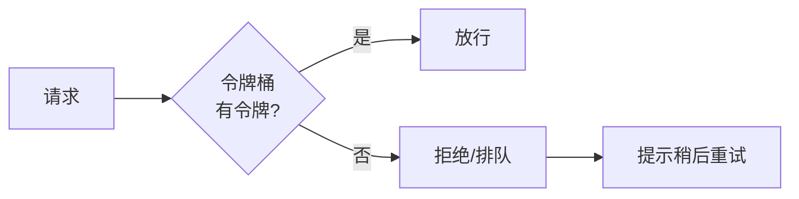

```python
# Redis + Lua 实现令牌桶
def rate_limit(user_id, max_qps=10):
    key = f"rate:{user_id}"
    script = """
    local current = redis.call('INCR', KEYS[1])
    if current == 1 then
        redis.call('EXPIRE', KEYS[1], 1)
    end
    if current > tonumber(ARGV[1]) then
        return 0
    end
    return 1
    """
    return redis.eval(script, 1, key, max_qps) == 1
```

### 4.3 库存预热

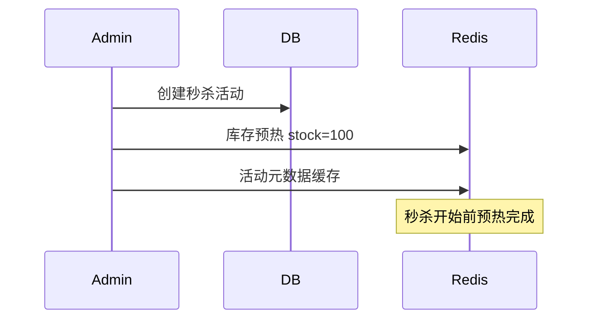

### 4.4 异步下单

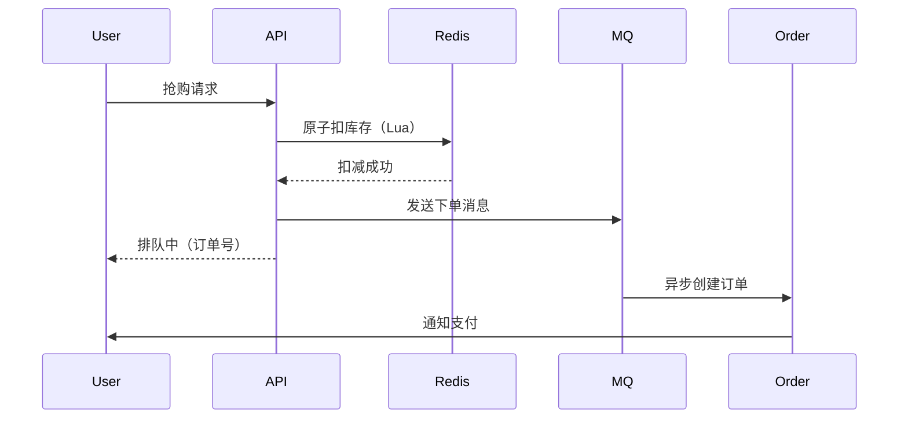

## 五、库存扣减方案

### 5.1 方案对比

| 方案 | 性能 | 一致性 | 复杂度 |
|------|------|--------|--------|
| DB 直接扣减 | 低 | 强 | 低 |
| Redis 预扣 + DB 异步 | 高 | 最终 | 中 |
| Redis + Lua 原子 | 高 | 强 | 中 |

### 5.2 Redis + Lua 原子扣减

```lua
-- Lua 脚本保证原子性
local stock = tonumber(redis.call('GET', KEYS[1]))
if not stock or stock < 1 then
    return -1  -- 库存不足
end
redis.call('DECR', KEYS[1])
return stock - 1  -- 返回扣减后库存
```

```python
def deduct_stock(item_id, user_id):
    # Lua 脚本保证原子扣减
    script = """
    if redis.call('SISMEMBER', KEYS[2], ARGV[1]) == 1 then
        return -2  -- 已抢过
    end
    local stock = tonumber(redis.call('GET', KEYS[1]))
    if not stock or stock < 1 then
        return -1
    end
    redis.call('DECR', KEYS[1])
    redis.call('SADD', KEYS[2], ARGV[1])
    return 1
    """
    # KEYS[1] = stock:item_id
    # KEYS[2] = users:item_id  已抢用户集合
    # ARGV[1] = user_id
    return redis.eval(script, 2,
                      f"stock:{item_id}",
                      f"users:{item_id}",
                      user_id)
```

### 5.3 防超卖

```python
def seckill(item_id, user_id):
    # 1. Redis 原子扣减
    result = deduct_stock(item_id, user_id)
    if result == -1:
        return '售罄'
    if result == -2:
        return '请勿重复抢购'

    # 2. 发送异步下单消息
    order_id = generate_order_id()
    mq.send('seckill_order', {
        'order_id': order_id,
        'item_id': item_id,
        'user_id': user_id,
        'create_time': now()
    })

    return {'order_id': order_id, 'msg': '抢购成功，请尽快支付'}
```

### 5.4 库存最终一致

```python
# 消费者：异步创建订单
def consume_order(message):
    order_id = message['order_id']
    # 幂等检查
    if db.exists("SELECT 1 FROM orders WHERE id = ?", order_id):
        return
    try:
        # 创建订单
        db.execute("""
            INSERT INTO orders(id, user_id, item_id, status, created_at)
            VALUES(?, ?, ?, 'PENDING', NOW())
        """, order_id, message['user_id'], message['item_id'])
        # 同步 Redis 库存到 DB（可选）
        sync_stock_to_db(message['item_id'])
    except Exception as e:
        # 失败回滚 Redis 库存
        redis.incr(f"stock:{message['item_id']}")
        redis.srem(f"users:{message['item_id']}", message['user_id'])
        raise
```

## 六、防刷与公平

### 6.1 多重防刷

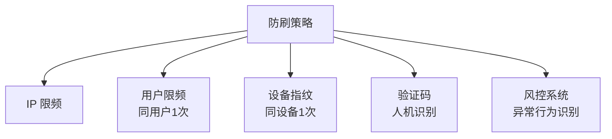

### 6.2 验证码防刷

```python
def get_seckill_token(user_id, item_id):
    # 1. 检查是否在活动时间内
    if not in_activity_time(item_id):
        return '活动未开始'

    # 2. 限流
    if not rate_limit(user_id, max_qps=1):
        return '请求过于频繁'

    # 3. 生成验证码
    captcha = generate_captcha()
    redis.setex(f"captcha:{user_id}", 60, captcha)
    return {'captcha_id': captcha.id, 'image': captcha.image}

def submit_seckill(user_id, item_id, captcha_answer):
    # 验证验证码
    expected = redis.get(f"captcha:{user_id}")
    if not expected or expected != captcha_answer:
        return '验证码错误'
    # 进入抢购流程
    return seckill(item_id, user_id)
```

### 6.3 黄牛识别

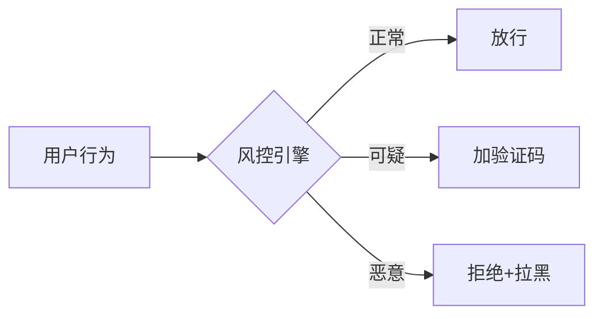

风控维度：
- 账号注册时间
- 历史行为
- 设备指纹
- IP 信誉
- 请求频率

## 七、典型架构

### 7.1 完整架构

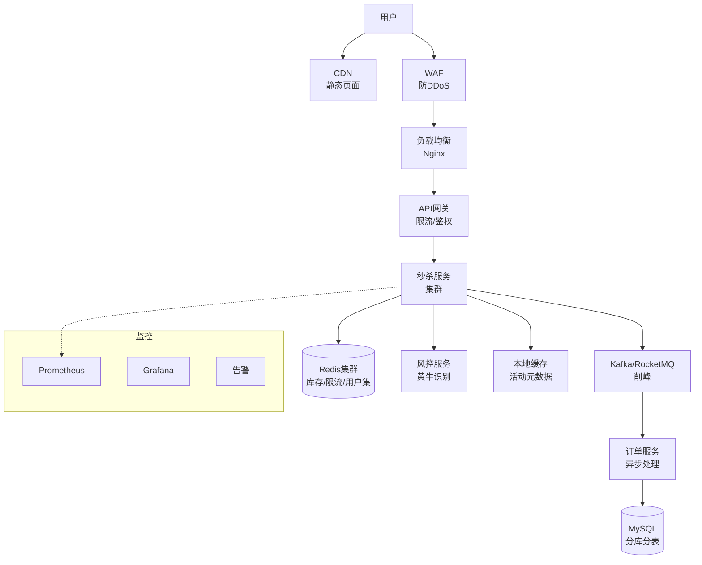

### 7.2 容量预估

```
假设：
- 100万人参与秒杀
- 100件商品
- 5秒内售罄

QPS = 100万 / 5秒 = 20万 QPS

实际请求峰值：可能瞬间 50万 QPS

容量规划：
- 网关：50台 × 1万QPS = 50万
- 秒杀服务：100台 × 5千QPS = 50万
- Redis：10台集群，单台 10万QPS
- MQ：3台，单台 50万消息/秒
- 订单服务：20台 × 1千QPS = 2万（异步消费）
```

### 7.3 降级与熔断

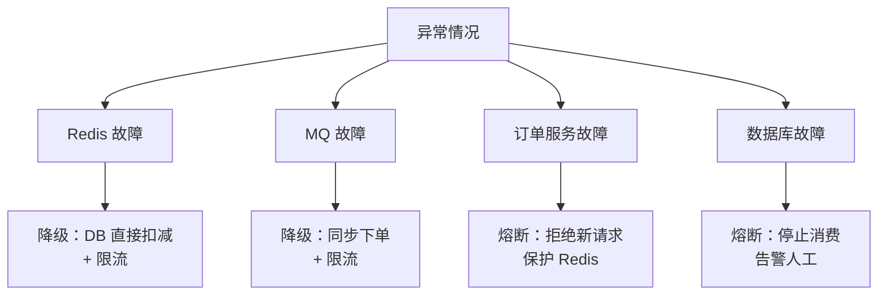

## 八、相关资料

- 《亿级流量网站架构核心技术》张开涛
- [秒杀系统设计](https://github.com/qiurunze123/miaosha)
- [Design a Flash Sale System](https://www.scaler.com/topics/system-design/flash-sale-system-design/)
- [阿里秒杀架构](https://developer.aliyun.com/article/781831)
