# 高并发架构设计

> 高并发是互联网架构的核心挑战，目标是在大流量下保持系统稳定与高性能。本文系统讲解高并发的核心思想、关键技术与架构模式。

## 目录

- [一、高并发核心指标](#一高并发核心指标)
- [二、核心思想](#二核心思想)
- [三、垂直扩展](#三垂直扩展)
- [四、水平扩展](#四水平扩展)
- [五、缓存](#五缓存)
- [六、异步化](#六异步化)
- [七、池化与预热](#七池化与预热)
- [八、相关资料](#八相关资料)

## 一、高并发核心指标

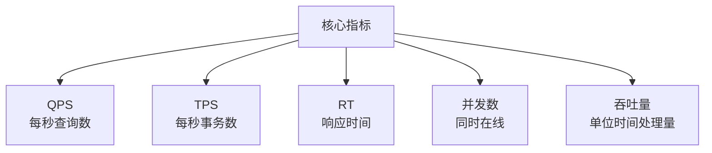

### 1.1 关键公式

```
Little's Law（利特尔法则）：
并发数 = QPS × 平均响应时间

例：QPS = 1000，RT = 0.1s
并发数 = 1000 × 0.1 = 100
```

### 1.2 性能等级

| QPS | 等级 | 架构 |
|-----|------|------|
| 100 | 低 | 单机 |
| 1,000 | 中 | 单机 + 缓存 |
| 10,000 | 高 | 主从 + 缓存 + 集群 |
| 100,000 | 极高 | 微服务 + 分布式 |
| 1,000,000+ | 超高 | 全分布式 + 多机房 |

## 二、核心思想

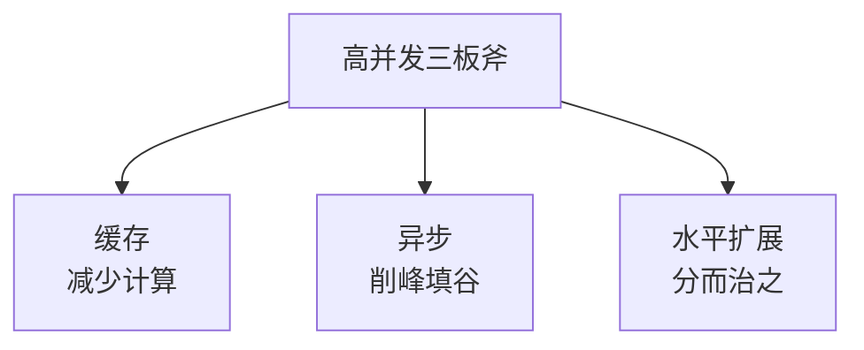

### 2.1 黄金法则

1. **能缓存的绝不查询**
2. **能异步的绝不同步**
3. **能并行的绝不串行**
4. **能批量的绝不循环**
5. **能分片的绝不集中**

## 三、垂直扩展

### 3.1 单机优化

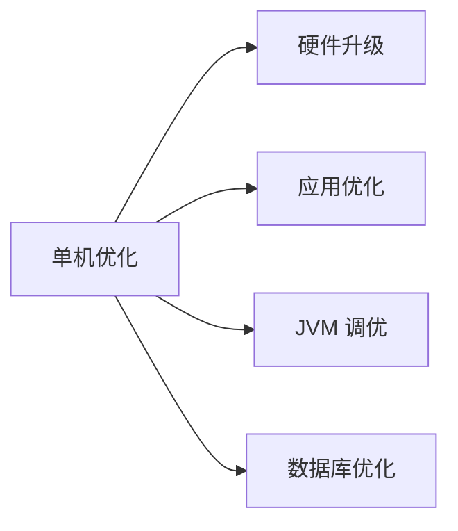

| 优化方向 | 手段 |
|---------|------|
| CPU | 升级多核、提升主频 |
| 内存 | 增大内存、提升频率 |
| 磁盘 | SSD 替换 HDD、NVMe |
| 网络 | 万兆网卡、内核优化 |

### 3.2 应用层优化

```python
# 串行 → 并行
def get_user_detail(user_id):
    # 串行：100ms + 50ms + 30ms = 180ms
    # profile = get_profile(user_id)      # 100ms
    # orders = get_orders(user_id)        # 50ms
    # points = get_points(user_id)        # 30ms

    # 并行：max(100, 50, 30) = 100ms
    with ThreadPoolExecutor(3) as executor:
        future_profile = executor.submit(get_profile, user_id)
        future_orders = executor.submit(get_orders, user_id)
        future_points = executor.submit(get_points, user_id)
        profile = future_profile.result()
        orders = future_orders.result()
        points = future_points.result()
    return {profile, orders, points}

# 循环 → 批量
def get_users(user_ids):
    # 错误：N 次 IO
    # return [db.query("SELECT * FROM users WHERE id = ?", uid) for uid in user_ids]

    # 正确：1 次 IO
    return db.query("SELECT * FROM users WHERE id IN (?)", user_ids)
```

## 四、水平扩展

### 4.1 无状态化

水平扩展的前提是服务无状态：

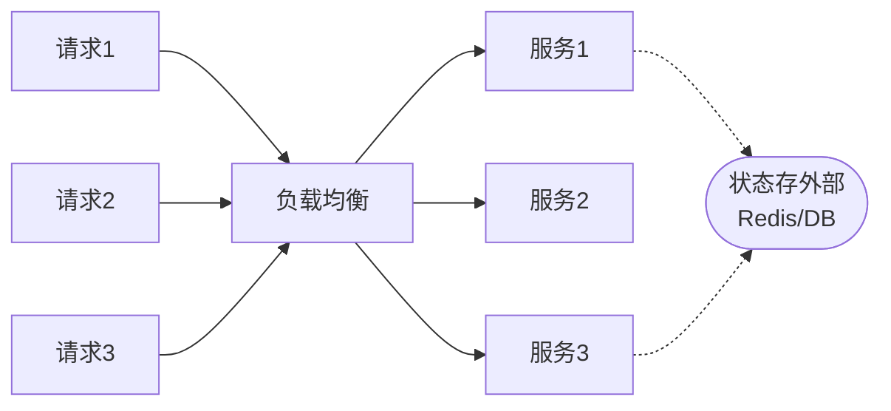

状态外置：
- 会话 → Redis
- 文件 → 对象存储
- 缓存 → Redis 集群

### 4.2 负载均衡

详见 [负载均衡方案.md](./负载均衡方案.md)

### 4.3 分片

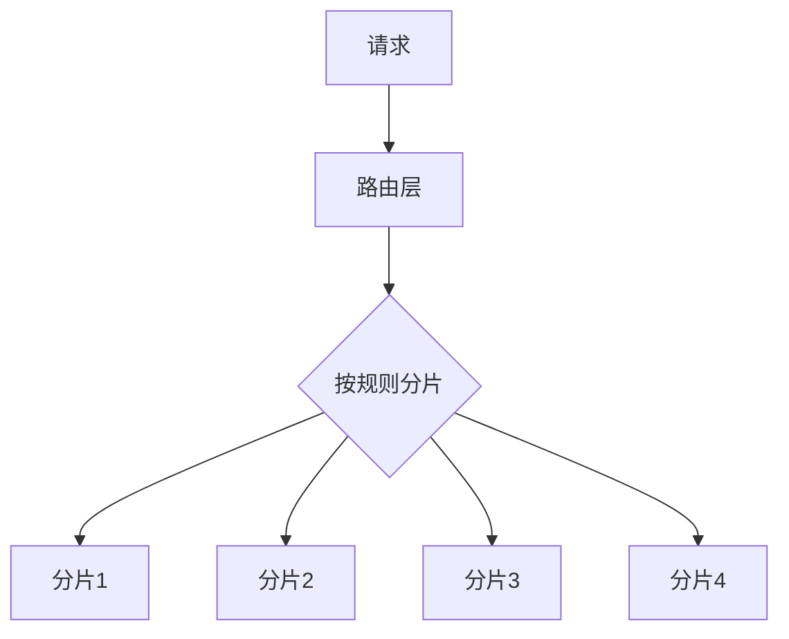

详见 [分库分表方案.md](./分库分表方案.md)

## 五、缓存

### 5.1 多级缓存

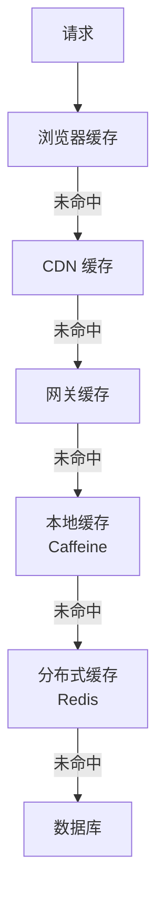

### 5.2 缓存策略

| 缓存类型 | 适用 | 特点 |
|---------|------|------|
| 浏览器 | 静态资源 | 客户端缓存 |
| CDN | 静态资源 | 边缘节点 |
| 网关 | 公共数据 | Nginx 缓存 |
| 本地 | 单实例热数据 | 进程内、低延迟 |
| 分布式 | 跨实例共享 | Redis |
| 数据库 | Buffer Pool | 引擎层 |

### 5.3 缓存模式

详见 [Redis缓存一致性.md](../redis/Redis缓存一致性.md)

### 5.4 缓存问题防护

详见 [Redis缓存雪崩击穿和穿透.md](../redis/Redis缓存雪崩击穿和穿透.md)

## 六、异步化

### 6.1 异步场景

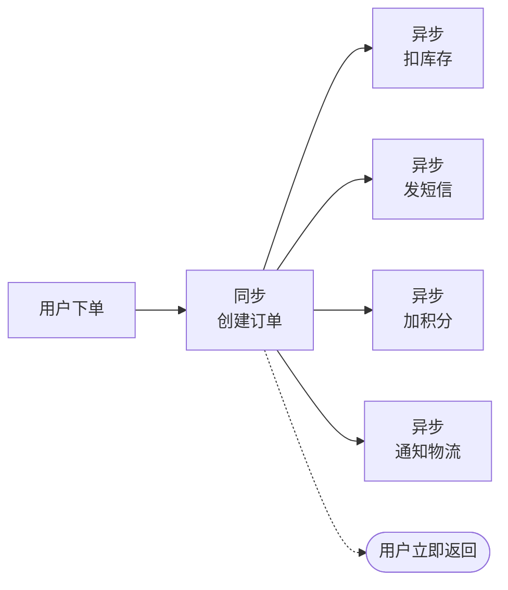

### 6.2 消息队列削峰

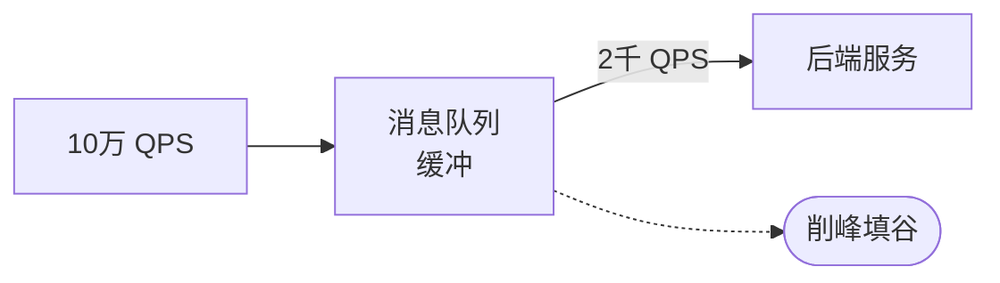

详见 [MQ对比.md](./MQ对比.md)

### 6.3 异步 IO

```python
# 同步阻塞
def fetch_all(urls):
    results = []
    for url in urls:
        results.append(requests.get(url))  # 串行
    return results

# 异步非阻塞（asyncio + aiohttp）
import asyncio
import aiohttp

async def fetch_all(urls):
    async with aiohttp.ClientSession() as session:
        tasks = [session.get(url) for url in urls]
        return await asyncio.gather(*tasks)  # 并发
```

## 七、池化与预热

### 7.1 池化技术

| 池化 | 用途 |
|------|------|
| 线程池 | 复用线程，避免频繁创建 |
| 连接池 | 复用 DB/Redis 连接 |
| 对象池 | 复用昂贵对象 |
| 内存池 | 复用内存块 |

### 7.2 线程池

```java
// Java 线程池
ThreadPoolExecutor executor = new ThreadPoolExecutor(
    10,                              // 核心线程
    100,                             // 最大线程
    60L, TimeUnit.SECONDS,           // 空闲存活
    new LinkedBlockingQueue<>(1000), // 队列
    new ThreadPoolExecutor.CallerRunsPolicy()  // 拒绝策略
);
```

```python
# Python 线程池
from concurrent.futures import ThreadPoolExecutor

with ThreadPoolExecutor(max_workers=100) as executor:
    futures = [executor.submit(process, item) for item in items]
    results = [f.result() for f in futures]
```

### 7.3 连接池

```yaml
# HikariCP（推荐 Java 连接池）
spring:
  datasource:
    hikari:
      maximum-pool-size: 20
      minimum-idle: 10
      idle-timeout: 30000
      connection-timeout: 30000
      max-lifetime: 1800000
```

### 7.4 预热


```python
def warmup():
    # 预热数据库连接
    db.execute("SELECT 1")
    # 预热缓存
    hot_keys = ['top_products', 'homepage_data']
    for key in hot_keys:
        cache.set(key, load_from_db(key))
    # 预热 JIT（重要方法调用）
    for _ in range(100):
        critical_method()
```

## 八、性能调优流程

### 8.1 性能瓶颈定位

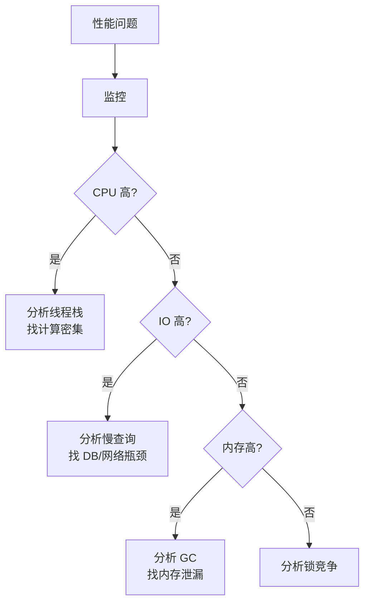

### 8.2 黄金指标

| 指标 | 说明 |
|------|------|
| 延迟 Latency | P50/P95/P99 响应时间 |
| 流量 Traffic | QPS/TPS |
| 错误 Errors | 错误率 |
| 饱和度 Saturation | CPU/内存/连接使用率 |

### 8.3 容量评估

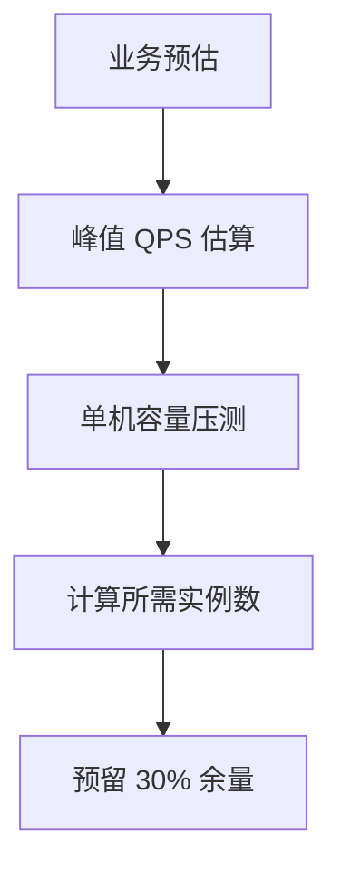

详见 [容量规划.md](./容量规划.md)

## 九、高并发实战案例

### 9.1 微博热点事件


### 9.2 双十一大促

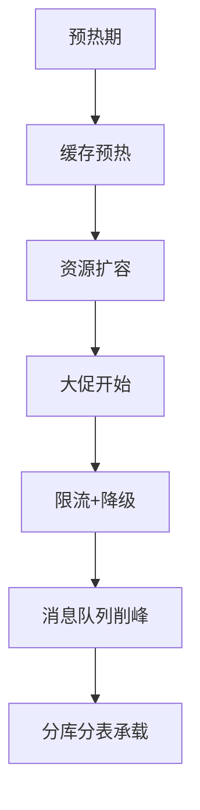

## 十、相关资料

- 《高并发编程实战》
- 《亿级流量网站架构核心技术》张开涛
- [Google SRE Book](https://sre.google/sre-book/)
- 《数据密集型应用系统设计》Martin Kleppmann
- [性能调优指南](https://github.com/bertmaher/perf-book)
