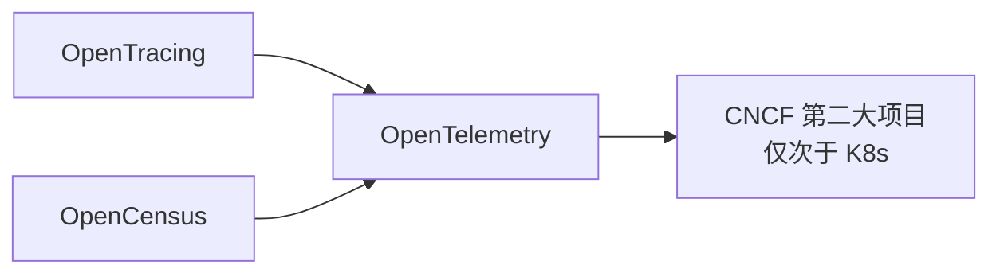
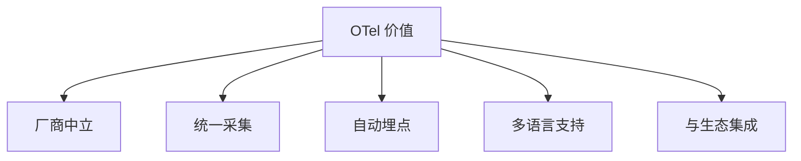
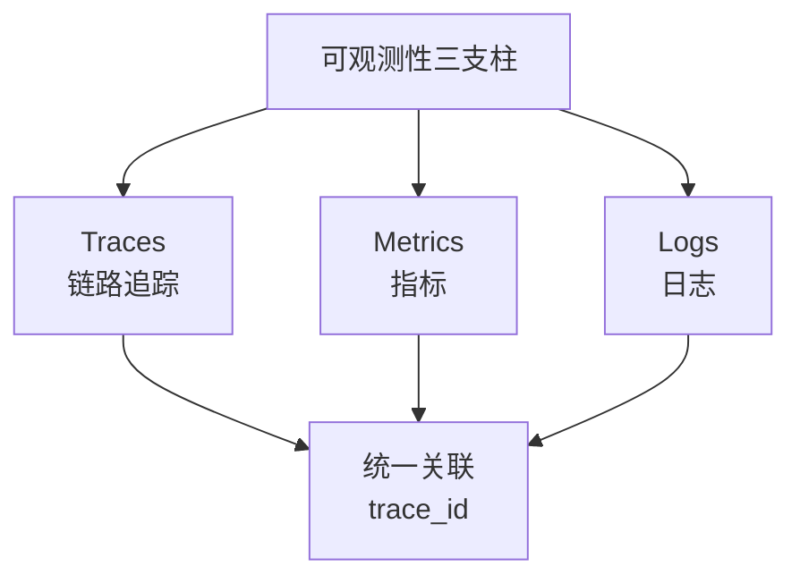
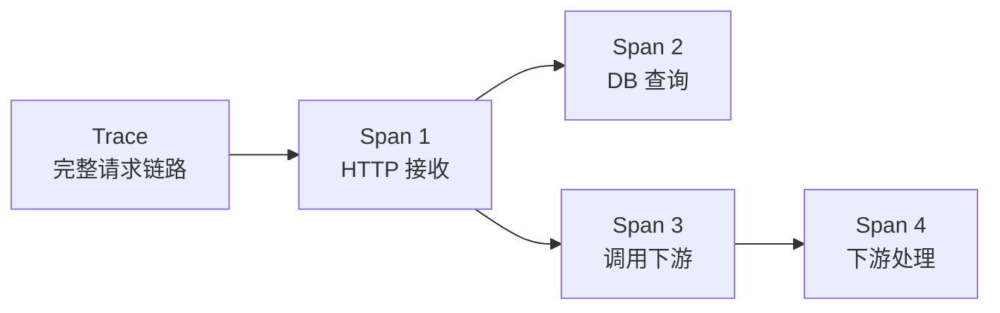
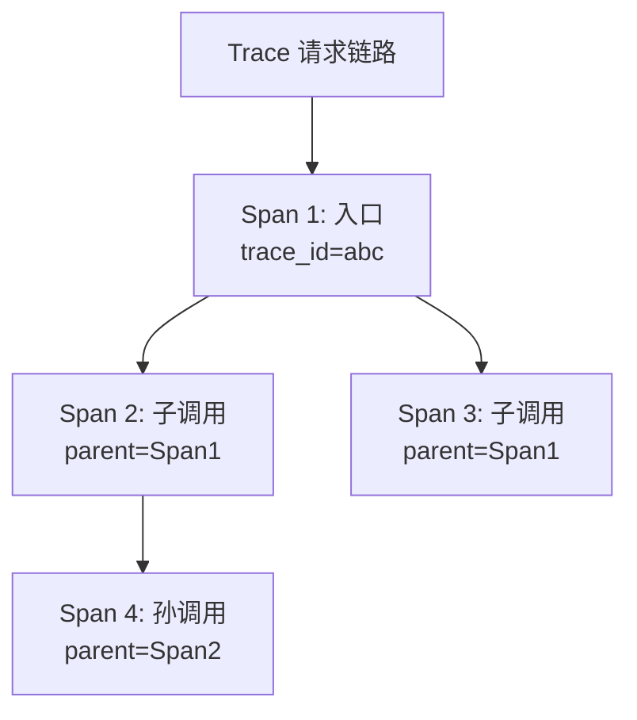
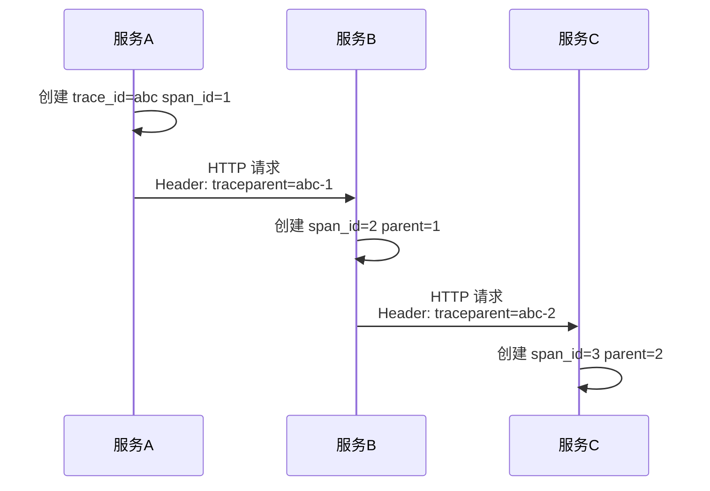
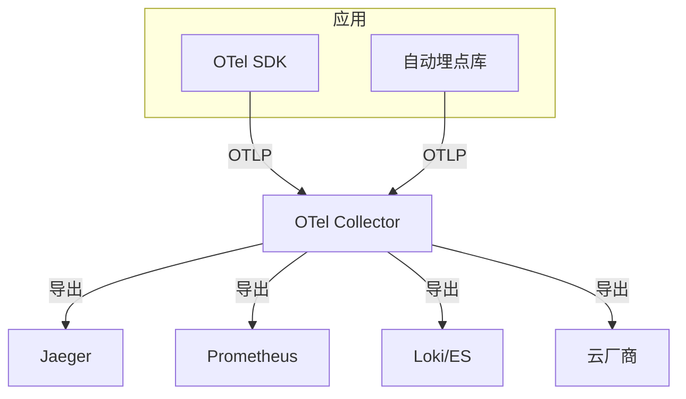
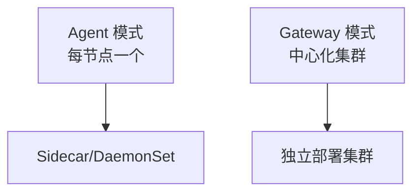
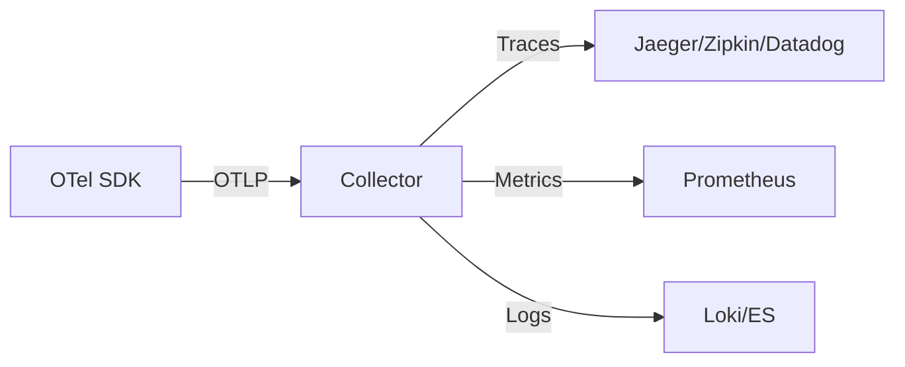

# OpenTelemetry 可观测性统一标准

> OpenTelemetry（OTel）是 CNCF 主导的可观测性标准，统一了 Metrics、Logs、Traces 的数据模型与采集 SDK，是云原生可观测性的未来。

## 目录

- [一、OpenTelemetry 概述](#一opentelemetry-概述)
- [二、三大支柱](#二三大支柱)
- [三、核心概念](#三核心概念)
- [四、架构与组件](#四架构与组件)
- [五、SDK 使用](#五sdk-使用)
- [六、Collector](#六collector)
- [七、与现有方案集成](#七与现有方案集成)
- [八、相关资料](#八相关资料)

## 一、OpenTelemetry 概述

### 1.1 历史背景



### 1.2 解决的问题

| 问题 | OTel 解决方案 |
|------|--------------|
| 厂商锁定 | 标准化数据格式 |
| 多 SDK 维护 | 统一 SDK |
| 数据格式不一 | 统一协议 OTLP |
| 集成成本高 | 自动埋点 |

### 1.3 核心价值



## 二、三大支柱



### 2.1 Traces 链路追踪



### 2.2 Metrics 指标

```
- 请求计数
- 响应延迟
- 错误率
- 资源使用
```

### 2.3 Logs 日志

```
- 与 trace_id 关联
- 结构化 JSON
- 包含 span_id
```

## 三、核心概念

### 3.1 Trace 与 Span



| 概念 | 说明 |
|------|------|
| **Trace** | 一次完整请求链路 |
| **Span** | 链路中的一个操作 |
| **SpanContext** | trace_id + span_id |
| **Parent** | 父 Span，构建调用树 |

### 3.2 Context 传播



通过 W3C Trace Context 标准在 HTTP Header 中传递：

```
traceparent: 00-{trace-id}-{span-id}-{trace-flags}
```

### 3.3 Baggage

跨服务传递业务上下文：

```
baggage: user_id=u100,env=prod
```

## 四、架构与组件



### 4.1 组件职责

| 组件 | 职责 |
|------|------|
| **API** | 接口定义，无实现 |
| **SDK** | API 实现，配置与处理 |
| **Instrumentation** | 自动埋点库 |
| **Collector** | 数据接收、处理、导出 |

### 4.2 OTLP 协议

OpenTelemetry Protocol，统一数据传输协议：
- gRPC（高性能）
- HTTP（兼容性好）

## 五、SDK 使用

### 5.1 Java 自动埋点

```bash
# 启动时挂载 agent
java -javaagent:opentelemetry-javaagent.jar \
     -Dotel.service.name=order-service \
     -Dotel.exporter.otlp.endpoint=http://otel-collector:4317 \
     -jar app.jar
```

自动埋点覆盖：
- HTTP 客户端/服务端
- JDBC
- Redis
- Kafka
- gRPC
- 日志

### 5.2 手动埋点

```java
import io.opentelemetry.api.trace.Tracer;
import io.opentelemetry.api.GlobalOpenTelemetry;

Tracer tracer = GlobalOpenTelemetry.getTracer("order-service");

public Order createOrder(OrderRequest req) {
    Span span = tracer.spanBuilder("createOrder")
        .setAttribute("user_id", req.getUserId())
        .setAttribute("amount", req.getAmount())
        .startSpan();

    try (Scope scope = span.makeCurrent()) {
        // 业务逻辑
        Order order = doCreate(req);
        span.setAttribute("order_id", order.getId());
        return order;
    } catch (Exception e) {
        span.recordException(e);
        span.setStatus(StatusCode.ERROR);
        throw e;
    } finally {
        span.end();
    }
}
```

### 5.3 Python 使用

```python
from opentelemetry import trace
from opentelemetry.sdk.trace import TracerProvider
from opentelemetry.sdk.trace.export import BatchSpanProcessor, OTLPSpanExporter
from opentelemetry.instrumentation.flask import FlaskInstrumentor
from opentelemetry.instrumentation.requests import RequestsInstrumentor

# 初始化
trace.set_tracer_provider(TracerProvider())
exporter = OTLPSpanExporter(endpoint="http://otel-collector:4317")
trace.get_tracer_provider().add_span_processor(
    BatchSpanProcessor(exporter)
)

# 自动埋点
FlaskInstrumentor().instrument_app(app)
RequestsInstrumentor().instrument()

# 手动埋点
tracer = trace.get_tracer(__name__)

@app.route('/orders', methods=['POST'])
def create_order():
    with tracer.start_as_current_span("create_order") as span:
        span.set_attribute("user_id", request.json['user_id'])
        order = process()
        span.set_attribute("order_id", order.id)
        return order
```

### 5.4 Go 使用

```go
package main

import (
    "context"
    "go.opentelemetry.io/otel"
    "go.opentelemetry.io/otel/trace"
)

func createOrder(ctx context.Context, req OrderRequest) (*Order, error) {
    tracer := otel.Tracer("order-service")
    ctx, span := tracer.Start(ctx, "createOrder",
        trace.WithAttributes(
            attribute.String("user_id", req.UserID),
            attribute.Float64("amount", req.Amount),
        ),
    )
    defer span.End()

    order, err := doCreate(ctx, req)
    if err != nil {
        span.RecordError(err)
        span.SetStatus(codes.Error, err.Error())
        return nil, err
    }
    span.SetAttributes(attribute.String("order_id", order.ID))
    return order, nil
}
```

## 六、Collector

### 6.1 部署模式



### 6.2 配置示例

```yaml
receivers:
  otlp:
    protocols:
      grpc:
        endpoint: 0.0.0.0:4317
      http:
        endpoint: 0.0.0.0:4318

processors:
  batch:
    timeout: 5s
    send_batch_size: 1000
  memory_limiter:
    check_interval: 1s
    limit_mib: 512
  attributes:
    actions:
    - key: environment
      value: production
      action: insert

exporters:
  jaeger:
    endpoint: jaeger:14250
    tls:
      insecure: true
  prometheus:
    endpoint: 0.0.0.0:8889
  loki:
    endpoint: http://loki:3100/loki/api/v1/push

service:
  pipelines:
    traces:
      receivers: [otlp]
      processors: [memory_limiter, batch]
      exporters: [jaeger]
    metrics:
      receivers: [otlp]
      processors: [memory_limiter, batch]
      exporters: [prometheus]
    logs:
      receivers: [otlp]
      processors: [memory_limiter, batch]
      exporters: [loki]
```

### 6.3 数据处理

Collector 可在中间做：
- 采样（降低成本）
- 过滤（去除无用数据）
- 转换（修改属性）
- 路由（按条件分发）

## 七、与现有方案集成

### 7.1 OTel → 各后端



### 7.2 与 Jaeger 集成

```yaml
exporters:
  jaeger:
    endpoint: jaeger-collector:14250
    tls:
      insecure: true
```

### 7.3 与 Prometheus 集成

```yaml
exporters:
  prometheus:
    endpoint: 0.0.0.0:8889
    namespace: otel
```

### 7.4 与云厂商集成

支持导出到：
- AWS X-Ray
- Google Cloud Trace
- Azure Monitor
- Datadog
- New Relic
- Dynatrace

## 八、采样策略

### 8.1 采样类型

| 类型 | 说明 | 适用 |
|------|------|------|
| Head Sampling | 入口决定是否采样 | 简单、可能丢子 Span |
| Tail Sampling | 链路完成后决定 | 精确、需暂存全链路 |

### 8.2 配置采样率

```java
// Java SDK 配置
-Dotel.traces.sampler=parentbased_traceidratio
-Dotel.traces.sampler.arg=0.1  // 10% 采样
```

```python
# Python SDK
from opentelemetry.sdk.trace.sampling import TraceIdRatioBased

sampler = TraceIdRatioBased(0.1)  # 10% 采样
trace.set_tracer_provider(TracerProvider(sampler=sampler))
```

## 九、相关资料

- [OpenTelemetry 官方文档](https://opentelemetry.io/docs/)
- [OTLP 协议规范](https://opentelemetry.io/docs/specs/otlp/)
- [W3C Trace Context](https://www.w3.org/TR/trace-context/)
- [OTel 生态](https://opentelemetry.io/ecosystem/registry/)
- 《Observability Engineering》Charity Majors
