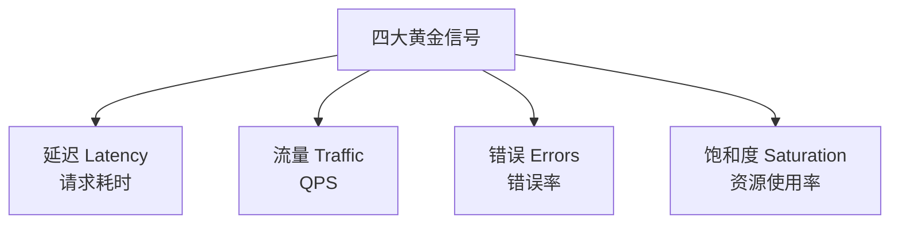
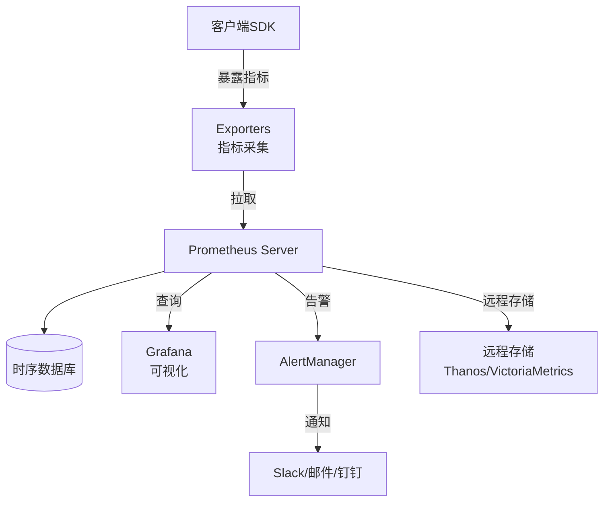
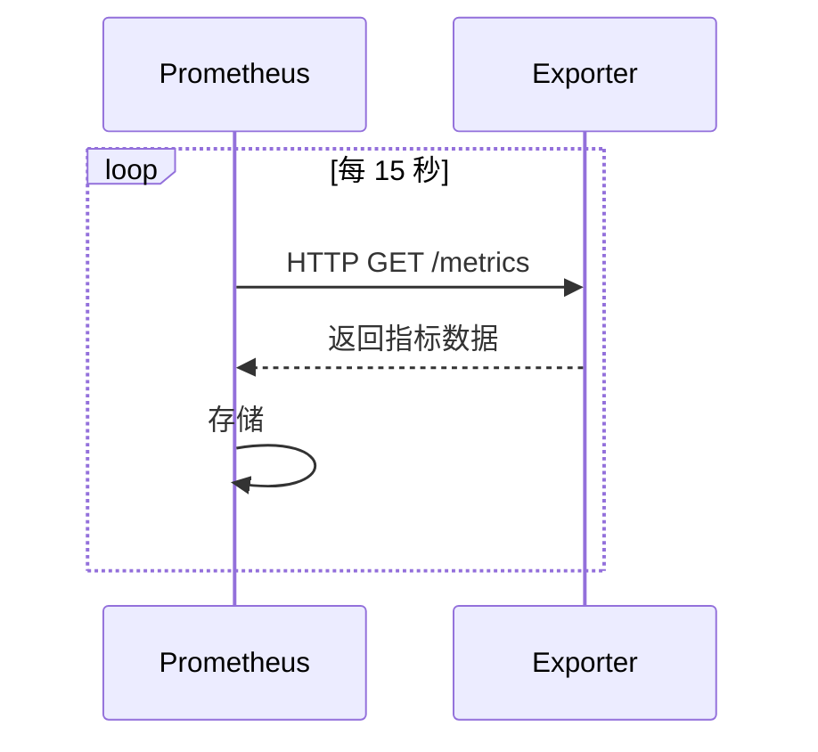
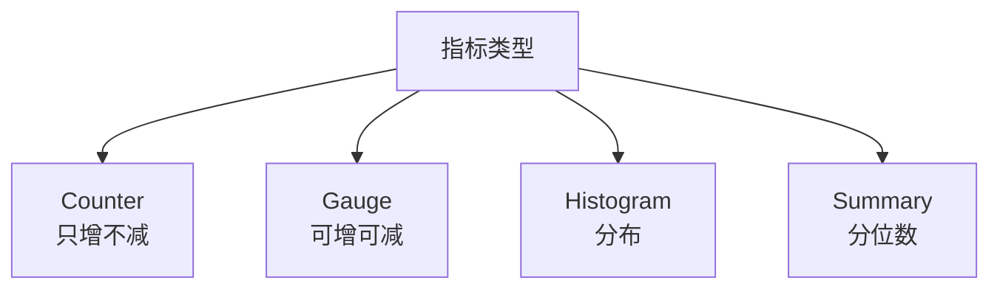
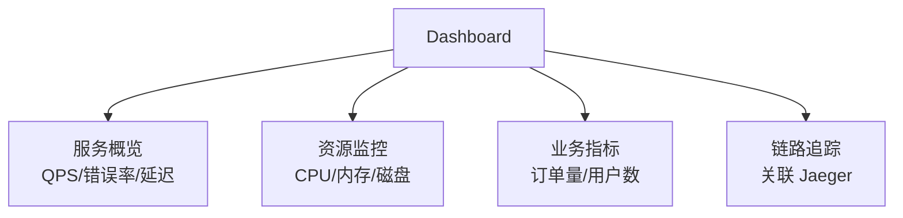
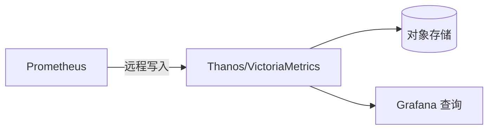

# 指标监控方案 Prometheus + Grafana

> 指标监控是可观测性的核心支柱，量化系统运行状态。Prometheus 已成为云原生指标监控的事实标准。

## 目录

- [一、监控目标](#一监控目标)
- [二、Prometheus 架构](#二prometheus-架构)
- [三、数据模型](#三数据模型)
- [四、PromQL](#四promql)
- [五、服务监控](#五服务监控)
- [六、告警](#六告警)
- [七、Grafana 可视化](#七grafana-可视化)
- [八、相关资料](#八相关资料)

## 一、监控目标

### 1.1 Google 黄金信号



### 1.2 USE 方法（资源监控）

| 维度 | 说明 | 示例 |
|------|------|------|
| Utilization | 使用率 | CPU 70% |
| Saturation | 饱和度 | 队列长度 |
| Errors | 错误 | 网络丢包 |

### 1.3 RED 方法（服务监控）

| 维度 | 说明 |
|------|------|
| Rate | 请求速率 |
| Errors | 错误率 |
| Duration | 响应时长 |

## 二、Prometheus 架构



### 2.1 核心组件

| 组件 | 职责 |
|------|------|
| **Prometheus Server** | 拉取、存储、查询指标 |
| **Exporters** | 暴露指标端点 |
| **AlertManager** | 告警路由与通知 |
| **Pushgateway** | 短任务指标推送 |
| **Grafana** | 可视化展示 |

### 2.2 拉模式（Pull）



优势：
- 主动控制采集频率
- 简单调试（直接 curl）
- 自动服务发现

劣势：
- 短任务不适合（用 Pushgateway）
- 防火墙限制（用 Push 模式）

## 三、数据模型

### 3.1 指标类型



| 类型 | 说明 | 示例 |
|------|------|------|
| Counter | 累计值 | 请求总数、错误总数 |
| Gauge | 当前值 | CPU 使用率、内存 |
| Histogram | 分布统计 | P95/P99 延迟 |
| Summary | 客户端分位数 | P95/P99（不可聚合） |

### 3.2 指标命名

```
{namespace}_{subsystem}_{name}_{unit}_{type}

例：
http_requests_total         (Counter)
node_memory_MemAvailable_bytes  (Gauge)
http_request_duration_seconds_bucket  (Histogram)
```

### 3.3 标签（Labels）

```
http_requests_total{
  method="POST",
  path="/api/orders",
  status="200",
  instance="10.0.0.1:8080"
}
```

标签是维度，相同指标名不同标签是不同的时间序列。

## 四、PromQL

### 4.1 基础查询

```promql
# 当前 CPU 使用率
node_cpu_seconds_total{mode="idle"}[5m]

# HTTP 总请求数
http_requests_total

# 每秒请求数（QPS）
rate(http_requests_total[5m])

# 错误率
rate(http_requests_total{status=~"5.."}[5m]) / rate(http_requests_total[5m])
```

### 4.2 聚合查询

```promql
# 所有实例 QPS 总和
sum(rate(http_requests_total[5m]))

# 按路径分组的 QPS
sum by(path) (rate(http_requests_total[5m]))

# 按实例排名前 10
topk(10, sum by(instance) (rate(http_requests_total[5m])))

# 平均延迟
rate(http_request_duration_seconds_sum[5m]) / rate(http_request_duration_seconds_count[5m])

# P99 延迟
histogram_quantile(0.99, rate(http_request_duration_seconds_bucket[5m]))
```

### 4.3 运算

```promql
# CPU 使用率 = 1 - idle
1 - avg(rate(node_cpu_seconds_total{mode="idle"}[5m]))

# 内存使用率
1 - (node_memory_MemAvailable_bytes / node_memory_MemTotal_bytes)

# 容量预警：当前QPS / 单机容量
sum(rate(http_requests_total[5m])) / 5000
```

## 五、服务监控

### 5.1 应用埋点

```java
// Spring Boot Actuator + Micrometer
@Service
public class OrderService {
    private final Counter orderCounter;
    private final Timer orderTimer;

    public OrderService(MeterRegistry registry) {
        this.orderCounter = Counter.builder("orders_created")
            .description("Number of orders created")
            .tag("service", "order")
            .register(registry);
        this.orderTimer = Timer.builder("order_processing_duration")
            .description("Order processing time")
            .register(registry);
    }

    public Order createOrder(OrderRequest req) {
        return orderTimer.record(() -> {
            Order order = doCreate(req);
            orderCounter.increment();
            return order;
        });
    }
}
```

```python
# Python + prometheus_client
from prometheus_client import Counter, Histogram, start_http_server

REQUESTS = Counter('http_requests_total', 'Total HTTP Requests', ['method', 'path', 'status'])
LATENCY = Histogram('http_request_duration_seconds', 'HTTP Request Duration', ['path'])

@app.route('/api/orders', methods=['POST'])
def create_order():
    start = time.time()
    try:
        result = process()
        REQUESTS.labels(method='POST', path='/api/orders', status='200').inc()
        return result
    except Exception:
        REQUESTS.labels(method='POST', path='/api/orders', status='500').inc()
        raise
    finally:
        LATENCY.labels(path='/api/orders').observe(time.time() - start)

start_http_server(9090)  # 暴露 /metrics
```

### 5.2 基础设施监控

| Exporter | 监控对象 |
|---------|---------|
| node_exporter | 主机 CPU/内存/磁盘 |
| mysql_exporter | MySQL |
| redis_exporter | Redis |
| kafka_exporter | Kafka |
| blackbox_exporter | HTTP/TCP 探测 |
| kube-state-metrics | K8s 资源状态 |

### 5.3 服务发现

```yaml
# Kubernetes 服务发现
scrape_configs:
- job_name: 'kubernetes-pods'
  kubernetes_sd_configs:
  - role: pod
  relabel_configs:
  - source_labels: [__meta_kubernetes_pod_annotation_prometheus_io_scrape]
    action: keep
    regex: true
  - source_labels: [__meta_kubernetes_pod_annotation_prometheus_io_port]
    action: replace
    target_label: __address__
    regex: (.+)
    replacement: $1
```

## 六、告警

### 6.1 告警规则

```yaml
groups:
- name: example
  rules:
  # 高 CPU 告警
  - alert: HighCpuUsage
    expr: 100 - (avg by(instance) (rate(node_cpu_seconds_total{mode="idle"}[5m])) * 100) > 80
    for: 5m
    labels:
      severity: warning
    annotations:
      summary: "CPU usage high on {{ $labels.instance }}"
      description: "CPU usage is {{ $value }}%"

  # 服务错误率高
  - alert: HighErrorRate
    expr: |
      sum(rate(http_requests_total{status=~"5.."}[5m]))
      /
      sum(rate(http_requests_total[5m])) > 0.05
    for: 2m
    labels:
      severity: critical
    annotations:
      summary: "High error rate"
      description: "Error rate is {{ $value | humanizePercentage }}"

  # 节点宕机
  - alert: NodeDown
    expr: up{job="node"} == 0
    for: 1m
    labels:
      severity: critical
    annotations:
      summary: "Node {{ $labels.instance }} down"
```

### 6.2 AlertManager 路由

```yaml
route:
  receiver: default
  group_by: ['alertname', 'cluster']
  group_wait: 30s
  group_interval: 5m
  repeat_interval: 3h
  routes:
  - match:
      severity: critical
    receiver: oncall
    group_wait: 0s
  - match:
      severity: warning
    receiver: slack

receivers:
- name: default
  email_configs:
  - to: team@example.com
- name: oncall
  pagerduty_configs:
  - service_key: xxx
- name: slack
  slack_configs:
  - api_url: https://hooks.slack.com/...
```

### 6.3 告警分级

| 级别 | 响应时效 | 通知方式 |
|------|---------|---------|
| P0 Critical | 立即 | 电话+短信+IM |
| P1 High | 5分钟 | 短信+IM |
| P2 Medium | 30分钟 | IM |
| P3 Low | 工作日 | 邮件 |

## 七、Grafana 可视化

### 7.1 Dashboard 设计



### 7.2 推荐面板

| 面板 | 用途 |
|------|------|
| Stat | 单值显示 |
| Graph | 时间序列 |
| Gauge | 仪表盘 |
| Table | 表格 |
| Heatmap | 热力图 |
| Log | 日志 |

### 7.3 黄金 Dashboard

```
1. QPS：sum(rate(http_requests_total[5m])) by (service)
2. 错误率：sum(rate(http_requests_total{status=~"5.."}[5m])) / sum(rate(http_requests_total[5m]))
3. P99 延迟：histogram_quantile(0.99, rate(http_request_duration_seconds_bucket[5m]))
4. CPU：100 - avg(rate(node_cpu_seconds_total{mode="idle"}[5m])) * 100
5. 内存：1 - node_memory_MemAvailable_bytes / node_memory_MemTotal_bytes
```

## 八、扩展与高可用

### 8.1 Prometheus 单点问题

Prometheus 默认无高可用，扩展方案：

| 方案 | 特点 |
|------|------|
| 双活 Prometheus | 各自独立采集，Grafana 聚合 |
| Thanos | 长期存储 + 全局查询 |
| Cortex/Mimir | 多租户 + 水平扩展 |
| VictoriaMetrics | 高性能 + 集群版 |

### 8.2 长期存储



## 九、相关资料

- [Prometheus 官方文档](https://prometheus.io/docs/)
- [PromQL 教程](https://prometheus.io/docs/prometheus/latest/querying/basics/)
- [Grafana 官方文档](https://grafana.com/docs/)
- [Google SRE 监控](https://sre.google/sre-book/monitoring-distributed-systems/)
- [Awesome Prometheus](https://github.com/roaldnefs/awesome-prometheus)
