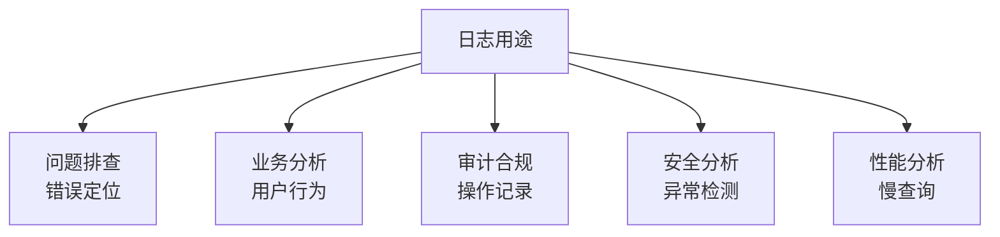
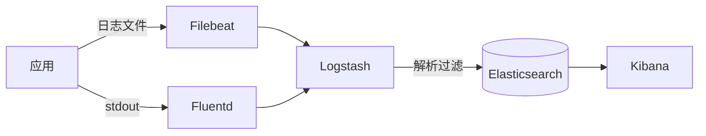
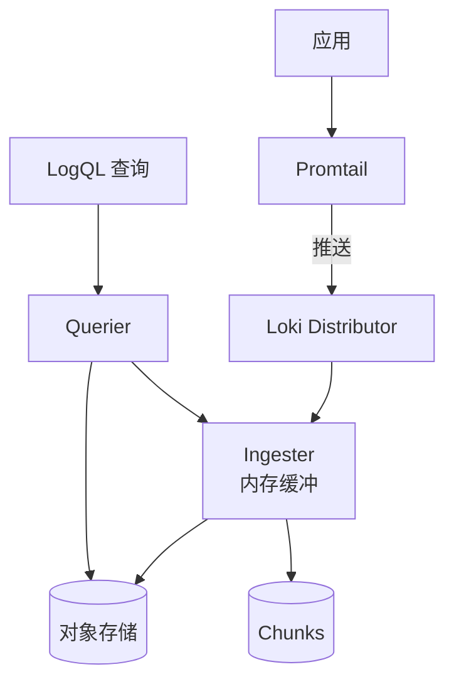
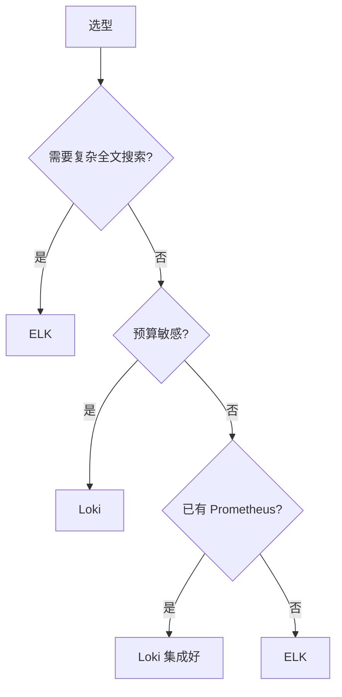
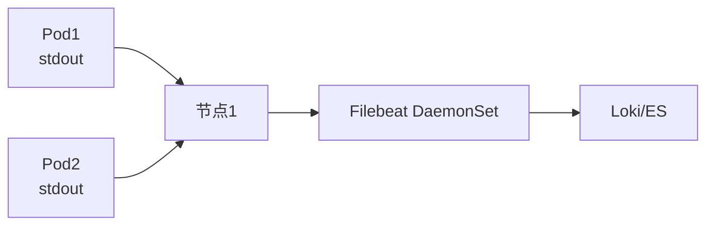

# 日志聚合方案 ELK 与 Loki

> 日志是排查问题的关键依据，分布式系统下日志分散在多机，需集中收集、存储、查询。ELK 与 Loki 是两大主流方案。

## 目录

- [一、日志的价值与挑战](#一日志的价值与挑战)
- [二、日志规范](#二日志规范)
- [三、ELK 架构](#三elk-架构)
- [四、Loki 架构](#四loki-架构)
- [五、ELK vs Loki](#五elk-vs-loki)
- [六、云原生日志](#六云原生日志)
- [七、相关资料](#七相关资料)

## 一、日志的价值与挑战

### 1.1 日志用途



### 1.2 分布式日志挑战

| 挑战 | 说明 |
|------|------|
| 日志分散 | 多机多容器 |
| 格式不统一 | 难以查询 |
| 量大 | TB/天 |
| 关联难 | 跨服务追踪 |

## 二、日志规范

### 2.1 日志级别

| 级别 | 使用场景 | 是否生产输出 |
|------|---------|------------|
| ERROR | 错误、异常 | ✓ |
| WARN | 警告、潜在问题 | ✓ |
| INFO | 关键业务节点 | ✓ |
| DEBUG | 调试细节 | 关闭 |
| TRACE | 详细流程 | 关闭 |

### 2.2 结构化日志

```json
{
  "timestamp": "2026-08-17T10:30:00Z",
  "level": "INFO",
  "service": "order-service",
  "trace_id": "abc123",
  "span_id": "def456",
  "user_id": "u100",
  "message": "Order created",
  "order_id": "ORD-001",
  "amount": 99.5,
  "duration_ms": 45
}
```

### 2.3 日志最佳实践

```python
# 错误：无上下文
logger.error("Failed to create order")

# 正确：带上下文
logger.info("Order created",
    extra={
        "order_id": order_id,
        "user_id": user_id,
        "amount": amount,
        "duration_ms": duration
    }
)
```

**原则**：
- 包含 trace_id 用于链路追踪
- 关键字段独立（user_id、order_id）
- 不打印敏感信息（密码、身份证）
- 不打印大对象（用摘要+ID）

## 三、ELK 架构

### 3.1 经典架构



### 3.2 组件职责

| 组件 | 职责 | 特点 |
|------|------|------|
| **Filebeat** | 采集日志 | 轻量、Go 编写 |
| **Logstash** | 解析过滤 | 功能强、JRuby 慢 |
| **Elasticsearch** | 存储搜索 | 倒排索引、强大 |
| **Kibana** | 可视化 | 图表丰富 |

### 3.3 Filebeat 配置

```yaml
filebeat.inputs:
- type: log
  paths:
    - /var/log/app/*.log
  fields:
    service: order-service
    env: prod
  json.keys_under_root: true

output.logstash:
  hosts: ["logstash:5044"]

# 或直接输出到 ES
output.elasticsearch:
  hosts: ["es:9200"]
  index: "app-logs-%{+yyyy.MM.dd}"
```

### 3.4 Logstash 解析

```
input {
  beats { port => 5044 }
}

filter {
  json {
    source => "message"
  }
  grok {
    match => { "message" => "%{TIMESTAMP_ISO8601:timestamp} %{LOGLEVEL:level} %{GREEDYDATA:msg}" }
  }
  date {
    match => ["timestamp", "ISO8601"]
  }
  mutate {
    remove_field => ["message", "host"]
  }
}

output {
  elasticsearch {
    hosts => ["es:9200"]
    index => "logs-%{[@metadata][version]}-%{+YYYY.MM.dd}"
  }
}
```

### 3.5 Kibana 查询

```
# 查询错误日志
level: ERROR AND service: order-service

# 查询特定用户
user_id: u100

# 时间范围 + 关键字
@timestamp: ["now-1h", "now"] AND message: "timeout"

# 聚合统计
group by: error_type
```

## 四、Loki 架构

### 4.1 设计理念

Loki 只索引标签，不索引日志内容，存储成本低：

```mermaid
flowchart LR
    A[日志] --> B[Loki]
    B --> C[标签索引<br/>service/env/host]
    B --> D[日志内容压缩存储<br/>不索引]
    Note over B: 仅索引元数据
```

### 4.2 架构



### 4.3 LogQL 查询

```
# 简单查询
{service="order-service"}

# 带过滤
{service="order-service"} |= "error"

# 正则匹配
{service="order-service"} |~ "timeout.*retry"

# JSON 字段过滤
{service="order-service"} | json | level="ERROR"

# 统计 QPS
rate({service="order-service"}[5m])

# 直方图
quantile_over_time(0.99, {service="order-service"} | json | unwrap duration_ms [5m])
```

### 4.4 Promtail 配置

```yaml
scrape_configs:
- job_name: app-logs
  static_configs:
  - targets: [localhost]
    labels:
      job: app
      service: order-service
      __path__: /var/log/app/*.log
  pipeline_stages:
  - json:
      expressions:
        level: level
        user_id: user_id
        message: message
  - labels:
      level:
```

## 五、ELK vs Loki

### 5.1 对比

| 维度 | ELK | Loki |
|------|-----|------|
| 索引 | 全文索引 | 仅标签索引 |
| 存储 | 大（10x原始） | 小（1x压缩） |
| 查询 | 强大全文 | 简单过滤 |
| 成本 | 高 | 低 |
| 复杂度 | 高 | 低 |
| 适用 | 复杂搜索 | 监控排查 |

### 5.2 存储对比

```
原始日志：1TB/天
ELK：5-10TB（含索引）
Loki：100-300GB（仅压缩）

成本对比：Loki 节省 80%+
```

### 5.3 选型决策



## 六、云原生日志

### 6.1 K8s 日志采集



三种采集方式：

| 方式 | 说明 | 优缺点 |
|------|------|-------|
| 节点级 DaemonSet | 每节点一个采集器 | 资源占用低、推荐 |
| Sidecar | 每 Pod 一个采集器 | 资源占用高 |
| 应用直推 | 应用直接发送 | 需 SDK |

### 6.2 Filebeat DaemonSet

```yaml
apiVersion: apps/v1
kind: DaemonSet
metadata:
  name: filebeat
spec:
  template:
    spec:
      containers:
      - name: filebeat
        image: docker.elastic.co/beats/filebeat:8.5.0
        volumeMounts:
        - name: varlog
          mountPath: /var/log
        - name: varlibdockercontainers
          mountPath: /var/lib/docker/containers
          readOnly: true
      volumes:
      - name: varlog
        hostPath:
          path: /var/log
      - name: varlibdockercontainers
        hostPath:
          path: /var/lib/docker/containers
```

### 6.3 容器日志标准

```python
# 应用日志输出到 stdout/stderr
import logging
logging.basicConfig(stream=sys.stdout, level=logging.INFO)
logger = logging.getLogger(__name__)

logger.info("Order created", extra={
    "order_id": order_id,
    "trace_id": trace_id
})
```

容器化最佳实践：
- 日志输出到 stdout/stderr
- 不写文件（除非必要）
- 结构化 JSON 格式
- 包含 trace_id

## 七、日志关联追踪


详见 [OpenTelemetry.md](./OpenTelemetry.md)

## 八、相关资料

- [Elastic 官方文档](https://www.elastic.co/guide/index.html)
- [Loki 官方文档](https://grafana.com/docs/loki/latest/)
- [Filebeat 文档](https://www.elastic.co/guide/en/beats/filebeat/current/filebeat-overview.html)
- [日志最佳实践 - 12 Factor](https://12factor.net/logs)
