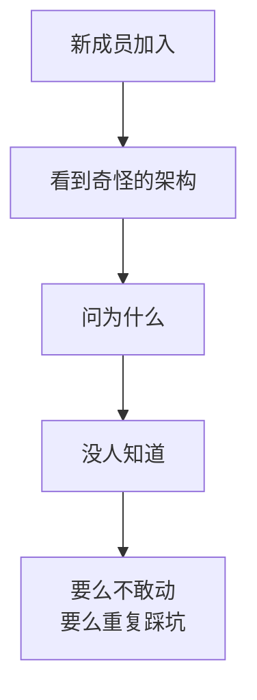
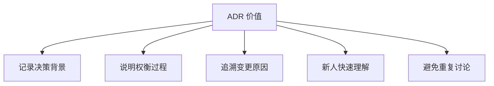
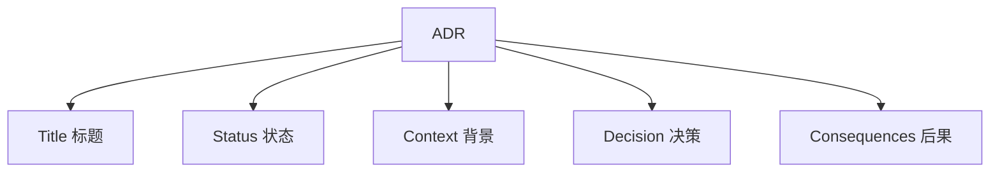
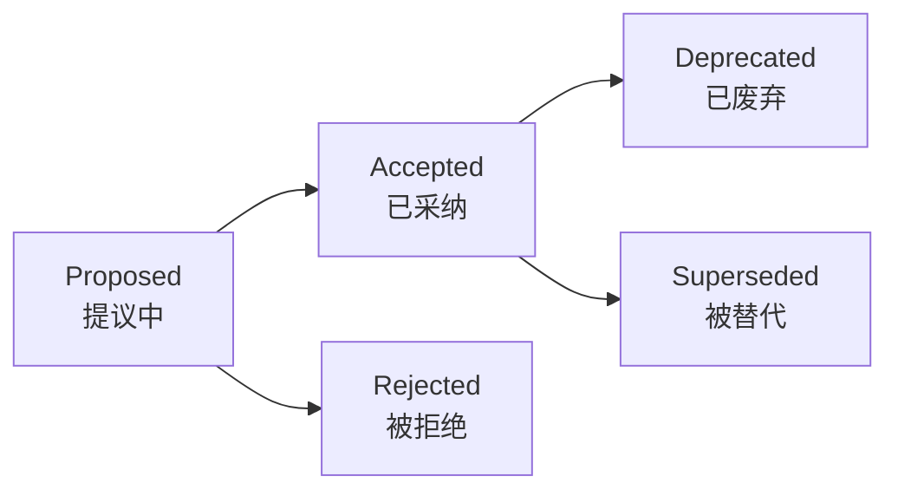
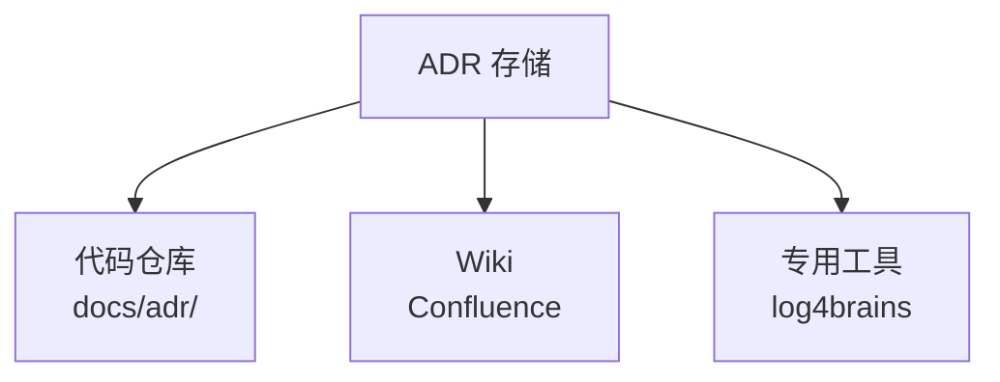
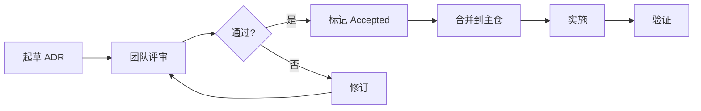

# ADR 架构决策记录

> ADR (Architecture Decision Record) 是记录架构决策的轻量文档，让每个技术选择都有迹可循，避免"为什么这么设计"的困惑。

## 目录

- [一、为什么需要 ADR](#一为什么需要-adr)
- [二、ADR 结构](#二adr-结构)
- [三、ADR 模板](#三adr-模板)
- [四、ADR 示例](#四adr-示例)
- [五、ADR 管理](#五adr-管理)
- [六、ADR vs 其他文档](#六adr-vs-其他文档)
- [七、相关资料](#七相关资料)

## 一、为什么需要 ADR

### 1.1 痛点



常见问题：
- "为什么用 Kafka 不用 RabbitMQ？"
- "为什么订单服务和库存服务合并了？"
- "为什么不用 GraphQL？"
- "这个奇怪的接口设计是为啥？"

### 1.2 ADR 的价值



### 1.3 何时写 ADR

| 场景 | 是否写 ADR |
|------|-----------|
| 选 Kafka 还是 RabbitMQ | ✓ |
| 改一个 Bug | ✗ |
| 微服务拆分边界 | ✓ |
| 重构某方法 | ✗ |
| 数据库选型 | ✓ |
| 引入新框架 | ✓ |
| API 版本策略 | ✓ |
| 命名规范 | 视情况 |

**判断标准**：影响架构、有多个选项、未来可能被质疑。

## 二、ADR 结构

### 2.1 标准 ADR（Michael Nygard 版）



### 2.2 各部分说明

| 部分 | 说明 | 示例 |
|------|------|------|
| **Title** | 简短描述决策 | 使用 Kafka 作为消息队列 |
| **Status** | 决策状态 | Proposed/Accepted/Deprecated |
| **Context** | 为什么需要决策 | 业务场景、约束、问题 |
| **Decision** | 我们选择什么 | 选择 Kafka，理由... |
| **Consequences** | 带来什么后果 | 优点、缺点、风险 |

### 2.3 状态流转



## 三、ADR 模板

### 3.1 简洁模板

```markdown
# ADR-001: 使用 Kafka 作为消息队列

- **Status**: Accepted
- **Date**: 2026-08-17
- **Deciders**: 架构组、订单团队、支付团队

## Context（背景）

订单系统需要异步处理支付通知、库存扣减、物流推送，预计日订单量 1000 万，峰值 QPS 10 万。现有 RabbitMQ 在 5 万 QPS 时出现性能瓶颈。

## Decision（决策）

选择 Apache Kafka 2.8+ 作为消息队列。

## Consequences（后果）

### 正面
- 吞吐量高，单机 10 万+ QPS
- 持久化、可重放
- 生态成熟

### 负面
- 不支持延迟队列（需自实现）
- 运维复杂度增加
- 消息丢失需业务层保证

### 中性
- 团队需学习 Kafka
- 引入 ZooKeeper/KRaft
```

### 3.2 详细模板

```markdown
# ADR-XXX: [决策标题]

## 元数据
- **Status**: [Proposed|Accepted|Rejected|Deprecated|Superseded]
- **Date**: YYYY-MM-DD
- **Deciders**: 参与决策人
- **Tags**: [backend|frontend|infra|security]

## Context（背景）
### 业务场景
[描述业务场景与问题]

### 约束
- 业务约束：[预算、时间、合规]
- 技术约束：[团队栈、历史包袱]
- 组织约束：[团队规模、能力]

## Decision Drivers（决策驱动因素）
1. [驱动因素1，如性能]
2. [驱动因素2，如成本]
3. [驱动因素3，如可维护性]

## Considered Options（候选方案）
### 方案A：[名称]
- 优点：...
- 缺点：...
- 成本：...

### 方案B：[名称]
- 优点：...
- 缺点：...
- 成本：...

### 方案C：[名称]
- 优点：...
- 缺点：...
- 成本：...

## Decision（决策）
选择方案X。

### 理由
1. [理由1]
2. [理由2]

## Consequences（后果）
### 正面影响
- [影响1]

### 负面影响
- [影响1]

### 风险与缓解
- 风险：[描述]
  缓解：[措施]

## Compliance（合规性验证）
- 如何验证决策落地？
- 如何衡量决策效果？

## Notes（备注）
- 相关 ADR：[ADR-001](./adr-001.md)
- 参考资料：[链接]
```

## 四、ADR 示例

### 4.1 示例：微服务拆分边界

```markdown
# ADR-002: 订单与库存服务拆分

- **Status**: Accepted
- **Date**: 2026-07-15

## Context

单体应用中订单与库存耦合，导致：
1. 库存调整影响订单下单
2. 性能瓶颈相互影响
3. 团队协作冲突频繁

## Decision

将订单与库存拆分为独立微服务，通过 RPC 通信，用 TCC 保证分布式事务。

## Consequences

### 正面
- 团队独立迭代
- 故障隔离
- 可独立扩展

### 负面
- 引入分布式事务复杂度
- 网络调用增加延迟
- 需要服务治理

### 风险
- TCC 实现复杂 → 引入 Seata
- 服务间调用失败 → 加重试 + 熔断
```

### 4.2 示例：数据库选型

```markdown
# ADR-003: 用户中心数据库选型

- **Status**: Accepted
- **Date**: 2026-06-01

## Context

用户中心需存储 5 亿用户数据，主要查询：
- 按手机号查用户
- 按用户 ID 批量查
- 按注册时间范围查

## Decision Drivers
1. 查询性能（P99 < 50ms）
2. 数据规模（5 亿行）
3. 运维成本
4. 团队熟悉度

## Considered Options

### MySQL 分库分表
- 优点：团队熟悉、事务强
- 缺点：分片复杂、扩容难

### MongoDB
- 优点：Schema 灵活、分片原生
- 缺点：事务弱、团队不熟

### TiDB
- 优点：兼容 MySQL、水平扩展
- 缺点：成本高、运维新

## Decision

选择 MySQL 分库分表（按 user_id 取模分 64 库）。

## Consequences

### 正面
- 团队无学习成本
- 运维成熟

### 负面
- 扩容需重新分片
- 跨片查询难

### 缓解
- 提前规划分片
- 异构索引解决跨片查询
```

### 4.3 示例：API 风格选型

```markdown
# ADR-004: REST vs GraphQL vs gRPC

- **Status**: Accepted
- **Date**: 2026-08-01

## Context

移动端需要灵活查询用户信息，Web 端固定字段，内部服务需要高性能。

## Decision

混合使用：
- 对外：REST（兼容性好）
- 移动端：GraphQL（按需取数据）
- 内部服务间：gRPC（高性能）

## Consequences

### 正面
- 各场景最优
- 内部性能高

### 负面
- 三套接口维护成本
- 团队需掌握三种技术
```

## 五、ADR 管理

### 5.1 存储位置



**推荐**：与代码同仓 `docs/adr/`

```
docs/
└── adr/
    ├── 0001-use-kafka-as-message-queue.md
    ├── 0002-split-order-inventory-service.md
    ├── 0003-user-center-database-selection.md
    ├── 0004-api-style-selection.md
    └── README.md
```

### 5.2 命名规范

```
ADR-XXXX-short-title.md

例：
ADR-0001-use-kafka-as-message-queue.md
ADR-0002-split-order-inventory-service.md
```

编号一旦分配不可重用。

### 5.3 工作流



### 5.4 何时废弃

```markdown
# ADR-001: 使用 Kafka 作为消息队列

- **Status**: Superseded by ADR-010
- **Date**: 2026-08-17

## Superseded By

[ADR-010: 切换到 Pulsar](./0010-switch-to-pulsar.md)

## Reason

业务发展需要多租户、跨地域复制，Kafka 实现复杂，Pulsar 原生支持。
```

## 六、ADR vs 其他文档

| 文档 | 用途 | 时机 |
|------|------|------|
| **ADR** | 单次决策记录 | 决策时 |
| **RFC** | 方案设计讨论 | 重大变更前 |
| **设计文档** | 系统详细设计 | 实施前 |
| **架构文档** | 全局架构说明 | 持续维护 |
| **README** | 项目入门 | 项目创建时 |

关系：ADR 是决策粒度，设计文档是方案粒度。

## 七、相关资料

- [Documenting Architecture Decisions - Michael Nygard](https://cognitect.com/blog/2011/11/15/documenting-architecture-decisions)
- [ADR GitHub Organization](https://adr.github.io/)
- [log4brains - ADR 管理工具](https://github.com/thomvaill/log4brains)
- [ADR Tools](https://github.com/npryce/adr-tools)
- [Awesome ADR](https://github.com/joelparkerhenderson/architecture-decision-record)
