# 技术选型框架

> 技术选型是架构师的高频工作，选错技术会带来长期成本。本文梳理系统化的选型框架与评估方法。

## 目录

- [一、选型原则](#一选型原则)
- [二、选型流程](#二选型流程)
- [三、评估维度](#三评估维度)
- [四、评估方法](#四评估方法)
- [五、常见技术选型](#五常见技术选型)
- [六、避坑指南](#六避坑指南)
- [七、相关资料](#七相关资料)

## 一、选型原则

### 1.1 核心原则

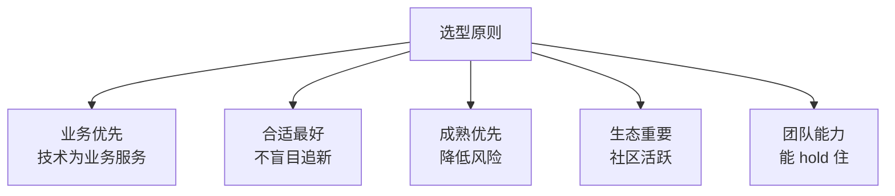

### 1.2 选型反模式

| 反模式 | 问题 |
|--------|------|
| 简历驱动 | 为用新技术而用 |
| 大厂崇拜 | 阿里在用所以我们用 |
| 流行度唯一 | Star 多就用 |
| 一步到位 | 想用 10 年 |
| 闭门造车 | 不调研 |

## 二、选型流程

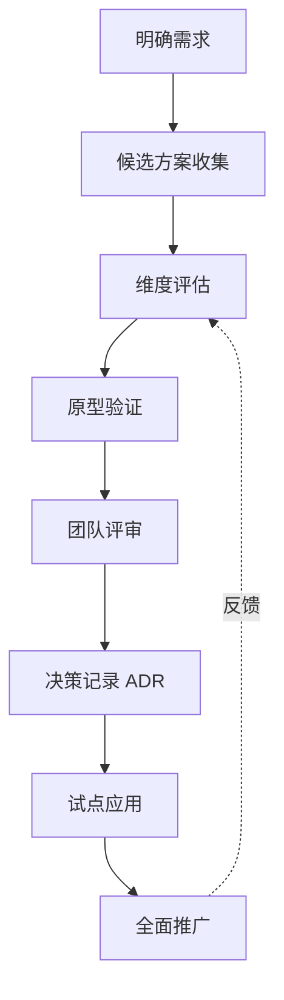

### 2.1 步骤详解

#### Step 1：明确需求

```markdown
## 需求清单

### 业务需求
- 日订单量：1000 万
- 峰值 QPS：10 万
- 数据保留：1 年

### 技术需求
- 延迟 P99 < 100ms
- 可用性 99.9%
- 水平扩展

### 约束
- 预算：月 50 万
- 团队：10 人 Java
- 时间：3 个月上线
```

#### Step 2：候选方案收集

来源：
- 同行业实践
- 技术社区推荐
- 大厂开源
- 咨询顾问

#### Step 3：维度评估

详见第三节。

#### Step 4：原型验证

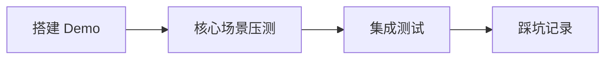

#### Step 5：团队评审

- 架构组评审
- 业务团队评审
- 运维评审

#### Step 6：ADR 记录

详见 [ADR 文档](./ADR架构决策记录.md)

## 三、评估维度

### 3.1 完整评估维度

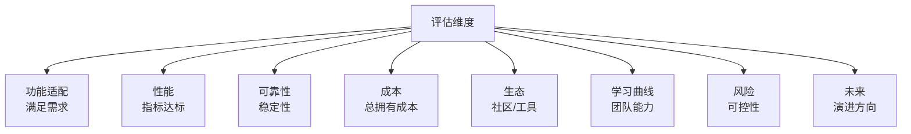

### 3.2 功能适配度

| 评估点 | 说明 |
|--------|------|
| 核心功能 | 是否满足业务核心需求 |
| 边界场景 | 极端场景是否支持 |
| 扩展能力 | 能否定制开发 |
| 集成能力 | 与现有系统集成 |

### 3.3 性能指标

```
- 吞吐量：QPS / TPS
- 延迟：P50 / P95 / P99
- 资源占用：CPU / 内存 / 磁盘
- 扩展性：水平 / 垂直
```

### 3.4 可靠性

```
- 成熟度：发布几年、生产案例
- 稳定性：故障频率、恢复时间
- 数据可靠性：是否丢数据
- 一致性：CAP 中位置
```

### 3.5 总拥有成本（TCO）

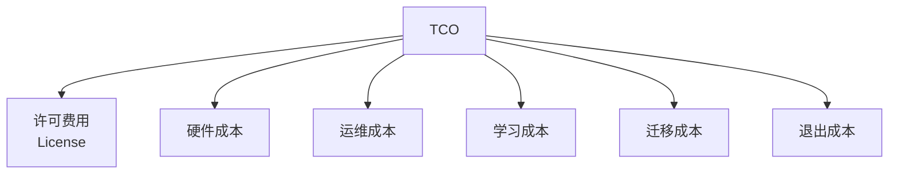

### 3.6 生态

| 维度 | 评估 |
|------|------|
| 社区活跃 | GitHub Star、Issue 响应 |
| 文档质量 | 官方文档、教程丰富度 |
| 工具链 | 监控、运维工具 |
| 人才市场 | 招聘难度 |

### 3.7 学习曲线

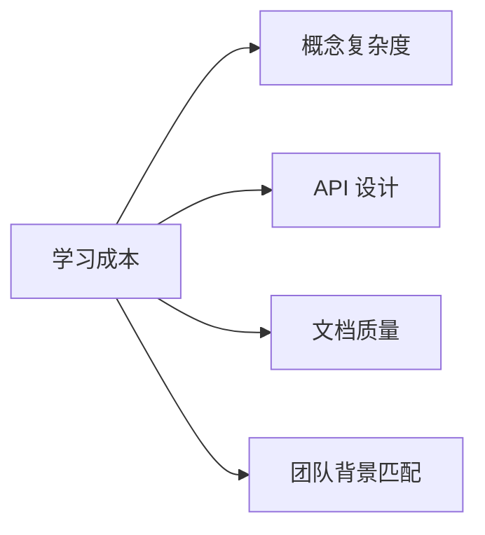

### 3.8 风险

```
- 厂商绑定：能否迁移
- 项目存续：维护方稳定性
- 安全漏洞：CVE 历史
- 版本兼容：升级是否破坏
```

## 四、评估方法

### 4.1 加权评分法

| 维度 | 权重 | 方案A | 方案B | 方案C |
|------|------|-------|-------|-------|
| 功能 | 30% | 8 | 9 | 7 |
| 性能 | 25% | 9 | 7 | 8 |
| 成本 | 20% | 7 | 6 | 9 |
| 生态 | 15% | 8 | 9 | 6 |
| 风险 | 10% | 7 | 8 | 9 |
| **总分** | 100% | **7.95** | **7.75** | **7.55** |

### 4.2 决策矩阵

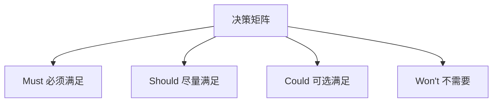

例：选 MQ
- Must：吞吐 10 万 QPS
- Should：顺序消息
- Could：事务消息
- Won't：跨语言客户端

### 4.3 PoC 验证

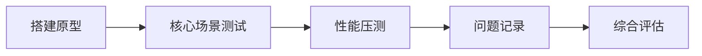

PoC 检查项：
- 核心功能可用性
- 性能是否达标
- 运维是否方便
- 文档是否准确
- 踩到的坑

### 4.4 参考调研

| 调研对象 | 价值 |
|---------|------|
| 同行业公司 | 直接借鉴 |
| 不同行业 | 启发思路 |
| 厂商案例 | 但要甄别 |
| 社区反馈 | 真实使用情况 |

## 五、常见技术选型

### 5.1 消息队列

| 维度 | Kafka | RocketMQ | RabbitMQ | Pulsar |
|------|-------|----------|----------|--------|
| 吞吐 | 极高 | 高 | 中 | 高 |
| 延迟 | 低 | 低 | 极低 | 低 |
| 顺序 | 分区 | 严格 | FIFO | 分区 |
| 事务 | 弱 | 强 | 弱 | 中 |
| 运维 | 中 | 中 | 低 | 高 |
| 适用 | 日志/大数据 | 金融订单 | 业务系统 | 多租户 |

**选型建议**：
- 日志收集：Kafka
- 订单交易：RocketMQ
- 业务解耦：RabbitMQ
- 大规模多租户：Pulsar

### 5.2 数据库

| 维度 | MySQL | PostgreSQL | MongoDB | TiDB |
|------|-------|-----------|---------|------|
| 事务 | 强 | 强 | 弱 | 强 |
| 扩展 | 分库分表 | 分库分表 | 原生分片 | 原生分布式 |
| Schema | 严格 | 严格 | 灵活 | 严格 |
| 学习 | 低 | 中 | 中 | 中 |
| 适用 | 通用 | 复杂查询 | 文档 | 海量数据 |

### 5.3 缓存

| 维度 | Redis | Memcached |
|------|-------|----------|
| 数据结构 | 丰富 | 仅 KV |
| 持久化 | 支持 | 不支持 |
| 集群 | 原生 | 客户端分片 |
| 适用 | 通用 | 纯缓存 |

### 5.4 服务框架

| 维度 | Spring Cloud | Dubbo | gRPC |
|------|-------------|-------|------|
| 协议 | HTTP | TCP | HTTP/2 |
| 性能 | 中 | 高 | 高 |
| 生态 | 丰富 | 中 | 中 |
| 多语言 | 支持 | 弱 | 强 |
| 适用 | Java 互联网 | Java 高性能 | 多语言 |

### 5.5 注册中心

| 维度 | Nacos | Eureka | Consul | ZooKeeper |
|------|-------|--------|--------|-----------|
| CAP | AP/CP | AP | CP | CP |
| 一致性 | 可选 | 弱 | 强 | 强 |
| 功能 | 注册+配置 | 注册 | 注册+KV | 通用 |
| 适用 | 互联网 | Spring Cloud | 多语言 | 强一致 |

### 5.6 网关

| 维度 | Spring Cloud Gateway | Zuul | Kong | Nginx+Lua |
|------|---------------------|------|------|-----------|
| 性能 | 中 | 中 | 高 | 高 |
| 扩展 | Java | Java | Lua | Lua |
| 生态 | Spring | Netflix | 丰富 | 成熟 |
| 适用 | Java | 老项目 | 多语言 | 高性能 |

## 六、避坑指南

### 6.1 常见坑

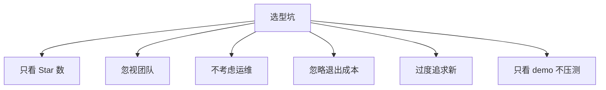

### 6.2 检查清单

选型前必问：

```markdown
## 选型检查清单

### 业务匹配
- [ ] 满足核心业务需求？
- [ ] 满足未来 1 年发展？
- [ ] 边界场景能处理？

### 技术匹配
- [ ] 性能指标达标？
- [ ] 与现有系统集成？
- [ ] 监控运维方案？

### 团队匹配
- [ ] 团队能学习掌握？
- [ ] 招聘市场有人才？
- [ ] 有外部支持？

### 商业匹配
- [ ] License 合规？
- [ ] 总成本可承受？
- [ ] 厂商稳定？

### 风险
- [ ] 厂商绑定程度？
- [ ] 迁移成本？
- [ ] 退出方案？
```

### 6.3 案例反思

#### 案例 1：盲目用 Kafka

**背景**：某团队日订单 1 万，选 Kafka 解耦。
**问题**：运维复杂，Kafka 集群经常出问题。
**反思**：业务量小用 RabbitMQ 即可。

#### 案例 2：跟风用微服务

**背景**：5 人团队直接上微服务。
**问题**：运维成本高，开发效率低。
**反思**：小团队单体优先。

#### 案例 3：过度追求分布式

**背景**：初创公司直接用 TiDB。
**问题**：成本高，DBA 难招。
**反思**：MySQL + 分库分表更合适。

## 七、选型决策树

### 7.1 数据库选型决策树

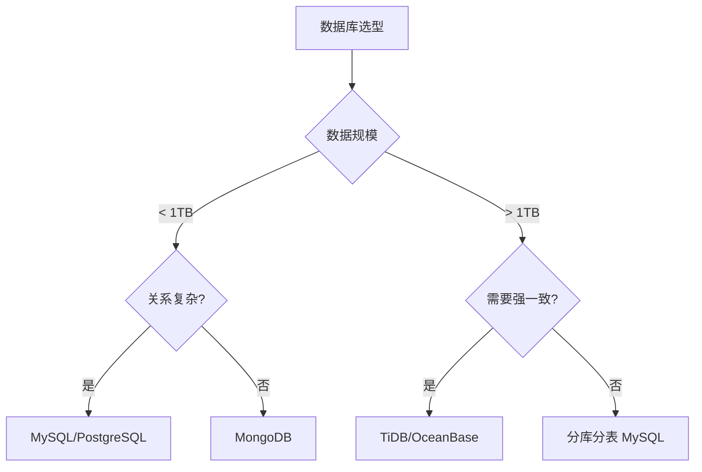

### 7.2 MQ 选型决策树

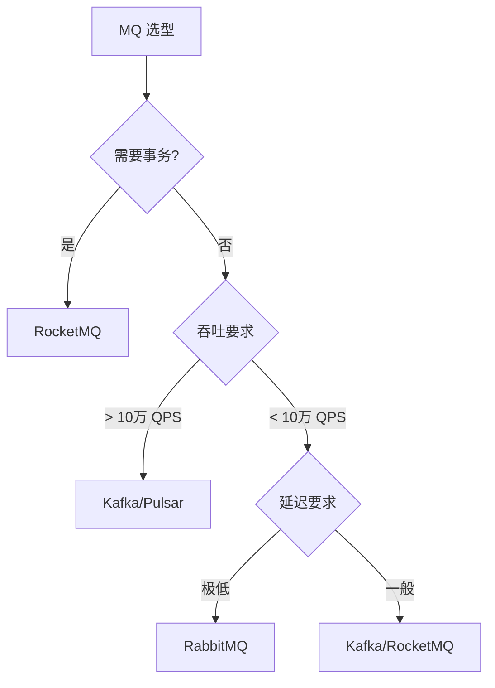

## 八、相关资料

- [ThoughtWorks Technology Radar](https://www.thoughtworks.com/radar)
- [云原生技术雷达](https://radar.cncf.io/)
- [DB-Engines - 数据库排名](https://db-engines.com/)
- [技术选型方法论](https://martinfowler.com/articles/enterprise-architecture.html)
- [The Architecture of Open Source Applications](http://aosabook.org/)
