# 架构师能力模型

> 架构师是技术与业务的桥梁，需要复合能力。本文梳理架构师的能力维度、成长路径与修炼方法。

## 目录

- [一、架构师定位](#一架构师定位)
- [二、能力维度](#二能力维度)
- [三、技术能力](#三技术能力)
- [四、业务能力](#四业务能力)
- [五、软技能](#五软技能)
- [六、成长路径](#六成长路径)
- [七、修炼方法](#七修炼方法)
- [八、相关资料](#八相关资料)

## 一、架构师定位

### 1.1 架构师是什么

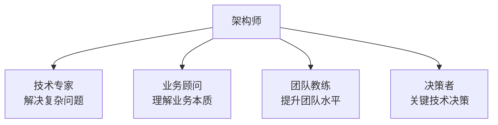

### 1.2 与开发的区别

| 维度 | 开发 | 架构师 |
|------|------|--------|
| 关注点 | 怎么实现 | 为什么这么做 |
| 视角 | 单个模块 | 整个系统 |
| 时间 | 当下需求 | 长期演进 |
| 沟通 | 团队内 | 跨团队/业务 |
| 决策 | 技术细节 | 技术方向 |

## 二、能力维度

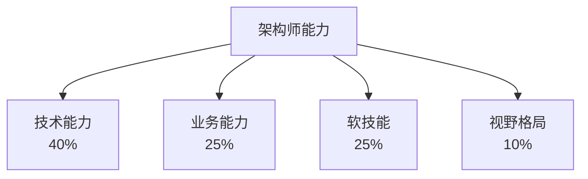

## 三、技术能力

### 3.1 技术广度

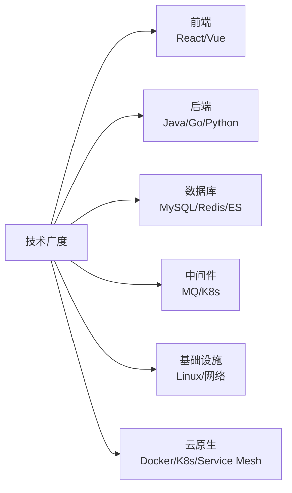

不要求精通，但需了解原理与适用场景。

### 3.2 技术深度

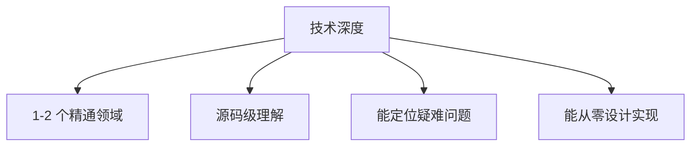

### 3.3 架构能力

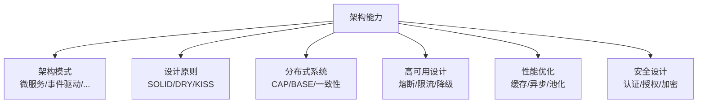

### 3.4 工程能力

| 能力 | 说明 |
|------|------|
| 代码能力 | 能写高质量代码 |
| 代码评审 | 把控代码质量 |
| 测试驱动 | 单测、集成测试 |
| CI/CD | 自动化部署 |
| DevOps | 监控、运维 |

## 四、业务能力

### 4.1 业务理解

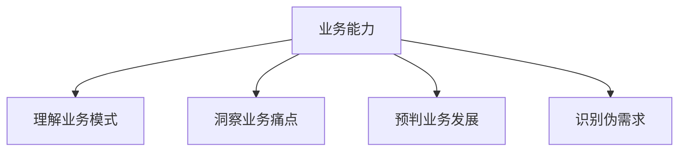

### 4.2 业务建模

- DDD 领域驱动设计
- 业务流程梳理
- 实体关系建模
- 限界上下文划分

### 4.3 业务沟通

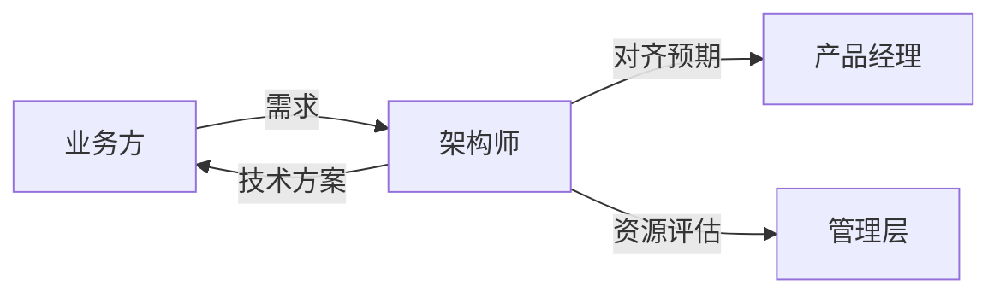

## 五、软技能

### 5.1 沟通能力

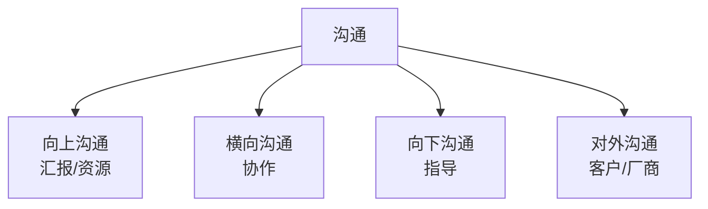

### 5.2 决策能力

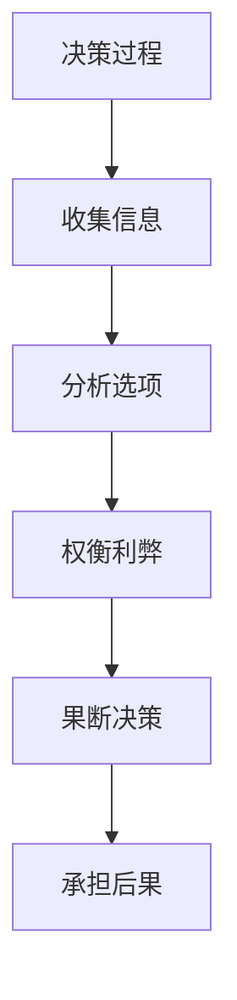

### 5.3 影响力

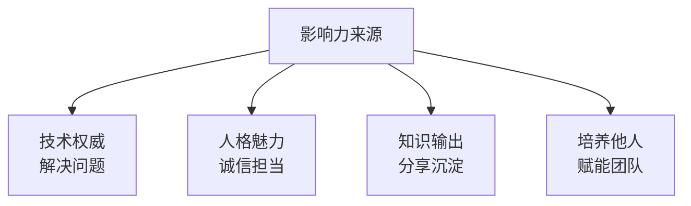

### 5.4 领导力

- 团队建设
- 人才培养
- 文化塑造
- 目标管理

## 六、成长路径

### 6.1 职级阶梯

### 6.2 各阶段重点

| 阶段 | 重点 | 周期 |
|------|------|------|
| 初级 | 实现功能、学习规范 | 1-2 年 |
| 中级 | 独立负责模块 | 2-4 年 |
| 高级 | 解决复杂问题、影响团队 | 4-7 年 |
| 专家 | 精通某领域、跨团队影响 | 7-10 年 |
| 架构师 | 系统设计、技术决策 | 10+ 年 |

### 6.3 关键转折点

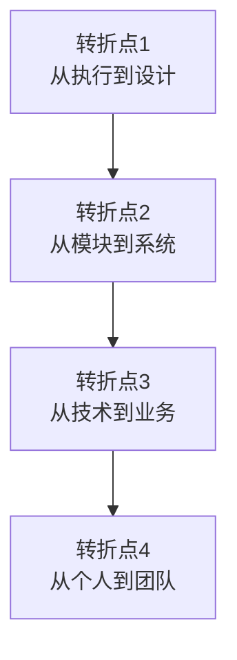

## 七、修炼方法

### 7.1 学习方法

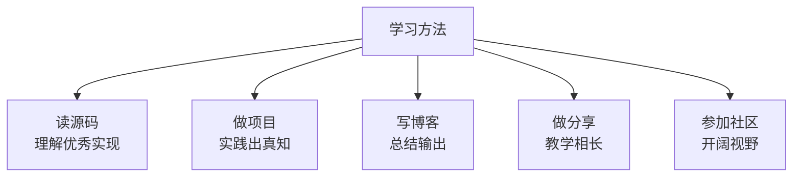

### 7.2 知识体系

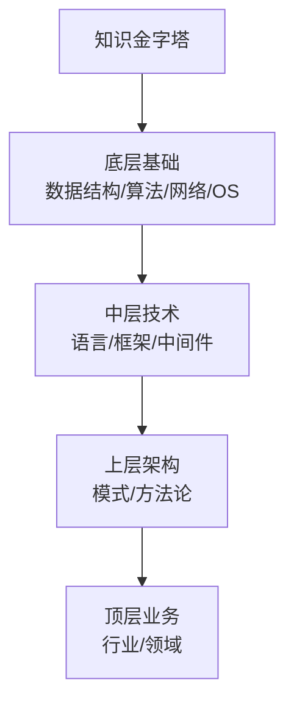

### 7.3 推荐书单

#### 计算机基础
- 《深入理解计算机系统》
- 《数据结构与算法分析》
- 《计算机网络：自顶向下方法》
- 《操作系统概念》

#### 架构相关
- 《架构整洁之道》Robert C. Martin
- 《领域驱动设计》Eric Evans
- 《微服务架构设计模式》Chris Richardson
- 《数据密集型应用系统设计》Martin Kleppmann
- 《大型网站技术架构》李智慧

#### 工程实践
- 《重构》Martin Fowler
- 《代码大全》Steve McConnell
- 《人月神话》Fred Brooks
- 《SRE：Google 运维解密》

#### 软技能
- 《非暴力沟通》
- 《高效能人士的七个习惯》
- 《技术领导之路》

### 7.4 实战训练

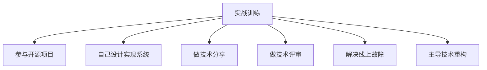

### 7.5 思维训练

- **第一性原理**：从本质出发思考
- **系统性思维**：看整体而非局部
- **长期思维**：考虑未来演进
- **权衡思维**：没有银弹，只有取舍
- **批判性思维**：质疑权威，独立判断

## 八、架构师的反模式

### 8.1 避免成为

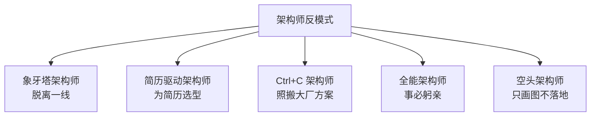

### 8.2 常见误区

| 误区 | 正确做法 |
|------|---------|
| 过度设计 | 满足当下+6个月演进 |
| 技术至上 | 业务驱动技术 |
| 一次性完美 | 持续演进 |
| 自己写 | 优先用成熟方案 |
| 不写代码 | 保持编码 |

## 九、相关资料

- [架构师能力模型 - 阿里技术](https://developer.aliyun.com/article/758621)
- 《架构整洁之道》Robert C. Martin
- 《技术领导之路》Michael Lopp
- [成为架构师](https://github.com/xitu/become-a-architect)
- [The Architect Elevator](https://architectelevator.com/)
