# 架构权衡 Architecture Tradeoffs

> 架构即权衡，没有银弹。每一个决策都是取舍。本文梳理常见权衡维度、决策框架与经典案例。

## 目录

- [一、权衡的本质](#一权衡的本质)
- [二、CAP 权衡](#二cap-权衡)
- [三、性能 vs 一致性](#三性能-vs-一致性)
- [四、简单 vs 灵活](#四简单-vs-灵活)
- [五、成本 vs 质量](#五成本-vs-质量)
- [六、权衡决策框架](#六权衡决策框架)
- [七、经典案例](#七经典案例)
- [八、相关资料](#八相关资料)

## 一、权衡的本质

### 1.1 没有银弹

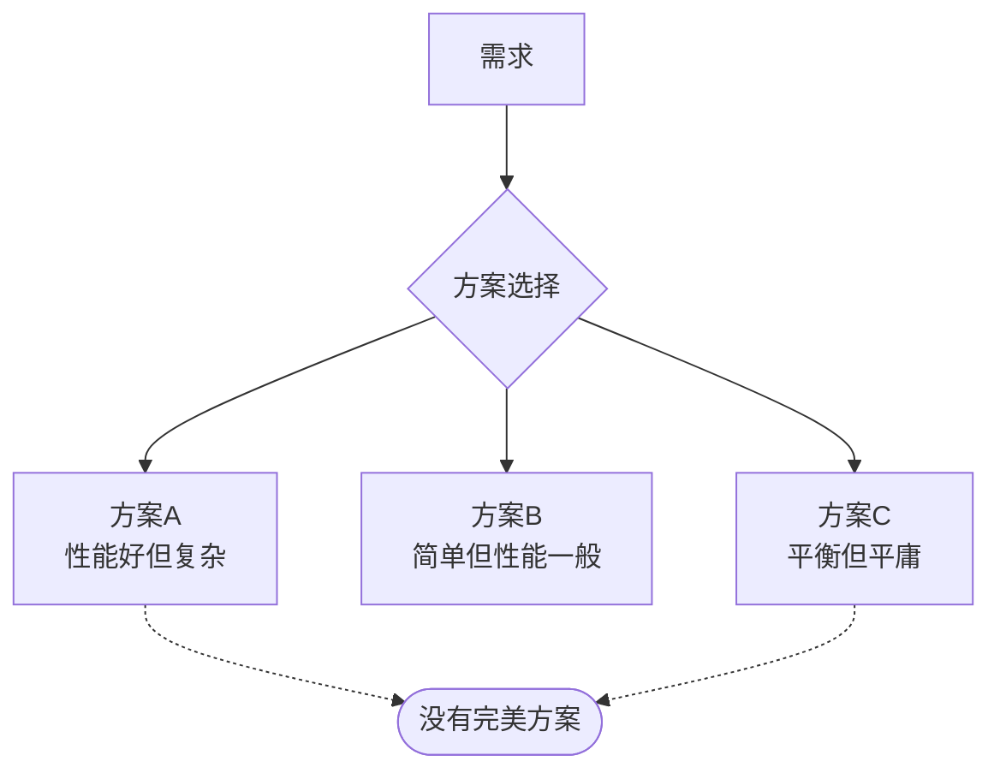

### 1.2 权衡三角

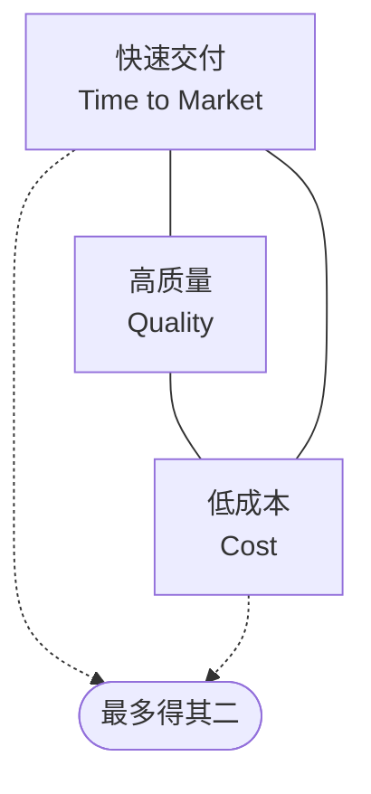

## 二、CAP 权衡

### 2.1 CAP 三选二

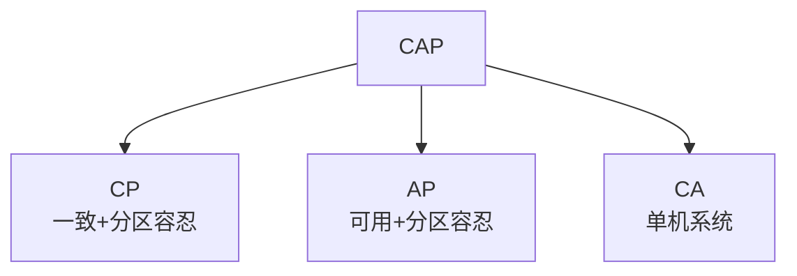

| 选择 | 适用场景 | 典型系统 |
|------|---------|---------|
| CP | 银行、配置中心 | ZooKeeper、etcd、HBase |
| AP | 互联网应用 | Cassandra、Eureka、DynamoDB |
| CA | 单机 | MySQL 单机 |

### 2.2 网络分区时的决策

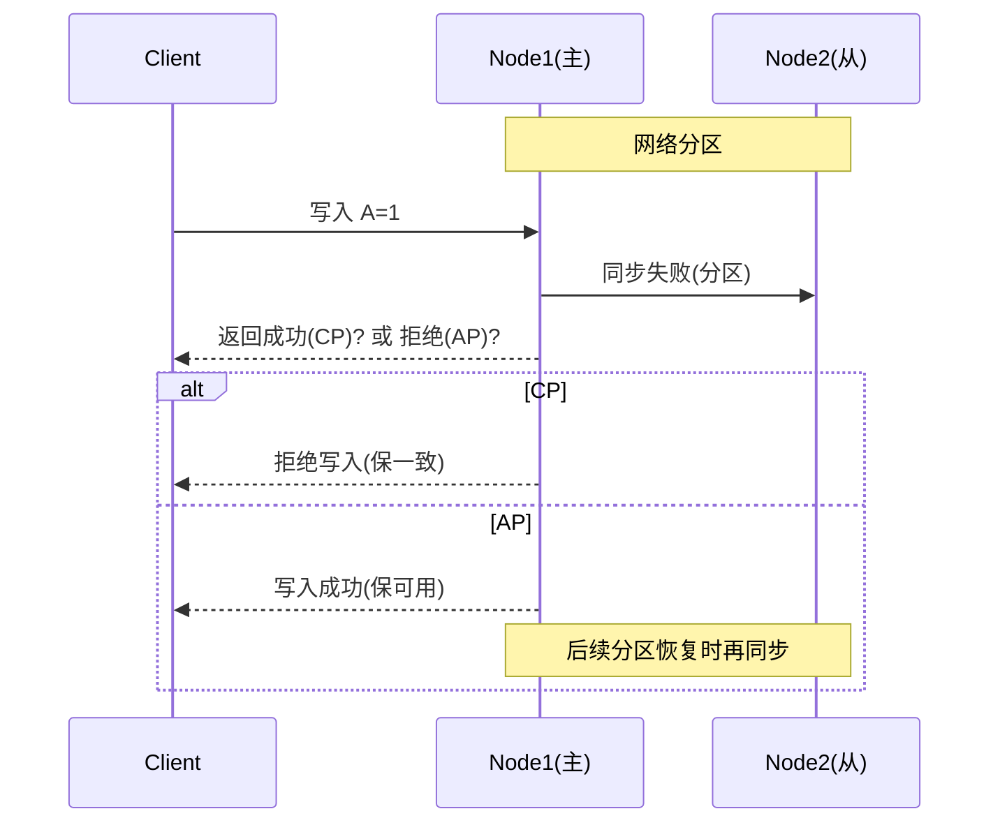

## 三、性能 vs 一致性

### 3.1 强一致 vs 最终一致

| 维度 | 强一致 | 最终一致 |
|------|-------|---------|
| 用户体验 | 看到立即一致 | 短暂不一致 |
| 性能 | 低（需同步） | 高（可异步） |
| 可用性 | 低（需多数派） | 高（任一节点可服务） |
| 实现 | 2PC、Paxos | MQ、异步复制 |

### 3.2 缓存一致性权衡

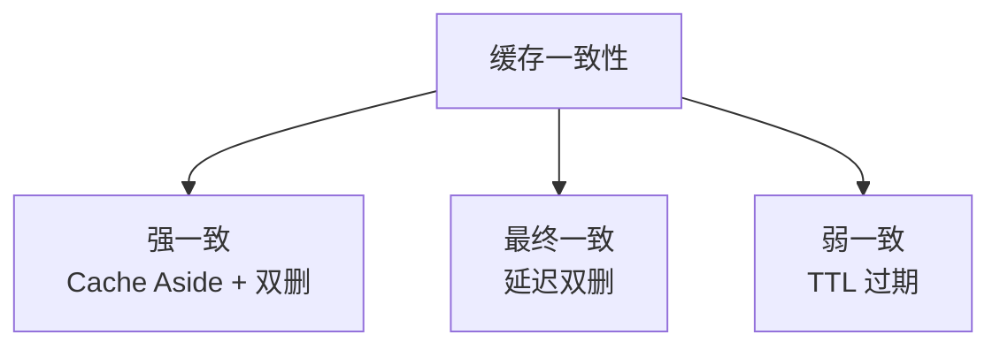

```
强一致：写 DB 后删缓存，读时回填 → 性能低
最终一致：写 DB 异步删缓存 → 性能高，短时不一致
弱一致：缓存 TTL 过期 → 性能最高，可能脏读
```

### 3.3 数据库隔离级别权衡

| 隔离级别 | 一致性 | 性能 | 适用 |
|---------|-------|------|------|
| Read Uncommitted | 最弱 | 最高 | 几乎不用 |
| Read Committed | 弱 | 高 | 大多数场景 |
| Repeatable Read | 中 | 中 | MySQL 默认 |
| Serializable | 强 | 低 | 资金交易 |

## 四、简单 vs 灵活

### 4.1 过度设计 vs 设计不足

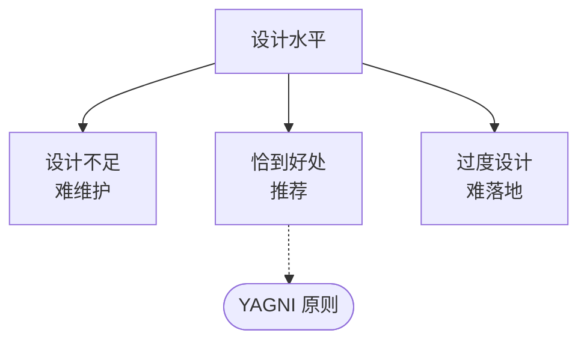

### 4.2 单体 vs 微服务

| 维度 | 单体 | 微服务 |
|------|------|--------|
| 复杂度 | 低 | 高 |
| 部署 | 简单 | 复杂 |
| 扩展 | 整体 | 独立 |
| 团队 | 小团队 | 多团队 |
| 运维 | 简单 | 复杂 |
| 故障 | 局部影响全局 | 隔离 |

**判断标准**：
- 团队 < 20 人：单体优先
- 业务领域清晰可拆：可微服务
- 运维能力跟上：否则别微服务

### 4.3 同步 vs 异步

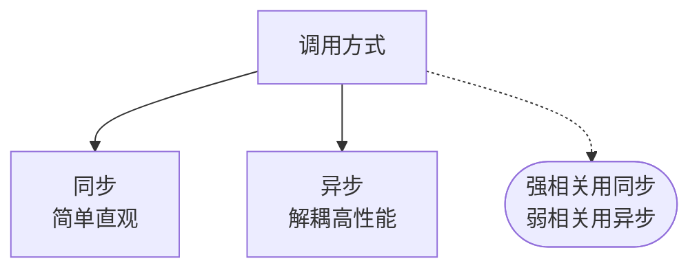

| 场景 | 选择 | 原因 |
|------|------|------|
| 下单+扣库存 | 同步 | 必须一起成功 |
| 下单+发短信 | 异步 | 不影响主流程 |
| 支付+通知 | 异步 | 可重试 |

## 五、成本 vs 质量

### 5.1 质量属性优先级

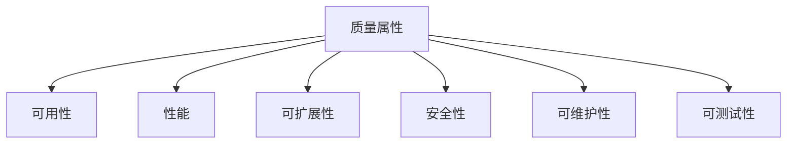

不能都要时，按业务排序：
- 银行：可用性 > 安全性 > 性能
- 游戏：性能 > 可用性 > 可维护性
- 创业产品：快速交付 > 完美架构

### 5.2 冗余 vs 成本

```
单机：成本 1x，可用性 99%
主从：成本 2x，可用性 99.9%
同城双活：成本 4x，可用性 99.99%
两地三中心：成本 6x，可用性 99.999%

每多一个 9，成本翻倍
```

### 5.3 自研 vs 采购 vs 开源

| 方式 | 成本 | 灵活性 | 维护 |
|------|------|--------|------|
| 自研 | 高 | 最高 | 自负责 |
| 开源 | 低 | 中 | 社区/自维护 |
| 商用 | 中 | 低 | 厂商支持 |

决策因素：
- 是否核心业务：核心自研
- 团队能力：能否 hold 住
- 时间紧迫度：紧急用商用

## 六、权衡决策框架

### 6.1 决策流程

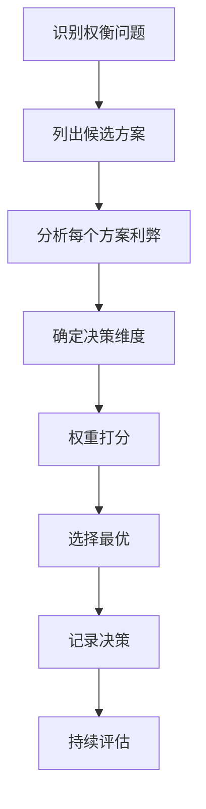

### 6.2 决策矩阵

| 方案 | 性能 | 一致性 | 复杂度 | 成本 | 总分 |
|------|------|--------|--------|------|------|
| 方案A | 9 | 8 | 5 | 6 | 28 |
| 方案B | 7 | 9 | 8 | 8 | 32 |
| 方案C | 8 | 7 | 7 | 7 | 29 |

加上业务权重：

```
总分 = 性能 × 30% + 一致性 × 30% + 复杂度 × 20% + 成本 × 20%
```

### 6.3 决策原则

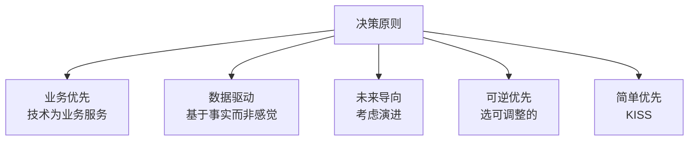

## 七、经典案例

### 7.1 案例一：电商订单一致性

**场景**：下单扣库存，要求不超卖

**方案对比**：

| 方案 | 一致性 | 性能 | 复杂度 |
|------|--------|------|--------|
| 同步锁扣 | 强 | 低 | 低 |
| Redis 预扣 + 异步落库 | 中 | 高 | 中 |
| TCC | 强 | 中 | 高 |
| Saga | 弱 | 高 | 中 |

**选择**：Redis 预扣 + 异步落库
**理由**：性能要求高，短暂不一致可接受（订单超时回滚）

### 7.2 案例二：朋友圈点赞数

**场景**：显示某条朋友圈的点赞数

**方案对比**：

| 方案 | 准确性 | 性能 | 成本 |
|------|--------|------|------|
| 实时 COUNT DB | 准确 | 低 | 低 |
| Redis 计数 | 准确 | 高 | 中 |
| HyperLogLog | 近似 | 极高 | 低 |

**选择**：Redis 计数
**理由**：实时性要求高，准确性要求高

### 7.3 案例三：配置中心选型

**场景**：需要选配置中心

| 方案 | 一致性 | 性能 | 可用性 |
|------|--------|------|--------|
| ZooKeeper | 强（CP） | 中 | 中 |
| etcd | 强（CP） | 中 | 高 |
| Nacos | 可选 | 高 | 高 |
| Apollo | 强 | 高 | 高 |

**选择**：Nacos（AP 模式）
**理由**：互联网场景可用性优先，配置短暂不一致可接受

### 7.4 案例四：消息队列选型

**场景**：订单系统解耦

| 方案 | 吞吐 | 延迟 | 可靠性 | 顺序 |
|------|------|------|--------|------|
| Kafka | 极高 | 低 | 高 | 分区有序 |
| RocketMQ | 高 | 低 | 极高 | 严格顺序 |
| RabbitMQ | 中 | 极低 | 高 | FIFO |
| Pulsar | 高 | 低 | 高 | 分区有序 |

**选择**：RocketMQ
**理由**：订单需要严格顺序 + 事务消息支持

## 八、反模式

### 8.1 避免的权衡

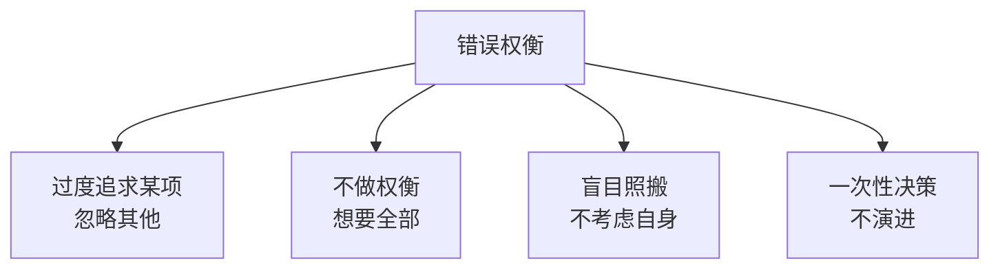

### 8.2 经典反模式

| 反模式 | 问题 | 正解 |
|--------|------|------|
| 简历驱动 | 为用新技术而用 | 业务驱动 |
| 大厂崇拜 | 照搬阿里方案 | 按自身规模 |
| 一步到位 | 设计未来10年 | 满足当下+6月 |
| 完美主义 | 追求100分 | 80分先上线 |

## 九、相关资料

- 《架构整洁之道》Robert C. Martin
- 《数据密集型应用系统设计》Martin Kleppmann
- [The Architecture of Open Source Applications](http://aosabook.org/)
- [PACELC: CAP 延伸](./PACELC定理.md)
- [Architecture Tradeoff Analysis Method](https://resources.sei.cmu.edu/library/view-all/software-architecture/)
