# 系统设计方法论

> 系统设计是架构师的核心工作，从需求到方案有一套完整方法论。本文梳理 4+1 视图、ADD 方法、设计流程与经典案例。

## 目录

- [一、系统设计概览](#一系统设计概览)
- [二、4+1 视图模型](#二41-视图模型)
- [三、ADD 方法](#三add-方法)
- [四、设计流程](#四设计流程)
- [五、设计原则](#五设计原则)
- [六、典型案例](#六典型案例)
- [七、相关资料](#七相关资料)

## 一、系统设计概览

### 1.1 什么是系统设计

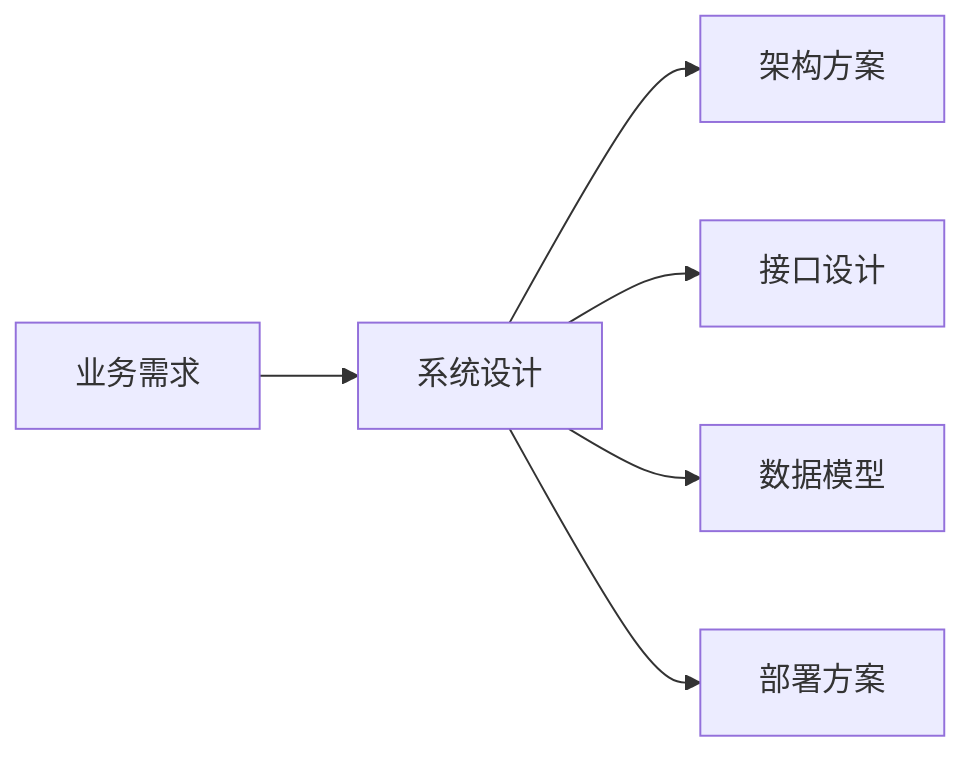

### 1.2 设计层次

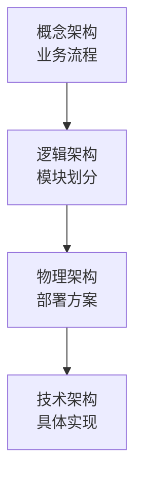

## 二、4+1 视图模型

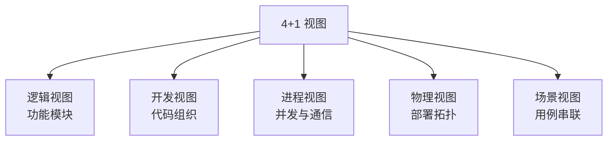

### 2.1 逻辑视图

描述系统的功能模块与关系：

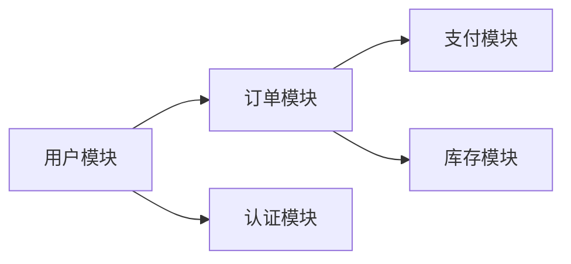

### 2.2 开发视图

代码组织与依赖：

```
order-service/
├── adapter/        # 适配器层
├── application/    # 应用层
├── domain/         # 领域层
└── infrastructure/ # 基础设施层
```

### 2.3 进程视图

并发与通信：

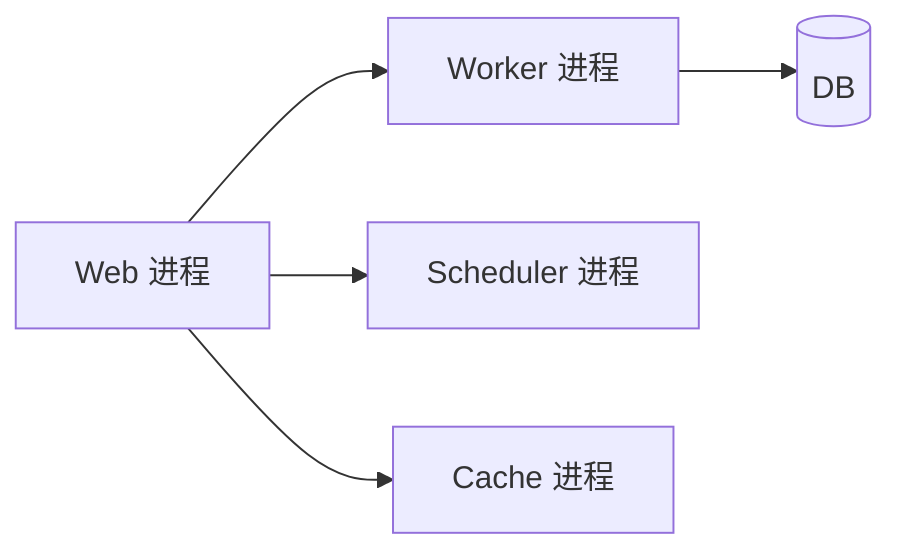

### 2.4 物理视图

部署拓扑：

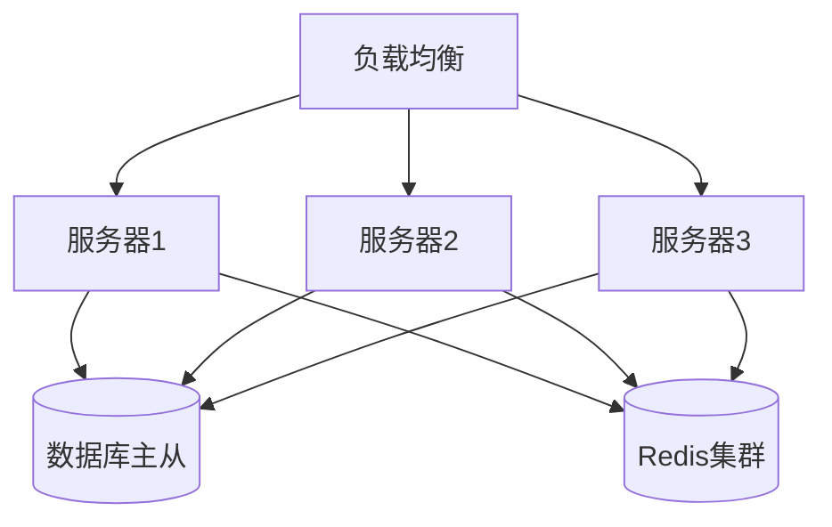

### 2.5 场景视图

用例串联各视图：

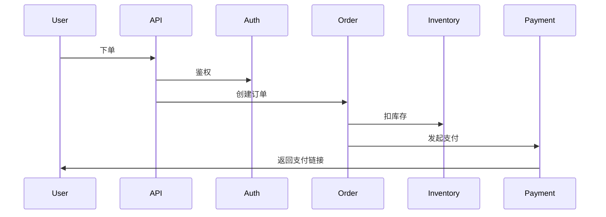

## 三、ADD 方法

Architecture-Driven Design，基于属性的设计方法：

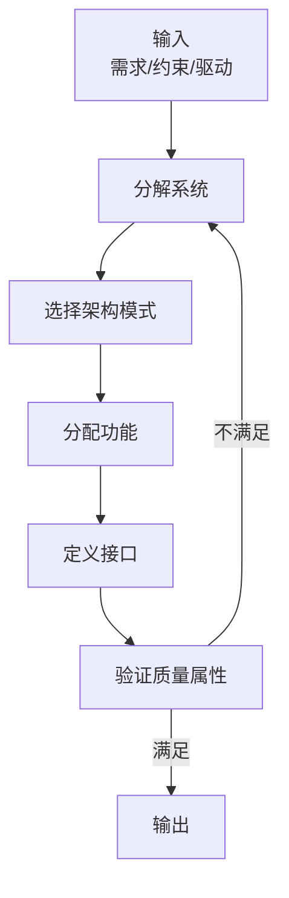

### 3.1 步骤

| 步骤 | 说明 |
|------|------|
| 1. 确定驱动因素 | 性能、可用性、安全等 |
| 2. 选择架构模式 | 微服务/单体/事件驱动 |
| 3. 分配功能 | 模块划分 |
| 4. 定义接口 | 模块间通信 |
| 5. 验证质量属性 | 是否满足需求 |

## 四、设计流程

### 4.1 完整流程

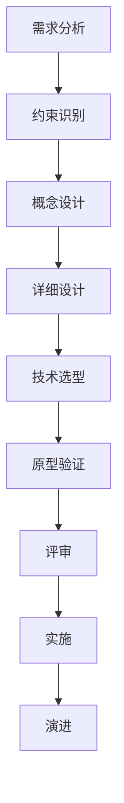

### 4.2 需求分析

#### 功能需求

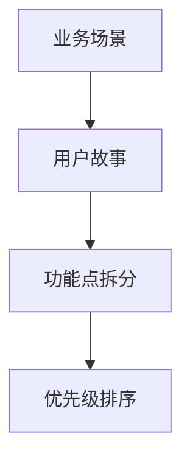

#### 非功能需求

| 维度 | 指标 |
|------|------|
| 性能 | QPS、延迟 |
| 可用性 | SLA 99.9% |
| 扩展性 | 水平扩展 |
| 安全 | 认证、加密 |
| 可维护 | 代码可读 |
| 可观测 | 监控、日志 |

### 4.3 约束识别

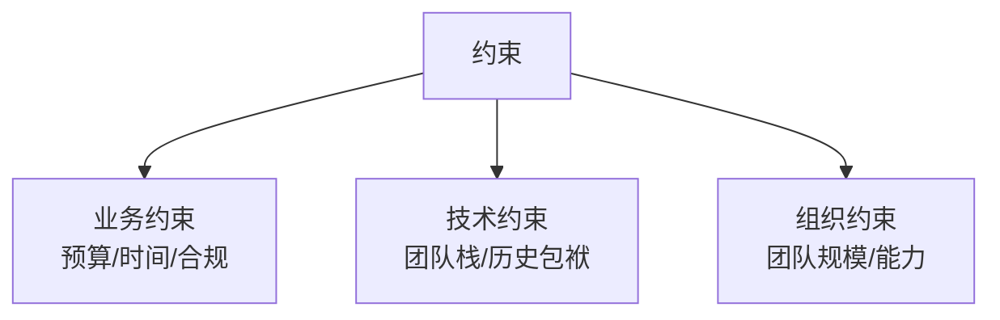

### 4.4 概念设计

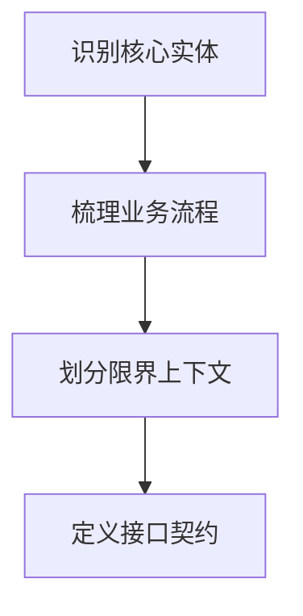

### 4.5 详细设计

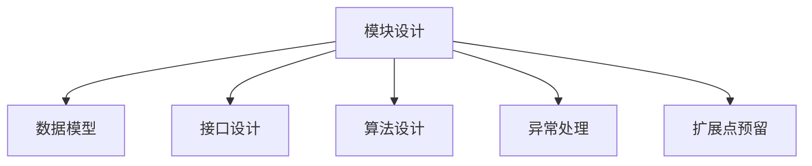

### 4.6 原型验证

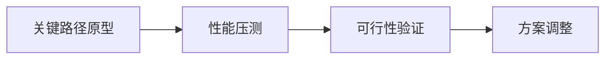

## 五、设计原则

### 5.1 SOLID 原则

| 原则 | 含义 |
|------|------|
| **S** 单一职责 | 一个类一个职责 |
| **O** 开闭原则 | 扩展开放，修改关闭 |
| **L** 里氏替换 | 子类可替换父类 |
| **I** 接口隔离 | 接口最小化 |
| **D** 依赖倒置 | 依赖抽象不依赖具体 |

### 5.2 架构原则

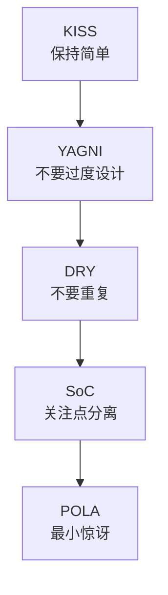

### 5.3 分布式原则

| 原则 | 说明 |
|------|------|
| Design for Failure | 假设故障必然发生 |
| Stateless | 优先无状态 |
| Idempotent | 操作幂等 |
| Async First | 优先异步 |
| Cache Everything | 能缓存则缓存 |

## 六、典型案例

### 6.1 设计一个短链系统

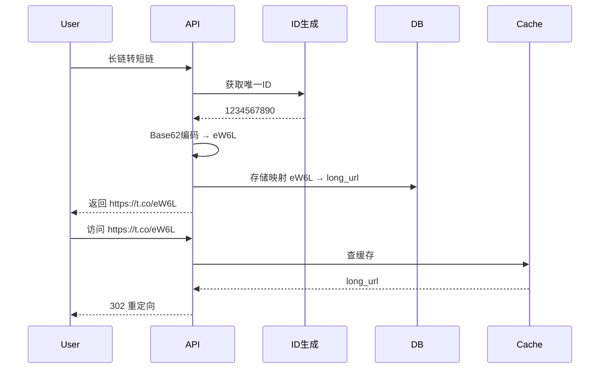

设计要点：
- ID 生成：雪花算法
- 编码：Base62
- 存储：MySQL + Redis 缓存
- 跳转：302 重定向
- 统计：异步上报

### 6.2 设计一个朋友圈 Feed 流

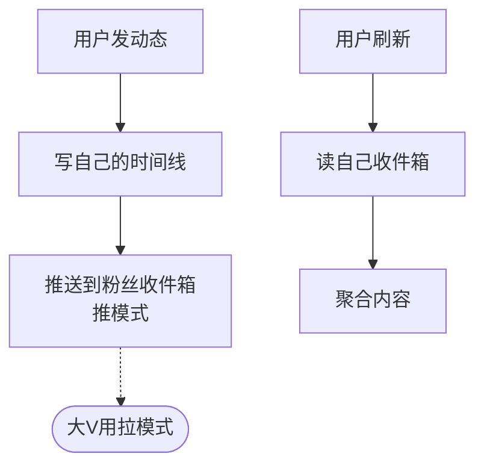

设计要点：
- 推拉结合：普通人推，大V拉
- 存储：Redis SortedSet（按时间排序）
- 优化：活跃用户才推
- 分页：游标分页

### 6.3 设计一个抢红包系统

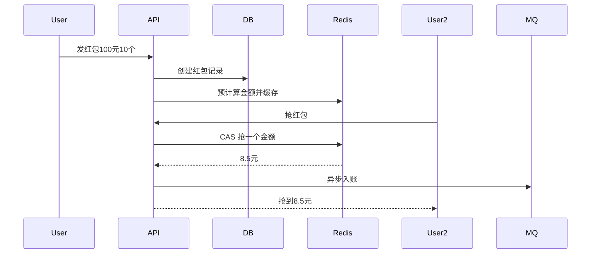

设计要点：
- 金额预计算：发红包时拆分
- Redis CAS 抢金额
- 异步入账
- 防并发

### 6.4 设计一个 IM 系统

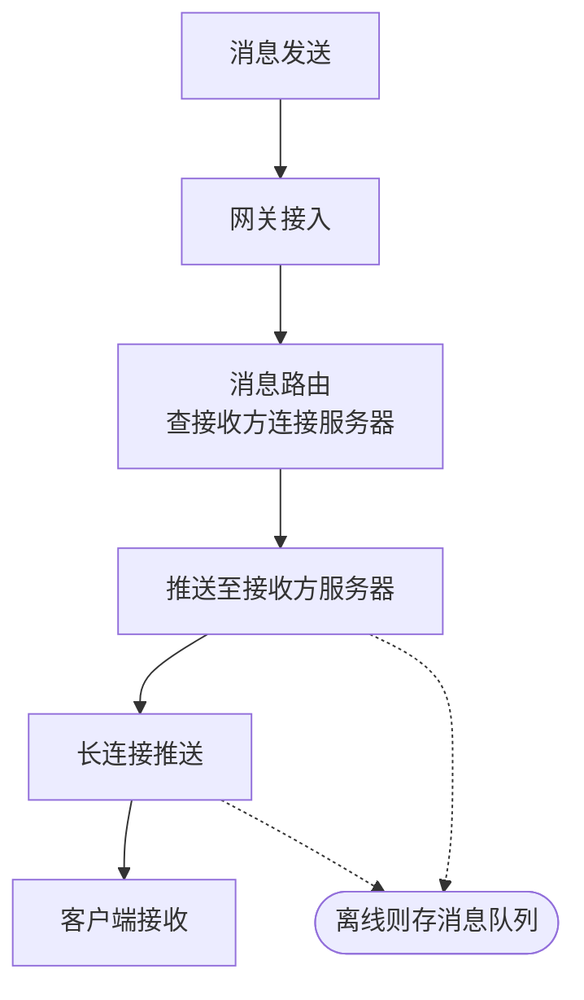

设计要点：
- 长连接：WebSocket / TCP
- 消息路由：用户→服务器映射
- 离线消息：存储 + 推送
- 消息顺序：单聊按时间，群聊按服务器时间

## 七、相关资料

- [System Design Primer](https://github.com/donnemartin/system-design-primer)
- 《大型网站技术架构》李智慧
- 《数据密集型应用系统设计》Martin Kleppmann
- [4+1 View Model](https://www.cs.ubc.ca/~gregor/teaching/papers/4+1view-architecture.pdf)
- [Designing Data-Intensive Applications](https://dataintensive.net/)
- 《架构整洁之道》Robert C. Martin
