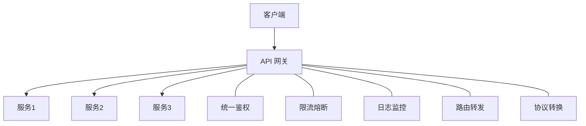
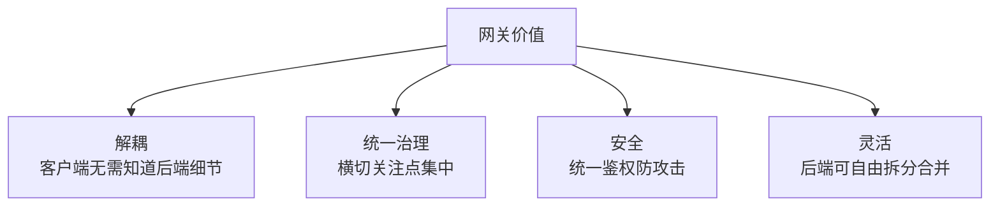
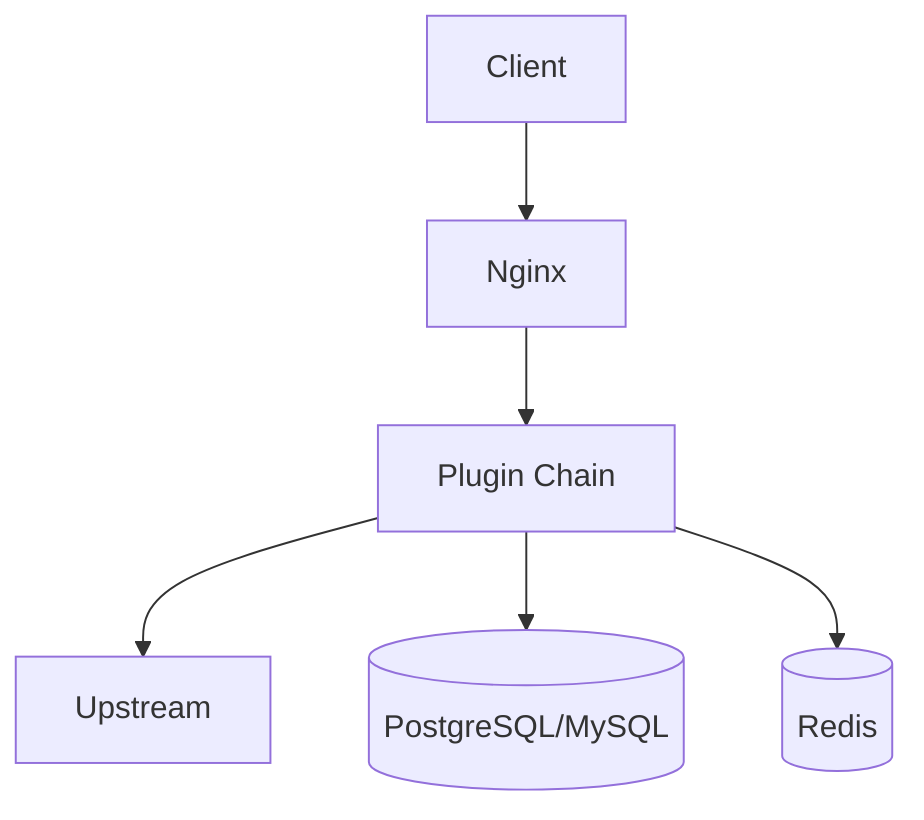
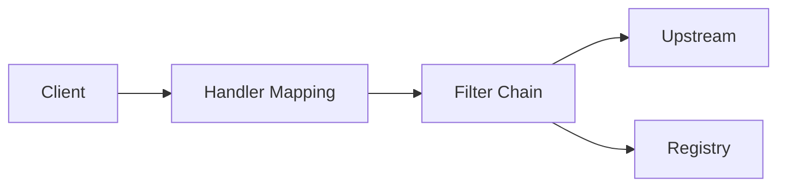
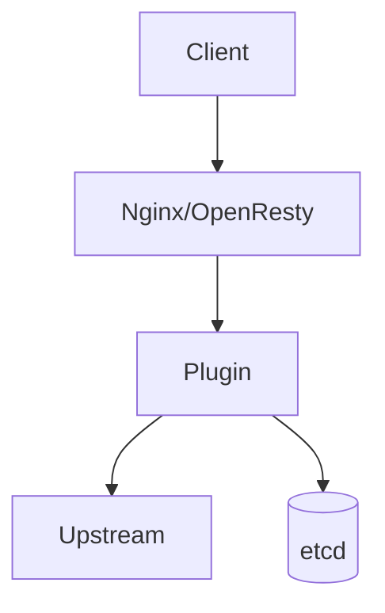
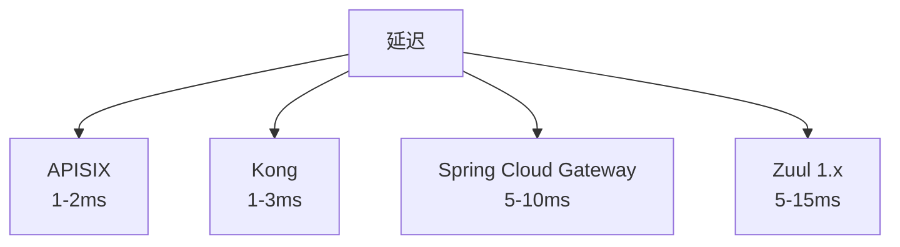
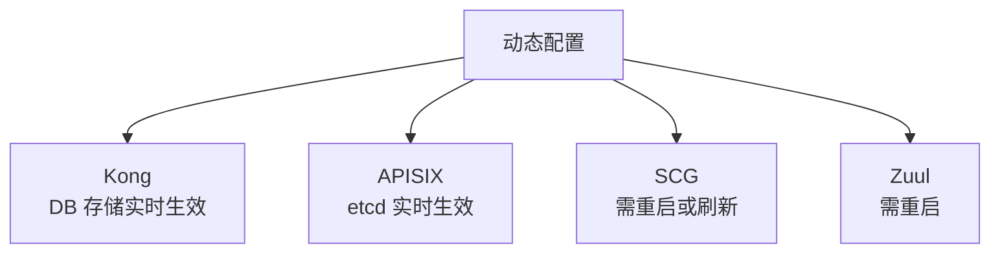
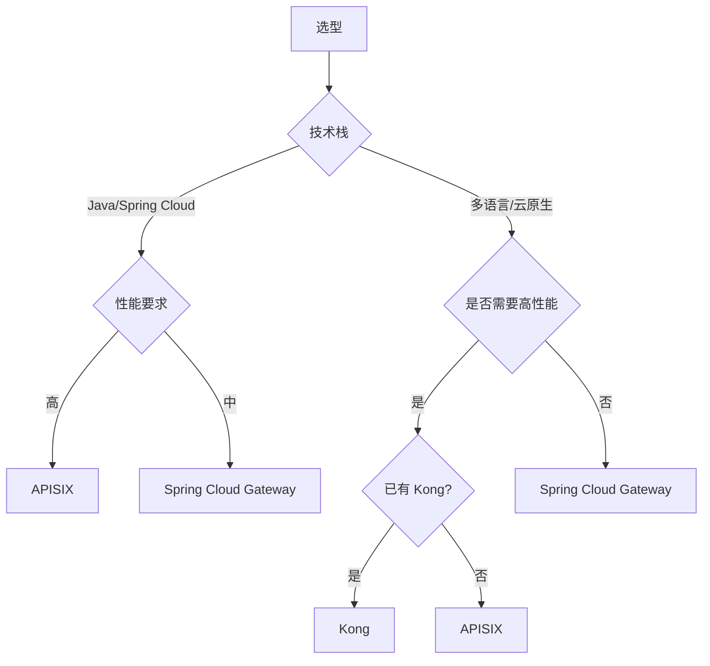
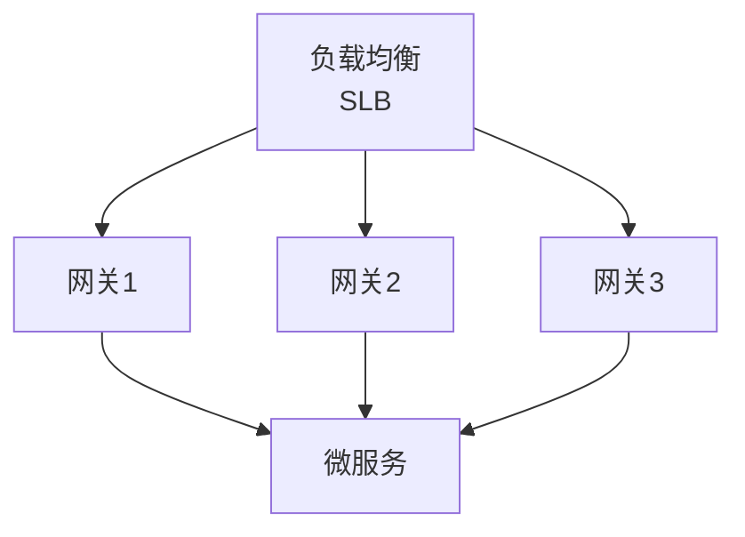

# API 网关对比 Kong vs Spring Cloud Gateway vs APISIX vs Zuul

> API 网关是微服务统一入口，承担路由、鉴权、限流等职责。本文对比主流 API 网关。

## 目录

- [一、API 网关职责](#一api-网关职责)
- [二、四大网关概览](#二四大网关概览)
- [三、架构对比](#三架构对比)
- [四、性能对比](#四性能对比)
- [五、功能特性对比](#五功能特性对比)
- [六、扩展能力](#六扩展能力)
- [七、选型建议](#七选型建议)
- [八、相关资料](#八相关资料)

## 一、API 网关职责



### 1.1 核心功能

| 功能 | 说明 |
|------|------|
| **路由转发** | 按路径/Header 转发到后端 |
| **统一鉴权** | JWT、OAuth2 |
| **限流熔断** | 保护后端服务 |
| **协议转换** | HTTP ↔ gRPC |
| **日志监控** | 访问日志、指标 |
| **灰度发布** | 流量按规则分流 |
| **响应处理** | 修改响应、聚合 |

### 1.2 网关价值



## 二、四大网关概览

| 网关 | 出身 | 语言 | 性能 | 扩展 |
|------|------|------|------|------|
| **Kong** | Mashape 2015 | Lua/Nginx | 极高 | 插件丰富 |
| **Spring Cloud Gateway** | Pivotal 2017 | Java | 中 | Java 生态 |
| **APISIX** | 支流 2019 | Lua/Nginx | 极高 | 插件丰富 |
| **Zuul** | Netflix 2013 | Java | 中 | 1.x 维护模式 |

### 2.1 其他网关

| 网关 | 特点 |
|------|------|
| Nginx+Lua | 灵活但需自开发 |
| Traefik | 云原生 K8s |
| Envoy | Service Mesh 数据面 |
| Higress | 阿里开源云原生 |

## 三、架构对比

### 3.1 Kong 架构



特点：
- 基于 OpenResty（Nginx+Lua）
- 数据库存储配置
- 插件机制扩展
- 集群能力

### 3.2 Spring Cloud Gateway



特点：
- 基于 Spring WebFlux
- 异步非阻塞（Netty）
- 与 Spring Cloud 深度集成
- Java 生态友好

### 3.3 APISIX 架构



特点：
- 基于 OpenResty
- etcd 存储配置
- 动态配置（无需 reload）
- 高性能

### 3.4 Zuul 架构


特点：
- Zuul 1.x：同步阻塞
- Zuul 2.x：异步非阻塞
- Netflix 已停止维护

## 四、性能对比

### 4.1 吞吐量对比

```
单机 QPS（同等硬件）：
- Kong：5 万+
- Spring Cloud Gateway：1-2 万
- APISIX：5 万+
- Zuul 1.x：5000-1 万
- Zuul 2.x：2-3 万
```

### 4.2 延迟对比



### 4.3 性能差异原因

| 网关 | 语言 | 模型 | 性能 |
|------|------|------|------|
| Kong | Lua | 异步非阻塞 | 极高 |
| APISIX | Lua | 异步非阻塞 | 极高 |
| SCG | Java | 异步非阻塞 | 中 |
| Zuul 1.x | Java | 同步阻塞 | 低 |
| Zuul 2.x | Java | 异步非阻塞 | 中 |

## 五、功能特性对比

### 5.1 综合对比

| 特性 | Kong | SCG | APISIX | Zuul |
|------|------|-----|--------|------|
| **动态路由** | ✓ | ✓ | ✓ | 弱 |
| **插件机制** | ✓ | ✓ | ✓ | ✓ |
| **限流** | ✓ | ✓ | ✓ | ✓ |
| **熔断** | ✓ | ✓ | ✓ | ✓ |
| **JWT 鉴权** | ✓ | ✓ | ✓ | ✓ |
| **协议转换** | HTTP/gRPC/TCP | HTTP | HTTP/gRPC/TCP | HTTP |
| **服务发现** | ✓ | ✓ | ✓ | ✓ |
| **配置中心** | DB | Spring Config | etcd | Spring Config |
| **动态配置** | 是 | 否（需重启） | 是 | 否 |
| **管理控制台** | ✓ | 第三方 | ✓ | 第三方 |

### 5.2 动态配置



APISIX 与 Kong 支持配置热更新，无需 reload Nginx。

### 5.3 协议支持

| 网关 | HTTP | HTTPS | gRPC | TCP | WebSocket |
|------|------|-------|------|-----|-----------|
| Kong | ✓ | ✓ | ✓ | ✓ | ✓ |
| SCG | ✓ | ✓ | ✓ | ✗ | ✓ |
| APISIX | ✓ | ✓ | ✓ | ✓ | ✓ |
| Zuul | ✓ | ✓ | ✗ | ✗ | ✓ |

## 六、扩展能力

### 6.1 插件机制

#### Kong 插件

```lua
-- 自定义插件
local MyPlugin = {
  PRIORITY = 1000,
  VERSION = "1.0",
}

function MyPlugin:access(conf)
  kong.response.set_header("X-Custom", "value")
end

return MyPlugin
```

#### SCG 过滤器

```java
@Component
public class CustomFilter implements GlobalFilter {
    @Override
    public Mono<Void> filter(ServerWebExchange exchange, GatewayFilterChain chain) {
        ServerHttpRequest request = exchange.getRequest();
        request.mutate().header("X-Custom", "value").build();
        return chain.filter(exchange);
    }
}
```

#### APISIX 插件

```lua
local plugin = require("apisix.plugin")

plugin_name = "custom-plugin"

local schema = {
    type = "object",
    properties = {
        key = { type = "string" }
    }
}

function plugin.check_schema(conf)
    return true
end

function plugin.rewrite(conf, ctx)
    core.response.set_header("X-Custom", conf.key)
end

return plugin
```

### 6.2 内置插件数

| 网关 | 插件数 | 类型 |
|------|--------|------|
| Kong | 100+ | 限流、鉴权、日志、监控 |
| SCG | 20+（Filter） | 鉴权、限流、日志 |
| APISIX | 80+ | 限流、鉴权、日志、可观测 |
| Zuul | 10+ | 鉴权、日志 |

## 七、选型建议

### 7.1 决策树



### 7.2 场景推荐

| 场景 | 推荐 | 原因 |
|------|------|------|
| Java 微服务 | SCG | 生态集成好 |
| 多语言微服务 | Kong/APISIX | 语言无关 |
| 云原生 K8s | APISIX/Kong | 原生支持 |
| 高性能需求 | APISIX | 性能最优 |
| 已有 Kong 体系 | Kong | 平滑升级 |
| 阿里技术栈 | Higress/APISIX | 阿里支持 |
| Netflix 体系 | Zuul | 兼容（不推荐新项目） |

### 7.3 综合评分

| 维度 | Kong | SCG | APISIX | Zuul |
|------|------|-----|--------|------|
| 性能 | ★★★★★ | ★★★ | ★★★★★ | ★★ |
| 易用性 | ★★★★ | ★★★★ | ★★★★ | ★★★ |
| 扩展性 | ★★★★★ | ★★★★ | ★★★★★ | ★★★ |
| 生态 | ★★★★★ | ★★★★ | ★★★★ | ★★ |
| 云原生 | ★★★★ | ★★★ | ★★★★★ | ★ |
| 学习曲线 | ★★★ | ★★★★★ | ★★★ | ★★★ |

## 八、典型配置示例

### 8.1 Kong 配置

```yaml
_format_version: "3.0"

services:
- name: order-service
  url: http://order-service:8080
  routes:
  - name: order-route
    paths:
    - /api/orders
    methods:
    - GET
    - POST
  plugins:
  - name: rate-limiting
    config:
      minute: 1000
  - name: jwt
```

### 8.2 Spring Cloud Gateway 配置

```yaml
spring:
  cloud:
    gateway:
      routes:
      - id: order-service
        uri: lb://order-service
        predicates:
        - Path=/api/orders/**
        - Method=GET,POST
        filters:
        - StripPrefix=0
        - name: RequestRateLimiter
          args:
            redis-rate-limiter.replenishRate: 100
            redis-rate-limiter.burstCapacity: 1000
```

### 8.3 APISIX 配置

```json
{
  "uri": "/api/orders/*",
  "upstream": {
    "type": "roundrobin",
    "nodes": {
      "order-service:8080": 1
    }
  },
  "plugins": {
    "limit-req": {
      "rate": 1000,
      "burst": 100,
      "rejected_code": 429
    },
    "jwt-auth": {}
  }
}
```

## 九、网关最佳实践

### 9.1 高可用部署



### 9.2 容量规划

```
单机网关 5万 QPS
峰值 20万 QPS
实例数 = 20万/5万 = 4台
加余量 30% → 6台
```

### 9.3 监控告警

- QPS
- 延迟 P99
- 错误率
- 后端健康度
- 限流次数

## 十、相关资料

- [Kong 官方文档](https://docs.konghq.com/)
- [Spring Cloud Gateway](https://docs.spring.io/spring-cloud-gateway/docs/current/reference/html/)
- [APISIX 官方文档](https://apisix.apache.org/docs/)
- [Zuul Wiki](https://github.com/Netflix/zuul/wiki)
- [Higress 官网](https://higress.io/)
- [API Gateway Comparison](https://www.kloia.com/blog/api-gateway-comparison)
