# 注册中心对比 Nacos vs Eureka vs Consul vs ZooKeeper

> 注册中心是微服务核心组件，负责服务注册与发现。本文对比四大主流注册中心。

## 目录

- [一、注册中心职责](#一注册中心职责)
- [二、四大注册中心概览](#二四大注册中心概览)
- [三、CAP 模型对比](#三cap-模型对比)
- [四、架构对比](#四架构对比)
- [五、功能特性对比](#五功能特性对比)
- [六、性能对比](#六性能对比)
- [七、选型建议](#七选型建议)
- [八、相关资料](#八相关资料)

## 一、注册中心职责

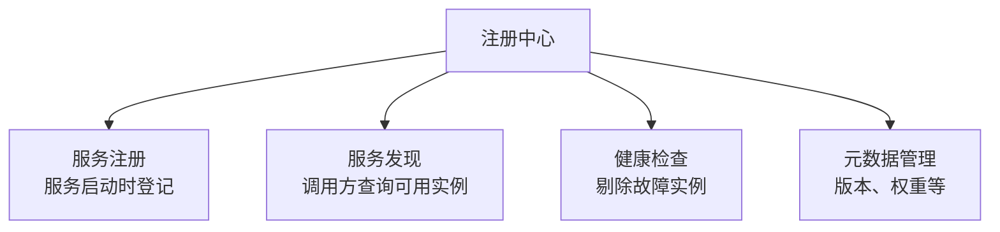

### 工作流程

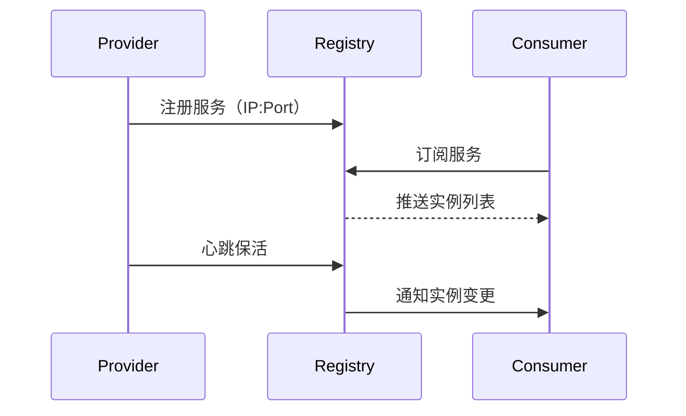

## 二、四大注册中心概览

| 注册中心 | 出身 | 语言 | 一致性 | 适用 |
|---------|------|------|--------|------|
| **ZooKeeper** | Yahoo 2008 | Java | CP | 强一致场景 |
| **Eureka** | Netflix 2012 | Java | AP | Spring Cloud |
| **Consul** | HashiCorp 2014 | Go | CP | 多语言 |
| **Nacos** | 阿里 2018 | Java | AP/CP | 阿里/Spring Cloud |

## 三、CAP 模型对比

### 3.1 CAP 选择

```mermaid
flowchart TD
    A[CAP 选择] --> B[CP<br/>强一致]
    A --> C[AP<br/>高可用]
    Note over B: ZK/Consul/Nacos(CP模式)
    Note over C: Eureka/Nacos(AP模式)
```

### 3.2 不同选择的影响

#### CP（强一致）

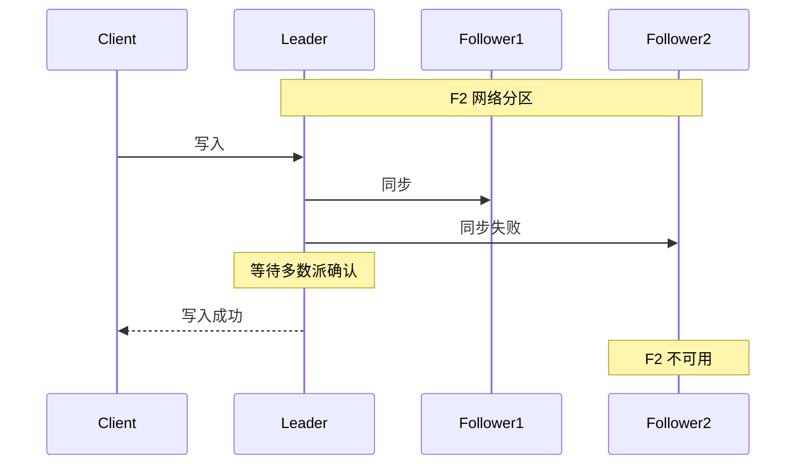

特点：
- 写入需多数派确认
- 分区时少数派不可用
- 数据强一致

#### AP（高可用）

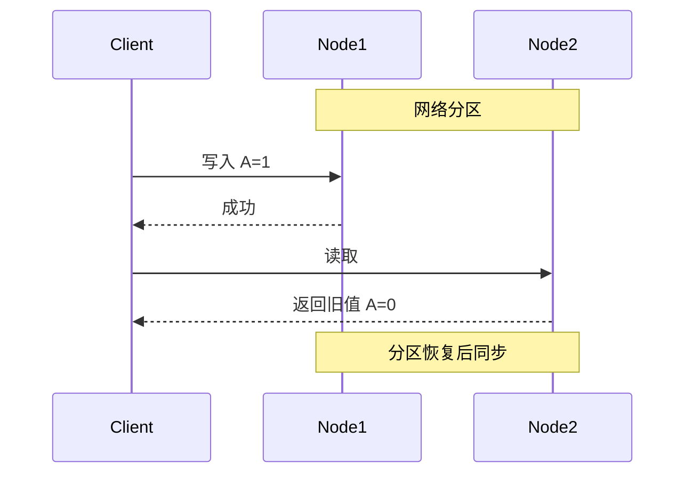

特点：
- 任一节点可读写
- 分区时仍可用
- 数据可能短暂不一致

### 3.3 为什么注册中心选 AP

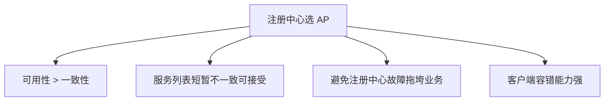

## 四、架构对比

### 4.1 ZooKeeper

```mermaid
flowchart TD
    L[Leader] --> F1[Follower]
    L --> F2[Follower]
    L --> F3[Observer]
    Note over L,F3: ZAB 协议
```

特点：
- 树形数据结构（ZNode）
- 临时节点表示存活
- Watcher 通知机制
- 复杂的 Leader 选举

### 4.2 Eureka

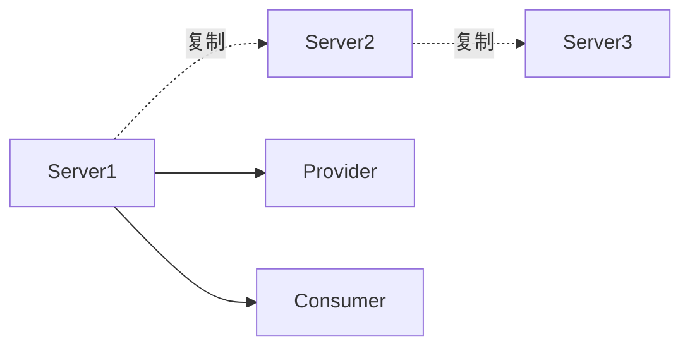

特点：
- Peer-to-Peer 复制
- 无主从
- 心跳续约
- 自我保护模式

### 4.3 Consul

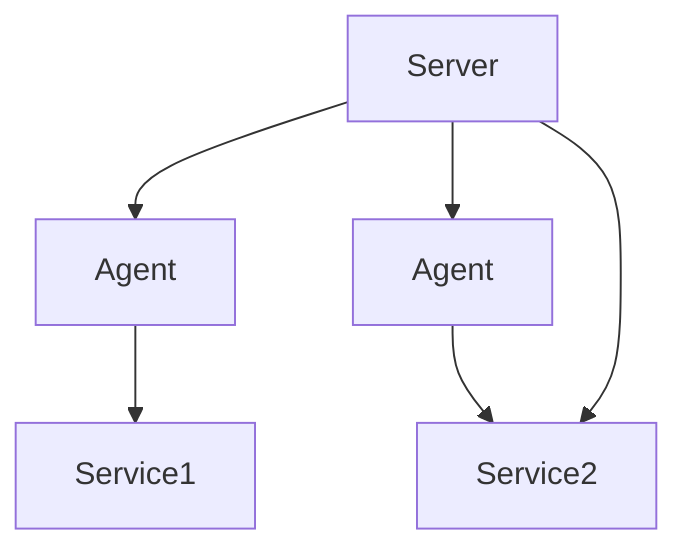

特点：
- Agent 部署在每个节点
- Gossip 协议通信
- Raft 一致性
- 支持 KV 存储

### 4.4 Nacos

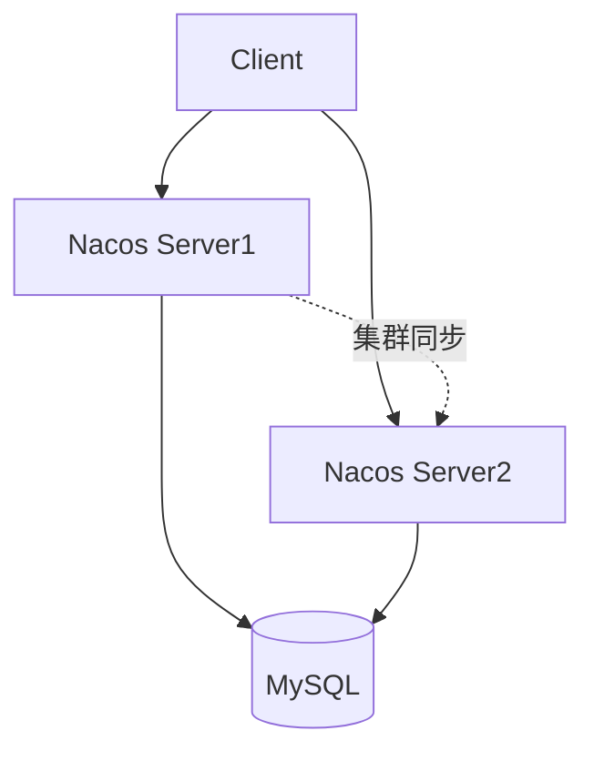

特点：
- 支持注册中心+配置中心
- AP/CP 切换
- 长连接推送
- 控制台管理

## 五、功能特性对比

### 5.1 综合对比

| 特性 | ZooKeeper | Eureka | Consul | Nacos |
|------|-----------|--------|--------|-------|
| **CAP** | CP | AP | CP | AP/CP |
| **健康检查** | Session | 心跳 | TCP/HTTP/脚本 | TCP/HTTP |
| **多数据中心** | 弱 | 不支持 | 支持 | 支持 |
| **配置中心** | 可作 | 否 | 是 | 是 |
| **管理控制台** | 第三方 | 简单 | 有 | 有 |
| **多语言** | SDK | HTTP | HTTP/DNS | HTTP/DNS |
| **服务网格** | 否 | 否 | Connect | 是 |

### 5.2 健康检查

| 注册中心 | 检查方式 |
|---------|---------|
| ZooKeeper | Session 心跳 |
| Eureka | 客户端心跳 30s |
| Consul | TCP/HTTP/Script |
| Nacos | TCP/HTTP/心跳 |

### 5.3 服务发现方式

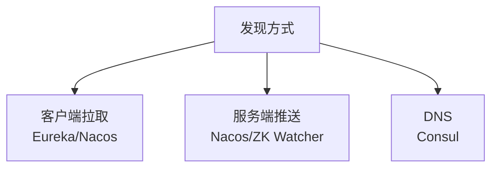

| 注册中心 | 方式 | 实时性 |
|---------|------|--------|
| ZooKeeper | Watcher 推送 | 高 |
| Eureka | 客户端定时拉取 | 30s 延迟 |
| Consul | 长轮询 | 中 |
| Nacos | 长连接推送 | 高 |

### 5.4 配置中心

| 注册中心 | 配置能力 |
|---------|---------|
| ZooKeeper | 可作但弱 |
| Eureka | 不支持 |
| Consul | KV 存储 |
| Nacos | 专业配置中心 |

## 六、性能对比

### 6.1 写入性能

```
ZooKeeper：万级 TPS
Eureka：万级 TPS
Consul：千级 TPS
Nacos：万级 TPS
```

### 6.2 服务实例数

| 注册中心 | 实例数上限 |
|---------|-----------|
| ZooKeeper | 10 万级 |
| Eureka | 10 万级（性能下降） |
| Consul | 1 万级 |
| Nacos | 100 万级 |

### 6.3 推送延迟

| 注册中心 | 延迟 |
|---------|------|
| ZooKeeper | 秒级 |
| Eureka | 30 秒（拉取） |
| Consul | 秒级 |
| Nacos | 毫秒级 |

## 七、选型建议

### 7.1 决策树

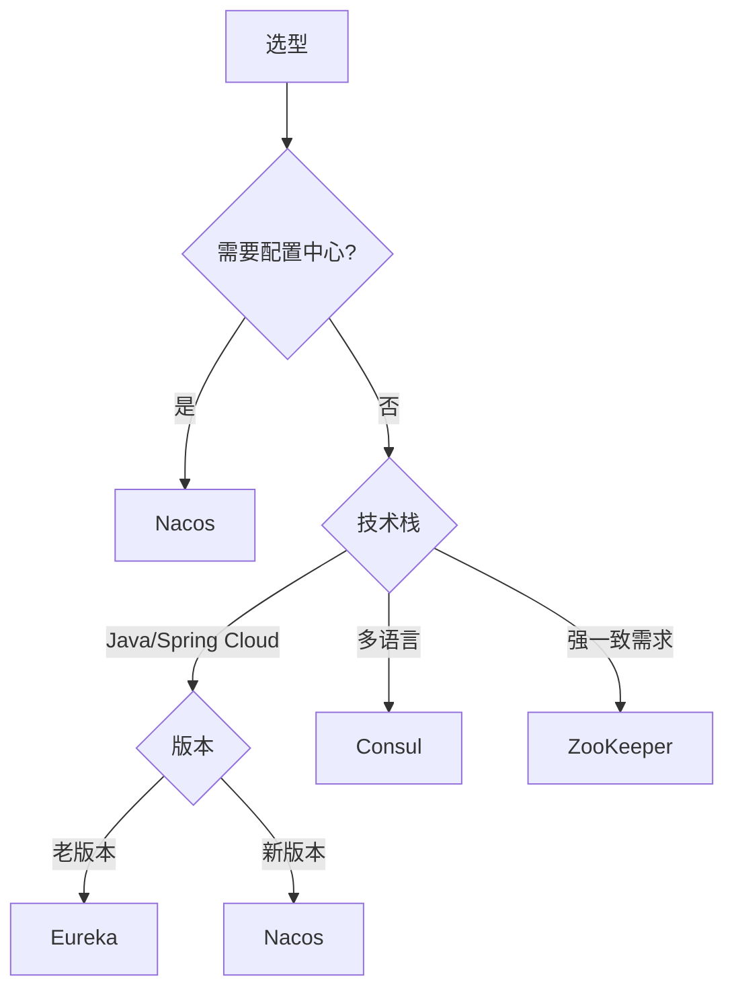

### 7.2 场景推荐

| 场景 | 推荐 | 原因 |
|------|------|------|
| Spring Cloud Alibaba | Nacos | 原生集成 |
| Spring Cloud Netflix | Eureka | 兼容（已维护模式） |
| 多语言微服务 | Consul | HTTP/DNS |
| 强一致要求 | ZooKeeper | CP 模型 |
| 服务网格 | Nacos/Consul | 集成能力 |
| 阿里技术栈 | Nacos | 阿里出品 |

### 7.3 Eureka 2.0 停止开发

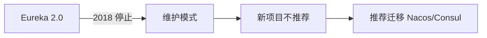

### 7.4 Nacos 优势

- 同时支持 AP/CP
- 注册中心+配置中心一体
- 长连接推送，实时性高
- 阿里大规模生产验证
- 友好的管理控制台

## 八、自我保护机制

### 8.1 Eureka 自我保护

```mermaid
flowchart TD
    A[15分钟内心跳<85%] --> B[进入自我保护]
    B --> C[不再剔除实例]
    Note over C: 防止网络分区误剔除
    A --> D[网络恢复]
    D --> E[退出自我保护]
```

### 8.2 Nacos 自我保护

- 临时实例：心跳低于阈值不剔除
- 持久化实例：主动探测

### 8.3 ZooKeeper Session

```
Session 超时 → 临时节点删除
网络抖动 → 误删除风险
```

## 九、相关资料

- [Nacos 官方文档](https://nacos.io/zh-cn/docs/what-is-nacos.html)
- [Eureka 文档](https://docs.spring.io/spring-cloud-netflix/docs/current/reference/html/)
- [Consul 文档](https://developer.hashicorp.com/consul/docs)
- [ZooKeeper 文档](https://zookeeper.apache.org/doc/current/)
- [CAP 定理](./CAP定理.md)
- [服务注册与发现](./服务注册与发现.md)
