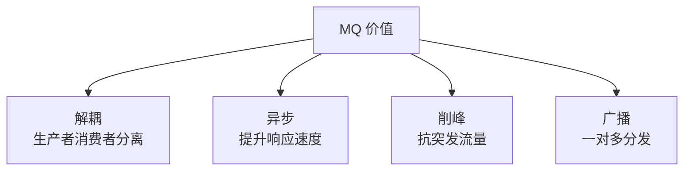
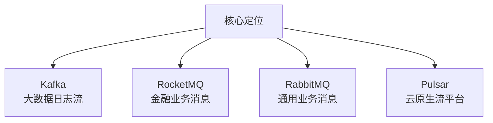
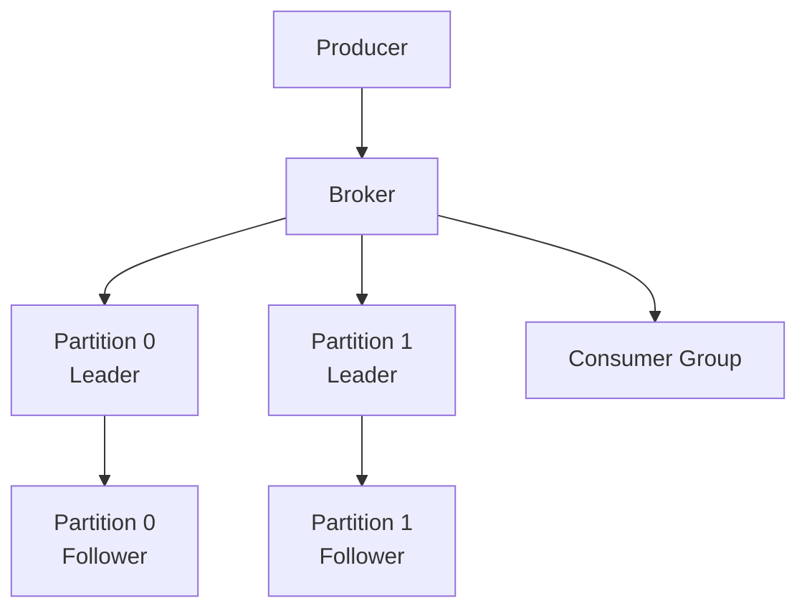
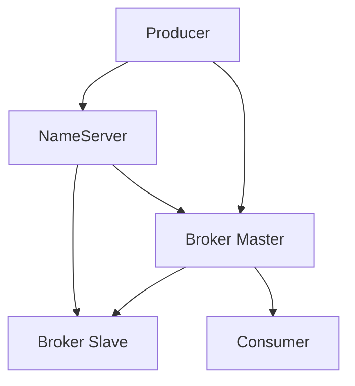
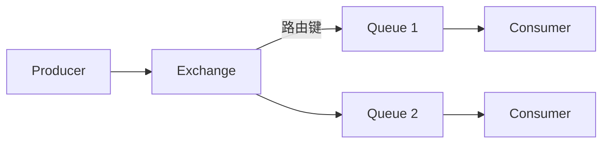
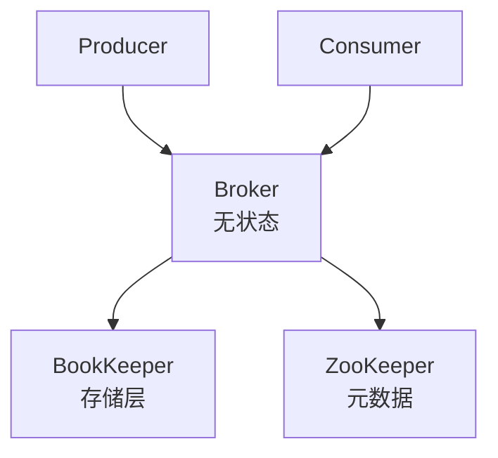
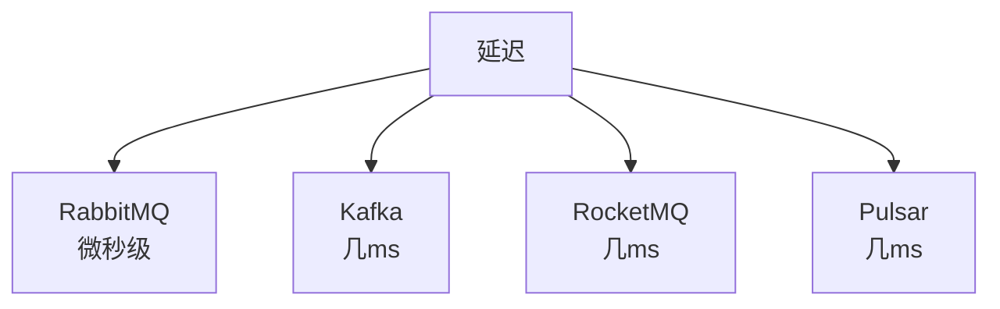
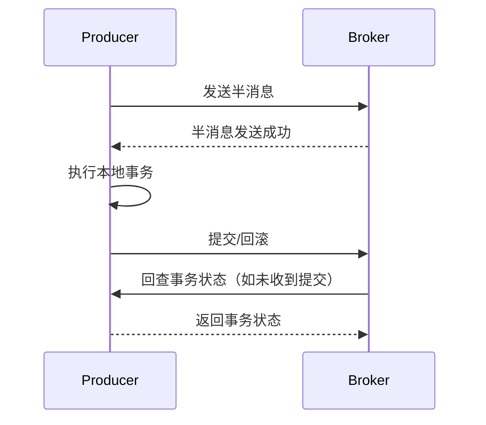
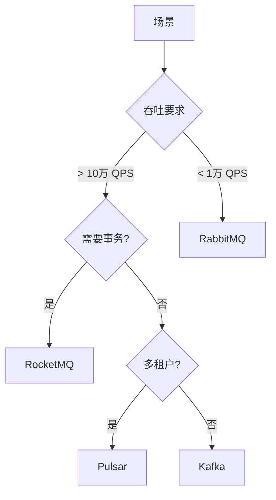

# 消息队列对比 Kafka vs RocketMQ vs RabbitMQ vs Pulsar

> 消息队列是分布式系统核心中间件，用于解耦、异步、削峰。不同 MQ 定位不同，选型需基于业务场景。

## 目录

- [一、消息队列价值](#一消息队列价值)
- [二、四大 MQ 概览](#二四大-mq-概览)
- [三、核心特性对比](#三核心特性对比)
- [四、架构对比](#四架构对比)
- [五、性能对比](#五性能对比)
- [六、功能特性对比](#六功能特性对比)
- [七、选型建议](#七选型建议)
- [八、相关资料](#八相关资料)

## 一、消息队列价值



### 典型场景

| 场景 | 说明 |
|------|------|
| 异步处理 | 下单后异步发短信、推送 |
| 应用解耦 | 订单系统与库存系统解耦 |
| 流量削峰 | 秒杀请求先入队再处理 |
| 日志收集 | Kafka 经典场景 |
| 事件驱动 | 微服务间事件通知 |

## 二、四大 MQ 概览

### 2.1 起源与定位

| MQ | 起源 | 定位 |
|----|------|------|
| **Kafka** | LinkedIn 2010 | 高吞吐日志流处理 |
| **RocketMQ** | 阿里 2012 | 金融级可靠消息 |
| **RabbitMQ** | 2007 Erlang | 通用业务消息 |
| **Pulsar** | Yahoo 2016 | 云原生多租户流平台 |

### 2.2 核心差异



## 三、核心特性对比

### 3.1 综合对比表

| 特性 | Kafka | RocketMQ | RabbitMQ | Pulsar |
|------|-------|----------|----------|--------|
| **吞吐量** | 极高（100万+） | 高（10万+） | 中（万级） | 高（10万+） |
| **延迟** | 几ms | 几ms | 微秒级 | 几ms |
| **消息顺序** | 分区有序 | 严格顺序 | FIFO | 分区有序 |
| **事务消息** | 弱（0.11+） | 强 | 弱 | 中 |
| **消息回溯** | 支持（offset） | 支持（时间） | 不支持 | 支持 |
| **消息堆积** | 强（日志） | 强 | 弱 | 强 |
| **多租户** | 弱 | 弱 | 中 | 强 |
| **协议** | 自研 | 自研 | AMQP | 自研+多协议 |
| **语言** | Scala/Java | Java | Erlang | Java |
| **运维复杂度** | 中 | 中 | 低 | 高 |

### 3.2 数据可靠性

| MQ | 同步刷盘 | 副本 | 消息确认 |
|----|---------|------|---------|
| Kafka | 支持 | ISR 副本 | acks=all |
| RocketMQ | 支持 | Master-Slave | 同步/异步 |
| RabbitMQ | 不支持 | 镜像队列 | 持久化+ack |
| Pulsar | 支持 | BookKeeper | Quorum 写 |

## 四、架构对比

### 4.1 Kafka 架构



特点：
- 分区为主
- 顺序写磁盘
- 零拷贝
- ISR 副本机制

### 4.2 RocketMQ 架构



特点：
- NameServer 无状态
- Master-Slave 同步/异步
- CommitLog 统一存储
- 支持事务消息

### 4.3 RabbitMQ 架构



特点：
- Exchange 路由模型
- 丰富的路由模式
- 镜像队列高可用
- Erlang 高并发

### 4.4 Pulsar 架构



特点：
- 计算存储分离
- Broker 无状态
- BookKeeper 存储
- 多租户原生支持

## 五、性能对比

### 5.1 吞吐量测试

```
单机吞吐（同等硬件）：
- Kafka：100 万+ msg/s
- RocketMQ：10 万+ msg/s
- RabbitMQ：1 万+ msg/s
- Pulsar：10 万+ msg/s

注：与消息大小、配置强相关
```

### 5.2 延迟对比



### 5.3 消息堆积能力

| MQ | 堆积能力 | 影响 |
|----|---------|------|
| Kafka | TB 级 | 几乎无影响 |
| RocketMQ | TB 级 | 几乎无影响 |
| RabbitMQ | GB 级 | 性能明显下降 |
| Pulsar | TB 级 | 几乎无影响 |

## 六、功能特性对比

### 6.1 顺序消息

| MQ | 实现 | 严格度 |
|----|------|--------|
| Kafka | 同 key 同分区 | 分区有序 |
| RocketMQ | MessageQueueSelector | 严格顺序 |
| RabbitMQ | 单队列 | FIFO |
| Pulsar | 同 key 同分区 | 分区有序 |

### 6.2 事务消息

#### RocketMQ 事务消息



#### Kafka 事务

```java
producer.initTransactions();
try {
    producer.beginTransaction();
    producer.send(record1);
    producer.send(record2);
    // 消费-生产模式
    producer.sendOffsetsToTransaction(offsets, groupId);
    producer.commitTransaction();
} catch (Exception e) {
    producer.abortTransaction();
}
```

### 6.3 延迟消息

| MQ | 实现 |
|----|------|
| Kafka | 不支持原生，需自实现 |
| RocketMQ | 18 个延迟级别（1s/5s/...2h） |
| RabbitMQ | 插件 rabbitmq_delayed_message_exchange |
| Pulsar | 原生支持任意延迟 |

### 6.4 死信队列

| MQ | 支持 |
|----|------|
| Kafka | 不支持原生 |
| RocketMQ | 支持 |
| RabbitMQ | 支持 |
| Pulsar | 支持 |

### 6.5 消息回溯

| MQ | 方式 |
|----|------|
| Kafka | 按 offset |
| RocketMQ | 按时间 |
| RabbitMQ | 不支持 |
| Pulsar | 按时间/位置 |

## 七、选型建议

### 7.1 场景选型



### 7.2 详细建议

#### Kafka 适用
- 日志收集
- 大数据流处理
- 用户行为追踪
- 实时数仓

#### RocketMQ 适用
- 订单交易
- 金融支付
- 需要事务消息
- 阿里技术栈

#### RabbitMQ 适用
- 业务解耦
- 复杂路由
- 中小规模系统
- 延迟敏感

#### Pulsar 适用
- 多租户 SaaS
- 云原生架构
- 大规模流处理
- 需要计算存储分离

### 7.3 综合评分

| 场景 | Kafka | RocketMQ | RabbitMQ | Pulsar |
|------|-------|----------|----------|--------|
| 高吞吐日志 | ★★★★★ | ★★★ | ★ | ★★★★ |
| 金融交易 | ★★ | ★★★★★ | ★★★ | ★★★ |
| 业务解耦 | ★★★ | ★★★★ | ★★★★★ | ★★★ |
| 复杂路由 | ★ | ★★ | ★★★★★ | ★★ |
| 多租户 | ★ | ★ | ★★★ | ★★★★★ |
| 云原生 | ★★★ | ★★ | ★★ | ★★★★★ |

## 八、运维对比

### 8.1 部署复杂度

```
简单 → 复杂：
RabbitMQ < Kafka < RocketMQ < Pulsar
```

### 8.2 监控

| MQ | 监控方案 |
|----|---------|
| Kafka | Kafka Exporter + Prometheus |
| RocketMQ | RocketMQ Dashboard |
| RabbitMQ | 内置 + Prometheus |
| Pulsar | Pulsar Manager |

## 九、相关资料

- [Kafka 官方文档](https://kafka.apache.org/documentation/)
- [RocketMQ 官方文档](https://rocketmq.apache.org/docs/)
- [RabbitMQ 官方文档](https://www.rabbitmq.com/documentation.html)
- [Pulsar 官方文档](https://pulsar.apache.org/docs/)
- 《Kafka 权威指南》
- 《RocketMQ 技术内幕》
- [MQ 对比](https://www.confluent.io/blog/kafka-vs-rabbitmq/)
